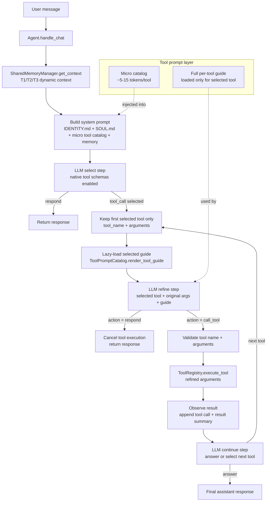

# Tool Prompt Micro-Catalog + Strict Tool Loop Plan

## Status

Implemented for review. Runtime code now uses the micro-catalog and strict
lazy tool loop described below.

## Goal

Replace the current large `TOOL.md` system-prompt injection with an ebot-style
micro-catalog and strict lazy tool loop:

- Initial prompt contains only a tiny tool catalog, about 5-15 tokens per tool.
- Full tool guide is loaded only after the model selects that tool.
- The model refines or cancels the selected tool call after reading the guide.
- The agent executes at most one tool per tool cycle.
- After each tool result, control returns to the LLM to decide the next step.

This plan only covers tool prompts. It does not change `IDENTITY.md`,
`SOUL.md`, T1/T2/T3 memory prompt content, or provider configuration.

## Cost Model

The main cost is tokens, not the number of LLM calls. A strict loop can be
better than a wide prompt if each call reads less irrelevant tool text.

Tradeoff:

- Token efficiency improves when the initial prompt stays tiny and only one
  selected tool guide is loaded.
- Latency increases because tool paths may require extra LLM calls.
- Runtime complexity increases because the agent must manage select, refine,
  execute, observe, and continue.

This design optimizes prompt size and tool correctness first. Latency is the
accepted cost.

## Native Schema Note

There are two tool prompt surfaces:

- System text: currently the big persona `TOOL.md`. This plan replaces it with
  a micro-catalog.
- Native tool schemas: OpenAI/Gemini function definitions. These also consume
  input tokens.

To reach the "about 10 tokens per tool" goal in practice, native tool
descriptions and parameter descriptions should also be short. Detailed usage
rules belong in the lazy per-tool guide.

## Architecture



## Strict Loop Rules

1. The initial LLM call can select tools through native tool calling, but the
   agent handles only the first selected tool.
2. Any remaining tool calls from the same LLM response are ignored/deferred.
3. Before execution, the selected tool guide is loaded.
4. The refine step must return strict JSON:
   - `action=call_tool` with refined arguments, or
   - `action=respond` with a direct response/cancel reason.
5. The agent executes only after a valid refine result.
6. After execution, the agent appends the tool result and returns to the LLM.
7. The next LLM call decides whether to answer or select another tool.

This means multi-tool work is intentionally sequential:

```text
select one tool -> load one guide -> refine -> execute -> observe -> decide next
```

No batch execution in the strict loop.

## Prompt Language

Runtime prompt text must use Vietnamese with accents. This applies to:

- Micro-catalog descriptions, written as short "when to use this tool"
  triggers.
- Full per-tool guides.
- Refine instructions.
- New fallback, retry, cancel, and validation messages shown to the model.

Technical identifiers stay unchanged: tool names, JSON keys, schema fields,
module paths, and protocol keys remain ASCII. Do not write user-facing or
model-facing guidance as unaccented Vietnamese such as `tim ky uc` or
`web hien tai`.

## Prompt Layers

Each tool guide has a tiny description block and the detailed guide:

```md
<tool_description>
Khi cần thông tin hiện tại, mới nhất, giá, lịch, tin tức, hoặc nguồn web.
</tool_description>

## tavily_search

Detailed guide starts here.

### Khi nên dùng

...

### Khi không nên dùng

...

### Quy tắc tạo input

...

### Cách đọc kết quả

...

### Lỗi cần tránh

...
```

Initial system prompt gets only `tool_name + <tool_description>` lines:

```md
=== CÔNG CỤ ===
- search_memory: Khi cần tìm điều user từng nói trong ký ức T2.
- get_profile: Khi cần đọc hồ sơ T3 ổn định của user.
- update_user_profile: Khi cần lưu thông tin bền vững của user vào hồ sơ T3.
- update_personality: Khi user muốn đổi persona, vai trò, tính cách, hoặc giọng nói bot.
- web_search: Khi cần thông tin hiện tại, mới nhất, giá, lịch, tin tức, hoặc nguồn web.
- run_python_code: Khi cần tính toán, chạy code, kiểm thử script, hoặc xử lý file.
- execute_host_bash: Khi cần kiểm tra host, Docker, log, service, hoặc chạy bash thật.
```

Lazy guide render removes the description tags and wraps the full selected guide:

```md
<tool_guide name="tavily_search">
Khi cần thông tin hiện tại, mới nhất, giá, lịch, tin tức, hoặc nguồn web.

## tavily_search

...
</tool_guide>
```

## Refine Contract

The refine call should not use native tool calling. It should return JSON text
so the agent can parse and validate deterministically.

Call tool:

```json
{
  "action": "call_tool",
  "tool_name": "tavily_search",
  "arguments": {
    "query": "..."
  }
}
```

Cancel/respond:

```json
{
  "action": "respond",
  "response": "..."
}
```

Validation rules:

- `action` must be `call_tool` or `respond`.
- `tool_name` must match the originally selected tool.
- Arguments must pass existing `ToolRegistry.execute_tool()` validation.
- Invalid JSON or invalid action should not execute the tool.
- For invalid refine output, return a safe retry/clarification response rather
  than falling back to unrefined arguments.

## Code Shape

### `twin/shared/tools/declarations/system_tools.py`

Add guide metadata:

```python
@dataclass(frozen=True)
class ToolSpec:
    module: str
    class_name: str
    visible_to: Optional[frozenset[str]] = None
    allowed_to: Optional[frozenset[str]] = None
    guide_path: str | None = None
    description_tag: str = "tool_description"
```

`guide_path` points to the selected tool's Markdown guide. Visibility and
execution permissions stay as they are. The native schema `description` also
comes from the guide's `<tool_description>` block, so the short catalog and
native tool schema share one source of truth. This description should explain
when to select the tool, not how to build arguments or read output; that detail
belongs in the lazy guide.

### New module: `twin/shared/tools/prompts/catalog.py`

Responsibilities:

- Build a prompt catalog from visible tool declarations.
- Render only micro-catalog lines for the initial prompt.
- Render full guide for one selected tool.
- Fail clearly if a guide file or `<tool_description>` block is missing.

Expected API:

```python
class ToolPromptCatalog:
    def render_catalog(self) -> str: ...
    def render_tool_description(self, tool_name: str) -> str: ...
    def render_tool_guide(self, tool_name: str) -> str: ...
    def has_guide(self, tool_name: str) -> bool: ...
    def allowed_tool_names(self) -> set[str]: ...
```

### New guide files

Preferred location:

```text
twin/shared/tools/prompts/guides/
  search_memory.md
  get_profile.md
  update_user_profile.md
  update_personality.md
  web_search.md
  run_python_code.md
  execute_host_bash.md
```

These files replace the runtime role of the large persona `TOOL.md`. The old
persona `TOOL.md` files have been removed to avoid a second source of tool
guidance.

### `twin/shared/tools/registry/bootstrap.py`

Extend `ToolBootstrapResult`:

```python
@dataclass
class ToolBootstrapResult:
    registry: ToolRegistry
    tool_prompt_catalog: ToolPromptCatalog
    system_tools: list[BaseTool]
    ...
```

Build `ToolPromptCatalog` from the same declarations used to instantiate
runtime tools, respecting agent visibility.

### `twin/shared/llm/base_llm_service.py`

Current behavior:

```python
self.static_tools = self._load_prompt("TOOL.md")
```

New behavior:

- Keep loading `IDENTITY.md` and `SOUL.md`.
- Stop depending on full `TOOL.md` for runtime tool prompt.
- Add `set_tool_prompt_catalog(...)`.
- `_build_final_system_prompt()` injects `tool_prompt_catalog.render_catalog()`
  under the tool section.
- If no catalog is configured, skip the tool text section instead of failing.

### Containers

After `build_tool_registry(...)`:

```python
tools = build_tool_registry(...)
self.tool_registry = tools.registry
self.llm_service.set_tool_registry(self.tool_registry)
self.llm_service.set_tool_prompt_catalog(tools.tool_prompt_catalog)
```

Apply in both:

- `twin/march7/container.py`
- `twin/evernight/container.py`

### Agent Loop

Add a strict tool loop helper, ideally shared by March7 and Evernight:

```text
selected tool_call
  -> keep first call only
  -> render selected guide
  -> refine call with strict JSON
  -> validate
  -> execute refined call
  -> observe result
  -> next LLM iteration
```

Provider constraint:

- OpenAI-compatible APIs require tool result messages to match prior assistant
  tool calls. The strict loop should preserve valid message ordering when
  appending assistant tool-call and tool-result messages.

## Sequence: One Tool

```text
LLM select
  system prompt includes:
    - persona
    - memory
    - micro catalog only
  API request includes:
    - short native tool schemas

LLM returns:
  tool_call tavily_search({"query": "raw or rough query"})

Agent:
  load tavily_search guide

LLM refine:
  returns action=call_tool with refined query

Agent:
  execute tavily_search(refined query)
  append tool result

LLM continue:
  reads result
  answers user or selects next tool
```

## Sequence: Multiple Tools

If the model returns:

```text
1. get_profile
2. tavily_search
3. search_memory
```

The strict loop handles only:

```text
1. get_profile
```

Then returns to the LLM after observing `get_profile`. The LLM can then decide
whether `tavily_search` or `search_memory` is still needed.

This avoids executing stale tool calls after context changes.

## Migration Plan

1. Add `guide_path` and `description_tag` metadata to `ToolSpec`.
2. Add `ToolPromptCatalog` with unit tests.
3. Create guide Markdown files by splitting current `TOOL.md` content.
4. Make each guide start with a tiny `<tool_description>` block.
5. Shorten native tool descriptions and parameter descriptions where safe.
6. Build and inject `ToolPromptCatalog` through `build_tool_registry`.
7. Change `BaseLLMService` to use the micro-catalog instead of full `TOOL.md`.
8. Add strict select/refine/execute/observe helper for March7.
9. Apply the same helper to Evernight.
10. Remove old persona `TOOL.md` files so guide Markdown is the only tool
    prompt documentation source.
11. Run unit tests and a local smoke test for at least one tool call.

## Tests

Unit tests:

- Catalog contains only `tool_name + <tool_description>` lines, not detailed
  guide sections.
- Runtime catalog/guide text uses Vietnamese with accents, except technical
  identifiers such as tool names and JSON keys.
- Missing guide file fails clearly during catalog build or render.
- Missing `<tool_description>` fails clearly.
- Native schema description comes from `<tool_description>`, says when to use
  the tool, and does not duplicate detailed input/output guidance.
- `render_tool_guide()` wraps content with `<tool_guide name="...">`.
- Agent visibility filters catalog the same way native schemas are filtered.
- `BaseLLMService._build_final_system_prompt()` no longer includes full
  `TOOL.md`.

Agent tests:

- If model returns direct response, no guide is loaded.
- If model returns tool calls, only the first call is selected.
- Selected tool guide is loaded before execution.
- Refine `respond` path skips execution.
- Refine `call_tool` path executes refined arguments.
- Invalid refine JSON does not execute the tool.
- Multiple tool calls are handled sequentially across iterations, not in one
  batch.
- Tool errors still surface through existing friendly failure behavior.

Regression tests:

- Existing tool bootstrap visibility tests still pass.
- Existing March7/Evernight chat tests still pass.
- Native tool execution still validates parameters through `ToolRegistry`.

## Open Questions

1. Should every runtime tool be required to have a guide file before startup
   succeeds, or should missing guides be tolerated during migration?
2. How short should native tool schema descriptions become in Phase 1?
3. Should the strict loop allow switching tools during refine, or only
   refine/cancel the originally selected tool?
