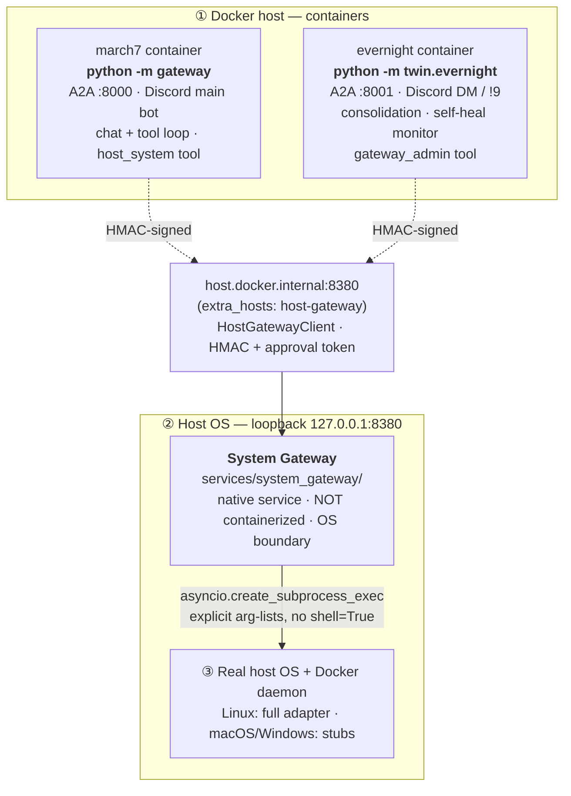
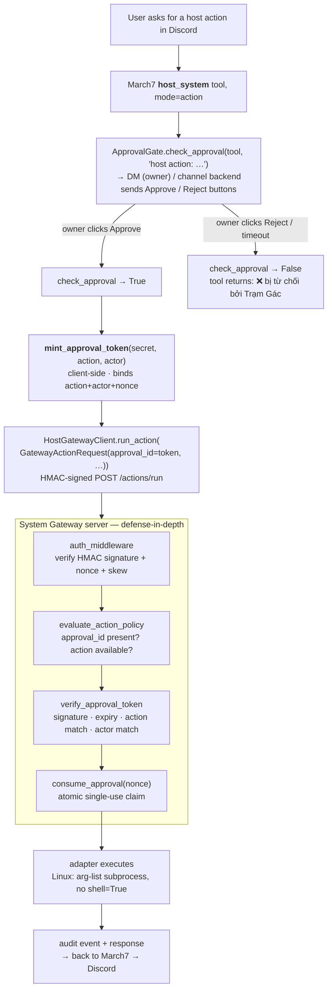

# March7 — Architecture Review

Single-source architecture overview for owner review. Grounded in the working
tree on 2026-06-25 (branch `feat/agent-action-loop`, uncommitted since
`ab5865f`). For per-symbol detail, query CodeGraph; this doc intentionally avoids
file-structure dumps.

Related docs (read alongside, not duplicated here):

- `.agents/PROJECT_CONTEXT.md` — runtime modes, env vars, memory tiers.
- `.agents/AGENT_RULES.md` — safety invariants and verified gotchas.
- `docker/ARCHITECTURE.md` — Docker ownership map.
- `.agents/plans/system-gateway.md` — phase-by-phase plan status.
- `.agents/notes/system-gateway-debug-verification.md` — independent security
  verification (the source of the gaps flagged below).
- `services/system_gateway/README.md` — threat model, API, env vars, runbook.

## 1. System Map

March7 is a two-agent Discord/A2A stack with a native host boundary. Three
trust domains:



Two gateways, do not confuse them:

- **March7 A2A Gateway** (`gateway/`) — platform adapter orchestration and
  routing. Containerized. Owns the Discord bot, the unified message contract,
  and the March7 A2A server on port 8000. This is the *chat* gateway.
- **System Gateway** (`services/system_gateway/`) — native host service on
  port 8380. This is the *host OS* gateway: the only process allowed to
  execute commands on the real operating system. Containerized agents reach
  it over `host.docker.internal:8380`.

## 2. The Two Agents

### March7 (`twin/march7/`, entry `gateway/__main__.py`)

Primary public chat agent. Production entry is `python -m gateway`
(`gateway/__main__.py`), which owns container init, the A2A server on port
8000, and the Discord adapter via `ChatGateway`. `twin/march7/__main__.py` is
a thinner local-dev entry (no Discord). The agent loop is
`Think(Decide) → Think(Refine) → Act → … → Think(Resolve)` in
`twin/shared/agent/agent_loop.py`: only `Think` stages touch the LLM; `Act`
is pure tool execution with no persona and no LLM access. All user-visible
answers come from `Think(Resolve)`.

### Evernight (`twin/evernight/`, entry `twin/evernight/__main__.py`)

Background consolidation and self-heal agent. Independent Discord surface:
DMs and `!9` prefix, A2A server on port 8001. Owns:

- Inactivity-triggered consolidation (sends tasks to March7 via A2A; March7
  then calls Evernight's `ConsolidateMemoryTool`).
- Owner approval delivery for host actions (DM approval backend).
- `GatewayMonitor` + `SelfHealMonitor` — polls March7 health and the native
  gateway; can request `container.restart` through System Gateway with an
  owner-minted approval token (`GatewayRecoveryExecutor`, preferred over the
  legacy bash-executor path when `SYSTEM_GATEWAY_URL` is set).
- `gateway_admin` tool (owner-only) for gateway `status` / `doctor` /
  `install_hint` / `update`.

Evernight must reach March7 session state through A2A skills
(`get_snapshot`, `clear_session`); it must not read March7 T1 Redis keys
directly.

## 3. Memory Tiers (shared)

All memory source lives once under `twin/shared/memory/`. Both agents build
the shared stack in their own container.

- **T1 Active** — Redis JSON, scoped `user` or `channel`. Short-term session
  context.
- **T2 Timeline** — Redis Stack HASH with RediSearch `VECTOR HNSW` index
  `timeline_summaries`. Semantic pre-flight retrieval. Requires
  `TIMELINE_REDIS_DB=0`.
- **T3 Profile** — Markdown files via `MarkdownProfileStore`, default base
  `memories/`, 8 sections. The durable core memory; T1/T2 may be disposable
  in dev but T3 must not be deleted without confirmation.

A2A Consolidation flow: `InactivityTrigger` (Evernight) detects idle scopes →
March7 sends a task via `ConsolidationClient` to Evernight:8001 → Evernight
runs `ConsolidateMemoryTool`, summarizing `ActiveMemory` into
`TimelineSummaryStore` / `MarkdownProfileStore` in one LLM call.

## 4. Tool Runtime

Declared logical tools have two backend kinds:

- `local` — direct `BaseTool` / `ToolRegistry` execution for in-process tools
  and app-owned services.
- `remote_mcp` — external MCP servers outside the trust boundary, called
  through `MCPClient` only when a real integration exists. Currently only
  `web_search` (Tavily). Remote `tools/list` metadata is untrusted and must
  never be rendered into the system prompt, lazy guide, or native tool
  schema descriptions.

The prompt contract stays local: `ToolPromptCatalog`, guide files under
`twin/shared/tools/prompts/guides/`, local schema descriptions, visibility,
and approval are the model-facing source of truth.

Host interaction tools:

- `host_system` — the model-facing tool that talks to System Gateway via
  `HostGatewayClient`. Modes: `capabilities`, `action`, `shell`.
- `gateway_admin` — Evernight-only, owner-gated, for gateway administration.
- `execute_host_bash` — **legacy and hard-hidden** (`visible_to` /
  `allowed_to` empty). Do not use for new host interactions.

## 5. System Gateway — Host Boundary

The host OS boundary. Runs native on the host (not in Docker), binds to
`127.0.0.1:8380` by default. Containers reach it via
`SYSTEM_GATEWAY_URL=http://host.docker.internal:8380` and sign requests with
`SYSTEM_GATEWAY_SHARED_SECRET`.

### 5.1 Components

- **Native service** `services/system_gateway/` — aiohttp server, config,
  in-memory state (`state.py`), CLI (`cli/`), platform packaging
  (`packaging/{linux,macos,windows}/`).
- **Shared agent-side library** `twin/shared/system_gateway/` —
  `auth.py` (HMAC sign/verify, approval token mint/verify),
  `policy.py` (default-deny evaluation), `audit.py` (audit event schema),
  `client.py` (`HostGatewayClient`), `types.py` / `errors.py`.
  `server.py` imports `auth` / `policy` / `audit` from this package — they
  are not duplicated under `services/system_gateway/`.
- **Platform adapters** `services/system_gateway/adapters/` —
  `base.py` (interface), `linux.py` (full structured actions via
  `asyncio.create_subprocess_exec`, no `shell=True`), `macos.py` /
  `windows.py` (capability stubs with honest unsupported responses).
- **Evernight monitor** `twin/evernight/system_gateway/` —
  `monitor.py` (`GatewayMonitor`), `installer.py` (bootstrap hint +
  `InstallerCoordinator`).

### 5.2 API Surface

| Method | Path | Auth | Purpose |
|--------|------|------|---------|
| `GET`  | `/health`        | none            | version, status, uptime, platform |
| `GET`  | `/capabilities`  | none            | platform, shells, features, raw-shell policy, structured actions |
| `POST` | `/actions/run`   | HMAC + approval | execute a structured action |
| `POST` | `/shell/run`     | HMAC + approval | raw shell gate (denied by default) |
| `POST` | `/self/update`   | HMAC + approval | record owner-approved update request (no auto-download) |

### 5.3 Authentication — HMAC-SHA256

Every mutating request is signed. Canonical message
(`twin/shared/system_gateway/auth.py`):

```text
METHOD\nPATH\nTIMESTAMP\nNONCE\nACTOR\n<sha256(body)>
```

- Timestamp is **seconds** (`str(int(time.time()))`), max clock skew
  `DEFAULT_MAX_CLOCK_SKEW_SECONDS = 300`.
- Nonces are tracked in-memory within a TTL window (replay protection).
- The client serializes the body itself (`jsonlib.dumps(..., separators=(",",":"))`)
  so the signed bytes match `request.read()` exactly — letting aiohttp
  re-serialize would break the signature.

### 5.4 Approval Tokens — action-bound, single-use

After the owner approves a host action, the agent mints a compact approval
token (`mint_approval_token`) that binds:

- token version, issued_at, expiry (default TTL 120s),
- a fresh nonce (the single-use replay key),
- the actor (e.g. `march7` or `evernight`),
- `sha256(action)` — the action digest.

Format: `<urlsafe-b64(payload-json)>.<hex-signature>`, signed with an
HMAC-SHA256 key derived from `SYSTEM_GATEWAY_SHARED_SECRET`.

The server verifies the token (`verify_approval_token`) against the same
canonical message, checking signature, expiry, action match, and actor
match. It then claims the nonce atomically via
`GatewayState.consume_approval` (compare-and-set on an in-memory set) so the
same token cannot be reused.

### 5.5 Policy — default-deny

`evaluate_action_policy` / `evaluate_shell_policy` (`policy.py`):

- Unknown action → `UNKNOWN_ACTION`.
- Action reported unavailable by the adapter → `ACTION_NOT_AVAILABLE`.
- **All structured actions require a valid `approval_id`, including
  read-only ones.** There is no read-only special case. A request without
  `approval_id` is denied with `APPROVAL_REQUIRED`.
- Raw shell is denied unless `SYSTEM_GATEWAY_RAW_SHELL=true`, and still
  requires a valid approval token.
- Replayed approval id → `APPROVAL_REPLAYED`.

### 5.6 Structured Actions (Linux adapter)

Read-only, validated, no `shell=True`:

- `system.status` — pure-Python.
- `system.disk_usage`
- `docker.list_containers`
- `docker.container_logs`
- `service.status`

All subprocess calls use explicit arg-lists
(`asyncio.create_subprocess_exec`), input validation, timeout, and output
truncation. macOS/Windows adapters report these actions as unsupported.

### 5.7 Self-Update Hook

`POST /self/update` validates an `self.update`-bound approval token, checks
`from_version` against `SERVICE_VERSION` (returns 409 `version_mismatch` if
mismatched), records the request, and returns a queued status. It does
**not** auto-download or restart; the admin applies the package update
out-of-band. See §7 for the owner-gate gap.

## 6. Approval Flow — End-to-End



Defense-in-depth: the owner approves once (Discord button), the agent mints
an action-bound token (client), and the server re-verifies and consumes it
(server). A compromised client that steals a token for action A cannot
replay it for action B or reuse it for action A a second time.

## 7. Security Model & Threat Surface

Trust boundary: System Gateway is the only process that executes host
commands. Containers must never shell out to the host directly, through
Redis, the Docker socket, or any side channel. `AGENT_RULES.md` codifies
this as a non-negotiable invariant.

Verified strengths (from
`.agents/notes/system-gateway-debug-verification.md`):

- **Default-deny is real.** All structured actions need `approval_id`; there
  is no read-only exception. Confirmed at `policy.py:85-90`.
- **Token binding is real.** Action-bound + actor-bound + single-use + version
  check. Confirmed by direct server test: token for `system.status`
  presented to `/self/update` → 403 `approval_invalid`; wrong actor → 403;
  replayed nonce → 403; wrong `from_version` → 409.
- **HMAC canonical + skew** is correct (`auth.py:60-78`, skew 300s,
  timestamp in seconds).
- **No `shell=True`** in the Linux adapter; all subprocess calls are
  explicit arg-lists with input validation, timeout, and output truncation.
- **Network exposure** is loopback only by default (`127.0.0.1:8380`).

Verified gaps to flag for review:

1. **`/self/update` has no server-side owner gate.** The owner check lives
   only in the Evernight `gateway_admin` tool
   (`gateway_admin_tool.py:85-94`, `_is_owner` compares `context.user_id` to
   `owner_user_id`). The server's `self_update` handler
   (`server.py:460-584`) validates that the approval token binds
   `action="self.update"` + `actor`, but does **not** verify the actor is the
   owner. Anyone holding `SYSTEM_GATEWAY_SHARED_SECRET` (Evernight container,
   March7 container, any co-tenant) can mint a `self.update` token with
   `actor="evernight"` and the server returns **HTTP 200 "update accepted"**.
   Owner protection relies entirely on the client-side tool layer; if
   Evernight is compromised, an attacker can trigger self-update freely.
   **Recommendation:** bind owner identity into the token (e.g. an
   `owner` claim) or use a separate approval-only key for owner-only
   actions, and check it server-side.

2. **Audit log is in-memory only.** `GatewayState.record_audit`
   (`state.py:34-43`) appends to a `list` capped at 500 entries and logs a
   redacted line to the logger. There is no persistence to disk. Restart
   loses all audit history; a long-running busy gateway also evicts old
   entries. For a host boundary service this is a forensics gap.
   **Recommendation:** persist audit events to an append-only file (or
   journald on Linux) with rotation.

3. **`EVENT_APPROVAL_REQUESTED` is defined but never emitted.**
   `audit.py` declares it; no code path emits it. The audit trail therefore
   records denials, starts, completions, and timeouts, but not the moment
   an approval was requested. This breaks the "approval requested →
   resolved" chain in the audit log.

4. **Channel-button approver restriction is deferred (TASK-026).** Anyone
   who can see the approval buttons in a channel can click them. Owner-DM
   approval is the current safe path; channel approval is not
   owner-restricted yet.

5. **`install_hint` hallucination vector.** Evernight previously
   hallucinated `npx @anthropic-ai/system-gateway@latest install` when asked
   for the install command. The real `build_bootstrap_hint("linux")`
   (`twin/evernight/system_gateway/installer.py:83-101`) returns a
   `sudo tee … /etc/systemd/system/system-gateway.service` + `systemctl
   daemon-reload && enable --now` snippet — there is no `npx`/`pip` in it.
   Anti-hallucination rules have been added to
   `twin/shared/tools/prompts/guides/gateway_admin.md` ("Output từ tool:",
   do not invent commands). Treat any `npx`/`pip install system-gateway`
   output from the model as a hallucination.

6. **Same secret for transport and approval.** The shared HMAC secret is
   used both for request signatures and for deriving approval-token HMACs.
   The `services/system_gateway/README.md` threat model already notes this
   and recommends a separate approval-only key in a later phase.

## 8. Docker Stack

Master compose: `docker/docker-compose.yml` includes per-ownership files.

| Service | Compose | Owner | Boundary |
|---------|---------|-------|----------|
| `redis`     | `shared/`           | shared  | T1 + T2 memory |
| `codebox`   | `shared/`           | shared  | sandboxed Python execution, port 8069 |
| `bash-executor` | `shared/`      | shared  | **legacy** Linux-only host bridge, port 8374; kept for migration, hidden from catalog |
| `march7`    | `march7/`           | March7  | A2A `:8000`, Discord main bot |
| `evernight` | `evernight/`        | Evernight | A2A `:8001`, Discord DM/`!9` bot |
| `system-gateway` | (native, not in compose) | host | `127.0.0.1:8380` |

Both `march7` and `evernight` carry `extra_hosts: host.docker.internal:host-gateway`
and `SYSTEM_GATEWAY_URL=http://host.docker.internal:8380` +
`SYSTEM_GATEWAY_SHARED_SECRET` from `.env`. The System Gateway itself is not
a Docker service — it runs on the host via systemd/launchd and is reached
through the host-gateway mapping.

Startup:

```bash
docker compose -f docker/docker-compose.yml up -d --build
docker compose -f docker/docker-compose.yml ps
# Native gateway (separate):
curl -sf http://localhost:8380/health
```

## 9. Operational Notes

- **March7 container entry is `python -m gateway`**, not
  `python -m twin.march7`. When wiring March7 background tasks, add them to
  `gateway/__main__.py`; `twin/march7/__main__.py` is a thinner local-dev
  entry.
- **Host-bound endpoints use `host.docker.internal`, never `localhost`.**
  Inside a container, `localhost` resolves to the container itself and
  fails. Applies to LLM/embedding endpoints and `SYSTEM_GATEWAY_URL`.
- **Run tests through the conda env interpreter:**
  `conda run -n discord_bot python -m pytest …`, not `conda run -n discord_bot pytest …`.
- **T2 index**: after changing the T2 FT schema, drop and recreate
  `FT.DROPINDEX timeline_summaries` then restart; `_create_index` skips if
  the index exists.
- **Repo hygiene — stray files already removed (2026-06-25):** the duplicate
  `services/system_gateway2/` tree and the junk file `!` at repo root were
  deleted before this doc was drawn. The entire System Gateway subsystem is
  still **uncommitted since `ab5865f`** — commit is the remaining step.

## 10. Open Items Tracked Elsewhere

- `tests/unit/system_gateway_adapter_test.py` (TASK-027) — missing-executable,
  timeout, truncation, unauthorized-approver cases only partially covered.
- `LegacyBashExecutorBridge` exists but is not wired into tool bootstrap
  (TASK-007, partial).
- Channel-button approver restriction (TASK-026, deferred).
- `EVENT_APPROVAL_REQUESTED` emission (TASK-045, partial).
- Audit log persistence (no task yet — flagged in §7.2).
- Server-side owner gate for `/self/update` (no task yet — flagged in §7.1).