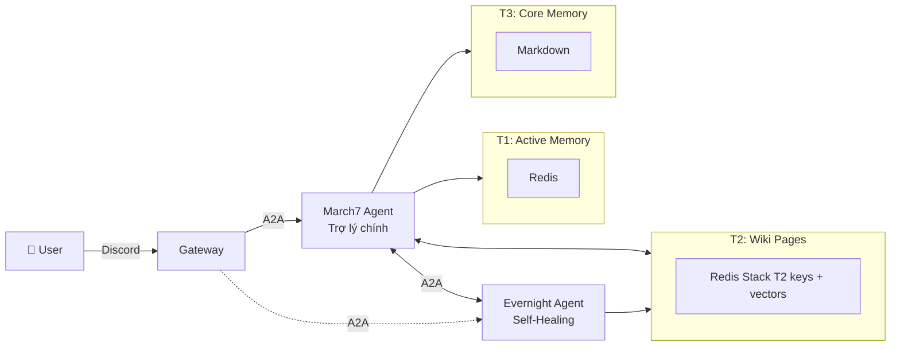

/home/flowerf/Projects/march7/src
# Bé Bảy — AI Assistant với Self-Healing

Bé Bảy là trợ lý AI trên Discord với persona March 7th (Honkai: Star Rail). Kiến trúc **Twin-Soul Agent** — hai agent độc lập giao tiếp qua A2A protocol, với cơ chế **self-healing** do background agent xử lý tự động.

## ⚡ Định hướng

- **Trợ lý thông minh**: Hội thoại tự nhiên, nhớ ngữ cảnh, gọi tool (tìm kiếm web, chạy code, quản lý hệ thống)
- **Self-healing (đang phát triển)**: Background agent (Evernight) giám sát lỗi, tự sửa, notify agent chính — bot tự phục hồi khi gặp vấn đề
- **Trí nhớ 3 tầng**: Redis Stack (T1 + T2 + coordination) → Markdown (hồ sơ người dùng)

## 🧭 Dành cho maintainer/agent (Copilot/LLM)

Nếu bạn đang dùng agent để làm việc trong repo (đọc kiến trúc, cách chạy, workflow, testing, quy ước code…), hãy bắt đầu ở:

- [`.agents/README.md`](.agents/README.md) (index + thứ tự đọc)

Bộ tài liệu này giúp agent nắm đúng boundary (Bash Executor/A2A), cách chạy Docker/local, và checklist review.

## 🏗️ Kiến trúc Twin-Soul Agent

```
Discord → Gateway → A2A Protocol ──→ March7 (port 8000): Trợ lý hội thoại
                                  └─→ Evernight (port 8001): Self-healing + Consolidation
```

| Agent | Vai trò | Port |
|-------|---------|------|
| **March7 (Bay)** | Trợ lý chính — chat, tool calling, quản lý T1/T3 | 8000 |
| **Evernight** | Background agent — self-healing, giám sát lỗi, consolidation T2 | 8001 |

Hai agent giao tiếp với nhau qua **Google A2A Protocol** (HTTP JSON-RPC + SSE), chia sẻ T2 memory (Redis Stack) nhưng độc lập T1/T3.

### Luồng tổng quát



---

## 🩹 Cơ chế Self-Healing (Đang phát triển)

Evernight là **background agent** chạy liên tục, giám sát và tự sửa lỗi:

| Cơ chế | Mô tả | Trạng thái |
|---------|-------|------------|
| **Giám sát lỗi** | Phát hiện lỗi từ March7 agent (tool crash, LLM timeout, rate limit) | 🔄 Đang phát triển |
| **Tự phục hồi** | Restart tool, retry request, fallback LLM provider | 🔄 Đang phát triển |
| **Thông báo** | Notify March7 agent khi có sự cố, đề xuất hành động | 🔄 Đang phát triển |
| **Consolidation** | Tự động tổng hợp hội thoại → Wiki pages trong Redis Stack | ✅ Đã hoàn thành |
| **Inactivity trigger** | Sau 30 phút user không chat → trigger consolidation | ✅ Đã hoàn thành |

**Luồng self-healing điển hình**:
1. Evernight poll Redis mỗi 60s, phát hiện lỗi trong log của March7
2. Evernight phân tích lỗi (tool crash? timeout? rate limit?)
3. Tự động thực thi hành động phục hồi (retry với provider khác, clear cache...)
4. Gửi status update cho March7 agent qua A2A

---

## 🧠 Hệ thống Trí nhớ 3 Tầng

### T1: Active Memory (Redis)
- **Mục đích**: Lưu hội thoại hiện tại
- **Giới hạn**: 2000 tokens (tự động overflow)
- **Handler**: March7 agent

### T2: Topic Pages (Redis Stack)
- **Mục đích**: Kiến thức tổng hợp về user (sở thích, sự kiện, mối quan hệ)
- **Upsert pattern**: Same topic = Same page_id = Merge/Update
- **Embedding**: Qwen3-Embedding-0.6B (1024 dims)
- **Handler**: Evernight agent (background)

### T3: Core Memory (Markdown)
- **Mục đích**: Hồ sơ người dùng (tên, quê quán, mối quan hệ...)
- **Storage**: `memories/{user_id}.md` (mặc định)
- **Handler**: March7 agent (qua tool `update_user_profile`)

---

## 🤖 MCP Tools

| Tool | Mô tả | Handler |
|------|-------|---------|
| `search_memory` | Tìm kiếm T2 memory | Redis Stack |
| `update_user_profile` | Cập nhật T3 profile | Markdown |
| `web_search` | Tavily web search | Tavily API |
| `run_python_code` | Python sandbox | CodeBox (Docker) |
| `execute_bash` | Lệnh bash trên host (cần xác nhận) | Bash Executor |

---

## 📁 Cấu trúc Dự án

```text
gateway/                         # Gateway Orchestrator (entry point: python -m gateway)
├── gateway.py                   # ChatGateway — quản lý adapter, routing, reconnect
├── config.py                    # Gateway config
├── shared/                      # UnifiedMessage, Adapter ABC
└── adapters/
    └── discord/                 # Discord adapter (cogs, converter, handler, agent_router)

twin/                            # Twin-Soul Agents
├── shared/                      # Shared package (dùng chung)
│   ├── a2a/                     # A2A protocol (server, client, types)
│   ├── llm/                     # LLM providers (Gemini, Qwen, LM Studio)
│   ├── tools/                   # MCP protocol + tool registry + implementations
│   │   ├── implementations/system/
│   │   └── implementations/mcp/
│   └── memories/                # T2 episodic memory (Redis Stack)
│
├── march7/                      # March7 Agent — Trợ lý chính
│   ├── agent.py                 # March7Agent (max 10 iterations, native tool calling)
│   ├── container.py             # DI container
│   ├── server/a2a_server.py     # A2A endpoint (port 8000)
│   ├── memories/                # T1 (Redis) + T3 (Markdown) riêng
│   └── personas/                # Persona files (IDENTITY, SOUL, TOOL...)
│
└── evernight/                   # Evernight Agent — Self-healing + Consolidation
    ├── agent.py                 # EvernightAgent (consolidation + chat capability)
    ├── container.py             # DI container
    ├── server/a2a_server.py     # A2A endpoint (port 8001)
    ├── triggers/                # Inactivity trigger (poll Redis mỗi 60s)
    ├── memories/                # T1 + T3 riêng
    └── personas/                # Evernight persona

docker/                          # Container infrastructure
├── docker-compose.yml           # Master compose
├── shared/                      # Shared base image + Redis Stack/CodeBox/Bash executor compose
│   ├── Dockerfile.base
│   ├── Dockerfile.bash-executor
│   └── docker-compose.*.yml
├── march7/                      # March7-owned Docker image + compose
│   ├── Dockerfile
│   └── docker-compose.yml
└── evernight/                   # Evernight-owned Docker image + compose
    ├── Dockerfile
    └── docker-compose.yml

memories/                        # Legacy persona files (đang migrate → twin/march7/personas)
scripts/                         # Host scripts (bash executor setup)
tests/                           # Test suite (unit, integration, e2e, manual)
data/                            # Runtime data (bot_channels.json)
```

---

## 🚀 Quick Start

### Yêu cầu

- Python 3.11+
- Docker + Docker Compose v2
- Discord Bot Token
- API key cho LLM provider (Gemini/Qwen)

### 1. Docker (Recommended)

```bash
cd docker
docker compose down
DOCKER_BUILDKIT=1 docker compose build
docker compose up -d
docker compose logs -f
```

### 2. Local Development

```bash
# Cài dependencies
pip install -r requirements.txt

# Chạy gateway (entry point chính)
python -m gateway

# Hoặc chạy riêng từng agent
python -m twin.march7     # March7 agent (port 8000)
python -m twin.evernight   # Evernight agent (port 8001)
```

### 3. Environment Variables

```bash
cp .env.example .env
```

```env
# Discord
DISCORD_MARCH7_TOKEN=your_march7_token
DISCORD_MARCH7_CLIENT_ID=your_march7_client_id
DISCORD_EVERNIGHT_TOKEN=your_evernight_token

# LLM
LLM_PROVIDER=qwen
LLM_MODEL=qwen3.6-max-preview
LLM_MAX_TOKENS=2000
QWEN_API_KEY=your_key

# OpenAI-compatible providers, including 9Router
# LLM_PROVIDER=openai
# OPENAI_API_KEY=dummy-key
# OPENAI_API_URL=http://localhost:20128/v1
# OPENAI_MODEL=your_9router_model_or_alias

# Infrastructure
REDIS_URL=redis://localhost:6379
CODEBOX_API_URL=http://localhost:8069

# Tavily Search
TAVILY_API_KEY=your_key

# Bash Executor (optional)
BASH_EXECUTOR_URL=http://localhost:8374
```

---

## 🧪 Testing

```bash
# Unit tests
pytest tests/unit/ -v

# Integration tests
pytest tests/integration/ -v

# E2E tests
pytest tests/e2e/ -v

# Manual tests (cần services đang chạy)
python tests/manual/check_services.py
```

---

## 📝 Bot Identity

**Persona:** March 7th (Bé Bảy) — Honkai: Star Rail

- Phong cách: Gen-Z Việt Nam, vui vẻ, lạc quan
- Tự xưng: "tui", "Bé Bảy"
- Icon: `:)))`, `:v`, `:3`, `^^`

Persona files: `twin/march7/personas/` và `twin/evernight/personas/`

---

## 📄 License

MIT
