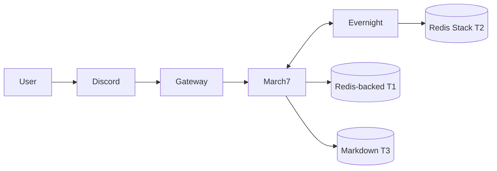

# Bé Bảy (March7) — Twin-Soul AI Assistant for Discord

Bé Bảy là trợ lý AI trên Discord với kiến trúc **Twin-Soul Agents**: `march7` (chat chính) và `evernight` (background consolidation + self-heal), giao tiếp qua A2A.

## Tính năng chính

- **Discord AI assistant**: hội thoại tự nhiên + tool calling.
- **Twin-Soul runtime**: tách chat runtime (`march7`) và background runtime (`evernight`).
- **Memory 3 tầng**: T1 Redis-backed active memory, T2 Redis Stack semantic/vector memory, T3 Markdown profile.
- **Background consolidation**: tự động tổng hợp hội thoại khi inactivity/overflow.
- **Self-heal loop**: có sẵn khung, đang tiếp tục phát triển.

## Dành cho maintainer/agent

Nếu bạn đang dùng agent để làm việc trong repo (đọc kiến trúc, cách chạy, workflow, testing, quy ước code…), hãy bắt đầu ở:

- [`.agents/README.md`](.agents/README.md) (index + CodeGraph policy)

Bộ tài liệu này giúp agent nắm đúng boundary (Bash Executor/A2A), cách chạy Docker/local, và checklist review.

## Kiến trúc tổng quan

```text
Discord -> Gateway -> March7 (A2A :8000)
                    -> Evernight (A2A :8001)
March7 <-> Evernight qua A2A boundary
```

| Agent | Vai trò | Port |
|-------|---------|------|
| **March7** | Trợ lý chính — chat, tool calling, quản lý T1/T3 | 8000 |
| **Evernight** | Background agent — self-healing, giám sát lỗi, consolidation T2 | 8001 |

Hai agent giao tiếp qua A2A (HTTP JSON-RPC + SSE). Evernight phải truy cập memory của March7 qua boundary A2A (`get_snapshot`, `clear_session`), không đọc trực tiếp T1 keys của March7.

### Luồng tổng quát



---

## Cấu trúc thư mục chính

- `gateway/`: adapter + router cho platform (Discord).
- `twin/march7/`: agent hội thoại chính.
- `twin/evernight/`: background agent (consolidation, self-heal).
- `twin/shared/`: A2A, LLM adapters, memories/tools dùng chung.
- `docker/`: compose + Dockerfiles cho toàn hệ thống.
- `tests/`: unit/integration/e2e/manual tests.

## Prerequisites

- Python `3.11+`
- Docker + Docker Compose v2
- Discord bot token(s)
- API key cho LLM provider

## Quick start

---

### 1) Docker (khuyến nghị)

```bash
cd docker
docker compose down
DOCKER_BUILDKIT=1 docker compose build
docker compose up -d
docker compose logs -f
```

### 2) Local Python

```bash
pip install -r requirements.txt
python -m gateway
# hoặc chạy từng agent:
python -m twin.march7
python -m twin.evernight
```

---

> [!TIP]
> Health endpoints kỳ vọng:
> - `http://localhost:8000/.well-known/agent.json`
> - `http://localhost:8001/.well-known/agent.json`

## Cấu hình

---

Các nhóm biến chính (chi tiết ở `.agents/PROJECT_CONTEXT.md`):

- Shared: `REDIS_URL`, `CODEBOX_API_URL`, `BASH_EXECUTOR_URL`, `T1_STORAGE_PHASE`
- March7: `MARCH7_A2A_PORT`, `MARCH7_REDIS_DB`, `MARCH7_PERSONA_PATH`
- Evernight: `EVERNIGHT_A2A_PORT`, `EVERNIGHT_REDIS_DB`, `INACTIVITY_SECONDS`, `SELF_HEAL_ENABLED`
- Discord/Gateway: `DISCORD_MARCH7_TOKEN`, `DISCORD_EVERNIGHT_TOKEN`, `GATEWAY_ENABLED_PLATFORMS`

`T1_STORAGE_PHASE` chọn storage T1:

- `legacy`: Redis basic/HASH path, hiện là path ổn định cho T1.
- `redis_stack`: Redis Stack JSON/Search adapter, dùng thử nghiệm hoặc cutover sau khi parity test ổn.

> [!NOTE]
> Runtime Redis trong Docker dùng `redis/redis-stack-server`, nên cùng một Redis Stack service có thể phục vụ cả T1 và T2. T1 không bắt buộc dùng JSON/Search; T2 mới là tầng semantic/vector cần Redis Stack features.

T1 chat context dùng recent-window theo token budget:

- `T1_CONTEXT_MAX_TOKENS`: số token T1 tối đa đưa vào prompt chat.
- `T1_CONTEXT_MAX_MESSAGES`: hard cap số message gần nhất.

LLM/embeddings: xem `README_LLM_PROVIDERS.md`.

## Development & testing

```bash
pytest tests/unit/ -v
pytest tests/integration/ -v
pytest tests/e2e/ -v
```

## Tài liệu liên quan

- `.agents/PROJECT_CONTEXT.md`
- `.agents/AGENT_RULES.md`
- `.agents/TESTING_GUIDE.md`
- `README_LLM_PROVIDERS.md`
- `README_BASH_EXECUTOR.md`
- `docker/README.md`

## Troubleshooting nhanh

> [!WARNING]
> Bash Executor là tool đặc quyền. Chỉ bật khi cần và luôn giữ luồng approve theo `README_BASH_EXECUTOR.md`.

- Kiểm tra trạng thái containers: `docker compose -f docker/docker-compose.yml ps`
- Xem logs: `docker compose -f docker/docker-compose.yml logs -f march7 evernight`
- Kiểm tra A2A health endpoints ở cổng `8000` và `8001`
