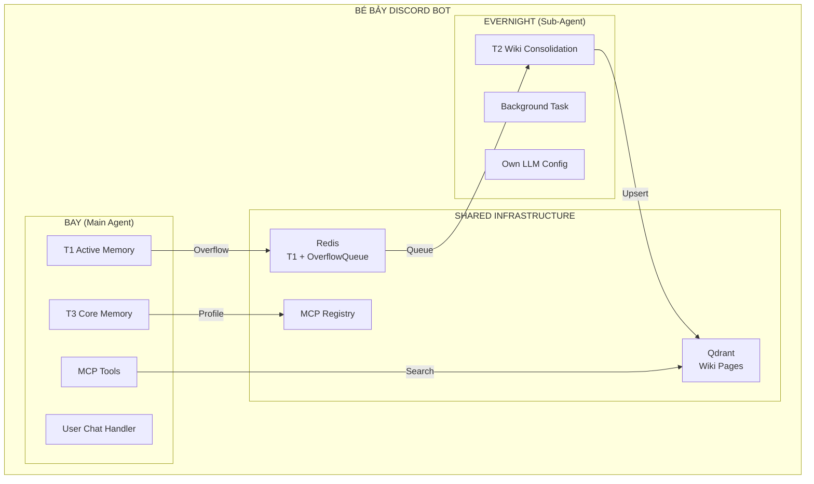
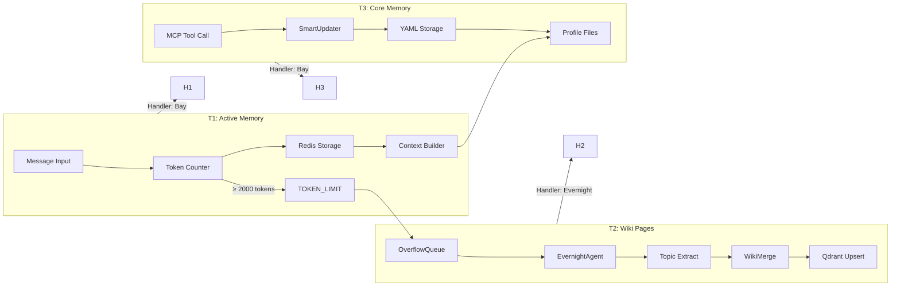
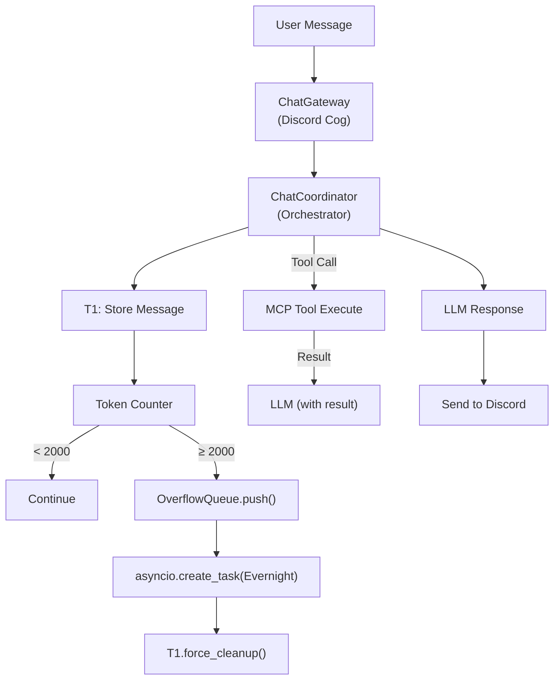
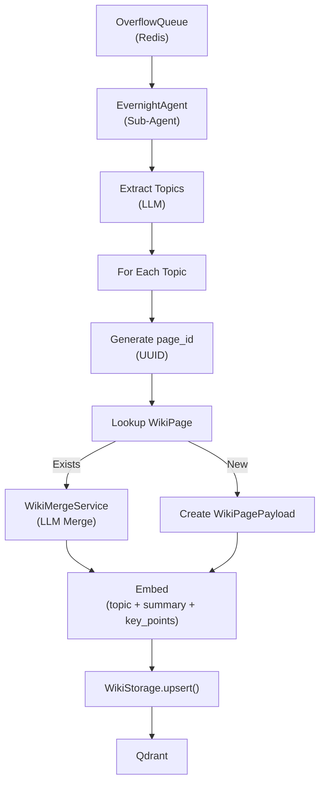
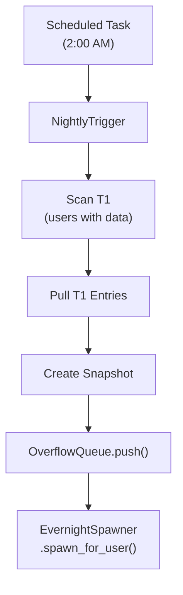

# Discord Bot "Bé Bảy"

Discord bot với persona March 7th (Honkai: Star Rail), kiến trúc Sub-Agent với hệ thống trí nhớ 3 tầng.

## 🎯 Trạng thái Phát triển

| Phase | Mô tả | Trạng thái |
|-------|-------|------------|
| **Phase 1** | Settings & Configuration | ✅ Hoàn thành |
| **Phase 2** | LM Studio Reasoning Support | ✅ Hoàn thành |
| **Phase 3** | Native Tool Calling (MCP) | ✅ Hoàn thành |
| **Phase 4** | Sub-Agent Architecture | ✅ Hoàn thành |
| **Phase 5** | Wiki Pages T2 Memory | ✅ Hoàn thành |
| **Phase 6** | CodeBox Integration | ✅ Hoàn thành |
| **Phase 7** | Testing & Validation | 🔄 Đang thực hiện |

---

## 🧠 Kiến trúc Hệ thống

### Sub-Agent Architecture



### Hệ thống Trí nhớ 3 Tầng



#### Tầng 1: Active Memory (Redis)
- **Mục đích**: Lưu trữ hội thoại hiện tại
- **Token limit**: MAX 2000 tokens, TARGET 1000 tokens
- **Flow**: Message → Store → Count tokens → (if >= 2000) → OverflowQueue
- **Handler**: Bay (Main Agent)

#### Tầng 2: Wiki Pages (Qdrant)
- **Mục đích**: Consolidated facts về user (preferences, events, relationships)
- **Upsert pattern**: Same topic = Same page_id = Merge/Update (no duplicates)
- **Embedding**: Qdrant3-Embedding-0.6B (1024 dims)
- **Collection**: `wiki_pages`
- **Handler**: EvernightAgent (Sub-Agent, background task)

#### Tầng 3: Core Memory (YAML)
- **Mục đích**: User profile (tên, quê, mối quan hệ...)
- **Storage**: YAML files trong `memories/users/`
- **Handler**: Bay via MCP Tool `update_user_profile`

---

## 🤖 MCP Tools

Bot sử dụng MCP (Model Context Protocol) tools:

| Tool | Mô tả | Handler |
|------|-------|---------|
| `search_memory` | Tìm Wiki Pages (T2) | WikiStorage → Qdrant |
| `update_user_profile` | Cập nhật T3 profile | SmartUpdater → YAML |
| `update_personality` | Thay đổi IDENTITY/SOUL | File overwrite |
| `web_search` | Tavily web search | TavilyClient → API |
| `run_python_code` | Python code sandbox | CodeBoxClient → Docker |

### search_memory Modes

| Mode | Mô tả | Parameters |
|------|-------|------------|
| `semantic` | Embedding search (default) | `query="..."` |
| `time` | Filter by last_updated | `days=7` |
| `topic` | Filter by canonical_topic | `topic="anime"` |

### run_python_code (CodeBox Sandbox)

Python code execution trong sandboxed Jupyter kernel:

**Khi dùng:**
- Tính toán toán học (lãi suất, xác suất, phép tính nhiều bước)
- Phân tích data (CSV, JSON, lọc, đếm)
- Test script (crawl, automation)
- Tạo biểu đồ (matplotlib), Excel (pandas)

**Khi KHÔNG dùng:**
- Thời tiết/tin tức → dùng `web_search`
- Chuyện cũ → dùng `search_memory`
- Tóm tắt văn bản → LLM tự làm

**Đặc điểm:**
- Stateful: Biến lưu giữa các lần gọi (per-user session)
- Timeout: 60 seconds
- Output limit: 2000 chars (Discord limit)

---

## 🔄 Luồng Xử lý

### Message Flow (T1)



### T2 Consolidation (Evernight)



### Nightly Trigger (2 AM)



---

## 🏗️ Cấu trúc Dự án

```text
src/
├── bot.py                          # Entry point, Discord bot setup
├── __main__.py                     # Python module entry
│
├── config/
│   ├── settings.py                 # Config class (env variables)
│   └── logging_config.py           # Logging setup
│
├── cogs/                           # Discord Cogs
│   ├── chat_gateway.py             # Main message handler
│   ├── user_commands.py            # User slash commands
│   ├── admin_channels.py           # Admin channel management
│   └── base_cog.py                 # Base cog class
│
├── agents/                         # Sub-Agent Architecture
│   ├── evernight/                  # Evernight (T2 Wiki)
│   │   ├── agent.py                # EvernightAgent
│   │   ├── spawner.py              # EvernightSpawner
│   │   └── services/
│   │       ├── wiki_storage.py     # Qdrant operations
│   │       └── wiki_merge.py       # LLM merge logic
│   │
│   └── shared/
│       └── models/
│           └── wiki_page.py        # WikiPagePayload model
│
├── services/
│   ├── chat_coordinator.py         # Main orchestrator (Bay)
│   ├── dependencies.py             # DI Container (AppContainer)
│   │
│   ├── llm/                        # LLM Providers
│   │   ├── base_llm_service.py     # Abstract base
│   │   ├── gemini_service.py       # Google Gemini
│   │   ├── qwen_service.py         # Qwen API
│   │   ├── lm_studio_service.py    # LM Studio (local)
│   │   └── embedding_service.py    # Local embedding
│   │
│   ├── tools/                      # MCP Tools
│   │   ├── base_tool.py            # Abstract base
│   │   ├── mcp_server.py           # MCP Server
│   │   ├── mcp_client.py           # MCP Client
│   │   ├── tool_discovery.py       # Auto-discovery
│   │   └── implementations/
│   │       ├── search_memory_tool.py
│   │       ├── update_profile_tool.py
│   │       ├── update_personality_tool.py
│   │       ├── web_search_tool.py
│   │       └── code_interpreter_tool.py
│   │
│   ├── external/
│   │   ├── tavily_client.py        # Tavily API client
│   │   └── codebox_client.py       # CodeBox sandbox client
│   │
│   ├── queue/
│   │   └── overflow_queue.py       # Redis overflow queue
│   │
│   └── memories/                   # Memory System
│       ├── memory_manager.py       # Orchestrator (T1 + T3)
│       │
│       ├── activate_memory/        # T1: Active Memory
│       │   ├── activate_memory_service.py
│       │   ├── models.py           # MemoryEntry
│       │   ├── constants.py        # Token thresholds
│       │   └── storage/
│       │       └── ram_storage.py  # Redis storage
│       │
│       └── core_memory/            # T3: Core Memory
│           ├── core_manager.py
│           ├── smart_updater.py    # LLM-based updater
│           └── storage/
│               └── yaml_storage.py # YAML files
│
├── tasks/
│   └── nightly_trigger.py          # 2 AM scheduled consolidation
│
├── models/                         # HuggingFace model cache
│
└── utils/
    └── helpers.py

memories/                           # Agent memory files
├── INDEX.md                        # Index
├── IDENTITY.md                     # Bot persona (March 7th)
├── SOUL.md                         # Conversation rules
├── TOOL.md                         # MCP tool usage guide
└── users/                          # User profiles (YAML)
    └── {user_id}.yaml

plan/                               # Implementation plans
└── archive/                        # Completed plans
```

---

## 🚀 Quick Start

### 1. Docker Deployment (Recommended)

```bash
# Start services
cd docker && docker compose up -d

# Or from project root
docker compose -f docker/docker-compose.yml up -d

# Check logs
docker compose logs -f be_bay_bot

# Stop
docker compose down
```

### 2. Local Development

```bash
# Create conda environment
conda create -n discord_bot python=3.11
conda activate discord_bot

# Install dependencies
pip install -r requirements.txt

# Run bot
python -m src.bot
```

### 3. Environment Variables

```bash
cp .env.example .env
```

Required variables:

```env
# Discord
DISCORD_LLM_BOT_TOKEN=your_bot_token
DISCORD_LLM_BOT_CLIENT_ID=your_client_id

# LLM Provider (gemini, qwen, lm_studio)
LLM_PROVIDER=qwen
LLM_MODEL=qwen3.6-max-preview
LLM_MAX_TOKENS=2000

# Provider API Keys
GEMINI_API_KEY=your_gemini_key     # if LLM_PROVIDER=gemini
QWEN_API_KEY=your_qwen_key         # if LLM_PROVIDER=qwen

# Local LLM (LM Studio)
TOOL_LLM_ENDPOINT=http://localhost:1234/v1

# Tavily Web Search
TAVILY_API_KEY=your_tavily_key

# Redis (T1)
REDIS_URL=redis://localhost:6379

# Qdrant (T2)
QDRANT_URL=http://localhost:6333
```

---

## ⚙️ Configuration

### LLM Parameters

| Biến | Mặc định | Mô tả |
|------|----------|-------|
| `LLM_PROVIDER` | `qwen` | Provider: `gemini`, `qwen`, `lm_studio` |
| `LLM_MODEL` | `qwen3.6-max-preview` | Model name |
| `LLM_MAX_TOKENS` | `2000` | Max output tokens |
| `LLM_TEMPERATURE` | `0.7` | Creativity (0-1) |
| `TOOL_EXECUTION_TIMEOUT` | `60` | Tool timeout (seconds) |

### Memory Parameters

| Biến | Mặc định | Mô tả |
|------|----------|-------|
| `MAX_WORKING_TOKENS` | `2000` | T1 overflow threshold |
| `TARGET_SAFE_TOKENS` | `1000` | T1 cleanup target |
| `NIGHTLY_TRIGGER_HOUR` | `2` | Evernight trigger hour (AM) |

### Docker Services

| Service | Container | Port | Purpose |
|---------|-----------|------|---------|
| `redis` | `be_bay_redis` | 6379 | T1 Active Memory + Queue |
| `qdrant` | `be_bay_qdrant` | 6333 | T2 Wiki Pages storage |
| `codebox` | `be_bay_codebox` | 8069 | Python sandbox (Jupyter kernel) |
| `be_bay_bot` | `be_bay_bot` | - | Discord bot |

---

## 🧪 Testing

```bash
# Unit tests
conda run -n discord_bot pytest tests/unit/ -v

# Integration tests
conda run -n discord_bot pytest tests/integration/ -v

# All tests
conda run -n discord_bot pytest -v
```

---

## 📝 Bot Identity

**Persona:** March 7th (Bé Bảy) - Honkai: Star Rail

- **Character:** Heart of the Astral Express crew
- **Style:** Vietnamese Gen-Z, cheerful, optimistic
- **Self-reference:** "tui", "Bé Bảy"
- **Icons:** `:)))`, `:v`, `:3`, `^^`

Memory files in `memories/`:
- `IDENTITY.md` - Persona definition
- `SOUL.md` - Conversation guidelines
- `TOOL.md` - MCP tool usage guide

---

## 📄 License

MIT License