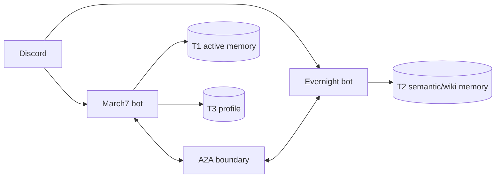

# Bé Bảy (March7) — Twin-Soul AI Assistant for Discord

Bé Bảy là hệ Twin-Soul AI trên Discord: `march7` là agent hội thoại chính, `evernight` là agent độc lập vừa trò chuyện qua DM/tag/prefix vừa làm background consolidation, notification, self-heal. Hai agent giao tiếp qua A2A.

## Tính năng chính

- **Discord AI assistant**: hội thoại tự nhiên + tool calling.
- **Twin-Soul runtime**: `march7` cho chat chính, `evernight` cho chat riêng + tác vụ nền.
- **Evernight DM/tag/!9**: nhận DM, tag/mention, prefix `!9`; gửi DM thông báo/approval.
- **Memory 3 tầng**: T1 Redis active, T2 Redis Stack semantic/vector, T3 Markdown profile.
- **Background consolidation**: tự động tổng hợp khi inactivity/overflow.
- **Self-heal loop**: framework có sẵn, đang phát triển.

## Yêu cầu cho agent workflow

Repo này tối ưu cho agent (Claude Code, Antigravity, Cursor, ...). Trước khi để agent đụng vào, cài đặt 2 thứ:

1. **CodeGraph** — index AST của repo, agent dùng cho mọi câu hỏi structural (where is X, what calls Y, impact of Z, ...). Skills đều giả định CodeGraph có sẵn.
   ```bash
   npm install -g @colbymchenry/codegraph
   codegraph init -i      # chạy 1 lần trong repo, tạo .codegraph/
   ```
2. **Skills toàn cục** — 6 skill (`implementation-planner`, `thoughtful-coder`, `debug-investigator`, `code-reviewer`, `architecture-docs`, `create-readme`) ở [Flowerf19/agents-skills](https://github.com/Flowerf19/agents-skills). Clone 1 lần, dùng cho mọi project:
   ```bash
   git clone https://github.com/Flowerf19/agents-skills.git ~/.claude/skills
   ```
   Claude Code auto-discover qua `/<skill-name>`; agent khác point thẳng vào `~/.claude/skills/<name>/SKILL.md`.

Agent docs project-specific (boundary A2A, gotcha runtime, testing) ở [.agents/](.agents/) — bắt đầu đọc từ [.agents/README.md](.agents/README.md).

## Kiến trúc tổng quan



| Agent | Vai trò | Port |
|---|---|---|
| **March7** | Chat chính, tool calling, quản lý T1/T3 | 8000 |
| **Evernight** | DM/tag/`!9` chat, notification/approval, self-heal, giám sát lỗi, consolidation T2 | 8001 |

Evernight truy cập memory của March7 qua A2A (`get_snapshot`, `clear_session`) — **không** đọc trực tiếp T1 keys.

### Plan đang chạy

- [Unified Discussion Memory](.agents/plans/unified-discussion-memory.md): T1 scope-aware (user/channel), T2 user-centric fan-out, flow `SUMMARY_REQUESTED → DiscussionConsolidator → SUMMARY_COMPLETED → cleanup` (thay cho `TOKEN_LIMIT_REACHED → overflow_queue` cũ).

### Gotcha runtime (dễ quên)

- Channel memory chỉ observe channel được phép, không nghe toàn server. Reply trigger gồm cả reply-to-bot.
- T2 user-centric: `T2Page.user_id` luôn là real user_id (digit); channel info ở `source_refs`.
- DiscussionConsolidator fan-out cho mỗi `active_participant` (LLM quyết định).
- T1 không xoá raw entries cho tới khi nhận `SUMMARY_COMPLETED`.

## Prerequisites

- Python `3.11+`
- Docker + Docker Compose v2
- Discord bot token(s) + API key LLM provider

## Quick start

**Docker (khuyến nghị):**

```bash
cd docker
docker compose down
DOCKER_BUILDKIT=1 docker compose build
docker compose up -d
docker compose logs -f
```

**Local Python:**

```bash
pip install -r requirements.txt
python -m gateway
# hoặc:
python -m twin.march7
python -m twin.evernight
```

> [!TIP]
> Health: `http://localhost:8000/.well-known/agent.json`, `http://localhost:8001/.well-known/agent.json`.

## Cấu hình

Nhóm env vars chính (chi tiết ở [.agents/PROJECT_CONTEXT.md](.agents/PROJECT_CONTEXT.md)):

- Shared: `REDIS_URL`, `CODEBOX_API_URL`, `BASH_EXECUTOR_URL`, `T1_STORAGE_PHASE`
- March7: `MARCH7_A2A_PORT`, `MARCH7_REDIS_DB`, `MARCH7_PERSONA_PATH`
- Evernight: `EVERNIGHT_A2A_PORT`, `EVERNIGHT_REDIS_DB`, `INACTIVITY_SECONDS`, `SELF_HEAL_ENABLED`
- Discord/Gateway: `DISCORD_MARCH7_TOKEN`, `DISCORD_EVERNIGHT_TOKEN`, `GATEWAY_ENABLED_PLATFORMS`
- T1 budget: `T1_CONTEXT_MAX_TOKENS`, `T1_CONTEXT_MAX_MESSAGES`

`T1_STORAGE_PHASE`: `legacy` (Redis HASH, ổn định) | `redis_stack` (JSON/Search, thử nghiệm).

> [!NOTE]
> Docker dùng `redis/redis-stack-server` — cùng service phục vụ cả T1 và T2.

LLM + embeddings (OpenAI-compat / Gemini native qua factory): xem [README_LLM_PROVIDERS.md](README_LLM_PROVIDERS.md).

## Development & testing

```bash
pytest tests/unit/ -v
pytest tests/integration/ -v
pytest tests/e2e/ -v
```

## Troubleshooting

> [!WARNING]
> Bash Executor là tool đặc quyền. Bật khi cần và giữ luồng approve theo [README_BASH_EXECUTOR.md](README_BASH_EXECUTOR.md).

- Trạng thái containers: `docker compose -f docker/docker-compose.yml ps`
- Logs: `docker compose -f docker/docker-compose.yml logs -f march7 evernight`
- A2A health: port `8000` và `8001`

## Tài liệu liên quan

- [.agents/](.agents/) — agent guidance (start: [README.md](.agents/README.md))
- [README_LLM_PROVIDERS.md](README_LLM_PROVIDERS.md) — LLM + embedding config
- [README_BASH_EXECUTOR.md](README_BASH_EXECUTOR.md) — bash executor security
- [docker/README.md](docker/README.md) — Docker runbook
