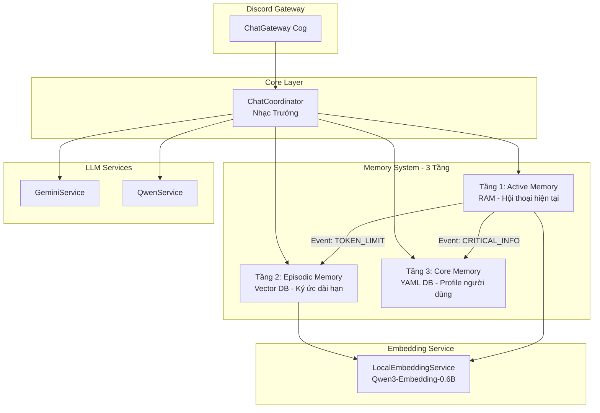
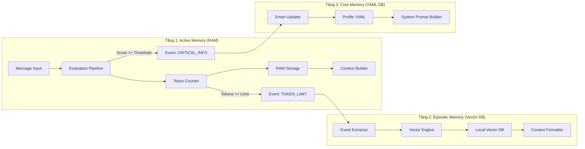
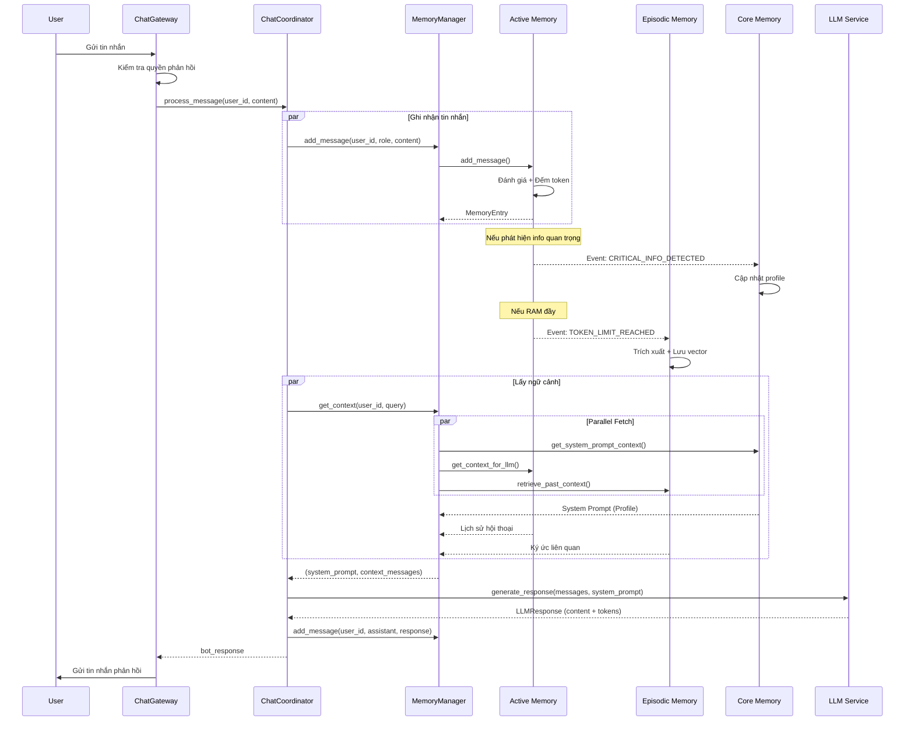
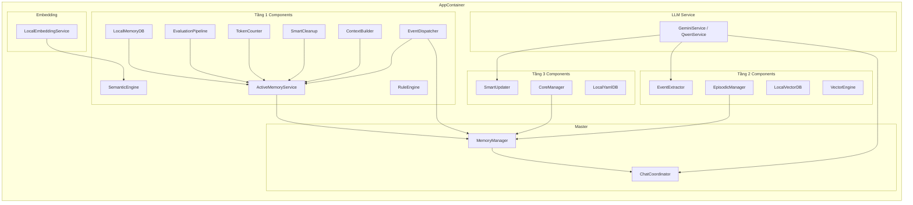

# Discord LLM AI Chatbot

Discord bot powered by Google Gemini và Qwen với hệ thống trí nhớ 3 tầng, theo dõi mối quan hệ và profile người dùng.

## 🧠 Kiến trúc Hệ thống

### Tổng quan

Bot được xây dựng theo kiến trúc **Service-Repository Pattern** với Dependency Injection, chia thành các layer rõ ràng:



### Hệ thống Trí nhớ 3 Tầng



#### Tầng 1: Active Memory (RAM)
- **Mục đích**: Lưu trữ hội thoại hiện tại trong RAM
- **Đánh giá tin nhắn**: Rule Engine + Semantic Engine
- **Quản lý token**: Tự động cleanup khi vượt giới hạn
- **Events**: Phát sự kiện khi phát hiện thông tin quan trọng hoặc RAM đầy

#### Tầng 2: Episodic Memory (Vector DB)
- **Mục đích**: Lưu trữ ký ức dài hạn dưới dạng vector embeddings
- **Trích xuất sự kiện**: Dùng LLM để tóm tắt và trích xuất thông tin
- **Tìm kiếm ngữ nghĩa**: Vector similarity search với threshold 0.4
- **Embedding**: Qwen3-Embedding-0.6B chạy local

#### Tầng 3: Core Memory (YAML DB)
- **Mục đích**: Lưu profile người dùng (tên, sở thích, mối quan hệ...)
- **Cập nhật thông minh**: Smart Updater dùng LLM để cập nhật profile
- **System Prompt**: Tự động inject vào prompt cho LLM

## 📊 Luồng Xử lý Tin nhắn



## 🏗️ Cấu trúc Dự án

```text
src/
├── bot.py                              # Entry point, Discord bot setup
├── __main__.py                         # Python module entry
│
├── config/
│   ├── settings.py                     # Config class (env variables)
│   └── logging_config.py               # Logging setup
│
├── cogs/                               # Discord Cogs (Event handlers)
│   ├── chat_gateway.py                 # Main message handler
│   ├── user_commands.py                # User slash commands
│   ├── admin_channels.py               # Admin channel management
│   └── base_cog.py                     # Base cog class
│
├── services/
│   ├── chat_coordinator.py             # Main orchestrator
│   ├── dependencies.py                 # DI Container (AppContainer)
│   │
│   ├── core/
│   │   └── anti_spam_service.py        # Rate limiting
│   │
│   ├── llm/                            # LLM Providers
│   │   ├── base_llm_service.py         # Abstract base class
│   │   ├── gemini_service.py           # Google Gemini API
│   │   ├── qwen_service.py             # Qwen API (OpenAI-compatible)
│   │   ├── embedding_service.py        # Local embedding model
│   │   └── llm_response.py             # Response wrapper
│   │
│   └── memories/                       # 3-Tier Memory System
│       ├── memory_manager.py           # Master orchestrator
│       │
│       ├── activate_memory/            # Tầng 1: Active Memory
│       │   ├── activate_memory_service.py
│       │   ├── models.py               # MemoryEntry, MessageCategory
│       │   ├── constants.py            # Thresholds config
│       │   ├── evaluation/
│       │   │   ├── pipeline.py         # Đánh giá tin nhắn
│       │   │   ├── rule_engine.py      # Luật cứng
│       │   │   └── sematic_enegine.py  # Semantic scoring
│       │   ├── events/
│       │   │   └── event_dispatcher.py # Pub/Sub system
│       │   ├── management/
│       │   │   ├── context_builder.py  # Build context for LLM
│       │   │   ├── smart_cleanup.py    # Auto cleanup
│       │   │   └── token_counter.py   # Token counting
│       │   └── storage/
│       │       ├── base_storage.py
│       │       └── ram_storage.py      # In-memory storage
│       │
│       ├── core_memory/                # Tầng 3: Core Memory
│       │   ├── core_manager.py
│       │   ├── models.py               # UserProfile
│       │   ├── smart_updater.py        # LLM-based profile updater
│       │   ├── prompts.yaml            # Extraction prompts
│       │   └── storage/
│       │       ├── base_core_db.py
│       │       ├── local_yaml_db.py    # YAML file storage
│       │       └── local_json_db.py    # JSON file storage
│       │
│       └── episodic_memory/            # Tầng 2: Episodic Memory
│           ├── episodic_manager.py
│           ├── models.py               # EpisodicRecord
│           ├── prompts.yaml            # Extraction prompts
│           ├── extraction/
│           │   ├── event_extractor.py  # LLM event extraction
│           │   └── retrieval/
│           │       ├── vector_engine.py # Embedding wrapper
│           │       └── context_formatter.py
│           └── storage/
│               ├── base_vector_db.py
│               └── local_vector_db.py  # Local vector storage
│
├── utils/
│   └── helpers.py                      # Utility functions
│
└── data/                               # Data storage (gitignored)
    ├── user_profiles/                  # Core Memory YAML files
    └── vector_db/                      # Episodic Memory vectors

prompts/
├── personality.yaml                    # Bot personality
└── conversation_prompt.yaml            # Conversation guidelines
```

## 🚀 Quick Start

### 1. Clone và Setup

```bash
# Clone repository
git clone <repository-url>
cd discord-bot-v1

# Tạo virtual environment
python -m venv venv
source venv/bin/activate  # Linux/macOS
# venv\Scripts\activate  # Windows

# Install dependencies
pip install -r requirements.txt
```

### 2. Cấu hình Environment

```bash
# Copy example env
cp .env.example .env
```

Edit file `.env` với các biến sau:

```env
# Discord
DISCORD_LLM_BOT_TOKEN=your_bot_token
DISCORD_LLM_BOT_CLIENT_ID=your_client_id

# LLM Provider (gemini hoặc qwen)
LLM_PROVIDER=gemini
LLM_MODEL=gemini-1.5-flash
LLM_TEMPERATURE=0.7
LLM_MAX_TOKENS=100

# Gemini API
GEMINI_API_KEY=your_gemini_key

# Qwen API (nếu dùng Qwen)
QWEN_API_KEY=your_qwen_key
QWEN_MODEL=qwen-max

# LangSmith Tracing (optional)
LANGCHAIN_API_KEY=your_langsmith_key
LANGCHAIN_TRACING_V2=true
LANGCHAIN_PROJECT=discord-bot
```

### 3. Chạy Bot

```bash
python -m src.bot
# hoặc
python src/bot.py
```

## ⚙️ Cấu hình Chi tiết

### LLM Parameters

| Biến | Mặc định | Mô tả |
|------|----------|-------|
| `LLM_PROVIDER` | `gemini` | Provider: `gemini` hoặc `qwen` |
| `LLM_MODEL` | `gemini-1.5-flash` | Model name |
| `LLM_TEMPERATURE` | `0.7` | Creativity (0-1) |
| `LLM_MAX_TOKENS` | `100` | Max output tokens |
| `LLM_TOP_P` | `0.9` | Nucleus sampling |
| `LLM_TOP_K` | `40` | Top-k sampling |

### Typing Simulation

| Biến | Mặc định | Mô tả |
|------|----------|-------|
| `ENABLE_TYPING_SIMULATION` | `1` | Bật/tắt typing simulation |
| `TYPING_SPEED_WPM` | `250` | Tốc độ gõ (words/min) |
| `MIN_TYPING_DELAY` | `0.5` | Delay tối thiểu (giây) |
| `MAX_TYPING_DELAY` | `8.0` | Delay tối đa (giây) |
| `PART_BREAK_DELAY` | `0.6` | Delay giữa các phần tin nhắn |

## 🔧 Kiến trúc Dependency Injection



## 📝 Ghi chú Kỹ thuật

### Event System (Pub/Sub)

Hệ thống sử dụng Event Dispatcher để giao tiếp giữa các tầng:

- **`CRITICAL_INFO_DETECTED`**: Khi Tầng 1 phát hiện thông tin quan trọng → Tầng 3 cập nhật profile
- **`TOKEN_LIMIT_REACHED`**: Khi Tầng 1 đầy RAM → Tầng 2 tóm tắt và lưu vector

### Parallel Context Fetching

Khi lấy ngữ cảnh cho LLM, 3 tác vụ chạy song song:
1. Tầng 3: Lấy system prompt (profile user)
2. Tầng 1: Lấy lịch sử hội thoại hiện tại
3. Tầng 2: Tìm kiếm ký ức liên quan (vector similarity)

### Token Tracking

Mọi response từ LLM đều được track token usage:
- Input tokens
- Output tokens
- Total tokens

### LangSmith Integration

Hệ thống tích hợp LangSmith tracing để debug và monitor:
- `@traceable` decorator trên các hàm quan trọng
- Track toàn bộ flow từ message đến response

## 📄 License

MIT License
