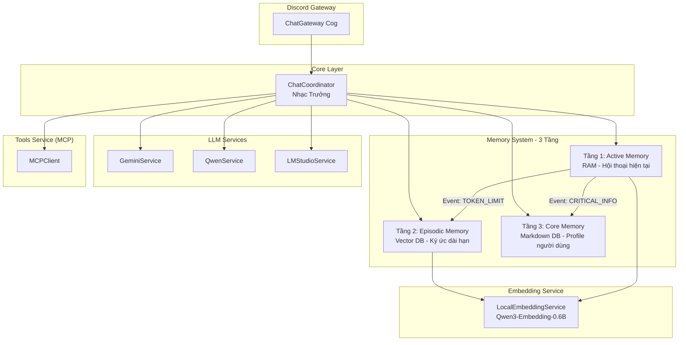
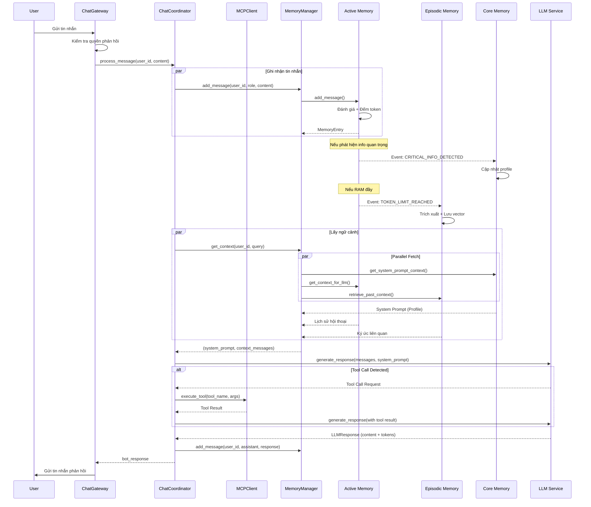
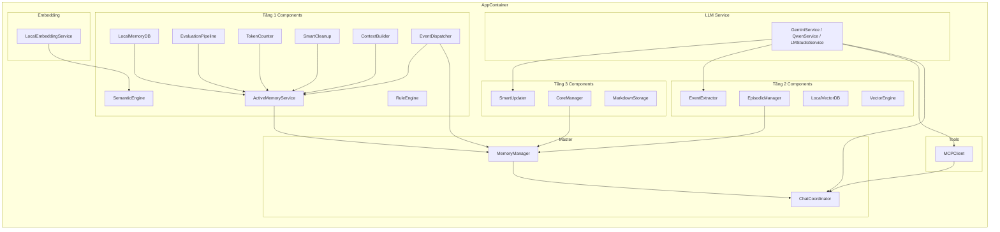

# Discord LLM AI Chatbot

Discord bot powered by Google Gemini và Qwen với hệ thống trí nhớ 3 tầng, theo dõi mối quan hệ và profile người dùng.

## 🚧 Trạng thái Phát triển

**Branch hiện tại**: `Harness_discord_v1`

| Phase | Mô tả | Trạng thái |
|-------|-------|------------|
| **Phase 1** | Settings & Configuration | ✅ Hoàn thành |
| **Phase 2** | LM Studio Reasoning Support | ✅ Hoàn thành |
| **Phase 3** | Native Tool Calling | 🔄 Đang thực hiện |
| **Phase 4** | Memory System Updates | 🔄 Đang thực hiện |
| **Phase 5** | Testing & Validation | ⏳ Chờ |
| **Phase 6** | Documentation & Cleanup | ⏳ Chờ |

### Tính năng mới (v1.1)
- **Reasoning Models Support**: DeepSeek R1, Qwen thinking models
- **Native Tool Calling**: Function calling qua API (không dùng regex parsing)
- **Token Limit**: Tăng từ 100 → 2000 tokens
- **Debug Logging**: Chi tiết cho reasoning models
- **Fallback Mechanism**: Tự động dùng `reasoning_content` khi `content` rỗng

---

## 🧠 Kiến trúc Hệ thống

### Tổng quan

Bot được xây dựng theo kiến trúc **Service-Repository Pattern** với Dependency Injection, chia thành các layer rõ ràng:



### Hệ thống Trí nhớ 3 Tầng

```mermaid
flowchart LR
    subgraph T1["Tầng 1: Active Memory (RAM)"]
        direction TB
        A1[Message Input] --> A2[Evaluation Pipeline]
        A2 --> A3[Token Counter]
        A3 --> A4[RAM Storage]
        A4 --> A5[Context Builder]
        
        A2 -->|Score >= Threshold| A6[Event: CRITICAL_INFO]
        A3 -->|Tokens >= Limit| A7[Event: TOKEN_LIMIT]
    end
    
    subgraph T2["Tầng 2: Episodic Memory (Vector DB)"]
        direction TB
        B1[Event Extractor] --> B2[Vector Engine]
        B2 --> B3[Local Vector DB]
        B3 --> B4[Context Formatter]
    endMarkdown DB)"]
        direction TB
        C1[Smart Updater] --> C2[Profile Markdown)"]
        direction TB
        C1[Smart Updater] --> C2[Profile YAML]
        C2 --> C3[System Prompt Builder]
    end
    
    A6 --> C1
    A7 --> B1
```

#### Tầng 1: Active Memory (RAM)
- **Mục đích**: Lưu trữ hội thoại hiện tại trong RAM
- **Đánh giá tin nhắn**: Rule Engine + Semantic Engine
- **Quản lý token**: Tự động cleanup khi vượt giới hạn
- **Events**: Phát sự kiện khi phát hiện thông tin quan trọng hoặc RAM đầy

#### Tầng 2: Episodic Memory (Vector DB)
- **Mục đích**: Lưu trữ ký ức dài hạn dưới dạng vector embeddings
- **Trích xuất sự kiện**: Dùng LLM để tóm tắt và trích xuất thông tin
- **Tìm kiếm ngữ nghĩa**: Vector similarity search với threshold 0.4
- **Embedding**: Qwen3-EmbMarkdown DB)
- **Mục đích**: Lưu profile người dùng (tên, sở thích, mối quan hệ...)
- **Cập nhật thông minh**: Smart Updater dùng LLM để cập nhật profile
- **System Prompt**: Tự động inject vào prompt cho LLM
- **Storage**: Markdown files trong `memories/users/` mối quan hệ...)
- **Cập nhật thông minh**: Smart Updater dùng LLM để cập nhật profile
- **System Prompt**: Tự động inject vào prompt cho LLM

## 🤖 Agent Memories & Identity

Bot sử dụng hệ thống **Agent Memories** để định hình tính cách và hành vi:

### Cấu trúc Memories

```
memories/
├── INDEX.md           # Index & navigation
├── IDENTITY.md        # Bot personality (March 7th)
├── SOUL.md            # Conversation guidelines
├── AWAKENING.md       # Reserved
├── MEMORY.md          # Reserved
├── HEARTBEAT.md       # Reserved
└── users/
    └── {user_id}.md   # User profiles
```

### Bot Identity: March 7th (Bé Bảy)
- **Character**: Heart of the Astral Express crew (Honkai: Star Rail)
- **Style**: Vietnamese Gen-Z, cheerful, optimistic
- **Self-reference**: "tui", "Bé Bảy"
- **Icons**: `:)))`, `:v`, `:3`, `^^`, `><`, `T.T`

### Available Tools
1. **search_memory** - Tìm kiếm ký ức quá khứ
2. **update_user_profile** - Cập nhật thông tin user
3. **update_personality** - Thay đổi phong cách hội thoại

---

## 📊 Luồng Xử lý Tin nhắn



## 🏗️ Cấu trúc Dự án

```text
src/
├── bot.py                              # Entry point, Discord bot setup
├── __main__.py                         # Python module entry
│
├── config/
│   ├── settings.py                     # Config class (env variables)
│   └── logging_config.py               # Logging setup
│
├── cogs/                               # Discord Cogs (Event handlers)
│   ├── chat_gateway.py                 # Main message handler
│   ├── user_commands.py                # User slash commands
│   ├── admin_channels.py               # Admin channel management
│   └── base_cog.py                     # Base cog class
│
├── services/
│   ├── chat_coordinator.py             # Main orchestrator
│   ├── dependencies.py                 # DI Container (AppContainer)
│   │
│   ├── core/
│   │   └── anti_spam_service.py        # Rate limiting
│   │
│   ├── llm/                            # LLM Providers
│   │   ├── base_llm_service.py         # Abstract base class
│   │   ├── gemini_service.py           # Google Gemini API
│   │   ├── qwen_service.py             # Qwen API (OpenAI-compatible)
│   │   ├── lm_studio_service.py        # LM Studio (local LLM)
│   │   ├── embedding_service.py        # Local embedding model
│   │   └── llm_response.py             # Response wrapper
│   │
│   ├── tools/                          # Tool System (MCP Architecture)
│   │   ├── base_tool.py                # Abstract base class
│   │   ├── tool_registry.py            # Tool registry
│   │   ├── mcp_server.py               # MCP Server (JSON-RPC 2.0)
│   │   ├── mcp_client.py               # MCP Client
│   │   ├── mcp_transport.py            # Communication layer
│   │   ├── tool_discovery.py           # Auto-discovery
│   │   └── implementations/            # Tool implementations
│   │       ├── search_memory_tool.py
│   │       ├── update_profile_tool.py
│   │       ├── update_personality_tool.py
│   │       └── web_search_tool.py
│   │
│   └── memories/                       # 3-Tier Memory System
│       ├── memory_manager.py           # Master orchestrator
│       │
│       ├── activate_memory/            # Tầng 1: Active Memory
│       │   ├── activate_memory_service.py
│       │   ├── models.py               # MemoryEntry, MessageCategory
│       │   ├── constants.py            # Thresholds config
│       │   ├── evaluation/
│       │   │   ├── pipeline.py         # Đánh giá tin nhắn
│       │   │   ├── rule_engine.py      # Luật cứng
│       │   │   └── semantic_engine.py  # Semantic scoring
│       │   ├── events/
│       │   │   └── event_dispatcher.py # Pub/Sub system
│       │   ├── management/
│       │   │   ├── context_builder.py  # Build context for LLM
│       │   │   ├── smart_cleanup.py    # Auto cleanup
│       │   │   └── token_counter.py   # Token counting
│       │   └── storage/
│       │       ├── base_storage.py
│       │       └── ram_storage.py      # In-memory storage
│       │
│       ├── core_memory/                # Tầng 3: Core Memory
│       │   ├── core_manager.py
│       │   ├── smart_updater.py        # LLM-based profile updater
│       │   ├── prompts.yaml            # Extraction prompts
│       │   └── storage/
│       │       └── markdown_storage.py # Markdown file storage
│       │
│       └── episodic_memory/            # Tầng 2: Episodic Memory
│           ├── episodic_manager.py
│           ├── models.py               # EpisodicRecord
│           ├── prompts.yaml            # Extraction prompts
│           ├── extraction/
│           │   └── event_extractor.py  # LLM event extraction
│           └── storage/
│               ├── base_vector_db.py
│               └── local_vector_db.py  # Local vector storage
│
├── models/                             # HuggingFace model cache
│   └── models--Qwen--Qwen3-Embedding-0.6B/
│
├── utils/
│   └── helpers.py                      # Utility functions
│
└── data/                               # Data storage (gitignored)
    ├── bot_channels.json               # Bot channel configurations
    └── core_memory/                    # User profiles (YAML)

memories/                               # Agent memory files
├── INDEX.md                            # Index
├── IDENTITY.md                         # Bot personality
├── SOUL.md                             # Conversation guidelines
├── AWAKENING.md                        # Reserved
├── MEMORY.md                           # Reserved
├── HEARTBEAT.md                        # Reserved
└── users/                              # User profiles
    └── {user_id}.md

plan/                                   # Implementation plans
└── upgrade-harness-bot-1.md            # Current upgrade plan
```

## 🚀 Quick Start

### 1. Clone và Setup

```bash
# Clone repository
git clone <repository-url>
cd discord-bot-v1

# Tạo conda environment
conda create -n discord_bot python=3.14
conda activate discord_bot

# Install dependencies
pip install -r requirements.txt
```

### 2. Cấu hình Environment

```bash
# Copy example env
cp .env.example .env
```

Edit file `.env` với các biến sau:

```env
# Discord
DISCORD_LLM_BOT_TOKEN=your_bot_token
DISCORD_LLM_BOT_CLIENT_ID=your_client_id

# LLM Provider (gemini hoặc qwen)
LLM_PROVIDER=gemini, qwen, lm_studio)
LLM_PROVIDER=gemini
LLM_MODEL=gemini-2.5-flash
LLM_TEMPERATURE=0.7
LLM_MAX_TOKENS=2000
LLM_TOP_P=0.9
LLM_TOP_K=40

# Gemini API
GEMINI_API_KEY=your_gemini_key

# Qwen API (nếu dùng Qwen)
QWEN_API_KEY=your_qwen_key
QWEN_MODEL=qwen-max

# LM Studio (nếu dùng local LLM)
TOOL_LLM_ENDPOINT=http://localhost:1234/v1

# Tool Execution
TOOL_EXECUTION_TIMEOUT=60

# Local development
conda activate discord_bot
python src/bot.py

# Hoặc as module
python -m src

# Docker deployment
docker-compose up -d
docker-compose logs -f be_bay_bot
docker-compose down
### 3. Chạy Bot

```bash
python -m src.bot
# hoặc
python src/bot.py
```

## ⚙️ Cấu hình Chi tiết

### LLM Parameters

| Biến | Mặc định | Mô tả |
|------|----------|-------|
| `LLM_PROVIDER` | `gemini` | Provider: `gemini`, `qwen`, `lm_studio` |
| `LLM_MODEL` | `gemini-2.5-flash` | Model name |
| `LLM_TEMPERATURE` | `0.7` | Creativity (0-1) |
| `LLM_MAX_TOKENS` | `2000` | Max output tokens |
| `LLM_TOP_P` | `0.9` | Nucleus sampling |
| `LLM_TOP_K` | `40` | Top-k sampling |
| `TOOL_EXECUTION_TIMEOUT` | `60` | Tool call timeout (seconds) |

### Typing Simulation

| Biến | Mặc định | Mô tả |
|------|----------|-------|
| `ENABLE_TYPING_SIMULATION` | `1` | Bật/tắt typing simulation |
| `TYPING_SPEED_WPM` | `250` | Tốc độ gõ (words/min) |
| `MIN_TYPING_DELAY` | `0.5` | Delay tối thiểu (giây) |
| `MAX_TYPING_DELAY` | `8.0` | Delay tối đa (giây) |
| `PART_BREAK_DELAY` | `0.6` | Delay giữa các phần tin nhắn |

### Reasoning Models Support

Bot hỗ trợ **reasoning models** (DeepSeek R1, Qwen thinking):

```python
# LM Studio Service tự động xử lý reasoning_content
# Khi content rỗng, fallback sang reasoning_content
if not content and reasoning_content:
    content = reasoning_content
```

## 🔧 Kiến trúc Dependency Injection



## 📝 Ghi chú Kỹ thuật

### Event System (Pub/Sub)

Hệ thống sử dụng Event Dispatcher để giao tiếp giữa các tầng:

- **`CRITICAL_INFO_DETECTED`**: Khi Tầng 1 phát hiện thông tin quan trọng → Tầng 3 cập nhật profile
- **`TOKEN_LIMIT_REACHED`**: Khi Tầng 1 đầy RAM → Tầng 2 tóm tắt và lưu vector

### Parallel Context Fetching

Khi lấy ngữ cảnh cho LLM, 3 tác vụ chạy song song:
1. Tầng 3: Lấy system prompt (profile user)
2. Tầng 1: Lấy lịch sử hội thoại hiện tại
3. Tầng 2: Tìm kiếm ký ức liên quan (vector similarity)

### Token Tracking

Mọi response từ LLM đều được track token usage:
- Input tokens
- Output tokens
- Total tokens

### Phoenix Tracing Integration

Hệ thống tích hợp Arize Phoenix tracing để debug và monitor:
- `@traceable` decorator trên các hàm quan trọng
- Track toàn bộ flow từ message đến response
- Export traces qua OTLP đến Phoenix collector

## 📄 License

MIT License
