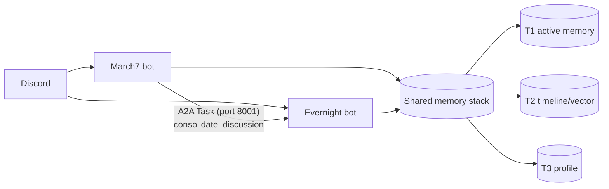
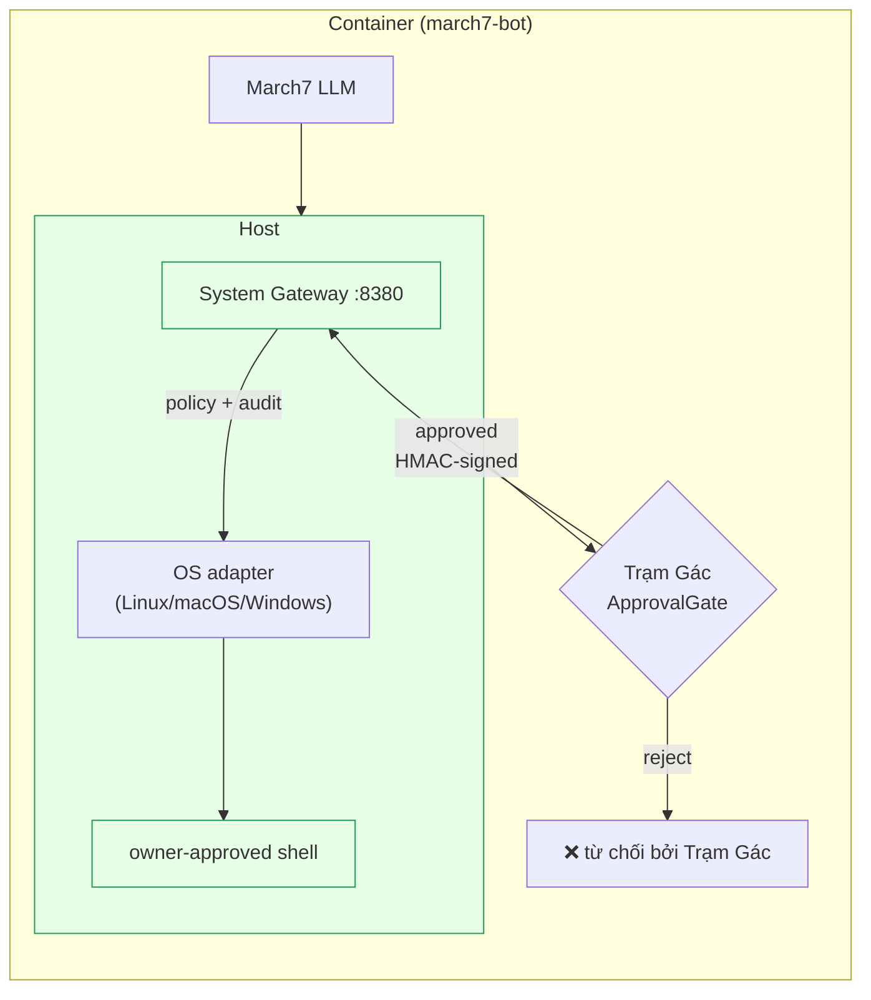

# Bé Bảy (March7) — Twin-Soul AI Assistant for Discord

Bé Bảy là hệ Twin-Soul AI trên Discord: `march7` là agent hội thoại chính, `evernight` là agent độc lập vừa trò chuyện qua DM/tag/prefix vừa làm background consolidation, notification, self-heal. Hai agent giao tiếp qua A2A.

## Tính năng chính

- **Discord AI assistant**: hội thoại tự nhiên + tool calling.
- **Twin-Soul runtime**: `march7` cho chat chính, `evernight` cho chat riêng + tác vụ nền.
- **Evernight DM/tag/!9**: nhận DM, tag/mention, prefix `!9`; gửi DM thông báo/approval.
- **Memory 3 tầng**: T1 Redis active, T2 `TimelineSummaryStore` (vector search), T3 Markdown profile.
- **Background consolidation**: tự động tổng hợp thông qua A2A Consolidation (`March7` gọi `Evernight`).
- **Self-heal loop**: framework có sẵn, đang phát triển.

## Yêu cầu cho agent workflow

Repo này tối ưu cho agent (Claude Code, Antigravity, Cursor, ...). Trước khi để agent đụng vào, cài đặt 2 thứ:

1. **CodeGraph** — index AST của repo, agent dùng cho mọi câu hỏi structural (where is X, what calls Y, impact of Z, ...). Skills đều giả định CodeGraph có sẵn.
   ```bash
   npm install -g @colbymchenry/codegraph
   codegraph init -i      # chạy 1 lần trong repo, tạo .codegraph/
   ```
2. **Skills toàn cục** — 6 skill (`implementation-planner`, `thoughtful-coder`, `debug-investigator`, `code-reviewer`, `architecture-docs`, `create-readme`) ở [Flowerf19/agents-skills](https://github.com/Flowerf19/agents-skills). Clone 1 lần, dùng cho mọi project:
   ```bash
   git clone https://github.com/Flowerf19/agents-skills.git ~/.claude/skills
   ```
   Claude Code auto-discover qua `/<skill-name>`; agent khác point thẳng vào `~/.claude/skills/<name>/SKILL.md`.

Agent docs project-specific (boundary A2A, gotcha runtime, testing) ở [.agents/](.agents/) — bắt đầu đọc từ [.agents/README.md](.agents/README.md).

## Kiến trúc tổng quan



| Agent | Vai trò | Port |
|---|---|---|
| **March7** | Chat chính, tool calling, T1/T2/T3 shared memory | 8000 |
| **Evernight** | DM/tag/`!9` chat, notification/approval, self-heal, T1/T2/T3 shared memory | 8001 |

Evernight nhận tác vụ xử lý tóm tắt trí nhớ (Consolidation) từ March7 qua A2A (`consolidate_discussion`), truy cập T1 để tóm tắt và ghi xuống T2/T3.

### Memory 3 tầng — tại sao & vòng đời

Hai agent chia nhau **một stack memory duy nhất**, tách 3 tầng vì mỗi tầng phục vụ một *latency budget* khác nhau: hot-path phải nhanh, semantic recall chạy async, profile thì biên dịch sẵn. Toàn bộ local-first (LLM + embeddings self-hosted qua LM Studio), không phụ thuộc cloud.

- **T1 — active (working memory ngắn hạn):** cửa sổ trượt các message gần nhất theo từng scope (1-1 user hoặc channel) trong Redis. Nạp thẳng vào context mỗi lượt chat. Ngưỡng token kích hoạt consolidation; sau khi tổng hợp, T1 bị cắt bớt nhưng giữ lại phần đuôi gần nhất để giữ mạch hội thoại.
- **T2 — timeline (semantic memory dài hạn), trên Redis Stack:** Lưu trữ các snapshot tóm tắt quá trình trò chuyện dưới dạng `TimelineSummary` (Redis HASH với vector embedding). Truy hồi ngữ nghĩa qua KNN vector search (`TimelineSummaryStore.search`). Dim index phải khớp `EMBEDDING_VECTOR_SIZE`; đổi dim → drop & tạo lại RediSearch index `timeline_summaries`.
- **T3 — profile:** một markdown profile các section cố định được cập nhật trực tiếp sau mỗi chu kỳ tóm tắt, sau đó inject vào system prompt mỗi lượt. Profile lưu giữ các fact cốt lõi một cách cô đọng.

**Vòng đời (A2A Consolidation):**
Hệ thống sử dụng cơ chế A2A trực tiếp thay vì các pipeline tuần tự phức tạp trước đây (Extractor/Curator/Topic):
1. **Observe:** `March7` nhận tin nhắn và lưu vào `T1 ActiveMemory`.
2. **Trigger:** `InactivityTrigger` (hiện được quản lý hoàn toàn bởi `Evernight`, đã gỡ khỏi gateway của `March7`) theo dõi tính trạng idle. Khi thỏa điều kiện hoặc T1 đạt ngưỡng, một tác vụ `consolidate_discussion` được sinh ra. Đối với March7, nó dùng `ConsolidationClient` (qua port 8001) gửi yêu cầu sang `Evernight`.
3. **Consolidate:** `Evernight` nhận yêu cầu (hoặc tự trigger) và chạy `ConsolidateMemoryTool`. Tool này gọi LLM để đọc toàn bộ T1 snapshot, sau đó tạo ra cả bản tóm tắt T2 (`TimelineSummaryStore`) và bản cập nhật T3 (`MarkdownProfileStore`) trong cùng một lượt, rồi lưu trực tiếp vào DB.
4. **Trim:** T1 được tự động cắt bớt phần cũ để giải phóng context window. Cơ chế chi tiết có thể xem tại `twin/shared/memory/` và qua CodeGraph.

### Plan trạng thái

- [Memory Rewrite](.agents/plans/memory-rewrite.md) — T1/T2/T3 chạy qua `twin/shared/memory/`, T2 dùng Redis Stack VECTOR HNSW (`EMBEDDING_VECTOR_SIZE`-dim), T3 là Markdown 8 section. **Tiến độ: Phase 11/11 ✓**.
- Unified Discussion Memory: đã được hấp thụ vào memory rewrite; flow hiện tại dùng hoàn toàn cơ chế **A2A Consolidation** (InactivityTrigger → ConsolidateMemoryTool), thay thế hoàn toàn `SharedMemoryManager → Consolidator → DebouncedScheduler` cũ.

### Gotcha runtime (dễ quên)

- Channel memory chỉ observe channel được phép, không nghe toàn server. Reply trigger gồm cả reply-to-bot.
- T1 đọc entry mới nhất trước (newest-first). Consolidation tự trigger khi token tích lũy vượt `TOKEN_THRESHOLD=2000` (xem `twin/shared/memory/active/constants.py`).
- T2 timeline là user-centric: channel scope **extract 1 lần** rồi route mỗi memory về đúng participant nó nói về (`subject_user_id`), **không** fan-out per-author; Redis document dùng `user_id` thật (của subject) làm key trong `TimelineSummaryStore`.
- Redis Stack RediSearch index phải ở DB 0; dùng `TIMELINE_REDIS_DB=0` cho T2, còn T1 có thể dùng DB riêng theo agent.
- T3 profile inject vào system prompt mỗi turn qua `MarkdownProfileStore.get_system_prompt_context()`.

### Host boundary — System Gateway

Host interaction giờ đi qua **System Gateway** — native service chạy trực tiếp trên host OS (Linux/macOS/Windows), thay vì qua Docker `nsenter`. Model-facing tool là `host_system` (xem `twin/shared/tools/modules/system/host_system_tool.py`).

Ranh giới code:

- `services/system_gateway/` là native host service package được cài và chạy trên host.
- `twin/shared/system_gateway/` là protocol/client chung cho HMAC signing, request/response types và `HostGatewayClient`.
- March7/Evernight gọi host qua `host_system`; riêng Evernight có `gateway_admin` để status/doctor/install/update gateway.



System Gateway cung cấp:

- **HMAC request signing** giữa container ↔ gateway (không còn tin `Origin`).
- **Nonce + timestamp** chống replay.
- **Approval id binding** trên mỗi mutating request (server lưu consumed approvals).
- **Local policy + audit log** ở gateway; raw shell chỉ chạy sau owner approval.
- **OS adapters** (Linux/macOS/Windows) chạy native trên host, không qua Docker `nsenter`.

Gateway install/update/admin details live in [services/system_gateway/README.md](services/system_gateway/README.md).
Install guidance phải lấy từ `gateway_admin install` hoặc `gateway_admin install_hint`.
Repo path thật chỉ được đưa vào install hint khi `SYSTEM_GATEWAY_BOOTSTRAP_REPO_ROOT`
trỏ tới một repo root mà Evernight có thể verify marker
`scripts/bootstrap_system_gateway.py` và `services/system_gateway/`. Nếu không
verify được, hint dùng placeholder `/path/to/march7` để owner tự thay bằng repo
root trên host.

## Prerequisites

- Python `3.11+`
- Docker + Docker Compose v2
- Discord bot token(s) + API key LLM provider

## Quick start

**Docker (khuyến nghị):**

```bash
cd docker
docker compose down
DOCKER_BUILDKIT=1 docker compose build
docker compose up -d
docker compose logs -f
```

**Local Python:**

```bash
pip install -r requirements.txt
python -m gateway
# hoặc:
python -m twin.march7
python -m twin.evernight
```

> [!TIP]
> Health: `http://localhost:8000/.well-known/agent.json`, `http://localhost:8001/.well-known/agent.json`.

## Cấu hình

Nhóm env vars chính (chi tiết ở [.agents/PROJECT_CONTEXT.md](.agents/PROJECT_CONTEXT.md)):

- Shared: `REDIS_URL`, `TIMELINE_REDIS_DB`, `CODEBOX_API_URL`, `SYSTEM_GATEWAY_URL`
- March7: `MARCH7_A2A_PORT`, `MARCH7_REDIS_DB`, `MARCH7_PERSONA_PATH`
- Evernight: `EVERNIGHT_A2A_PORT`, `EVERNIGHT_REDIS_DB`, `POLL_INTERVAL`, `SELF_HEAL_ENABLED`
- Discord/Gateway: `DISCORD_MARCH7_TOKEN`, `DISCORD_EVERNIGHT_TOKEN`, `GATEWAY_ENABLED_PLATFORMS`
- T1 budget: `T1_CONTEXT_MAX_TOKENS`, `T1_CONTEXT_MAX_MESSAGES`
- Embeddings/T2: `EMBEDDING_PROVIDER`, `EMBEDDING_MODEL_NAME`, `EMBEDDING_VECTOR_SIZE`, `EMBEDDING_API_URL`, `EMBEDDING_API_KEY`
- LLM: `LLM_PROVIDER`, `OPENAI_API_URL`, `OPENAI_API_KEY`, `OPENAI_MODEL` (OpenAI-compat; đặt URL/key theo provider)

> [!NOTE]
> Docker dùng `redis/redis-stack-server` — cùng service phục vụ cả T1 và T2.

> [!IMPORTANT]
> Mọi entrypoint gọi `load_dotenv(override=True)` — file `.env` LUÔN đè block `environment:` trong docker-compose. **`.env` là nguồn sự thật.** Sau khi đổi `.env`, recreate container (không cần rebuild image):
> ```bash
> docker compose -f docker/docker-compose.yml up -d --force-recreate march7 evernight
> ```

LLM + embeddings (OpenAI-compat / Gemini native qua factory): xem [twin/shared/llm/README.md](twin/shared/llm/README.md).

## Development & testing

```bash
pytest tests/unit/ -v
pytest tests/integration/ -v
pytest tests/e2e/ -v
```

## Troubleshooting

> [!WARNING]
> Bash Executor là tool đặc quyền. Bật khi cần và giữ luồng approve theo [scripts/README.md](scripts/README.md).

- Trạng thái containers: `docker compose -f docker/docker-compose.yml ps`
- Logs: `docker compose -f docker/docker-compose.yml logs -f march7 evernight`
- A2A health: port `8000` và `8001`
- **LM Studio**: phải bind `0.0.0.0` (`lms server start --host 0.0.0.0`) để container gọi được qua `host.docker.internal:1234`.
- **Đổi embedding dim**: sau khi đổi `EMBEDDING_VECTOR_SIZE`, drop và tạo lại RediSearch index `timeline_summaries` (T2 data cũ không tương thích).

## Tài liệu liên quan

- [.agents/](.agents/) — agent guidance (start: [README.md](.agents/README.md))
- [services/system_gateway/README.md](services/system_gateway/README.md) — native host gateway architecture, install, security, and runbook
- [twin/shared/llm/README.md](twin/shared/llm/README.md) — LLM + embedding config
- [scripts/README.md](scripts/README.md) — bash executor security
- [docker/README.md](docker/README.md) — Docker runbook
