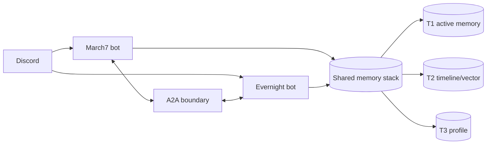
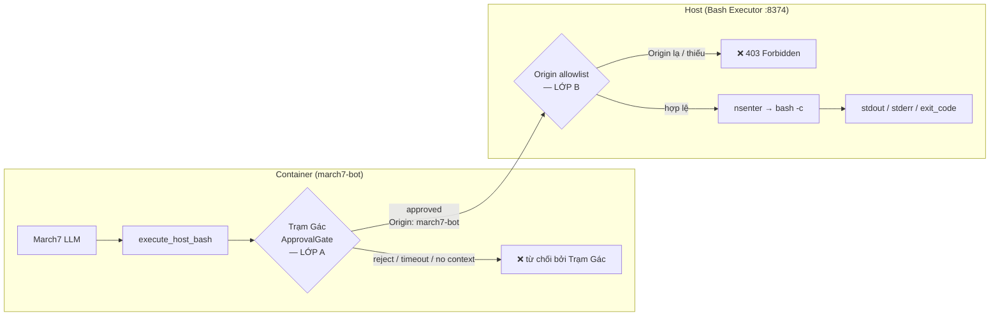

# Bé Bảy (March7) — Twin-Soul AI Assistant for Discord

Bé Bảy là hệ Twin-Soul AI trên Discord: `march7` là agent hội thoại chính, `evernight` là agent độc lập vừa trò chuyện qua DM/tag/prefix vừa làm background consolidation, notification, self-heal. Hai agent giao tiếp qua A2A.

## Tính năng chính

- **Discord AI assistant**: hội thoại tự nhiên + tool calling.
- **Twin-Soul runtime**: `march7` cho chat chính, `evernight` cho chat riêng + tác vụ nền.
- **Evernight DM/tag/!9**: nhận DM, tag/mention, prefix `!9`; gửi DM thông báo/approval.
- **Memory 3 tầng**: T1 Redis active, T2 Redis Stack semantic/vector, T3 Markdown profile.
- **Background consolidation**: tự động tổng hợp khi inactivity/overflow.
- **Self-heal loop**: framework có sẵn, đang phát triển.

## Yêu cầu cho agent workflow

Repo này tối ưu cho agent (Claude Code, Antigravity, Cursor, ...). Trước khi để agent đụng vào, cài đặt 2 thứ:

1. **CodeGraph** — index AST của repo, agent dùng cho mọi câu hỏi structural (where is X, what calls Y, impact of Z, ...). Skills đều giả định CodeGraph có sẵn.
   ```bash
   npm install -g @colbymchenry/codegraph
   codegraph init -i      # chạy 1 lần trong repo, tạo .codegraph/
   ```
2. **Skills toàn cục** — 6 skill (`implementation-planner`, `thoughtful-coder`, `debug-investigator`, `code-reviewer`, `architecture-docs`, `create-readme`) ở [Flowerf19/agents-skills](https://github.com/Flowerf19/agents-skills). Clone 1 lần, dùng cho mọi project:
   ```bash
   git clone https://github.com/Flowerf19/agents-skills.git ~/.claude/skills
   ```
   Claude Code auto-discover qua `/<skill-name>`; agent khác point thẳng vào `~/.claude/skills/<name>/SKILL.md`.

Agent docs project-specific (boundary A2A, gotcha runtime, testing) ở [.agents/](.agents/) — bắt đầu đọc từ [.agents/README.md](.agents/README.md).

## Kiến trúc tổng quan



| Agent | Vai trò | Port |
|---|---|---|
| **March7** | Chat chính, tool calling, T1/T2/T3 shared memory | 8000 |
| **Evernight** | DM/tag/`!9` chat, notification/approval, self-heal, T1/T2/T3 shared memory | 8001 |

Evernight truy cập memory của March7 qua A2A (`get_snapshot`, `clear_session`) — **không** đọc trực tiếp T1 keys.

### Memory 3 tầng — tại sao & vòng đời

Hai agent chia nhau **một stack memory duy nhất**, tách 3 tầng vì mỗi tầng phục vụ một *latency budget* khác nhau: hot-path phải nhanh, semantic recall chạy async, profile thì biên dịch sẵn. Toàn bộ local-first (LLM + embeddings self-hosted qua LM Studio), không phụ thuộc cloud.

- **T1 — active (working memory ngắn hạn):** cửa sổ trượt các message gần nhất theo từng scope (1-1 user hoặc channel) trong Redis. Nạp thẳng vào context mỗi lượt chat. Ngưỡng token/idle kích hoạt consolidation; sau khi tổng hợp, T1 bị cắt bớt nhưng giữ lại phần đuôi gần nhất để giữ mạch hội thoại.
- **T2 — timeline (semantic memory dài hạn), trên Redis Stack:** các "atomic memory" được một lượt LLM trích từ transcript, embed cục bộ rồi lưu kèm taxonomy ~12 catalog cố định, gom theo topic, đánh version (supersede chain + change_type: new/update/correction/reinforcement), kèm confidence + importance từng item, và **TTL theo importance** (memory tự phân rã theo thời gian). Truy hồi đa chế độ: KNN ngữ nghĩa + đọc có lọc (theo catalog, theo topic, recent, current-state/active-only, change-log).
- **T3 — profile (identity bền vững theo user):** một markdown profile các section cố định, **thăng cấp (promote)** từ những T2 memory importance cao + confidence cao, và được inject vào system prompt mỗi lượt. Vì promote chỉ chống trùng *chính xác* (cùng câu paraphrase vẫn lọt nên hồ sơ phình dần), một **lượt biên tập (curate)** tự chạy **~30 phút sau khi user ngừng nói** — ở bất kỳ DM hay channel nào họ có lên tiếng: 1 lượt LLM gộp trùng/bỏ thông tin lỗi thời rồi ghi lại *cả* hồ sơ dưới cùng hash-guard như sửa tay, kèm chốt an toàn (bỏ qua nếu hồ sơ chưa đổi hoặc còn quá ít bullet; từ chối bản rewrite làm mất >50% nội dung).

Vòng đời chạy theo: **observe → consolidate (T1→T2: trích xuất, route đúng người, embed) → promote (T2→T3) → cleanup (T2: supersede + topic-merge) → curate (T3: dedup/biên tập khi user idle)**. Ba nguyên tắc cốt lõi: memory phân rã qua TTL thay vì phình mãi; khi có fact mâu thuẫn thì **supersede/đánh version** chứ không ghi đè âm thầm; và **mỗi tầng tự dọn** — T2 qua cleanup, T3 qua curate — nên phần ghi tự động (promote) không bao giờ tích tụ rác vĩnh viễn. Cơ chế chi tiết (class, key, index) tra ở code + CodeGraph.

### Plan trạng thái

- [Memory Rewrite](.agents/plans/memory-rewrite.md) — T1/T2/T3 chạy qua `twin/shared/memory/`, T2 dùng Redis Stack VECTOR HNSW 1024, T3 là Markdown 8 section. **Tiến độ: Phase 11/11 ✓**.
- Unified Discussion Memory: đã được hấp thụ vào memory rewrite; flow hiện tại là `ActiveMemory → SharedMemoryManager → Consolidator → CleanupScheduler`.

### Gotcha runtime (dễ quên)

- Channel memory chỉ observe channel được phép, không nghe toàn server. Reply trigger gồm cả reply-to-bot.
- T2 timeline là user-centric: channel scope **extract 1 lần** rồi route mỗi memory về đúng participant nó nói về (`subject_user_id`), **không** fan-out per-author; Redis document dùng `T2Memory.user_id` thật (của subject).
- Redis Stack RediSearch index phải ở DB 0; dùng `TIMELINE_REDIS_DB=0` cho T2, còn T1 có thể dùng DB riêng theo agent.
- T3 profile inject vào system prompt mỗi turn qua `MarkdownProfileStore.get_system_prompt_context()`.

### Host bash tool — 2 lớp chặn

`execute_host_bash` là proxy tool: chạy trong container nhưng thực thi trên host qua HTTP. Vì là tool đặc quyền, mỗi lần gọi đi qua **2 lớp chặn độc lập** — duyệt người (gateway cấp context + nút approve) *trước*, rồi xác thực caller (`Origin` allowlist) ở host. Thiếu bất kỳ lớp nào → lệnh dừng, không bao giờ chạm `bash`.



| | Lớp A — Trạm Gác | Lớp B — Origin |
|---|---|---|
| **Vị trí** | Trong container, *trước* HTTP | Trên host, *đầu* `/execute` |
| **Chặn ai** | Lệnh chưa được người duyệt | Caller không phải bot container |
| **Cơ chế** | `ApprovalGate` + `ApprovalBackend` (nút Discord) do **gateway** cấp qua context | So `Origin` header với `BASH_EXECUTOR_ALLOWED_ORIGINS` |
| **Bỏ qua** | env `APPROVAL_AUTO_APPROVE_WITHOUT_CONTEXT=true` | thêm origin vào allowlist |

> [!NOTE]
> "Gateway chặn" = dừng ở Lớp A: gateway là nơi set approval context/backend. Message **không** đi qua gateway adapter → không có bề mặt xin phép → mặc định `reject`.

## Prerequisites

- Python `3.11+`
- Docker + Docker Compose v2
- Discord bot token(s) + API key LLM provider

## Quick start

**Docker (khuyến nghị):**

```bash
cd docker
docker compose down
DOCKER_BUILDKIT=1 docker compose build
docker compose up -d
docker compose logs -f
```

**Local Python:**

```bash
pip install -r requirements.txt
python -m gateway
# hoặc:
python -m twin.march7
python -m twin.evernight
```

> [!TIP]
> Health: `http://localhost:8000/.well-known/agent.json`, `http://localhost:8001/.well-known/agent.json`.

## Cấu hình

Nhóm env vars chính (chi tiết ở [.agents/PROJECT_CONTEXT.md](.agents/PROJECT_CONTEXT.md)):

- Shared: `REDIS_URL`, `TIMELINE_REDIS_DB`, `CODEBOX_API_URL`, `BASH_EXECUTOR_URL`
- March7: `MARCH7_A2A_PORT`, `MARCH7_REDIS_DB`, `MARCH7_PERSONA_PATH`
- Evernight: `EVERNIGHT_A2A_PORT`, `EVERNIGHT_REDIS_DB`, `POLL_INTERVAL`, `SELF_HEAL_ENABLED`
- Discord/Gateway: `DISCORD_MARCH7_TOKEN`, `DISCORD_EVERNIGHT_TOKEN`, `GATEWAY_ENABLED_PLATFORMS`
- T1 budget: `T1_CONTEXT_MAX_TOKENS`, `T1_CONTEXT_MAX_MESSAGES`
- Embeddings/T2: `EMBEDDING_PROVIDER`, `EMBEDDING_MODEL_NAME`, `EMBEDDING_VECTOR_SIZE=1024`

> [!NOTE]
> Docker dùng `redis/redis-stack-server` — cùng service phục vụ cả T1 và T2.

LLM + embeddings (OpenAI-compat / Gemini native qua factory): xem [twin/shared/llm/README.md](twin/shared/llm/README.md).

## Development & testing

```bash
pytest tests/unit/ -v
pytest tests/integration/ -v
pytest tests/e2e/ -v
```

## Troubleshooting

> [!WARNING]
> Bash Executor là tool đặc quyền. Bật khi cần và giữ luồng approve theo [scripts/README.md](scripts/README.md).

- Trạng thái containers: `docker compose -f docker/docker-compose.yml ps`
- Logs: `docker compose -f docker/docker-compose.yml logs -f march7 evernight`
- A2A health: port `8000` và `8001`

## Tài liệu liên quan

- [.agents/](.agents/) — agent guidance (start: [README.md](.agents/README.md))
- [twin/shared/llm/README.md](twin/shared/llm/README.md) — LLM + embedding config
- [scripts/README.md](scripts/README.md) — bash executor security
- [docker/README.md](docker/README.md) — Docker runbook
