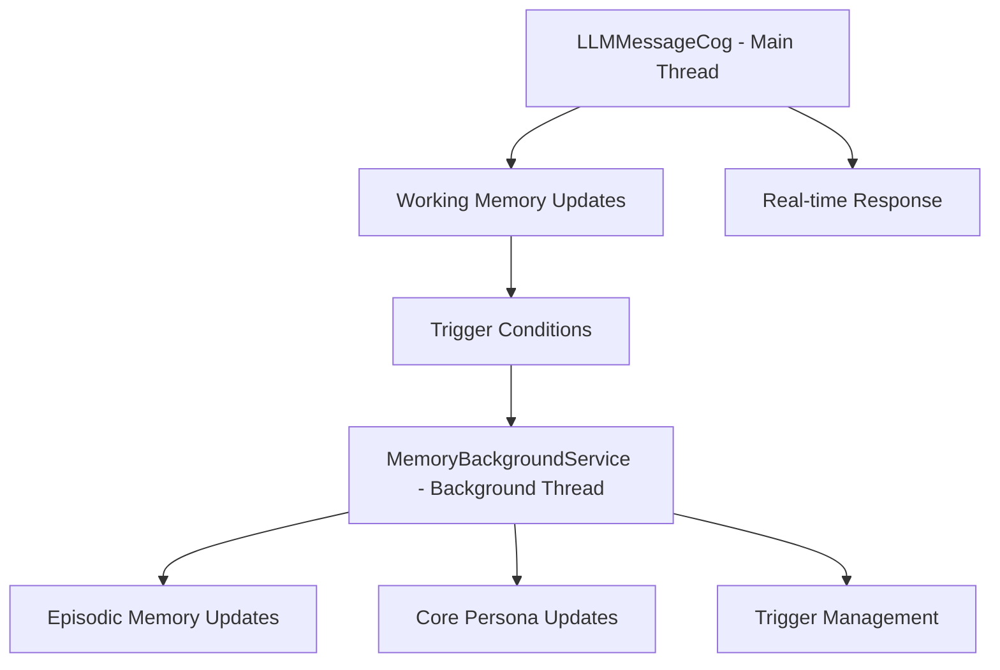

# Kế hoạch hệ thống Background Job cho hệ thống 3 tầng

## Tổng quan

Hệ thống Background Job sẽ xử lý các tác vụ cập nhật định kỳ cho Episodic Memory và Core Persona, hoạt động độc lập với luồng xử lý tin nhắn chính.

## Kiến trúc hệ thống



## Chi tiết thiết kế

### 1. MemoryBackgroundService

Dịch vụ chạy nền với các chức năng chính:

#### a. Episodic Memory Updater
- **Mục tiêu**: Trích xuất sự kiện/fact quan trọng từ Working Memory và lưu vào Episodic Memory
- **Điều kiện kích hoạt**:
  - Working Memory đạt ngưỡng 20 tin nhắn
  - Không có hoạt động trong 10 phút
- **Quy trình**:
  1. Lấy 20 tin nhắn gần nhất từ Working Memory
  2. Gửi đến LLM để trích xuất facts/events
  3. Lưu vào file `user_id_episodic.json`
  4. Dọn dẹp Working Memory đã xử lý

#### b. Core Persona Updater
- **Mục tiêu**: Cập nhật hồ sơ cốt lõi dựa trên các sự kiện mới trong Episodic Memory
- **Điều kiện kích hoạt**:
  - Định kỳ hàng tuần
  - Episodic Memory có hơn 50 sự kiện mới
- **Quy trình**:
  1. Lấy các sự kiện mới từ Episodic Memory
  2. Kết hợp với hồ sơ hiện tại
  3. Gửi đến LLM để tạo hồ sơ mới
  4. Lưu vào file `user_id_summary.txt`

### 2. Cơ chế trigger thông minh

#### a. Working Memory Threshold Trigger
- Theo dõi số lượng tin nhắn trong Working Memory
- Kích hoạt khi đạt ngưỡng 20 tin nhắn

#### b. Inactivity Timeout Trigger
- Theo dõi thời gian hoạt động cuối cùng của người dùng
- Kích hoạt khi không có hoạt động trong 10 phút

#### c. Event Count Trigger
- Theo dõi số lượng sự kiện mới trong Episodic Memory
- Kích hoạt Core Persona update khi có > 50 sự kiện

## Triển khai chi tiết

### Tệp: `src/services/memory_background_service.py`

```python
import asyncio
import logging
import os
import json
from datetime import datetime, timedelta
from typing import Dict, List, Optional

logger = logging.getLogger(__name__)

class MemoryBackgroundService:
    """
    Dịch vụ chạy nền để xử lý cập nhật Episodic Memory và Core Persona
    """
    
    def __init__(self, llm_service, data_dir: str):
        self.llm_service = llm_service
        self.data_dir = data_dir
        
        # Đường dẫn lưu trữ
        self.user_summaries_dir = os.path.join(data_dir, "user_summaries")
        
        # Theo dõi thời gian hoạt động của người dùng
        self.last_activity = {}
        self.working_memory_threshold = 20  # Số lượng tin nhắn trước khi cập nhật
        self.inactivity_timeout = 600  # 10 phút không hoạt động (tính bằng giây)
        
        # Cờ để kiểm soát vòng lặp
        self.running = False
        self.task = None
        
    def start(self):
        """Khởi động dịch vụ nền"""
        if not self.running:
            self.running = True
            self.task = asyncio.create_task(self._background_worker())
            logger.info("🔄 MemoryBackgroundService started")
            
    def stop(self):
        """Dừng dịch vụ nền"""
        if self.running:
            self.running = False
            if self.task:
                self.task.cancel()
            logger.info("🔄 MemoryBackgroundService stopped")
    
    async def _background_worker(self):
        """Vòng lặp xử lý nền chính"""
        while self.running:
            try:
                # Kiểm tra và cập nhật episodic memory
                await self._check_and_update_episodic_memories()
                
                # Kiểm tra và cập nhật core persona (định kỳ hàng tuần)
                await self._check_and_update_core_personas()
                
                # Chờ 60 giây trước lần kiểm tra tiếp theo
                await asyncio.sleep(60)
                
            except asyncio.CancelledError:
                logger.info("🔄 Background worker cancelled")
                break
            except Exception as e:
                logger.error(f"❌ Error in background worker: {e}")
                await asyncio.sleep(60)  # Chờ 60 giây trước khi thử lại
    
    async def _check_and_update_episodic_memories(self):
        """Kiểm tra và cập nhật episodic memories dựa trên điều kiện"""
        try:
            # Lấy tất cả file history
            history_files = [f for f in os.listdir(self.user_summaries_dir) if f.endswith('_history.json')]
            
            for history_file in history_files:
                user_id = history_file.replace('_history.json', '')
                
                # Kiểm tra điều kiện cập nhật
                should_update = await self._should_update_episodic_memory(user_id)
                
                if should_update:
                    await self._update_episodic_memory(user_id)
                    
        except Exception as e:
            logger.error(f"❌ Error checking episodic memories: {e}")
    
    async def _should_update_episodic_memory(self, user_id: str) -> bool:
        """Kiểm tra xem có nên cập nhật episodic memory không"""
        try:
            # Kiểm tra số lượng tin nhắn trong working memory
            history = self._get_user_history(user_id)
            message_count = len(history)
            
            # Điều kiện 1: Đạt ngưỡng 20 tin nhắn
            if message_count >= self.working_memory_threshold:
                logger.info(f"📝 Episodic memory update triggered for {user_id}: reached {message_count} messages")
                return True
            
            # Điều kiện 2: Không có hoạt động trong 10 phút
            last_activity = self._get_last_activity_time(user_id)
            if last_activity:
                time_since_activity = (datetime.now() - last_activity).total_seconds()
                if time_since_activity >= self.inactivity_timeout:
                    logger.info(f"📝 Episodic memory update triggered for {user_id}: inactive for {time_since_activity}s")
                    return True
            
            return False
            
        except Exception as e:
            logger.error(f"❌ Error checking episodic memory update condition for {user_id}: {e}")
            return False
    
    def _get_user_history(self, user_id: str) -> List[Dict]:
        """Lấy lịch sử hội thoại của người dùng"""
        history_file = os.path.join(self.user_summaries_dir, f"{user_id}_history.json")
        
        if not os.path.exists(history_file):
            return []
        
        try:
            with open(history_file, 'r', encoding='utf-8') as f:
                history = json.load(f)
                return history if isinstance(history, list) else []
        except Exception as e:
            logger.error(f"❌ Error loading history for {user_id}: {e}")
            return []
    
    def _get_last_activity_time(self, user_id: str) -> Optional[datetime]:
        """Lấy thời gian hoạt động cuối cùng của người dùng"""
        history = self._get_user_history(user_id)
        if history:
            # Lấy timestamp của tin nhắn cuối cùng
            last_message = history[-1]
            if 'timestamp' in last_message:
                try:
                    return datetime.fromisoformat(last_message['timestamp'])
                except ValueError:
                    # Nếu không parse được ISO format, thử các định dạng khác
                    pass
        return None
    
    async def _update_episodic_memory(self, user_id: str):
        """Cập nhật episodic memory cho người dùng"""
        try:
            logger.info(f"🔄 Updating episodic memory for user {user_id}")
            
            # Lấy lịch sử hội thoại thô
            history = self._get_user_history(user_id)
            if not history:
                logger.info(f"📝 No history to process for {user_id}")
                return
            
            # Lấy 20 tin nhắn gần nhất để xử lý
            recent_history = history[-20:] if len(history) > 20 else history
            
            # Tạo prompt để trích xuất facts/events
            conversation_text = "\\n".join([
                f"{msg['role']}: {msg['content']}" 
                for msg in recent_history 
                if msg.get('content')
            ])
            
            # Prompt để LLM trích xuất các sự kiện/fact quan trọng
            extraction_prompt = f"""
Bạn là một chuyên gia phân tích hội thoại. Hãy trích xuất các sự kiện, fact quan trọng từ đoạn hội thoại sau:

HỘI THOẠI CẦN PHÂN TÍCH:
{conversation_text}

Hãy trích xuất các thông tin sau theo định dạng JSON:
{{
  "events": [
    {{
      "type": "fact|event|behavior|preference|milestone|change",
      "category": "personal_info|interests|habits|goals|relationships|activities|status_change",
      "summary": "Tóm tắt ngắn gọn sự kiện/fact",
      "details": "Chi tiết cụ thể về sự kiện/fact",
      "timestamp": "Thời gian (nếu có thể xác định)",
      "confidence": 0.0-1.0
    }}
  ],
  "key_themes": ["chủ đề chính được thảo luận"],
  "important_facts": ["các fact quan trọng cần nhớ"]
}}

Chỉ trả lời dưới dạng JSON, không giải thích thêm:
"""
            
            # Gọi LLM để trích xuất facts
            llm_response = await self.llm_service.generate_response(
                extraction_prompt, f"episodic_extraction_{user_id}"
            )
            
            # Parse kết quả từ LLM
            extracted_data = self._parse_llm_extraction_result(llm_response)
            
            if extracted_data and 'events' in extracted_data:
                # Thêm facts vào episodic memory
                await self._append_to_episodic_memory(user_id, extracted_data['events'])
                
                # Xóa bớt tin nhắn cũ ở tầng 1 (working memory) sau khi đã trích xuất
                await self._cleanup_working_memory(user_id, len(recent_history))
                
                logger.info(f"✅ Episodic memory updated for {user_id} with {len(extracted_data['events'])} events")
            else:
                logger.warning(f"⚠️ No valid events extracted for {user_id}")
                
        except Exception as e:
            logger.error(f"❌ Error updating episodic memory for {user_id}: {e}")
    
    def _parse_llm_extraction_result(self, llm_response: str) -> Optional[Dict]:
        """Parse kết quả trích xuất từ LLM"""
        import re
        import json
        
        try:
            # Thử parse trực tiếp nếu là JSON hợp lệ
            return json.loads(llm_response)
        except json.JSONDecodeError:
            # Nếu không phải JSON hợp lệ, tìm khối JSON trong chuỗi
            try:
                # Tìm khối JSON giữa dấu ngoặc nhọn
                json_match = re.search(r'\{.*\}', llm_response, re.DOTALL)
                if json_match:
                    json_str = json_match.group()
                    # Làm sạch chuỗi JSON (loại bỏ trailing commas)
                    json_str = re.sub(r',(\s*[}\]])', r'\1', json_str)
                    return json.loads(json_str)
            except:
                pass
        
        return None
    
    async def _append_to_episodic_memory(self, user_id: str, events: List[Dict]):
        """Thêm các sự kiện vào episodic memory (file nhật ký)"""
        try:
            # Tạo file episodic memory riêng biệt
            episodic_file = os.path.join(self.user_summaries_dir, f"{user_id}_episodic.json")
            
            # Đọc dữ liệu hiện tại
            existing_events = []
            if os.path.exists(episodic_file):
                try:
                    with open(episodic_file, 'r', encoding='utf-8') as f:
                        existing_events = json.load(f)
                        if not isinstance(existing_events, list):
                            existing_events = []
                except:
                    existing_events = []
            
            # Thêm các sự kiện mới
            for event in events:
                event['added_at'] = datetime.now().isoformat()
                existing_events.append(event)
            
            # Giới hạn số lượng sự kiện để tránh file quá lớn
            if len(existing_events) > 200:  # Giới hạn 200 sự kiện gần nhất
                existing_events = existing_events[-200:]
            
            # Ghi lại file
            with open(episodic_file, 'w', encoding='utf-8') as f:
                json.dump(existing_events, f, ensure_ascii=False, indent=2)
                
        except Exception as e:
            logger.error(f"❌ Error appending to episodic memory for {user_id}: {e}")
    
    async def _cleanup_working_memory(self, user_id: str, processed_count: int):
        """Dọn dẹp working memory sau khi đã trích xuất"""
        try:
            history_file = os.path.join(self.user_summaries_dir, f"{user_id}_history.json")
            
            if not os.path.exists(history_file):
                return
            
            # Đọc lịch sử hiện tại
            with open(history_file, 'r', encoding='utf-8') as f:
                history = json.load(f)
            
            if not isinstance(history, list):
                return
            
            # Giữ lại phần chưa xử lý (nếu có)
            remaining_history = history[processed_count:] if len(history) > processed_count else []
            
            # Ghi lại file với phần còn lại
            with open(history_file, 'w', encoding='utf-8') as f:
                json.dump(remaining_history, f, ensure_ascii=False, indent=2)
                
            logger.info(f"🧹 Cleaned up {processed_count} messages from working memory for {user_id}")
            
        except Exception as e:
            logger.error(f"❌ Error cleaning up working memory for {user_id}: {e}")
    
    async def _check_and_update_core_personas(self):
        """Kiểm tra và cập nhật core personas định kỳ"""
        # Cập nhật định kỳ hàng tuần hoặc khi có > 50 sự kiện mới
        try:
            # Lấy tất cả file episodic
            episodic_files = [f for f in os.listdir(self.user_summaries_dir) if f.endswith('_episodic.json')]
            
            for episodic_file in episodic_files:
                user_id = episodic_file.replace('_episodic.json', '')
                
                # Kiểm tra điều kiện cập nhật core persona
                should_update = await self._should_update_core_persona(user_id)
                
                if should_update:
                    await self._update_core_persona(user_id)
                    
        except Exception as e:
            logger.error(f"❌ Error checking core personas: {e}")
    
    async def _should_update_core_persona(self, user_id: str) -> bool:
        """Kiểm tra xem có nên cập nhật core persona không"""
        try:
            # Lấy file episodic memory
            episodic_file = os.path.join(self.user_summaries_dir, f"{user_id}_episodic.json")
            
            if not os.path.exists(episodic_file):
                return False
            
            # Đếm số lượng sự kiện mới
            with open(episodic_file, 'r', encoding='utf-8') as f:
                events = json.load(f)
            
            if not isinstance(events, list):
                return False
            
            # Điều kiện: có hơn 50 sự kiện kể từ lần cập nhật core persona cuối cùng
            # (giả sử chúng ta theo dõi lần cập nhật cuối cùng trong metadata)
            
            # Đơn giản hóa: cập nhật nếu có hơn 50 sự kiện
            if len(events) > 50:
                logger.info(f"🔄 Core persona update triggered for {user_id}: {len(events)} events recorded")
                return True
            
            # Ngoài ra, có thể thêm điều kiện thời gian (ví dụ: cập nhật hàng tuần)
            # Để đơn giản, tạm thời chỉ dùng điều kiện số lượng sự kiện
            
            return False
            
        except Exception as e:
            logger.error(f"❌ Error checking core persona update condition for {user_id}: {e}")
            return False
    
    async def _update_core_persona(self, user_id: str):
        """Cập nhật core persona cho người dùng"""
        try:
            logger.info(f"🔄 Updating core persona for user {user_id}")
            
            # Lấy episodic memory (sự kiện mới)
            episodic_file = os.path.join(self.user_summaries_dir, f"{user_id}_episodic.json")
            if not os.path.exists(episodic_file):
                logger.info(f"📝 No episodic memory to process for {user_id}")
                return
            
            with open(episodic_file, 'r', encoding='utf-8') as f:
                events = json.load(f)
            
            if not isinstance(events, list) or not events:
                logger.info(f"📝 No events to process for {user_id}")
                return
            
            # Lấy core persona hiện tại
            current_summary = self._get_current_summary(user_id)
            
            # Lấy các sự kiện gần đây để cập nhật
            recent_events = events[-50:] if len(events) > 50 else events  # Lấy 50 sự kiện gần nhất
            
            # Tạo prompt để cập nhật hồ sơ
            update_prompt = f"""
Bạn là chuyên gia cập nhật hồ sơ người dùng. Hãy cập nhật hồ sơ cốt lõi của người dùng dựa trên các sự kiện mới sau:

HỒ SƠ HIỆN TẠI:
{current_summary or '[Chưa có hồ sơ]'}

SỰ KIỆN MỚI (theo thứ tự thời gian):
{json.dumps(recent_events[-10:], indent=2, ensure_ascii=False)}  # Lấy 10 sự kiện gần nhất

Hãy tạo lại hồ sơ người dùng theo định dạng chuẩn sau, cập nhật thông tin mới và giữ lại thông tin vẫn còn chính xác:

=== THÔNG TIN CƠ BẢN ===
Tên: [Tên thật hoặc biệt danh]
Tuổi: [Tuổi hiện tại]
Sinh nhật: [Ngày sinh nếu có]

=== SỞ THÍCH & ĐAM MÊ ===
• Công nghệ: [Ngôn ngữ lập trình, dự án, level skill]
• Giải trí: [Phim, nhạc, game, thể loại yêu thích]
• Khác: [Các sở thích khác được đề cập]

=== TÍNH CÁCH & PHONG CÁCH ===
• Giao tiếp: [Cách user nói chuyện - hài hước, nghiêm túc, etc]
• Tâm trạng: [Thường vui, hay lo lắng, tích cực, etc]
• Đặc điểm: [Những điều đặc biệt về user]

=== DỰ ÁN & MỤC TIÊU ===
• Hiện tại: [Đang làm gì, học gì, quan tâm gì]
• Kế hoạch: [Mục tiêu, ước mơ đã chia sẻ]

=== LỊCH SỬ TƯƠNG TÁC ===
• Chủ đề đã thảo luận: [Những gì đã nói chuyện]
• Mức độ thân thiết: [Mới quen, đã quen, thân thiết]
• Ghi chú đặc biệt: [Điều gì cần nhớ đặc biệt]

=== MỐI QUAN HỆ VỚI NGƯỜI KHÁC ===
• Bạn bè: [Tên các user khác mà user này đã nhắc đến, kèm thông tin về mối quan hệ]
• Gia đình: [Thành viên gia đình được nhắc đến]
• Đồng nghiệp: [Đồng nghiệp, đối tác làm việc được đề cập]
• Người quan trọng: [Người yêu, crush, người đặc biệt được nhắc đến]
• Ghi chú về tương tác: [Cách user nói về người khác, mức độ thân thiết]

QUAN TRỌNG:
- CẬP NHẬT thông tin nếu có thay đổi (ví dụ: tuổi mới, sở thích mới)
- GIỮ lại thông tin vẫn còn chính xác
- LOẠI BỎ thông tin lỗi thời hoặc không còn đúng
- CHỈ ghi thông tin CÓ THẬT trong các sự kiện
"""
            
            # Gọi LLM để cập nhật hồ sơ
            new_summary = await self.llm_service.generate_response(
                update_prompt, f"core_persona_update_{user_id}"
            )
            
            if new_summary and len(new_summary.strip()) > 50:
                # Lưu lại hồ sơ mới
                self._save_summary(user_id, new_summary.strip())
                
                # Lưu lại thời gian cập nhật để theo dõi
                await self._mark_persona_updated(user_id)
                
                logger.info(f"✅ Core persona updated for {user_id}")
            else:
                logger.warning(f"⚠️ Failed to generate new summary for {user_id}")
                
        except Exception as e:
            logger.error(f"❌ Error updating core persona for {user_id}: {e}")
    
    def _get_current_summary(self, user_id: str) -> str:
        """Lấy summary hiện tại của người dùng"""
        summary_file = os.path.join(self.user_summaries_dir, f"{user_id}_summary.txt")
        
        if not os.path.exists(summary_file):
            return ""
        
        try:
            with open(summary_file, 'r', encoding='utf-8') as f:
                return f.read().strip()
        except Exception as e:
            logger.error(f"❌ Error loading summary for {user_id}: {e}")
            return ""
    
    def _save_summary(self, user_id: str, summary: str):
        """Lưu summary của người dùng"""
        summary_file = os.path.join(self.user_summaries_dir, f"{user_id}_summary.txt")
        
        try:
            with open(summary_file, 'w', encoding='utf-8') as f:
                f.write(summary)
            logger.info(f"📝 Summary saved for user {user_id}")
        except Exception as e:
            logger.error(f"❌ Error saving summary for {user_id}: {e}")
    
    async def _mark_persona_updated(self, user_id: str):
        """Đánh dấu thời gian cập nhật core persona"""
        # Có thể lưu vào một file metadata riêng để theo dõi
        metadata_file = os.path.join(self.user_summaries_dir, f"{user_id}_metadata.json")
        
        metadata = {}
        if os.path.exists(metadata_file):
            try:
                with open(metadata_file, 'r', encoding='utf-8') as f:
                    metadata = json.load(f)
            except:
                metadata = {}
        
        metadata['last_persona_update'] = datetime.now().isoformat()
        
        try:
            with open(metadata_file, 'w', encoding='utf-8') as f:
                json.dump(metadata, f, ensure_ascii=False, indent=2)
        except Exception as e:
            logger.error(f"❌ Error saving metadata for {user_id}: {e}")
    
    def record_user_activity(self, user_id: str):
        """Ghi nhận hoạt động của người dùng để theo dõi thời gian inactivity"""
        self.last_activity[user_id] = datetime.now()
```

## Luồng hoạt động

### 1. Luồng trả lời tin nhắn (Real-time)
```
User -> Discord Cog -> Working Memory -> LLM -> Response
                      ↓
              Ghi nhận hoạt động -> Background Service
```

### 2. Luồng cập nhật nhật ký (Episodic Memory)
```
Background Service -> Kiểm tra điều kiện -> Trích xuất facts từ Working Memory
                   -> Lưu vào Episodic Memory -> Dọn dẹp Working Memory
```

### 3. Luồng cập nhật hồ sơ (Core Persona)
```
Background Service -> Kiểm tra điều kiện -> Lấy sự kiện từ Episodic Memory
                   -> Cập nhật Core Persona -> Lưu hồ sơ mới
```

## Tích hợp với hệ thống hiện tại

### 1. Cập nhật LLMMessageCog
- Gọi `memory_background_service.record_user_activity()` khi nhận tin nhắn
- Không thay đổi luồng xử lý chính

### 2. Khởi tạo dịch vụ
- Khởi tạo `MemoryBackgroundService` trong `LLMMessageCog.__init__()`
- Bắt đầu dịch vụ khi bot khởi động
- Dừng dịch vụ khi bot tắt

## Lợi ích của hệ thống mới

1. **Tách biệt trách nhiệm**: Luồng xử lý tin nhắn chính không bị ảnh hưởng bởi các tác vụ cập nhật nền
2. **Hiệu suất cao**: Các tác vụ nặng được xử lý trong background
3. **Tự động hóa**: Các cập nhật diễn ra tự động theo điều kiện đã định
4. **Scalability**: Dễ dàng mở rộng thêm các loại bộ nhớ hoặc điều kiện cập nhật
5. **Tính chính xác**: Thông tin được tổng hợp và cập nhật định kỳ, tránh sai sót do cập nhật quá thường xuyên

## Các điểm cần lưu ý khi triển khai

1. **Đảm bảo thread safety**: Các thao tác đọc/ghi file cần được đồng bộ hóa nếu cần
2. **Xử lý lỗi**: Cần có cơ chế fallback khi LLM không phản hồi hoặc phản hồi không đúng định dạng
3. **Tối ưu hiệu suất**: Giới hạn số lượng sự kiện trong mỗi file để tránh quá tải
4. **Backup dữ liệu**: Cần có cơ chế backup định kỳ cho các file bộ nhớ quan trọng