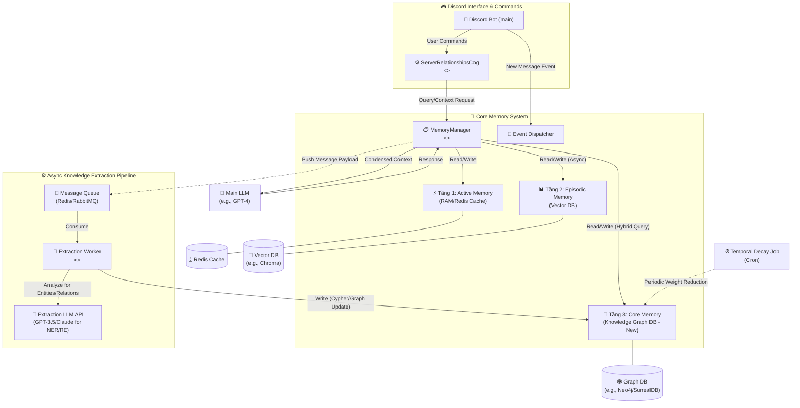

# Kế Hoạch Triển Khai Hệ Thống Relationship Graph

> **Tài liệu tham khảo:** Kế hoạch này được xây dựng dựa trên các phát hiện nghiên cứu từ [`relationship_graph_alternatives_research.md`](relationship_graph_alternatives_research.md).

## Mối quan hệ với Tài liệu Nghiên cứu

| Giai đoạn trong Kế hoạch | Dựa trên Phương án từ Research |
|--------------------------|--------------------------------|
| **Giai đoạn 1: Foundation** | Phần 1 - Storage: JSON Local (khuyến nghị MVP) |
| **Giai đoạn 2: Async Pipeline** | Phần 2 - Extraction: Hybrid Rule + LLM |
| **Giai đoạn 3: Hybrid Retrieval** | Phần 3 - Update Strategy: Hybrid Immediate + Deferred |
| **Giai đoạn 4: Temporal Dynamics** | Phần 4 - Algorithms: Temporal Decay |
| **Giai đoạn 5: UI Commands** | Implementation cụ thể |

---

## 1. Đánh Giá Tính Khả Thi (Feasibility Assessment)

**Kết luận nhanh:** Rất khả thi và mang tính đột phá, nhưng đòi hỏi tài nguyên hệ thống và kỹ năng quản lý trạng thái (state management) rất cao.

Tài liệu thể hiện một tầm nhìn kiến trúc cực kỳ hiện đại (State-of-the-Art) cho LLM Agents, tiếp cận đúng "nỗi đau" của RAG truyền thống là mất đi cấu trúc tô-pô (topological structure) và bối cảnh xã hội học trong Discord.

### 1.1 Những điểm mạnh và thuận lợi (Dựa trên code hiện tại)

- **Kiến trúc hướng sự kiện (Event-driven) đã sẵn sàng:** Trong file `MemoryManager.py` đã có sẵn `EventDispatcher` và cơ chế Pub/Sub (`self.events.subscribe`). Đây là "xương sống" tuyệt vời để cắm thêm luồng xử lý Đồ thị tri thức (Graph Knowledge) chạy ngầm mà không làm nghẽn luồng chat chính của Discord.

- **Phân tách tầng rõ ràng:** Tầng 1 (Active/RAM), Tầng 2 (Episodic/Vector) và Tầng 3 (Core/Tiềm thức) đã được định hình tốt trong `MemoryManager` và `CoreManager`. Việc biến hệ thống quan hệ thành một phần mở rộng của Tầng 3 (Core) kết hợp với Tầng 2 (Vector) là hoàn toàn hợp lý.

### 1.2 Những thách thức cần lưu tâm

- **Chi phí API (API Cost):** Việc sử dụng LLM API (như GPT-4, Claude) để trích xuất thực thể (NER) và quan hệ (RE) từ hàng ngàn tin nhắn Discord sẽ tốn chi phí đáng kể. Cần cân nhắc sử dụng các mô hình nhỏ hơn (như GPT-3.5-turbo) hoặc các API giá rẻ hơn cho tác vụ này, hoặc triển khai chiến lược batch processing để giảm số lượng API calls.

- **Độ phức tạp của "Reified Relationships":** Việc lưu mối quan hệ dưới dạng một Node trung gian (để lưu `Source_Msg_ID` và `Timestamp`) là chuẩn mực để chống ảo giác (hallucination), nhưng nó sẽ làm số lượng Node trong Graph DB tăng theo cấp số nhân.

- **Khoảng cách từ hiện tại đến mục tiêu:** File `ServerRelationshipsCog.py` hiện tại chỉ đang đọc từ một file text tĩnh (`server_relationships.txt`). Việc nâng cấp lên truy vấn Cypher động từ Graph DB là một bước nhảy vọt cần thực hiện cẩn thận.

---

## 2. Kế Hoạch Triển Khai (Phased Implementation Plan)

Vì hệ thống này rất phức tạp, khuyến nghị không làm theo kiểu "Big Bang" (đập đi xây lại tất cả cùng lúc), mà nên chia thành **5 Giai đoạn (Phases)**.

### 2.1 Giai đoạn 1: Thiết lập Nền tảng Đồ thị và Ontology (Foundation)

**Mục tiêu:** Chọn mặt gửi vàng cho cơ sở dữ liệu và định nghĩa rõ ràng cấu trúc dữ liệu.

**Công việc:**

1. **Chọn Graph DB:** Quyết định dùng Neo4j (truyền thống, mạnh về Cypher) hay SurrealDB (đa mô hình, tiện hợp nhất với Vector DB của Tầng 2).
2. **Chốt Ontology:** Khai báo cứng các Node chuẩn (`User`, `Topic`, `Emotion`) và các Edge (`INTERACTS_WITH`, `DISCUSSES`). Tuyệt đối không để LLM tự chế ra loại Node mới để tránh rác cơ sở dữ liệu.
3. **Thiết kế Cấu trúc Reified:** Chốt cấu trúc Node trung gian để đảm bảo tính minh bạch dữ liệu (Data Provenance).

### 2.2 Giai đoạn 2: Đường ống Trích xuất Bất đồng bộ (Async Extraction Pipeline)

**Mục tiêu:** Xây dựng worker chạy ngầm để "tiêu hóa" tin nhắn thành Đồ thị tri thức mà không làm lag bot.

**Công việc:**

1. Tạo một Message Queue (Redis Pub/Sub hoặc RabbitMQ).
2. Mở rộng `MemoryManager`: Khi Tầng 1 nhận tin nhắn (hoặc khi đạt đủ một cụm hội thoại), đẩy payload vào Queue này.
3. Xây dựng Worker: Một tiến trình chạy độc lập, lấy dữ liệu từ Queue, đưa vào LLM chuyên trích xuất (với System Prompt định dạng JSON strict), phân tích ra Node/Edge và ghi vào Graph DB.

### 2.3 Giai đoạn 3: Truy xuất Lai (Hybrid Retrieval - Tích hợp vào Luồng Bot)

**Mục tiêu:** Bot bắt đầu biết "nhớ" quan hệ khi trả lời tin nhắn.

**Công việc:**

1. Chỉnh sửa hàm `get_context` trong `MemoryManager`: Cùng lúc với việc lấy dữ liệu từ Vector DB (Tầng 2), gọi thêm lệnh Cypher vào Graph DB (Tầng 3 mở rộng).
2. **Quy trình Anchor Node:** Dùng kết quả từ Vector DB để tìm ra thực thể, sau đó lấy thực thể đó làm "mỏ neo" để duyệt các Node lân cận trong Graph DB (độ sâu 1-2 level).
3. **Xây dựng Module Thông dịch:** Chuyển đống dữ liệu JSON/Cypher khô khan từ Graph DB thành một đoạn văn xuôi ngắn gọn nhét vào Prompt cho LLM chính (như cách đang làm trong `CoreManager.get_system_prompt_context`).

### 2.4 Giai đoạn 4: Động lực học thời gian (Temporal Dynamics)

**Mục tiêu:** Mô phỏng sự "phai nhạt" trí nhớ con người theo thời gian.

**Công việc:**

1. Triển khai công thức suy giảm theo cấp số nhân vào hệ thống:
   
   $$W(t) = W_0 \cdot e^{-\lambda\Delta t}$$

2. Tạo một Cronjob (hoặc Celery beat) chạy ngầm lúc nửa đêm (lưu lượng server thấp): Quét toàn bộ Graph DB, giảm trọng số (weight) của các mối quan hệ lâu không tương tác.
3. Xóa bỏ (Pruning) hoặc lưu trữ lạnh (Archive) các cạnh có trọng số rớt xuống dưới mức kích hoạt tối thiểu.

### 2.5 Giai đoạn 5: Tái cấu trúc UI/Lệnh Discord

**Mục tiêu:** Cập nhật lại các lệnh tương tác trên Discord để tận dụng kiến trúc mới.

**Công việc:**

1. Nâng cấp `ServerRelationshipsCog`: Xóa bỏ việc đọc file `.txt`. Thay vào đó, tạo các lệnh như `/relationship @user`, bot sẽ truy vấn trực tiếp Graph DB để báo cáo về lưới quan hệ của người dùng đó (ai thân với ai, chủ đề hay cãi nhau là gì).

---

## 3. Sơ đồ Kiến trúc Hệ thống (Component Diagram)

Sơ đồ dưới đây minh họa cách hệ thống lưu trữ 3 tầng hiện tại kết hợp với luồng xử lý Quan hệ (Knowledge Graph) bất đồng bộ.

### 3.1 Giải thích Sơ đồ

Sơ đồ được chia thành **3 phân vùng chính**:

#### 3.1.1 Discord Interface & Commands (Vùng màu xanh dương)

Đây là nơi xử lý các lệnh trực tiếp từ người dùng (Discord Bot chính và `ServerRelationshipsCog`). Trong kiến trúc mới, Cog này sẽ truy vấn trực tiếp vào `MemoryManager` để lấy dữ liệu quan hệ, thay vì đọc file tĩnh.

#### 3.1.2 Core Memory System (Vùng trung tâm)

- **MemoryManager:** Đóng vai trò bộ não điều phối (Orchestrator). Nhận tin nhắn mới, điều phối việc lưu/đọc từ 3 tầng lưu trữ, và tổng hợp ngữ cảnh để gửi cho Main LLM.
- **3 Tầng Lưu trữ:** L1 (RAM/Cache), L2 (Vector DB cho RAG), và L3 (Graph DB mới cho Quan hệ).
- **Luồng Hybrid Query:** Khi `MemoryManager` cần bối cảnh, sẽ truy vấn song song L2 (tìm các đoạn hội thoại tương tự) và L3 (tìm lưới quan hệ xung quanh các thực thể được nhắc đến).

#### 3.1.3 Asynchronous Knowledge Extraction Pipeline (Vùng bên phải)

Đây là phần cốt lõi của **Giai đoạn 2** trong kế hoạch. Luồng này chạy ngầm:

- **Message Queue:** Nhận tin nhắn được `MemoryManager` đẩy sang.
- **Extraction Worker:** "Tiêu hóa" tin nhắn từ Queue, gọi API LLM chuyên biệt (như GPT-3.5-turbo hoặc Claude) để làm nhiệm vụ trích xuất thực thể (NER) và quan hệ (RE).
- Kết quả trích xuất sau đó được ghi vào Graph DB (Tầng 3).

#### 3.1.4 Thành phần bổ sung

- **Temporal Decay Job:** Một cronjob chạy định kỳ (ví dụ: nửa đêm) để giảm trọng số các mối quan hệ lâu không tương tác trong Graph DB (Giai đoạn 4).