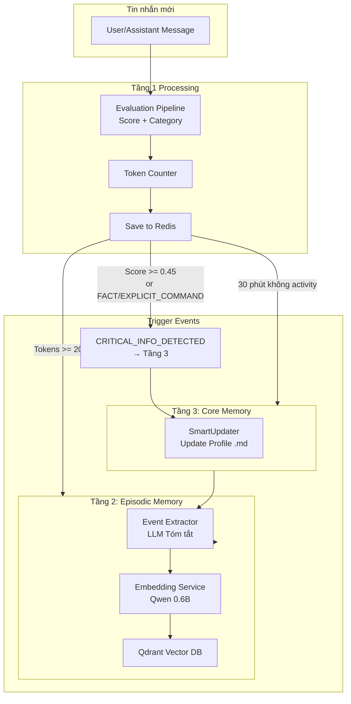
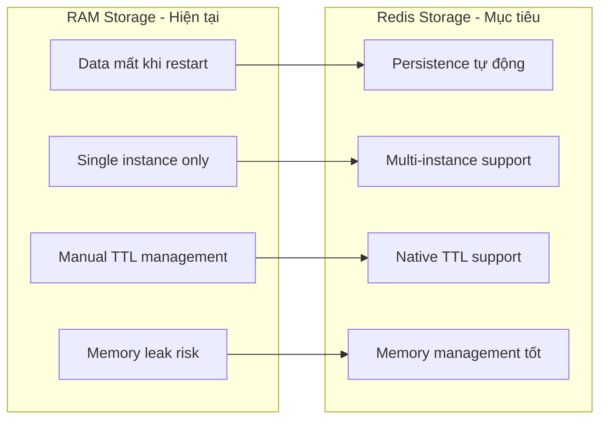
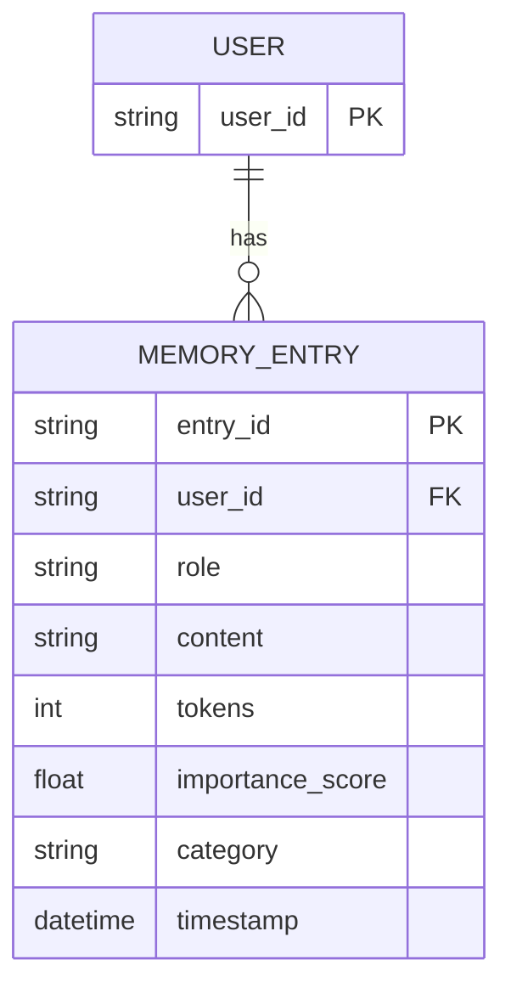
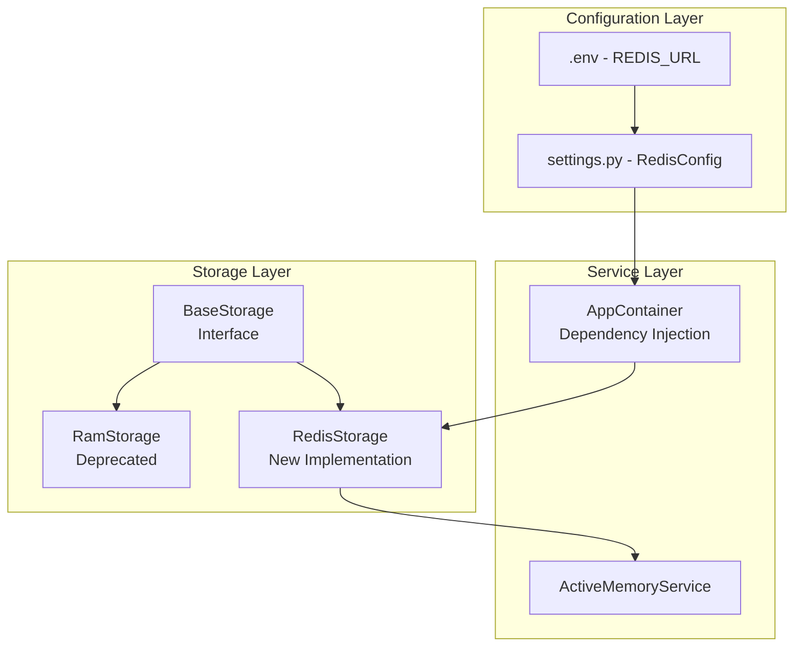
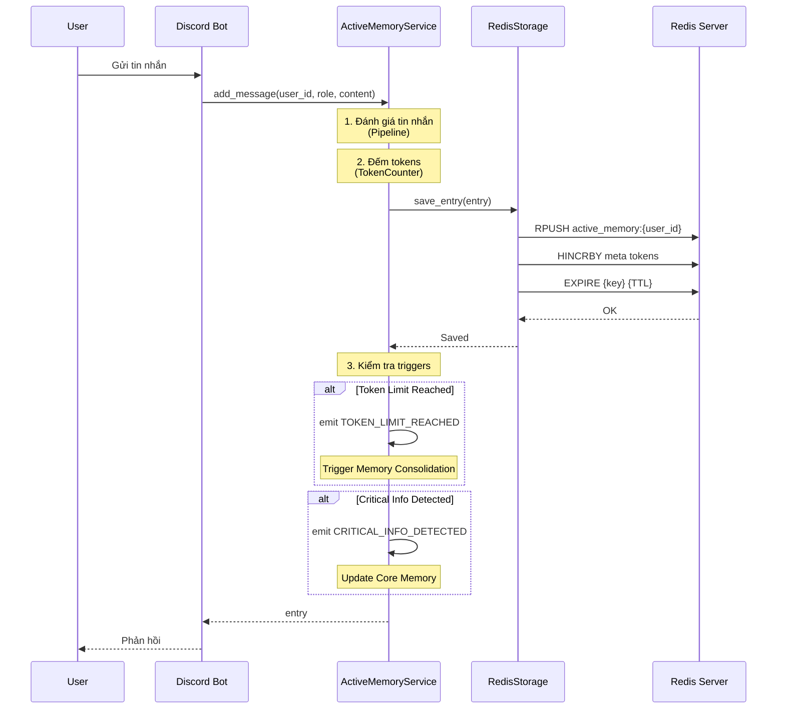
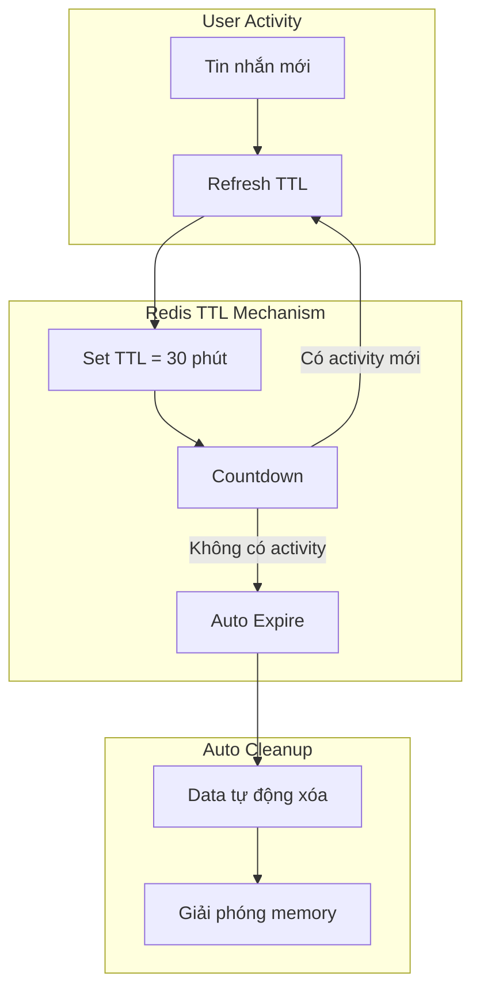

# Kế hoạch Cập nhật Tầng 1 (Active Memory) - Migration từ RAM sang Redis

## Tổng quan

Tài liệu này mô tả kế hoạch chi tiết việc thay thế [`ram_storage.py`](src/services/memories/activate_memory/storage/ram_storage.py) bằng `redis_storage.py` để giải quyết các vấn đề về persistence, distributed deployment và session management.

---

## 0. Các Giai đoạn Trigger (Khi nào chuyển sang Embedding/Vector)

Active Memory đóng vai trò là "bộ nhớ hoạt động" - lưu trữ tin nhắn hiện tại. Khi đạt các điều kiện cụ thể, dữ liệu sẽ được chuyển sang Tầng 2 (Episodic Memory) hoặc Tầng 3 (Core Memory).

### 0.1 Sơ đồ Trigger Events



### 0.2 Chi tiết từng Trigger

#### Trigger 1: CRITICAL_INFO_DETECTED → Tầng 3 (Core Memory)

**Điều kiện kích hoạt:**
| Condition | Giá trị | Mô tả |
|-----------|---------|-------|
| `importance_score >= 0.45` | CRITICAL_INFO_THRESHOLD | Tin nhắn có độ quan trọng cao |
| `category == FACT` | MessageCategory.FACT | Tin nhắn chứa fact về user |
| `category == EXPLICIT_COMMAND` | MessageCategory.EXPLICIT_COMMAND | Lệnh !note từ user |

**Dữ liệu gửi đi:**
```python
# Từ activate_memory_service.py:87-91
self.events.emit(
    ActiveMemoryEvent.CRITICAL_INFO_DETECTED,
    user_id,
    data={
        "entry": entry,           # Tin nhắn hiện tại
        "context": context_entries  # 5 tin nhắn gần nhất
    },
)
```

**Xử lý ở Tầng 3:**
- [`SmartUpdater`](src/services/memories/core_memory/smart_updater.py) nhận event
- LLM phân tích và trích xuất thông tin cá nhân
- Cập nhật file Markdown profile

**Ví dụ:**
```
User: "Tôi tên là Minh, 25 tuổi, sống ở TP.HCM"
→ Score: 0.48 (>= 0.45)
→ Category: FACT
→ Trigger CRITICAL_INFO_DETECTED
→ Tầng 3: Update profile với name, age, location
```

---

#### Trigger 2: TOKEN_LIMIT_REACHED → Tầng 2 (Episodic Memory)

**Điều kiện kích hoạt:**
| Condition | Giá trị | Mô tả |
|-----------|---------|-------|
| `current_tokens >= 2000` | MAX_WORKING_TOKENS | Đã tích đủ token |

**Dữ liệu gửi đi:**
```python
# Từ activate_memory_service.py:94-102
current_tokens = await self.storage.get_total_tokens(user_id)
if current_tokens >= MAX_WORKING_TOKENS:
    snapshot = await self.storage.get_entries(user_id)
    self.events.emit(
        ActiveMemoryEvent.TOKEN_LIMIT_REACHED,
        user_id,
        data={
            "snapshot": snapshot,        # Toàn bộ tin nhắn trong session
            "current_tokens": current_tokens
        },
    )
```

**Xử lý ở Tầng 2:**

Chi tiết 3 bước xử lý (extract_event → create_record → add_record) được mô tả trong **[`t2_update_memory.md`](t2_update_memory.md)** - Section "0. Flow Xử lý từ Tầng 1 → Tầng 2".

**Tóm tắt nhanh:**
1. **extract_event()** → LLM tóm tắt snapshot thành JSON
2. **create_record()** → Embedding `detailed_summary` thành vector
3. **add_record()** → Lưu vào Qdrant Vector DB

**Ví dụ tóm tắt:**
```markdown
# Session: 2026-04-06 10:30

## Chủ đề chính
- Thảo luận về game Wuthering Waves
- User hỏi về build character

## Chi tiết
- User đang chơi Wuthering Waves level 45
- Bot hướng dẫn build Jinhsi optimal
- User quan tâm đến upcoming banner

## Kết quả
- User đã hiểu cách build
- Sẽ thử nghiệm trong game
```

---

#### Trigger 3: SESSION_INACTIVE_TIMEOUT → Tầng 2 (Episodic Memory)

**Điều kiện kích hoạt:**
| Condition | Giá trị | Mô tả |
|-----------|---------|-------|
| `last_activity > 30 phút` | SESSION_INACTIVE_TIMEOUT | User không chat trong 30 phút |

**Cơ chế với Redis:**
```python
# Redis TTL tự động expire key sau 30 phút
# Key: active_memory:{user_id}
# TTL: SESSION_INACTIVE_TIMEOUT + 300 (buffer 5 phút)

# Khi TTL expire → Data tự động xóa
# Nhưng cần trigger event trước khi expire để lưu vào T2
```

**Implementation với Redis Keyspace Notifications:**
```python
# Cấu hình Redis để notify khi key expire
CONFIG SET notify-keyspace-events Ex

# Subscribe to expire events
psubscribe __keyevent@0__:expired

# Khi nhận event:
def on_key_expired(key):
    user_id = extract_user_id(key)  # active_memory:123456789
    # Trigger memory consolidation trước khi data mất
    events.emit(SESSION_TIMEOUT, user_id)
```

**Lưu ý:** Với Redis TTL, cần cân nhắc:
1. **Option A:** Subscribe to expire events → Trigger consolidation
2. **Option B:** Background task check last_activity periodically
3. **Option C:** Client-side timeout detection (khi user chat lại sau timeout)

---

### 0.3 Bảng Tổng hợp Triggers

| Trigger | Điều kiện | Target | Dữ liệu gửi | Mục đích |
|---------|-----------|--------|-------------|----------|
| CRITICAL_INFO_DETECTED | Score >= 0.45 OR FACT OR !note | Tầng 3 | Entry + 5 context | Update profile ngay |
| TOKEN_LIMIT_REACHED | Tokens >= 2000 | Tầng 2 | Snapshot + tokens | Tóm tắt → Embedding → Vector |
| SESSION_INACTIVE_TIMEOUT | 30 phút không chat | Tầng 2 | Snapshot (nếu còn) | Lưu session trước khi mất |

---

## 1. Lý do chọn Redis thay vì RAM

### 1.1 Vấn đề với RAM Storage hiện tại

| Vấn đề | Mô tả |
|--------|-------|
| **Data Loss on Restart** | Khi restart service, toàn bộ conversation history bị mất |
| **Single Instance** | Không hỗ trợ horizontal scaling với nhiều bot instances |
| **Manual TTL** | Cần implement thủ công session timeout mechanism |
| **Memory Leaks** | Rủi ro memory leak nếu cleanup không đúng cách |

### 1.2 Lợi ích của Redis



| Tính năng | Lợi ích |
|-----------|---------|
| **Persistence** | Dữ liệu được lưu trên disk, không mất khi restart service |
| **Distributed** | Nhiều bot instance có thể chia sẻ cùng một Redis cluster |
| **Native TTL** | Hỗ trợ TTL tự động, không cần manual cleanup |
| **Memory Efficiency** | Redis có cơ chế eviction policy (LRU, LFU) |
| **Pub/Sub** | Có thể mở rộng cho real-time event broadcasting |

---

## 2. Cấu trúc Dữ liệu Redis

### 2.1 Key Pattern Design

```
active_memory:{user_id}              → List of conversation entries
active_memory:{user_id}:meta         → Metadata (total_tokens, last_activity)
```

### 2.2 Data Structure



### 2.3 Redis Storage Schema

```python
# Key: active_memory:{user_id}
# Type: List (Redis List - LPUSH/RPUSH for ordered entries)
# Value: JSON serialized MemoryEntry

# Example:
LPUSH active_memory:123456789 '{"entry_id":"uuid-1","role":"user","content":"Hello","tokens":5,"importance_score":0.3,"category":"general","timestamp":"2026-04-06T10:00:00Z"}'

# Key: active_memory:{user_id}:meta
# Type: Hash
# Fields: total_tokens, last_activity, entry_count

# Example:
HSET active_memory:123456789:meta total_tokens 150
HSET active_memory:123456789:meta last_activity 1712390400
HSET active_memory:123456789:meta entry_count 5
```

### 2.4 TTL Configuration

```python
# Trong constants.py
SESSION_INACTIVE_TIMEOUT = 30 * 60  # 30 phút (giây)
REDIS_KEY_TTL = SESSION_INACTIVE_TIMEOUT + 300  # TTL + buffer 5 phút
```

---

## 3. Các Component cần Thay đổi

### 3.1 File mới cần tạo

| File | Mô tả |
|------|-------|
| `src/services/memories/activate_memory/storage/redis_storage.py` | Redis storage implementation |

### 3.2 File cần sửa đổi

| File | Thay đổi |
|------|----------|
| [`src/config/settings.py`](src/config/settings.py) | Thêm Redis configuration |
| [`src/services/dependencies.py`](src/services/dependencies.py) | Cập nhật DI để sử dụng Redis storage |
| [`src/services/memories/activate_memory/constants.py`](src/services/memories/activate_memory/constants.py) | Thêm Redis-related constants |
| `.env.example` | Thêm REDIS_URL example |

### 3.3 Sơ đồ Dependency



---

## 4. Chi tiết Implementation

### 4.1 RedisStorage Class

```python
# src/services/memories/activate_memory/storage/redis_storage.py

import json
import logging
from typing import List, Optional
import redis.asyncio as redis
from datetime import datetime

from ..models import MemoryEntry
from ..constants import REDIS_KEY_TTL, SESSION_INACTIVE_TIMEOUT
from .base_storage import BaseStorage

logger = logging.getLogger(__name__)


class RedisStorage(BaseStorage):
    """
    Redis-based storage cho Active Memory.
    
    Key Pattern:
        - active_memory:{user_id} → List of JSON entries
        - active_memory:{user_id}:meta → Hash metadata
    
    Features:
        - Native TTL support
        - Atomic operations
        - Distributed-friendly
    """
    
    def __init__(self, redis_url: str, key_prefix: str = "active_memory"):
        self.redis_url = redis_url
        self.key_prefix = key_prefix
        self._client: Optional[redis.Redis] = None
    
    async def _get_client(self) -> redis.Redis:
        """Lazy initialization của Redis client."""
        if self._client is None:
            self._client = redis.from_url(
                self.redis_url,
                encoding="utf-8",
                decode_responses=True
            )
        return self._client
    
    def _get_key(self, user_id: str) -> str:
        """Tạo key cho user's memory list."""
        return f"{self.key_prefix}:{user_id}"
    
    def _get_meta_key(self, user_id: str) -> str:
        """Tạo key cho user's metadata."""
        return f"{self.key_prefix}:{user_id}:meta"
    
    async def _refresh_ttl(self, user_id: str) -> None:
        """Refresh TTL cho cả data và meta keys."""
        client = await self._get_client()
        key = self._get_key(user_id)
        meta_key = self._get_meta_key(user_id)
        
        # Refresh TTL cho cả 2 keys
        await client.expire(key, REDIS_KEY_TTL)
        await client.expire(meta_key, REDIS_KEY_TTL)
    
    async def save_entry(self, entry: MemoryEntry) -> None:
        """Lưu một tin nhắn mới vào Redis."""
        client = await self._get_client()
        key = self._get_key(entry.user_id)
        meta_key = self._get_meta_key(entry.user_id)
        
        # Serialize entry to JSON
        entry_json = entry.model_dump_json()
        
        # Push to list (RPUSH để giữ thứ tự thời gian)
        await client.rpush(key, entry_json)
        
        # Update metadata
        await client.hincrby(meta_key, "total_tokens", entry.tokens)
        await client.hincrby(meta_key, "entry_count", 1)
        await client.hset(meta_key, "last_activity", datetime.now().timestamp())
        
        # Refresh TTL
        await self._refresh_ttl(entry.user_id)
        
        logger.debug(f"📥 Redis: Saved entry for user {entry.user_id}")
    
    async def get_entries(self, user_id: str) -> List[MemoryEntry]:
        """Lấy toàn bộ tin nhắn của user theo thứ tự thời gian."""
        client = await self._get_client()
        key = self._get_key(user_id)
        
        # Lấy tất cả entries từ list
        entries_json = await client.lrange(key, 0, -1)
        
        # Deserialize
        entries = []
        for entry_str in entries_json:
            try:
                entry = MemoryEntry.model_validate_json(entry_str)
                entries.append(entry)
            except Exception as e:
                logger.warning(f"Failed to parse entry: {e}")
        
        return entries
    
    async def get_total_tokens(self, user_id: str) -> int:
        """Lấy tổng số token từ metadata hash."""
        client = await self._get_client()
        meta_key = self._get_meta_key(user_id)
        
        total = await client.hget(meta_key, "total_tokens")
        return int(total) if total else 0
    
    async def delete_entries(self, user_id: str, entry_ids: List[str]) -> None:
        """Xóa các entries theo ID."""
        client = await self._get_client()
        key = self._get_key(user_id)
        meta_key = self._get_meta_key(user_id)
        
        # Lấy tất cả entries
        entries_json = await client.lrange(key, 0, -1)
        ids_to_remove = set(entry_ids)
        
        # Filter và tính toán tokens cần trừ
        new_entries = []
        tokens_to_subtract = 0
        deleted_count = 0
        
        for entry_str in entries_json:
            try:
                entry = MemoryEntry.model_validate_json(entry_str)
                if entry.entry_id in ids_to_remove:
                    tokens_to_subtract += entry.tokens
                    deleted_count += 1
                else:
                    new_entries.append(entry_str)
            except Exception as e:
                logger.warning(f"Failed to parse entry during delete: {e}")
        
        if deleted_count > 0:
            # Xóa list cũ và tạo mới
            await client.delete(key)
            if new_entries:
                await client.rpush(key, *new_entries)
            
            # Update metadata
            await client.hincrby(meta_key, "total_tokens", -tokens_to_subtract)
            await client.hincrby(meta_key, "entry_count", -deleted_count)
            
            logger.debug(f"🗑️ Redis: Deleted {deleted_count} entries for user {user_id}")
    
    async def clear_all(self, user_id: str) -> None:
        """Xóa sạch bộ nhớ của user."""
        client = await self._get_client()
        key = self._get_key(user_id)
        meta_key = self._get_meta_key(user_id)
        
        await client.delete(key, meta_key)
        logger.debug(f"🧹 Redis: Cleared all memory for user {user_id}")
    
    async def get_last_activity(self, user_id: str) -> Optional[datetime]:
        """Lấy thời gian hoạt động cuối cùng của user."""
        client = await self._get_client()
        meta_key = self._get_meta_key(user_id)
        
        timestamp = await client.hget(meta_key, "last_activity")
        if timestamp:
            return datetime.fromtimestamp(float(timestamp))
        return None
    
    async def close(self) -> None:
        """Đóng Redis connection."""
        if self._client:
            await self._client.close()
```

### 4.2 Cập nhật Constants

```python
# src/services/memories/activate_memory/constants.py

# --- Token Management ---
MAX_WORKING_TOKENS = 2000
STRUCTURAL_OVERHEAD_TOKENS = 15
TARGET_SAFE_TOKENS = 1000

# --- Semantic Thresholds ---
SEMANTIC_ACTIVATION_THRESHOLD = 0.40
CRITICAL_INFO_THRESHOLD = 0.45

# --- Timeouts ---
SESSION_TIMEOUT_MINUTES = 30
SESSION_INACTIVE_TIMEOUT = 30 * 60  # 30 phút (giây)

# --- Redis Configuration ---
REDIS_KEY_TTL = SESSION_INACTIVE_TIMEOUT + 300  # TTL + buffer 5 phút
REDIS_KEY_PREFIX = "active_memory"
```

### 4.3 Cập nhật Settings

```python
# Thêm vào src/config/settings.py

class Config:
    # ... existing config ...
    
    # Redis Configuration
    REDIS_URL = os.getenv("REDIS_URL", "redis://localhost:6379/0")
    REDIS_KEY_PREFIX = os.getenv("REDIS_KEY_PREFIX", "active_memory")
    REDIS_POOL_SIZE = int(os.getenv("REDIS_POOL_SIZE", "10"))
```

### 4.4 Cập nhật Dependencies

```python
# Thay đổi trong src/services/dependencies.py

from src.services.memories.activate_memory.storage.redis_storage import RedisStorage
from src.config.settings import Config

class AppContainer:
    async def initialize(self):
        # ... existing code ...
        
        # 2. LẮP RÁP BỘ NHỚ TẦNG 1 (Active Memory)
        event_bus = EventDispatcher()
        
        # Thay đổi: Sử dụng RedisStorage thay vì RamStorage
        t1_storage = RedisStorage(
            redis_url=Config.REDIS_URL,
            key_prefix=Config.REDIS_KEY_PREFIX
        )
        
        # ... rest of initialization ...
```

---

## 5. Cơ chế Hoạt động Mới

### 5.1 Flow Chart



### 5.2 TTL Auto-Cleanup Mechanism



### 5.3 Token Counter với Redis

```python
# Token counter sẽ đọc từ metadata hash thay vì tính lại

async def get_total_tokens(self, user_id: str) -> int:
    """
    Lấy tổng tokens từ Redis metadata.
    Không cần loop qua tất cả entries.
    """
    client = await self._get_client()
    meta_key = self._get_meta_key(user_id)
    
    total = await client.hget(meta_key, "total_tokens")
    return int(total) if total else 0
```

---

## 6. Migration Plan

### 6.1 Chiến lược Migration

```mermaid
flowchart LR
    subgraph Phase1["Phase 1: Preparation"]
        A1[Cài đặt Redis]
        A2[Thêm config]
        A3[Viết RedisStorage]
    end
    
    subgraph Phase2["Phase 2: Testing"]
        B1[Unit tests]
        B2[Integration tests]
        B3[Load tests]
    end
    
    subgraph Phase3["Phase 3: Deployment"]
        C1[Deploy Redis]
        C2[Update code]
        C3[Switch storage]
    end
    
    subgraph Phase4["Phase 4: Cleanup"]
        D1[Remove RamStorage]
        D2[Update docs]
    end
    
    Phase1 --> Phase2
    Phase2 --> Phase3
    Phase3 --> Phase4
```



### 6.2 Chi tiết từng Phase

#### Phase 1: Preparation

| Task | Mô tả |
|------|-------|
| Cài đặt Redis | `pip install redis` hoặc thêm vào `requirements.txt` |
| Thêm config | Thêm `REDIS_URL` vào `.env` và `settings.py` |
| Viết RedisStorage | Implement class mới theo `BaseStorage` interface |

#### Phase 2: Testing

| Test Case | Mô tả |
|-----------|-------|
| `test_save_entry` | Lưu entry và verify trong Redis |
| `test_get_entries` | Lấy entries và verify thứ tự |
| `test_get_total_tokens` | Verify token counter |
| `test_delete_entries` | Xóa entries và verify metadata update |
| `test_clear_all` | Clear và verify keys bị xóa |
| `test_ttl_expiry` | Verify TTL auto-expiry |
| `test_concurrent_access` | Test concurrent operations |

#### Phase 3: Deployment

```yaml
# docker-compose.yml - Thêm Redis service
services:
  redis:
    image: redis:7-alpine
    ports:
      - "6379:6379"
    volumes:
      - redis_data:/data
    command: redis-server --appendonly yes

volumes:
  redis_data:
```

#### Phase 4: Cleanup

- Xóa hoặc deprecate `ram_storage.py`
- Cập nhật documentation
- Cập nhật `dependencies.py`

### 6.3 Lưu ý quan trọng

> **Không cần migration dữ liệu**: Active Memory là temporary storage, dữ liệu không cần persist giữa các lần deploy.

> **Backward Compatibility**: Giữ `RamStorage` như một fallback option trong trường hợp Redis không khả dụng.

---

## 7. Configuration

### 7.1 Environment Variables

```bash
# .env.example

# Redis Configuration
REDIS_URL=redis://localhost:6379/0
REDIS_KEY_PREFIX=active_memory
REDIS_POOL_SIZE=10
```

### 7.2 Docker Compose

```yaml
# docker-compose.yml
version: '3.8'

services:
  bot:
    build: .
    environment:
      - REDIS_URL=redis://redis:6379/0
    depends_on:
      - redis
  
  redis:
    image: redis:7-alpine
    ports:
      - "6379:6379"
    volumes:
      - redis_data:/data
    command: redis-server --appendonly yes --maxmemory 256mb --maxmemory-policy allkeys-lru
    healthcheck:
      test: ["CMD", "redis-cli", "ping"]
      interval: 5s
      timeout: 3s
      retries: 5

volumes:
  redis_data:
```

### 7.3 Redis Configuration Best Practices

```conf
# redis.conf (optional)

# Memory Management
maxmemory 256mb
maxmemory-policy allkeys-lru

# Persistence (optional for Active Memory)
appendonly yes
appendfsync everysec

# Connection
timeout 300
tcp-keepalive 60
```

---

## 8. Testing Strategy

### 8.1 Unit Tests

```python
# tests/test_redis_storage.py

import pytest
from datetime import datetime
from src.services.memories.activate_memory.storage.redis_storage import RedisStorage
from src.services.memories.activate_memory.models import MemoryEntry, MessageCategory

@pytest.fixture
async def redis_storage():
    storage = RedisStorage("redis://localhost:6379/15")  # Use test DB
    yield storage
    await storage.clear_all("test_user")
    await storage.close()

@pytest.mark.asyncio
async def test_save_and_get_entry(redis_storage):
    entry = MemoryEntry(
        user_id="test_user",
        role="user",
        content="Hello world",
        tokens=10,
        importance_score=0.5,
        category=MessageCategory.GENERAL
    )
    
    await redis_storage.save_entry(entry)
    entries = await redis_storage.get_entries("test_user")
    
    assert len(entries) == 1
    assert entries[0].content == "Hello world"
    assert entries[0].tokens == 10

@pytest.mark.asyncio
async def test_token_counter(redis_storage):
    entries = [
        MemoryEntry(user_id="test_user", role="user", content="A", tokens=5),
        MemoryEntry(user_id="test_user", role="assistant", content="B", tokens=10),
    ]
    
    for e in entries:
        await redis_storage.save_entry(e)
    
    total = await redis_storage.get_total_tokens("test_user")
    assert total == 15

@pytest.mark.asyncio
async def test_ttl_expiry(redis_storage):
    # Set very short TTL for testing
    from src.services.memories.activate_memory.constants import REDIS_KEY_TTL
    import asyncio
    
    entry = MemoryEntry(user_id="test_ttl", role="user", content="test", tokens=5)
    await redis_storage.save_entry(entry)
    
    # Verify data exists
    entries = await redis_storage.get_entries("test_ttl")
    assert len(entries) == 1
    
    # Wait for TTL (this would need mock in real test)
    # In production, use freezegun or mock redis.expire
```

### 8.2 Integration Tests

```python
# tests/integration/test_active_memory_redis.py

@pytest.mark.asyncio
async def test_full_flow_with_redis():
    """Test full Active Memory flow with Redis storage."""
    storage = RedisStorage("redis://localhost:6379/15")
    service = ActiveMemoryService(storage=storage, ...)
    
    # Add messages
    await service.add_message("user_1", "user", "Hello")
    await service.add_message("user_1", "assistant", "Hi there!")
    
    # Verify in Redis
    entries = await storage.get_entries("user_1")
    assert len(entries) == 2
    
    # Check tokens
    tokens = await storage.get_total_tokens("user_1")
    assert tokens > 0
```

---

## 9. Monitoring & Observability

### 9.1 Metrics to Track

| Metric | Mô tả |
|--------|-------|
| `redis_connection_pool_size` | Số connections trong pool |
| `redis_commands_total` | Tổng số Redis commands |
| `redis_command_duration_seconds` | Thời gian thực thi command |
| `active_memory_entries_count` | Số entries per user |
| `active_memory_total_tokens` | Total tokens per user |
| `redis_key_expiry_total` | Số keys bị expire |

### 9.2 Logging

```python
# Thêm structured logging
import structlog

logger = structlog.get_logger()

async def save_entry(self, entry: MemoryEntry) -> None:
    logger.info(
        "redis_save_entry",
        user_id=entry.user_id,
        entry_id=entry.entry_id,
        tokens=entry.tokens,
        category=entry.category.value
    )
    # ... save logic ...
```

---

## 10. Checklist Triển khai

- [ ] **Phase 1: Preparation**
  - [ ] Thêm `redis` vào `requirements.txt`
  - [ ] Thêm Redis config vào `settings.py`
  - [ ] Tạo `redis_storage.py` implement `BaseStorage`
  - [ ] Thêm Redis constants vào `constants.py`
  - [ ] Cập nhật `.env.example`

- [ ] **Phase 2: Testing**
  - [ ] Viết unit tests cho `RedisStorage`
  - [ ] Viết integration tests
  - [ ] Test TTL expiry
  - [ ] Test concurrent access
  - [ ] Load test với nhiều users

- [ ] **Phase 3: Deployment**
  - [ ] Thêm Redis service vào `docker-compose.yml`
  - [ ] Cấu hình Redis persistence (optional)
  - [ ] Update `dependencies.py` để dùng RedisStorage
  - [ ] Deploy và monitor

- [ ] **Phase 4: Cleanup**
  - [ ] Deprecate `RamStorage`
  - [ ] Cập nhật documentation
  - [ ] Remove unused code

---

## 11. Tham khảo

- [Redis Python Client Documentation](https://redis-py.readthedocs.io/)
- [Redis Data Types](https://redis.io/docs/data-types/)
- [Redis TTL & Expiration](https://redis.io/commands/expire/)
- [Redis Memory Optimization](https://redis.io/docs/management/optimization/memory-optimization/)