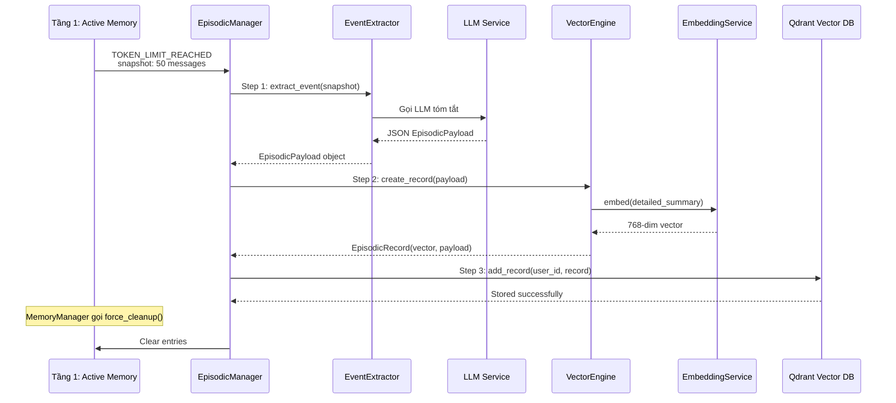
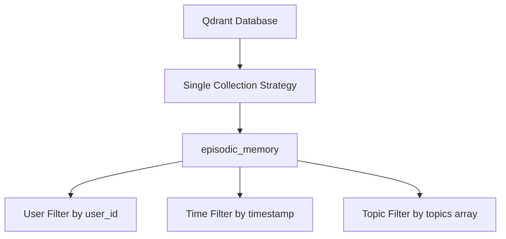
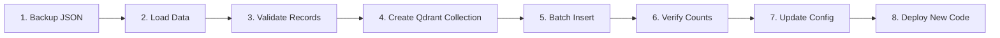

# Kế Hoạch Cập Nhật Tầng 2 (Episodic Memory) - Migration sang Qdrant

## 1. Tổng Quan

### 1.1 Mục Tiêu
Thay thế Local Vector DB hiện tại (sử dụng Numpy in-memory + JSON persistence) bằng Qdrant - một vector database chuyên nghiệp với hiệu suất cao và khả năng mở rộng.

### 1.2 Phạm Vi Thay Đổi
- **File mới**: `src/services/memories/episodic_memory/storage/qdrant_vector_db.py`
- **File cập nhật**:
  - `src/services/memories/episodic_memory/episodic_manager.py`
  - `src/services/memories/episodic_memory/extraction/retrieval/vector_engine.py`
  - `src/config/settings.py`
  - `.env.example`
- **File migration**: `scripts/migrate_to_qdrant.py`

---

## 0. Flow Xử lý từ Tầng 1 → Tầng 2

Khi Tầng 1 (Active Memory) trigger **TOKEN_LIMIT_REACHED** hoặc **SESSION_INACTIVE_TIMEOUT**, dữ liệu được gửi sang Tầng 2 để xử lý.

### 0.1 Sơ đồ Flow 3 Bước



### 0.2 Chi tiết từng Bước

#### **Bước 1: extract_event() - LLM Tóm tắt**

**Component:** [`EventExtractor`](src/services/memories/episodic_memory/extraction/event_extractor.py)

```python
# EventExtractor.extract_event() - Line 80-114
payload = await self.extractor.extract_event(snapshot)
```

**Input:**
- `snapshot`: List[dict] - 50 tin nhắn raw từ Tầng 1

**Output:** `EpisodicPayload` object với:
```json
{
  "event_title": "Thảo luận game Wuthering Waves",
  "detailed_summary": "User hỏi về build Jinhsi, bot hướng dẫn optimal build...",
  "entities": ["Jinhsi", "Wuthering Waves", "build"],
  "topics": ["game", "build-guide"],
  "user_sentiment": "positive",
  "resolution_status": "resolved"
}
```

**Process:**
1. Format snapshot thành chat text: `[USER]: hello\n[ASSISTANT]: hi...`
2. Gọi LLM với prompt từ [`prompts.yaml`](src/services/memories/episodic_memory/prompts.yaml)
3. Parse JSON response thành Pydantic object

---

#### **Bước 2: create_record() - Embedding**

**Component:** [`VectorEngine`](src/services/memories/episodic_memory/extraction/retrieval/vector_engine.py)

```python
# VectorEngine.create_record()
record = await self.vector_engine.create_record(payload)
```

**Input:**
- `payload`: EpisodicPayload - chỉ embed `detailed_summary`

**Output:** `EpisodicRecord` với:
```python
EpisodicRecord(
    vector=[0.123, 0.456, ...],  # 768 dimensions
    payload=EpisodicPayload(...)  # metadata đầy đủ
)
```

**Process:**
1. Gọi [`EmbeddingService`](src/services/llm/embedding_service.py) với `detailed_summary`
2. Qwen 0.6B model tạo 768-dim vector
3. Combine vector + payload thành record

**Lưu ý quan trọng:**
- **Chỉ embed `detailed_summary`**, không embed toàn bộ snapshot raw
- **Lý do:** Mật độ ngữ nghĩa cao, giảm nhiễu, tiết kiệm vector storage

---

#### **Bước 3: add_record() - Lưu Vector DB**

**Component:** [`QdrantVectorDB`](src/services/memories/episodic_memory/storage/qdrant_vector_db.py) (mới)

```python
# QdrantVectorDB.add_record()
await self.storage.add_record(user_id, record)
```

**Input:**
- `user_id`: string - Discord user ID
- `record`: EpisodicRecord - vector + payload

**Output:** Upsert vào Qdrant collection

**Payload Structure trong Qdrant:**
```json
{
  "user_id": "123456789",
  "session_id": "sess_abc123",
  "timestamp": 1712390400,
  "date": "2026-04-06",
  "event_title": "Thảo luận game Wuthering Waves",
  "detailed_summary": "User hỏi về build Jinhsi...",
  "entities": ["Jinhsi", "Wuthering Waves"],
  "topics": ["game", "build-guide"],
  "user_sentiment": "positive"
}
```

---

### 0.3 Ví dụ Complete Flow

**Input từ Tầng 1:**
```
Snapshot: 50 tin nhắn về game Wuthering Waves
- User: "Build Jinhsi sao tốt?"
- Bot: "Jinhsi best build là..."
- User: "Thanks, tôi sẽ thử"
...
```

**Bước 1 Output (EpisodicPayload):**
```json
{
  "event_title": "Hướng dẫn build Jinhsi Wuthering Waves",
  "detailed_summary": "User hỏi về cách build character Jinhsi trong game Wuthering Waves. Bot đã hướng dẫn optimal build với focus vào damage output. User hài lòng và sẽ thử nghiệm.",
  "entities": ["Jinhsi", "Wuthering Waves", "build"],
  "topics": ["game", "wuthering-waves", "build-guide"],
  "user_sentiment": "positive",
  "resolution_status": "resolved"
}
```

**Bước 2 Output (Vector):**
```
Vector: [0.123, -0.456, 0.789, ...] (768 dims)
```

**Bước 3 Output (Stored in Qdrant):**
```
Collection: episodic_memory
Point ID: uuid-xxx
Vector: 768-dim
Payload: {user_id, event_title, topics, ...}
```

---

## 2. Lý Do Chọn Qdrant

### 2.1 Hiệu Suất Cao
- **HNSW Algorithm**: Sử dụng Hierarchical Navigable Small World cho approximate nearest neighbor search
- **Native Rust**: Core engine được viết bằng Rust, đảm bảo performance cao
- **Batch Operations**: Hỗ trợ insert/search batch với throughput lớn

### 2.2 Distributed Deployment
- **Horizontal Scaling**: Hỗ trợ clustering cho mở rộng theo nhu cầu
- **Raft Consensus**: Đảm bảo tính nhất quán dữ liệu trong cluster
- **Sharding**: Tự động phân chia dữ liệu across nodes

### 2.3 Rich Metadata Filtering
- **Payload Filters**: Filter theo user_id, date range, topics, sentiment
- **Nested Field Queries**: Truy vấn các field lồng nhau trong payload
- **Full-text Search**: Kết hợp vector search với keyword matching

### 2.4 Built-in Time-based Decay Scoring
- **Custom Scoring**: Implement time-decay thông qua payload + query-time scoring
- **Date Range Queries**: Efficient filtering theo timestamp
- **Relevance Decay**: Tự động giảm điểm các ký ức cũ

### 2.5 Persistence và Durability
- **Write-ahead Log**: Đảm bảo không mất dữ liệu khi crash
- **Snapshot Support**: Backup/restore dễ dàng
- **Docker-ready**: Deployment đơn giản qua Docker

---

## 3. Kiến Trúc Collection Qdrant

### 3.1 Chiến Lược Collection



**Quyết định**: Sử dụng **Single Collection** với `user_id` filter thay vì per-user collection.

**Lý do**:
- Dễ quản lý và maintain
- Efficient resource utilization
- Hỗ trợ cross-user analytics nếu cần
- Đơn giản hóa backup/restore

### 3.2 Cấu Hình Vector

```yaml
Collection: episodic_memory
Vector Parameters:
  - Size: 768 dimensions (Qwen embedding)
  - Distance: Cosine similarity
  - On-disk: True (cho large datasets)
  
Indexing:
  - HNSW config:
    - m: 16 (số kết nối neighbors)
    - ef_construct: 100 (build time accuracy)
```

### 3.3 Payload Structure

```json
{
  "user_id": "string",
  "session_id": "string",
  "record_id": "string",
  "timestamp": "int64 (Unix timestamp)",
  "date": "string (YYYY-MM-DD format)",
  "event_title": "string",
  "detailed_summary": "string",
  "entities": ["array of strings"],
  "topics": ["array of strings"],
  "user_sentiment": "string",
  "resolution_status": "string"
}
```

### 3.4 Payload Indexes

```python
# Các field cần index cho efficient filtering
payload_schema = {
    "user_id": PayloadSchemaType.KEYWORD,
    "session_id": PayloadSchemaType.KEYWORD,
    "timestamp": PayloadSchemaType.INTEGER,
    "date": PayloadSchemaType.KEYWORD,
    "topics": PayloadSchemaType.KEYWORD_ARRAY,
    "entities": PayloadSchemaType.KEYWORD_ARRAY,
    "user_sentiment": PayloadSchemaType.KEYWORD,
    "resolution_status": PayloadSchemaType.KEYWORD,
}
```

---

## 4. Chi Tiết Implementation

### 4.1 QdrantVectorDB Class

```python
# src/services/memories/episodic_memory/storage/qdrant_vector_db.py

class QdrantVectorDB(BaseVectorDB):
    """
    Qdrant-based Vector Database cho Episodic Memory.
    Hỗ trợ distributed deployment và rich metadata filtering.
    """
    
    COLLECTION_NAME = "episodic_memory"
    VECTOR_SIZE = 768
    
    def __init__(self, qdrant_client: QdrantClient):
        self.client = qdrant_client
        self._ensure_collection_exists()
    
    async def add_record(self, user_id: str, record: EpisodicRecord) -> None:
        """Upsert một record vào Qdrant với full payload."""
        pass
    
    async def search_similar(
        self,
        user_id: str,
        query_vector: List[float],
        top_k: int = 3,
        threshold: float = 0.5,
        time_decay: bool = True,
        decay_factor: float = 0.95,
    ) -> List[Tuple[EpisodicRecord, float]]:
        """
        Tìm kiếm với time-decay scoring.
        Score = cosine_similarity * decay_factor^(days_ago)
        """
        pass
    
    async def get_recent_records(
        self, user_id: str, limit: int = 5
    ) -> List[EpisodicRecord]:
        """Lấy records mới nhất theo timestamp."""
        pass
    
    async def delete_record(self, user_id: str, record_id: str) -> None:
        """Xóa record theo ID."""
        pass
    
    async def get_records_by_date_range(
        self,
        user_id: str,
        start_date: datetime,
        end_date: datetime,
    ) -> List[EpisodicRecord]:
        """Lấy records trong khoảng thời gian."""
        pass
```

### 4.2 Time-Decay Scoring Algorithm

```python
def calculate_time_decay_score(
    base_score: float,
    record_timestamp: datetime,
    decay_factor: float = 0.95,
    half_life_days: int = 30,
) -> float:
    """
    Tính điểm với time-decay.
    
    Công thức: score * decay_factor^(days_ago / half_life_days)
    
    Ví dụ với decay_factor=0.95, half_life_days=30:
    - Record hôm nay: score * 1.0
    - Record 30 ngày trước: score * 0.95
    - Record 60 ngày trước: score * 0.90
    - Record 90 ngày trước: score * 0.86
    """
    days_ago = (datetime.now(timezone.utc) - record_timestamp).days
    decay_multiplier = decay_factor ** (days_ago / half_life_days)
    return base_score * decay_multiplier
```

### 4.3 Cập Nhật EpisodicManager

```python
# Thay đổi trong episodic_manager.py

class EpisodicManager:
    def __init__(
        self,
        extractor: EventExtractor,
        vector_engine: VectorEngine,
        storage: BaseVectorDB,  # Interface không đổi
    ):
        # Injection qua DI, không cần thay đổi logic
        pass
    
    async def retrieve_past_context(
        self,
        user_id: str,
        current_query: str,
        time_decay: bool = True,  # NEW: Enable time-decay
    ) -> str:
        # Logic giữ nguyên, Qdrant xử lý time-decay internally
        pass
```

### 4.4 Cập Nhật VectorEngine

```python
# Thay đổi trong vector_engine.py

class VectorEngine:
    def __init__(self, embedding_service, vector_size: int = 768):
        self.embedding_service = embedding_service
        self.vector_size = vector_size  # NEW: Configurable vector size
    
    async def create_record(self, payload: EpisodicPayload) -> Optional[EpisodicRecord]:
        # Giữ nguyên logic
        pass
    
    # NEW: Batch embedding cho migration
    async def create_records_batch(
        self,
        payloads: List[EpisodicPayload],
    ) -> List[EpisodicRecord]:
        """Tạo nhiều records cùng lúc cho migration efficiency."""
        pass
```

---

## 5. Configuration

### 5.1 Environment Variables

```bash
# .env.example - Thêm các config sau

# Qdrant Configuration
QDRANT_URL=http://localhost:6333
QDRANT_API_KEY=  # Optional, cho cloud deployment
QDRANT_COLLECTION_NAME=episodic_memory
QDRANT_VECTOR_SIZE=768

# Time Decay Settings
EPISODIC_TIME_DECAY_ENABLED=true
EPISODIC_TIME_DECAY_FACTOR=0.95
EPISODIC_TIME_DECAY_HALF_LIFE_DAYS=30
```

### 5.2 Settings Class Update

```python
# src/config/settings.py - Thêm vào class Config

class Config:
    # ... existing settings ...
    
    # Qdrant Configuration
    QDRANT_URL = os.getenv("QDRANT_URL", "http://localhost:6333")
    QDRANT_API_KEY = os.getenv("QDRANT_API_KEY", None)
    QDRANT_COLLECTION_NAME = os.getenv("QDRANT_COLLECTION_NAME", "episodic_memory")
    QDRANT_VECTOR_SIZE = int(os.getenv("QDRANT_VECTOR_SIZE", "768"))
    
    # Time Decay Settings
    EPISODIC_TIME_DECAY_ENABLED = os.getenv("EPISODIC_TIME_DECAY_ENABLED", "true") == "true"
    EPISODIC_TIME_DECAY_FACTOR = float(os.getenv("EPISODIC_TIME_DECAY_FACTOR", "0.95"))
    EPISODIC_TIME_DECAY_HALF_LIFE_DAYS = int(os.getenv("EPISODIC_TIME_DECAY_HALF_LIFE_DAYS", "30"))
```

### 5.3 Docker Compose Addition

```yaml
# docker-compose.yml - Thêm Qdrant service

services:
  # ... existing services ...
  
  qdrant:
    image: qdrant/qdrant:latest
    container_name: discord_bot_qdrant
    ports:
      - "6333:6333"  # REST API
      - "6334:6334"  # gRPC API
    volumes:
      - qdrant_storage:/qdrant/storage
    environment:
      - QDRANT__LOG_LEVEL=INFO
    restart: unless-stopped

volumes:
  qdrant_storage:
```

---

## 6. Migration Plan

### 6.1 Migration Script

```python
# scripts/migrate_to_qdrant.py

"""
Migration Script: Local Vector DB -> Qdrant

Steps:
1. Load existing data from JSON file
2. Validate data integrity
3. Batch insert into Qdrant
4. Verify migration success
5. Create backup of original data
"""

import asyncio
import json
from pathlib import Path
from qdrant_client import QdrantClient
from qdrant_client.models import PointStruct

class QdrantMigration:
    def __init__(self, source_file: str, qdrant_client: QdrantClient):
        self.source_file = source_file
        self.client = qdrant_client
        
    async def run_migration(self):
        """Execute full migration pipeline."""
        # Step 1: Load data
        data = self._load_local_db()
        
        # Step 2: Validate
        validated = self._validate_records(data)
        
        # Step 3: Batch insert
        await self._batch_insert(validated)
        
        # Step 4: Verify
        success = await self._verify_migration()
        
        # Step 5: Backup
        if success:
            self._create_backup()
        
        return success
    
    def _load_local_db(self) -> dict:
        """Load data from local JSON file."""
        pass
    
    def _validate_records(self, data: dict) -> List[PointStruct]:
        """Validate and convert to Qdrant PointStruct."""
        pass
    
    async def _batch_insert(self, points: List[PointStruct]):
        """Batch insert with progress tracking."""
        pass
    
    async def _verify_migration(self) -> bool:
        """Verify record counts match."""
        pass
    
    def _create_backup(self):
        """Create backup of original JSON."""
        pass
```

### 6.2 Migration Steps



### 6.3 Rollback Plan

```python
# scripts/rollback_qdrant.py

"""
Rollback Script: Revert to Local Vector DB

Steps:
1. Export data from Qdrant
2. Convert to Local DB format
3. Restore JSON file
4. Update config to use LocalVectorDB
"""
```

---

## 7. Testing Strategy

### 7.1 Unit Tests

```python
# tests/test_qdrant_vector_db.py

class TestQdrantVectorDB:
    """Unit tests cho QdrantVectorDB."""
    
    @pytest.mark.asyncio
    async def test_add_record_success(self):
        """Test adding a record successfully."""
        pass
    
    @pytest.mark.asyncio
    async def test_search_similar_with_results(self):
        """Test search returning similar records."""
        pass
    
    @pytest.mark.asyncio
    async def test_search_similar_with_time_decay(self):
        """Test time-decay scoring in search results."""
        pass
    
    @pytest.mark.asyncio
    async def test_get_recent_records(self):
        """Test retrieving recent records by timestamp."""
        pass
    
    @pytest.mark.asyncio
    async def test_delete_record(self):
        """Test deleting a record."""
        pass
    
    @pytest.mark.asyncio
    async def test_user_isolation(self):
        """Test that user_id filter works correctly."""
        pass
```

### 7.2 Integration Tests

```python
# tests/integration/test_episodic_qdrant.py

class TestEpisodicManagerWithQdrant:
    """Integration tests với real Qdrant instance."""
    
    @pytest.mark.asyncio
    async def test_full_ingest_and_retrieve(self):
        """Test complete flow: ingest -> retrieve."""
        pass
    
    @pytest.mark.asyncio
    async def test_time_decay_retrieval(self):
        """Test that older records score lower."""
        pass
```

---

## 8. Deployment Checklist

### 8.1 Pre-deployment

- [ ] Cài đặt `qdrant-client` package
- [ ] Cấu hình Qdrant server (Docker hoặc Cloud)
- [ ] Tạo collection với đúng vector config
- [ ] Chạy migration script
- [ ] Verify data integrity sau migration
- [ ] Update environment variables
- [ ] Run integration tests

### 8.2 Deployment

- [ ] Deploy code mới
- [ ] Monitor logs cho errors
- [ ] Verify search functionality
- [ ] Check time-decay scoring

### 8.3 Post-deployment

- [ ] Monitor Qdrant metrics
- [ ] Setup alerts cho Qdrant health
- [ ] Document new configuration
- [ ] Train team on new features

---

## 9. Dependencies

### 9.1 New Python Packages

```txt
# requirements.txt - Thêm

qdrant-client>=1.7.0
```

### 9.2 Infrastructure

- Docker (cho local Qdrant)
- Hoặc Qdrant Cloud account (cho production)

---

## 10. Timeline Implementation

### Phase 1: Setup Infrastructure
- [ ] Thêm qdrant-client vào requirements.txt
- [ ] Cập nhật docker-compose.yml
- [ ] Thêm Qdrant config vào settings.py
- [ ] Tạo QdrantVectorDB class

### Phase 2: Core Implementation
- [ ] Implement add_record method
- [ ] Implement search_similar với time-decay
- [ ] Implement get_recent_records
- [ ] Implement delete_record
- [ ] Implement get_records_by_date_range

### Phase 3: Integration
- [ ] Cập nhật DI container
- [ ] Cập nhật EpisodicManager
- [ ] Cập nhật VectorEngine
- [ ] Viết unit tests

### Phase 4: Migration
- [ ] Viết migration script
- [ ] Test migration với sample data
- [ ] Viết rollback script
- [ ] Document migration process

### Phase 5: Testing & Deployment
- [ ] Viết integration tests
- [ ] Run full test suite
- [ ] Deploy to staging
- [ ] Deploy to production

---

## 11. Risks & Mitigations

| Risk | Impact | Mitigation |
|------|--------|------------|
| Qdrant downtime | High | Implement fallback to LocalVectorDB |
| Migration data loss | Critical | Create backup before migration |
| Performance regression | Medium | Benchmark before/after migration |
| Time-decay accuracy | Low | Add unit tests for scoring algorithm |

---

## 12. Success Metrics

- **Latency**: Search query < 100ms (P95)
- **Throughput**: Support 100+ concurrent users
- **Accuracy**: Same or better search relevance
- **Reliability**: 99.9% uptime for Qdrant service
- **Migration**: Zero data loss during migration