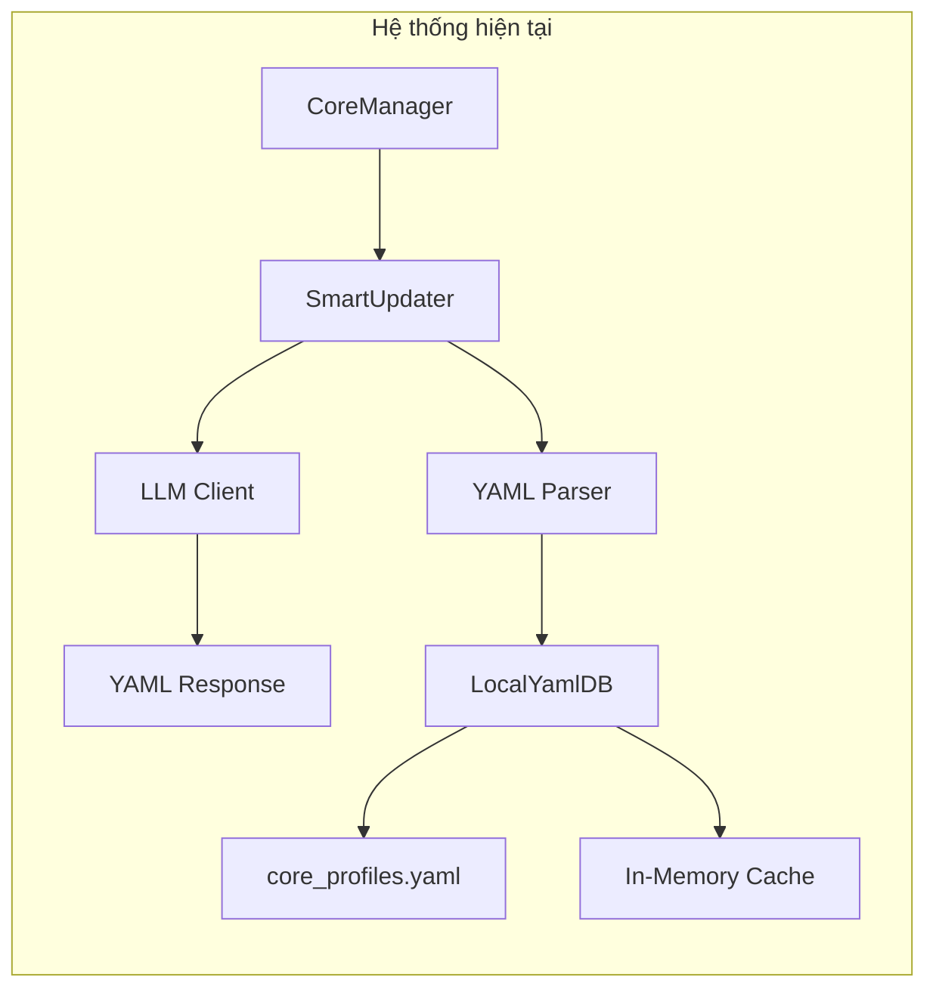
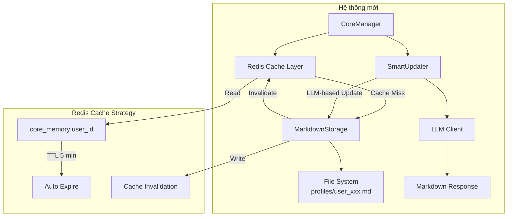
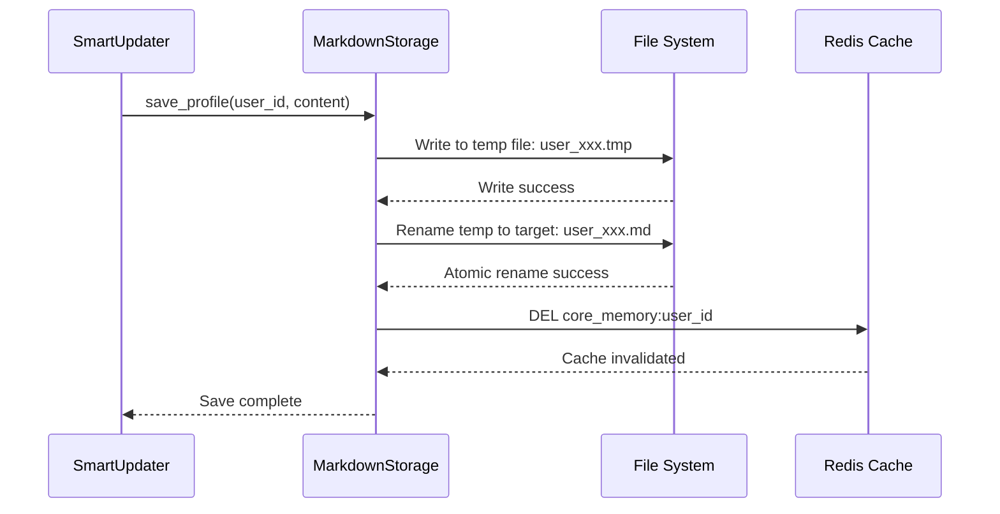
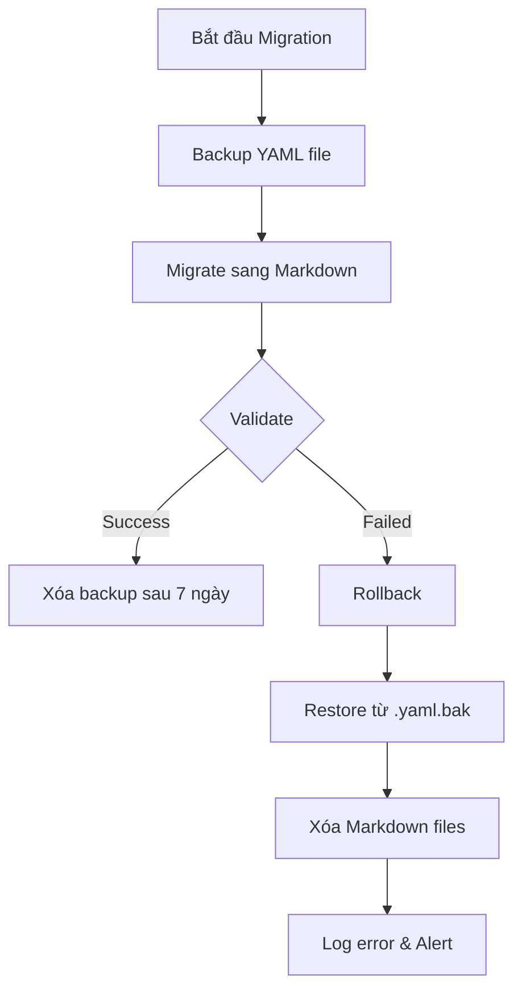
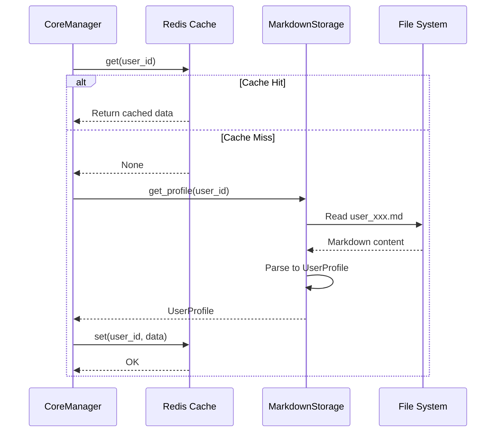
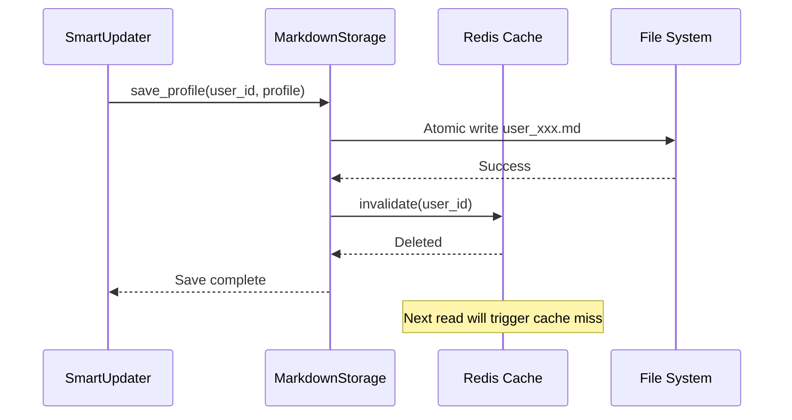
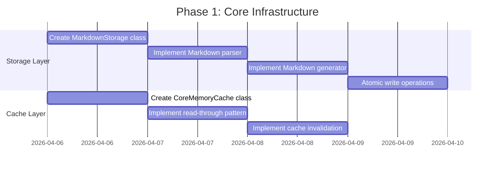
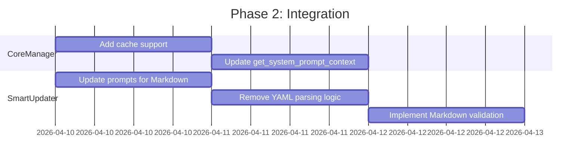
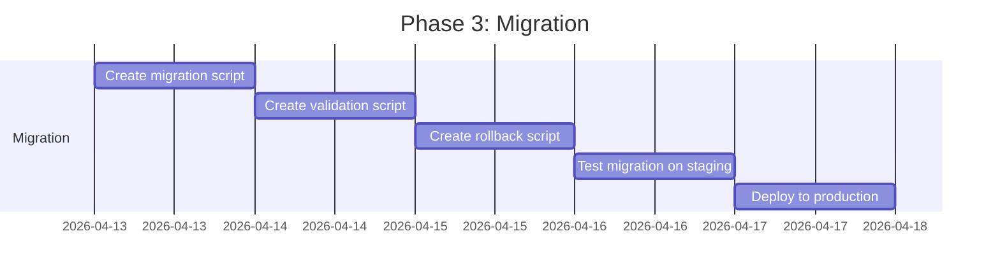

# Kế hoạch Cập nhật Tầng 3 (Core Memory) - Migration sang Markdown + Redis Caching

## 1. Tổng quan

### 1.1 Mục tiêu
Thay thế hệ thống lưu trữ Core Memory hiện tại (YAML-based) bằng Markdown files kết hợp với Redis caching để:
- Tăng khả năng đọc và chỉnh sửa thủ công bởi con người (Human-in-the-loop)
- Giảm độ phức tạp khi parse và update file
- Tăng tốc độ read operations thông qua caching
- Hỗ trợ LLM-based updates thay vì parse phức tạp

### 1.2 Phạm vi thay đổi
- **File mới**: 
  - `src/services/memories/core_memory/storage/markdown_storage.py`
  - `src/services/memories/core_memory/redis_cache.py`
  - `scripts/migrate_yaml_to_markdown.py`
- **File cập nhật**:
  - `src/services/memories/core_memory/core_manager.py`
  - `src/services/memories/core_memory/smart_updater.py`
  - `src/services/memories/core_memory/prompts.yaml`
  - `src/config/settings.py`
  - `.env.example`
- **File deprecated**:
  - `src/services/memories/core_memory/storage/local_yaml_db.py`
  - `src/services/memories/core_memory/storage/local_json_db.py`

---

## 2. Hiện trạng và Vấn đề

### 2.1 Kiến trúc hiện tại



### 2.2 Vấn đề với LocalYamlDB hiện tại

| Vấn đề | Mô tả | Impact |
|--------|-------|--------|
| **Parse Complexity** | YAML parser dễ lỗi với LLM output (unclosed quotes, truncated YAML) | High - gây crash khi update |
| **Single File Storage** | Tất cả users trong 1 file `core_profiles.yaml` | Medium - khó manage, rủi ro data corruption |
| **No Caching Layer** | Mỗi read request phải load toàn bộ file | Medium - chậm khi scale |
| **Manual Fix Required** | LLM output YAML thường bị lỗi format | High - cần code fix phức tạp |
| **Not Human-Readable** | YAML format khó đọc cho end-users | Low - khó debug manual |

### 2.3 Vấn đề trong SmartUpdater

Xem [`smart_updater.py`](src/services/memories/core_memory/smart_updater.py:49-138):

```python
# Các hàm fix YAML phức tạp:
def _clean_yaml_output(self, raw_text: str) -> str:
    """Trích xuất lõi YAML từ markdown của LLM"""
    # Regex parsing dễ lỗi

def _fix_yaml_string_issues(self, yaml_str: str) -> str:
    """Sửa các lỗi YAML phổ biến do LLM tạo ra"""
    # Unclosed quotes, multiline strings, unicode, truncated YAML

def _sanitize_unicode(self, text: str) -> str:
    """Loại bỏ các Unicode control characters gây lỗi YAML parser"""

def _fix_truncated_yaml(self, yaml_str: str) -> str:
    """Cố gắng sửa YAML bị cắt giữa chừng do LLM token limit"""
```

**Vấn đề cốt lõi**: Đòi hỏi LLM output phải là YAML hợp lệ 100% là không thực tế.

---

## 3. Giải pháp Đề xuất

### 3.1 Kiến trúc mới



### 3.2 Lợi ích của Markdown Storage

| Tính năng | Lợi ích |
|-----------|---------|
| **Human-Readable** | Dễ đọc, dễ chỉnh sửa thủ công bởi admin/user |
| **LLM-Native** | LLM sinh Markdown tự nhiên hơn YAML/JSON |
| **Section-Based** | Mỗi section có thể update độc lập |
| **No Parse Errors** | Markdown không có cú pháp nghiêm ngặt |
| **Version Control Friendly** | Git diff dễ đọc hơn |

### 3.3 Lợi ích của Redis Caching

| Tính năng | Lợi ích |
|-----------|---------|
| **Fast Read** | Read operations < 1ms từ cache |
| **Distributed** | Nhiều bot instances chia sẻ cache |
| **TTL Native** | Auto-expire sau 5 phút |
| **Write-Through** | Tự động invalidate khi write |

---

## 4. Cấu trúc Storage Mới

### 4.1 File System Structure

```
data/
└── memories/
    └── core_profiles/
        ├── user_123456789.md
        ├── user_987654321.md
        └── ...
```

### 4.2 Markdown File Format

```markdown
# User Profile: user_123456789

> Last updated: 2026-04-06T10:30:00Z
> Version: 3

## Định danh

- **Danh xưng**: Minh
- **Nhân khẩu học**: 25 tuổi, Nam, TP.HCM, Việt Nam

## Vai trò xã hội

- **Nghề nghiệp**: Kỹ sư phần mềm tại công ty công nghệ

## Mối quan hệ

- Có bạn gái tên Lan
- Sống cùng roommate tên Tuấn
- Có một chú chó tên Rex

## Sở thích & Đam mê

- Chơi game Wuthering Waves, Genshin Impact
- Đọc light novel
- Nghe nhạc J-pop

## Mục tiêu & Kế hoạch

- Đang học tiếng Nhật N3
- Kế hoạch đi du lịch Nhật Bản vào mùa hè

## Thói quen & Ưa thích

- Thích bot trả lời ngắn gọn, không dài dòng
- Hay thức khuya, ngủ muộn
- Dùng Discord chủ yếu vào buổi tối

## Ràng buộc & Cấm kỵ

- Dị ứng hải sản
- Không thích nói chuyện chính trị
- Không muốn bị nhắc về công việc vào cuối tuần

## Thông tin khác

- Đang viết một dự án side project về Discord bot
- Có kênh YouTube về review game
```

### 4.3 Redis Cache Structure

```
Key: core_memory:{user_id}
Type: Hash
TTL: 300 seconds (5 minutes)

Fields:
  - name: "Minh"
  - demographics: "25 tuổi, Nam, TP.HCM, Việt Nam"
  - occupation: "Kỹ sư phần mềm tại công ty công nghệ"
  - relationships: ["Có bạn gái tên Lan", "Sống cùng roommate tên Tuấn", "Có một chú chó tên Rex"]
  - interests: ["Chơi game Wuthering Waves", "Genshin Impact", "Đọc light novel", "Nghe nhạc J-pop"]
  - goals_and_plans: ["Đang học tiếng Nhật N3", "Kế hoạch đi du lịch Nhật Bản vào mùa hè"]
  - preferences: ["Thích bot trả lời ngắn gọn", "Hay thức khuya", "Dùng Discord chủ yếu vào buổi tối"]
  - constraints: ["Dị ứng hải sản", "Không thích nói chuyện chính trị", "Không muốn bị nhắc về công việc vào cuối tuần"]
  - other_facts: ["Đang viết một dự án side project về Discord bot", "Có kênh YouTube về review game"]
  - _metadata: '{"version": 3, "last_updated": "2026-04-06T10:30:00Z", "source_file": "user_123456789.md"}'
```

### 4.4 Atomic Write Operations



**Lý do atomic write:**
1. Ghi vào temp file trước để tránh corruption khi crash
2. Rename là atomic operation trên hầu hết filesystems
3. Chỉ invalidate cache sau khi write thành công

---

## 5. Các Component Cần Thay đổi

### 5.1 MarkdownStorage (File mới)

**Path**: `src/services/memories/core_memory/storage/markdown_storage.py`

```python
# Interface kế thừa từ BaseCoreDB
class MarkdownStorage(BaseCoreDB):
    """
    Kho lưu trữ Profile chạy bằng Markdown Files.
    - Mỗi user một file riêng: profiles/user_{user_id}.md
    - Hỗ trợ Redis caching cho read operations
    - Atomic write để tránh data corruption
    """
    
    def __init__(
        self, 
        storage_path: str = "data/memories/core_profiles",
        redis_client: Optional[Redis] = None,
        cache_ttl: int = 300  # 5 minutes
    ):
        self.storage_path = Path(storage_path)
        self.redis = redis_client
        self.cache_ttl = cache_ttl
        
    async def get_profile(self, user_id: str) -> UserProfile:
        """Lấy Profile với read-through cache pattern."""
        # 1. Check Redis cache first
        # 2. If cache miss, read from Markdown file
        # 3. Parse Markdown to UserProfile
        # 4. Cache the result
        pass
    
    async def save_profile(self, user_id: str, profile: UserProfile) -> None:
        """Lưu Profile với write-through invalidation."""
        # 1. Convert UserProfile to Markdown
        # 2. Atomic write to file
        # 3. Invalidate Redis cache
        pass
    
    def _parse_markdown_to_profile(self, content: str) -> UserProfile:
        """Parse Markdown content thành UserProfile object."""
        pass
    
    def _profile_to_markdown(self, profile: UserProfile, user_id: str) -> str:
        """Convert UserProfile object thành Markdown content."""
        pass
    
    def _atomic_write(self, file_path: Path, content: str) -> None:
        """Ghi file một cách atomic để tránh corruption."""
        pass
```

### 5.2 RedisCache (File mới)

**Path**: `src/services/memories/core_memory/redis_cache.py`

```python
class CoreMemoryCache:
    """
    Redis caching layer cho Core Memory.
    Sử dụng read-through cache pattern.
    """
    
    KEY_PREFIX = "core_memory:"
    TTL = 300  # 5 minutes
    
    def __init__(self, redis_client: Redis):
        self.redis = redis_client
        
    def _get_key(self, user_id: str) -> str:
        return f"{self.KEY_PREFIX}{user_id}"
    
    async def get(self, user_id: str) -> Optional[dict]:
        """Lấy cached profile data."""
        key = self._get_key(user_id)
        data = await self.redis.hgetall(key)
        if not data:
            return None
        return self._deserialize(data)
    
    async def set(self, user_id: str, profile_data: dict) -> None:
        """Cache profile data với TTL."""
        key = self._get_key(user_id)
        serialized = self._serialize(profile_data)
        await self.redis.hset(key, mapping=serialized)
        await self.redis.expire(key, self.TTL)
    
    async def invalidate(self, user_id: str) -> None:
        """Xóa cache khi profile được update."""
        key = self._get_key(user_id)
        await self.redis.delete(key)
    
    async def warm_cache(self, user_ids: list[str]) -> None:
        """Pre-populate cache cho multiple users."""
        # Batch load profiles and cache them
        pass
```

### 5.3 Cập nhật CoreManager

**Path**: `src/services/memories/core_memory/core_manager.py`

```python
class CoreManager:
    """
    Facade Tổng Chỉ Huy của Tầng 3 (Core Memory).
    Cập nhật để hỗ trợ Redis caching.
    """
    
    def __init__(
        self, 
        storage: BaseCoreDB, 
        smart_updater: SmartUpdater,
        cache: Optional[CoreMemoryCache] = None
    ):
        self.storage = storage
        self.smart_updater = smart_updater
        self.cache = cache  # New: Redis cache layer
        
    async def get_system_prompt_context(self, user_id: str) -> str:
        """Lấy Profile context với cache support."""
        # Try cache first if available
        if self.cache:
            cached = await self.cache.get(user_id)
            if cached:
                return self._format_context(cached)
        
        # Cache miss - get from storage
        profile = await self.storage.get_profile(user_id)
        
        # Cache the result
        if self.cache:
            await self.cache.set(user_id, profile.model_dump())
        
        return self._format_context(profile)
```

### 5.4 Cập nhật SmartUpdater cho LLM-based Updates

**Path**: `src/services/memories/core_memory/smart_updater.py`

```python
class SmartUpdater:
    """
    Người Thư Ký của Tầng 3.
    Cập nhật để sử dụng LLM-based Markdown updates.
    """
    
    async def update_profile_with_fact(
        self, 
        user_id: str, 
        new_fact: str, 
        context: str = ""
    ) -> bool:
        """
        Luồng chạy chính khi có CRITICAL_INFO từ Tầng 1.
        Sử dụng LLM để update trực tiếp Markdown thay vì parse YAML.
        """
        # 1. Lấy profile hiện tại (Markdown format)
        current_markdown = await self.storage.get_profile_markdown(user_id)
        
        # 2. Gọi LLM với prompt mới (Markdown-based)
        prompt = get_core_update_prompt_markdown(
            current_profile=current_markdown,
            new_fact=new_fact,
            context=context
        )
        
        # 3. LLM trả về Markdown mới (không cần parse phức tạp)
        response = await self.llm_client.generate_response(
            messages=[{"role": "user", "content": prompt}],
        )
        
        # 4. Validate và lưu trực tiếp
        updated_markdown = self._extract_markdown(response.content)
        
        # 5. Parse để validate structure (optional)
        validated_profile = self._validate_markdown_profile(updated_markdown)
        
        # 6. Lưu xuống storage
        await self.storage.save_profile_markdown(user_id, updated_markdown)
        
        return True
```

### 5.5 Cập nhật Prompts

**Path**: `src/services/memories/core_memory/prompts.yaml`

```yaml
# New Markdown-based prompt
CORE_UPDATE_PROMPT_MARKDOWN: |
  role: "Thư ký Quản lý Hồ sơ" cho AI Assistant
  task: Cập nhật Hồ sơ người dùng dựa trên thông tin mới.
  
  instructions:
    1. Đọc kỹ "Hồ sơ hiện tại" (Markdown format)
    2. Phân tích "Sự thật mới" trong ngữ cảnh hội thoại
    3. Cập nhật hồ sơ, giữ nguyên các thông tin không liên quan
    4. Nếu có xung đột, ghi đè thông tin cũ bằng thông tin mới
    5. Trả về hồ sơ đã cập nhật dưới dạng Markdown
  
  output_format: |
    Trả về ĐÚNG MỘT khối Markdown với cấu trúc:
    ```markdown
    # User Profile: user_xxx
    
    > Last updated: [timestamp]
    > Version: [version number]
    
    ## Định danh
    - **Danh xưng**: ...
    - **Nhân khẩu học**: ...
    
    ## Vai trò xã hội
    - **Nghề nghiệp**: ...
    
    ## Mối quan hệ
    - ...
    
    ## Sở thích & Đam mê
    - ...
    
    ## Mục tiêu & Kế hoạch
    - ...
    
    ## Thói quen & Ưa thích
    - ...
    
    ## Ràng buộc & Cấm kỵ
    - ...
    
    ## Thông tin khác
    - ...
    ```
  
  inputs:
    current_profile: |
      {current_profile}
    context: |
      {context}
    new_fact: "{new_fact}"
```

---

## 6. Migration từ YAML sang Markdown

### 6.1 Migration Script

**Path**: `scripts/migrate_yaml_to_markdown.py`

```python
"""
Script migration từ YAML sang Markdown cho Core Memory.
Chạy một lần khi deploy version mới.
"""

import asyncio
import yaml
from pathlib import Path
from datetime import datetime

def yaml_to_markdown(user_id: str, profile_data: dict) -> str:
    """Convert YAML profile data sang Markdown format."""
    lines = [
        f"# User Profile: {user_id}",
        "",
        f"> Last updated: {datetime.utcnow().isoformat()}Z",
        f"> Version: 1",
        "",
    ]
    
    # Định danh
    if profile_data.get("name") or profile_data.get("demographics"):
        lines.append("## Định danh")
        if profile_data.get("name"):
            lines.append(f"- **Danh xưng**: {profile_data['name']}")
        if profile_data.get("demographics"):
            lines.append(f"- **Nhân khẩu học**: {profile_data['demographics']}")
        lines.append("")
    
    # Nghề nghiệp
    if profile_data.get("occupation"):
        lines.append("## Vai trò xã hội")
        lines.append(f"- **Nghề nghiệp**: {profile_data['occupation']}")
        lines.append("")
    
    # Các list fields
    list_sections = {
        "Mối quan hệ": "relationships",
        "Sở thích & Đam mê": "interests",
        "Mục tiêu & Kế hoạch": "goals_and_plans",
        "Thói quen & Ưa thích": "preferences",
        "Ràng buộc & Cấm kỵ": "constraints",
        "Thông tin khác": "other_facts"
    }
    
    for section_name, field_name in list_sections.items():
        items = profile_data.get(field_name, [])
        if items:
            lines.append(f"## {section_name}")
            for item in items:
                lines.append(f"- {item}")
            lines.append("")
    
    return "\n".join(lines)


async def migrate_yaml_to_markdown(
    source_file: str = "data/memories/core_profiles.yaml",
    target_dir: str = "data/memories/core_profiles"
):
    """
    Main migration function.
    """
    source_path = Path(source_file)
    target_path = Path(target_dir)
    
    if not source_path.exists():
        print(f"Source file not found: {source_file}")
        return
    
    # Create target directory
    target_path.mkdir(parents=True, exist_ok=True)
    
    # Load YAML data
    with open(source_path, "r", encoding="utf-8") as f:
        data = yaml.safe_load(f) or {}
    
    print(f"Found {len(data)} user profiles to migrate")
    
    # Migrate each user
    for user_id, profile_data in data.items():
        markdown_content = yaml_to_markdown(user_id, profile_data)
        
        user_file = target_path / f"user_{user_id}.md"
        with open(user_file, "w", encoding="utf-8") as f:
            f.write(markdown_content)
        
        print(f"Migrated: {user_id} -> {user_file}")
    
    # Backup original YAML
    backup_path = source_path.with_suffix(".yaml.bak")
    source_path.rename(backup_path)
    print(f"Original file backed up to: {backup_path}")


if __name__ == "__main__":
    asyncio.run(migrate_yaml_to_markdown())
```

### 6.2 Validation Script

**Path**: `scripts/validate_migration.py`

```python
"""
Validate migration từ YAML sang Markdown.
So sánh data integrity giữa source và target.
"""

import yaml
from pathlib import Path
from typing import Optional, List

def parse_markdown_to_dict(content: str) -> dict:
    """Parse Markdown content back to dict for validation."""
    result = {
        "name": None,
        "demographics": None,
        "occupation": None,
        "relationships": [],
        "interests": [],
        "goals_and_plans": [],
        "preferences": [],
        "constraints": [],
        "other_facts": []
    }
    
    current_section = None
    
    for line in content.split("\n"):
        line = line.strip()
        
        # Detect sections
        if line.startswith("## "):
            section_map = {
                "Định danh": "identity",
                "Vai trò xã hội": "occupation",
                "Mối quan hệ": "relationships",
                "Sở thích & Đam mê": "interests",
                "Mục tiêu & Kế hoạch": "goals_and_plans",
                "Thói quen & Ưa thích": "preferences",
                "Ràng buộc & Cấm kỵ": "constraints",
                "Thông tin khác": "other_facts"
            }
            current_section = section_map.get(line[3:])
            continue
        
        # Parse content
        if line.startswith("- **"):
            # Key-value pair
            key, value = line[4:].split("**:", 1)
            key = key.strip()
            value = value.strip()
            
            if key == "Danh xưng":
                result["name"] = value
            elif key == "Nhân khẩu học":
                result["demographics"] = value
            elif key == "Nghề nghiệp":
                result["occupation"] = value
                
        elif line.startswith("- ") and current_section:
            # List item
            value = line[2:]
            if current_section in result and isinstance(result[current_section], list):
                result[current_section].append(value)
    
    return result


def validate_migration(
    yaml_file: str = "data/memories/core_profiles.yaml.bak",
    md_dir: str = "data/memories/core_profiles"
):
    """Validate that all data was migrated correctly."""
    yaml_path = Path(yaml_file)
    md_path = Path(md_dir)
    
    if not yaml_path.exists():
        print("Backup YAML file not found")
        return False
    
    # Load original YAML
    with open(yaml_path, "r", encoding="utf-8") as f:
        original_data = yaml.safe_load(f) or {}
    
    errors = []
    
    for user_id, original_profile in original_data.items():
        user_file = md_path / f"user_{user_id}.md"
        
        if not user_file.exists():
            errors.append(f"Missing file for user: {user_id}")
            continue
        
        with open(user_file, "r", encoding="utf-8") as f:
            md_content = f.read()
        
        migrated_profile = parse_markdown_to_dict(md_content)
        
        # Compare fields
        for field in ["name", "demographics", "occupation"]:
            if original_profile.get(field) != migrated_profile.get(field):
                errors.append(f"Field mismatch for {user_id}.{field}")
        
        # Compare list fields
        for field in ["relationships", "interests", "goals_and_plans", 
                      "preferences", "constraints", "other_facts"]:
            orig_set = set(original_profile.get(field, []))
            mig_set = set(migrated_profile.get(field, []))
            if orig_set != mig_set:
                errors.append(f"List mismatch for {user_id}.{field}")
    
    if errors:
        print("Validation FAILED:")
        for error in errors:
            print(f"  - {error}")
        return False
    
    print("Validation PASSED: All profiles migrated correctly")
    return True


if __name__ == "__main__":
    validate_migration()
```

### 6.3 Rollback Mechanism



**Rollback Script**:

```python
def rollback_migration(
    backup_file: str = "data/memories/core_profiles.yaml.bak",
    target_file: str = "data/memories/core_profiles.yaml",
    md_dir: str = "data/memories/core_profiles"
):
    """Rollback migration nếu có lỗi."""
    backup_path = Path(backup_file)
    target_path = Path(target_file)
    md_path = Path(md_dir)
    
    # Restore YAML
    if backup_path.exists():
        backup_path.rename(target_path)
        print(f"Restored: {target_path}")
    
    # Remove Markdown files
    if md_path.exists():
        for md_file in md_path.glob("user_*.md"):
            md_file.unlink()
            print(f"Removed: {md_file}")
        md_path.rmdir()
    
    print("Rollback complete")
```

---

## 7. Cơ chế Caching với Redis

### 7.1 Read-Through Cache Pattern



### 7.2 Write-Through Cache Invalidation



### 7.3 Cache Warming Strategy

```python
class CoreMemoryCache:
    # ... existing methods ...
    
    async def warm_cache_for_active_users(
        self, 
        user_ids: list[str],
        storage: MarkdownStorage
    ) -> int:
        """
        Pre-populate cache cho active users.
        Chạy khi bot startup hoặc scheduled.
        """
        warmed = 0
        for user_id in user_ids:
            try:
                profile = await storage.get_profile(user_id)
                await self.set(user_id, profile.model_dump())
                warmed += 1
            except Exception as e:
                logger.warning(f"Failed to warm cache for {user_id}: {e}")
        
        logger.info(f"Cache warmed for {warmed}/{len(user_ids)} users")
        return warmed
```

### 7.4 Cache Configuration

```python
# src/config/settings.py additions

class Config:
    # ... existing config ...
    
    # Core Memory Storage
    CORE_MEMORY_STORAGE_PATH = os.getenv(
        "CORE_MEMORY_STORAGE_PATH", 
        "data/memories/core_profiles"
    )
    
    # Redis Cache for Core Memory
    REDIS_CORE_MEMORY_TTL = int(
        os.getenv("REDIS_CORE_MEMORY_TTL", "300")
    )  # 5 minutes
    
    REDIS_CORE_MEMORY_PREFIX = os.getenv(
        "REDIS_CORE_MEMORY_PREFIX", 
        "core_memory:"
    )
    
    # LLM Update Model
    LLM_UPDATE_MODEL = os.getenv(
        "LLM_UPDATE_MODEL", 
        "gemini-1.5-flash"  # Cheaper model for profile updates
    )
```

---

## 8. Configuration

### 8.1 Environment Variables

```bash
# .env.example additions

# Core Memory Storage
CORE_MEMORY_STORAGE_PATH=data/memories/core_profiles

# Redis Cache for Core Memory
REDIS_CORE_MEMORY_TTL=300
REDIS_CORE_MEMORY_PREFIX=core_memory:

# LLM Model for Profile Updates
LLM_UPDATE_MODEL=gemini-1.5-flash
```

### 8.2 Docker Compose Updates

```yaml
# docker-compose.yml additions
services:
  bot:
    environment:
      - CORE_MEMORY_STORAGE_PATH=/app/data/memories/core_profiles
      - REDIS_CORE_MEMORY_TTL=300
      - REDIS_CORE_MEMORY_PREFIX=core_memory:
      - LLM_UPDATE_MODEL=gemini-1.5-flash
    volumes:
      - ./data/memories/core_profiles:/app/data/memories/core_profiles
    depends_on:
      - redis
```

---

## 9. Implementation Roadmap

### 9.1 Phase 1: Core Infrastructure



### 9.2 Phase 2: Integration



### 9.3 Phase 3: Migration



---

## 10. Testing Strategy

### 10.1 Unit Tests

```python
# tests/test_markdown_storage.py

import pytest
from src.services.memories.core_memory.storage.markdown_storage import MarkdownStorage
from src.services.memories.core_memory.models import UserProfile

class TestMarkdownStorage:
    
    def test_parse_empty_markdown(self):
        """Test parsing empty Markdown file."""
        storage = MarkdownStorage(storage_path="/tmp/test_profiles")
        profile = storage._parse_markdown_to_profile("")
        assert profile == UserProfile()
    
    def test_parse_complete_markdown(self):
        """Test parsing complete Markdown file."""
        markdown = """
# User Profile: test_user

## Định danh
- **Danh xưng**: Minh
- **Nhân khẩu học**: 25 tuổi, Nam, TP.HCM

## Mối quan hệ
- Có bạn gái tên Lan
"""
        storage = MarkdownStorage(storage_path="/tmp/test_profiles")
        profile = storage._parse_markdown_to_profile(markdown)
        
        assert profile.name == "Minh"
        assert profile.demographics == "25 tuổi, Nam, TP.HCM"
        assert "Có bạn gái tên Lan" in profile.relationships
    
    def test_profile_to_markdown(self):
        """Test converting UserProfile to Markdown."""
        profile = UserProfile(
            name="Minh",
            demographics="25 tuổi, Nam, TP.HCM",
            relationships=["Có bạn gái tên Lan"]
        )
        storage = MarkdownStorage(storage_path="/tmp/test_profiles")
        markdown = storage._profile_to_markdown(profile, "test_user")
        
        assert "# User Profile: test_user" in markdown
        assert "**Danh xưng**: Minh" in markdown
        assert "- Có bạn gái tên Lan" in markdown
    
    @pytest.mark.asyncio
    async def test_atomic_write(self):
        """Test atomic write operation."""
        storage = MarkdownStorage(storage_path="/tmp/test_profiles")
        profile = UserProfile(name="Test User")
        
        await storage.save_profile("test_user", profile)
        
        # Verify file exists
        file_path = storage.storage_path / "user_test_user.md"
        assert file_path.exists()
```

### 10.2 Integration Tests

```python
# tests/test_core_memory_integration.py

import pytest
from unittest.mock import AsyncMock, MagicMock
from src.services.memories.core_memory.core_manager import CoreManager
from src.services.memories.core_memory.storage.markdown_storage import MarkdownStorage
from src.services.memories.core_memory.redis_cache import CoreMemoryCache

class TestCoreMemoryIntegration:
    
    @pytest.fixture
    def setup(self, tmp_path):
        storage = MarkdownStorage(storage_path=str(tmp_path / "profiles"))
        cache = CoreMemoryCache(redis_client=MagicMock())
        return storage, cache
    
    @pytest.mark.asyncio
    async def test_cache_hit_flow(self, setup):
        """Test read flow with cache hit."""
        storage, cache = setup
        
        # Mock cache hit
        cache.get = AsyncMock(return_value={
            "name": "Cached User",
            "demographics": None,
            "occupation": None,
            "relationships": [],
            "interests": [],
            "goals_and_plans": [],
            "preferences": [],
            "constraints": [],
            "other_facts": []
        })
        
        manager = CoreManager(storage=storage, smart_updater=None, cache=cache)
        context = await manager.get_system_prompt_context("test_user")
        
        # Should use cached data
        assert "Cached User" in context
        cache.get.assert_called_once()
    
    @pytest.mark.asyncio
    async def test_cache_miss_flow(self, setup):
        """Test read flow with cache miss."""
        storage, cache = setup
        
        # Mock cache miss
        cache.get = AsyncMock(return_value=None)
        cache.set = AsyncMock()
        
        # Create a profile in storage
        profile = UserProfile(name="Storage User")
        await storage.save_profile("test_user", profile)
        
        manager = CoreManager(storage=storage, smart_updater=None, cache=cache)
        context = await manager.get_system_prompt_context("test_user")
        
        # Should read from storage and cache
        assert "Storage User" in context
        cache.get.assert_called_once()
        cache.set.assert_called_once()
```

---

## 11. Monitoring & Observability

### 11.1 Metrics to Track

```python
# Metrics definitions
METRICS = {
    "core_memory_read_total": {
        "description": "Total number of core memory reads",
        "labels": ["user_id", "cache_status"]  # cache_status: hit, miss
    },
    "core_memory_write_total": {
        "description": "Total number of core memory writes",
        "labels": ["user_id"]
    },
    "core_memory_cache_latency": {
        "description": "Latency of cache operations",
        "labels": ["operation"]  # operation: get, set, invalidate
    },
    "core_memory_storage_latency": {
        "description": "Latency of storage operations",
        "labels": ["operation"]  # operation: read, write
    },
    "core_memory_llm_update_total": {
        "description": "Total LLM-based profile updates",
        "labels": ["status"]  # status: success, failure
    }
}
```

### 11.2 Logging

```python
# Structured logging format
LOG_FORMAT = """
{
    "timestamp": "2026-04-06T10:30:00Z",
    "level": "INFO",
    "component": "core_memory",
    "operation": "get_profile",
    "user_id": "123456789",
    "cache_status": "hit",
    "latency_ms": 2.5,
    "message": "Profile retrieved from cache"
}
"""
```

---

## 12. Risks & Mitigations

| Rủi ro | Xác suất | Tác động | Giảm thiểu |
|--------|----------|----------|------------|
| LLM sinh Markdown không đúng format | Trung bình | Trung bình | Validation layer + retry mechanism |
| Redis connection failure | Thấp | Cao | Fallback to direct file read |
| File system corruption | Thấp | Cao | Atomic writes + backup strategy |
| Migration data loss | Thấp | Cao | Validation script + rollback mechanism |
| Cache inconsistency | Trung bình | Thấp | TTL-based expiration + write invalidation |

---

## 13. Success Criteria

- [ ] Tất cả user profiles được migrate sang Markdown format
- [ ] Validation script xác nhận 100% data integrity
- [ ] Read latency < 5ms với cache hit
- [ ] Read latency < 50ms với cache miss
- [ ] Write latency < 100ms
- [ ] LLM update success rate > 95%
- [ ] Zero data loss during migration
- [ ] Rollback script tested và sẵn sàng

---

## 14. Appendix

### 14.1 File Structure After Migration

```
src/services/memories/core_memory/
├── __init__.py
├── core_manager.py          # Updated: Add cache support
├── models.py                 # Unchanged
├── prompts.yaml              # Updated: Markdown prompts
├── smart_updater.py          # Updated: Markdown-based updates
├── redis_cache.py            # New: Redis caching layer
└── storage/
    ├── __init__.py
    ├── base_core_db.py        # Unchanged
    ├── local_json_db.py      # Deprecated
    ├── local_yaml_db.py      # Deprecated
    └── markdown_storage.py   # New: Markdown storage

scripts/
├── migrate_yaml_to_markdown.py  # New: Migration script
├── validate_migration.py         # New: Validation script
└── rollback_migration.py        # New: Rollback script

data/memories/core_profiles/
├── user_123456789.md
├── user_987654321.md
└── ...
```

### 14.2 Dependencies

```txt
# requirements.txt additions
redis>=4.5.0           # Redis client
aioredis>=2.0.0        # Async Redis support
```

### 14.3 Related Documents

- [Kế hoạch tổng thể](plans/memories/update_memory.md)
- [Tầng 1: Active Memory](plans/memories/t1_update_memory.md)
- [Tầng 2: Episodic Memory](plans/memories/t2_update_memory.md)