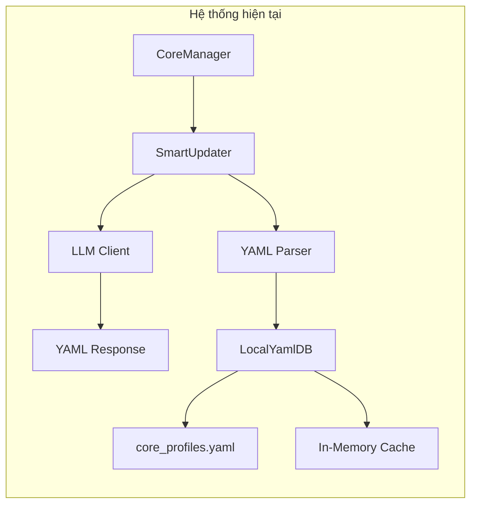
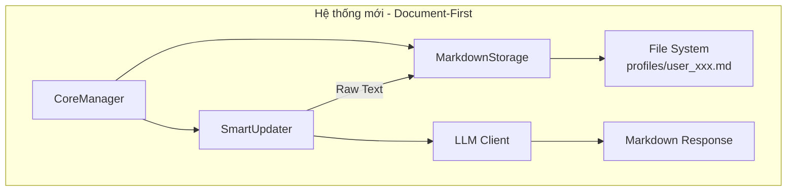
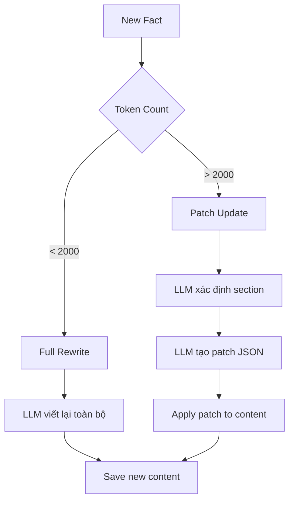
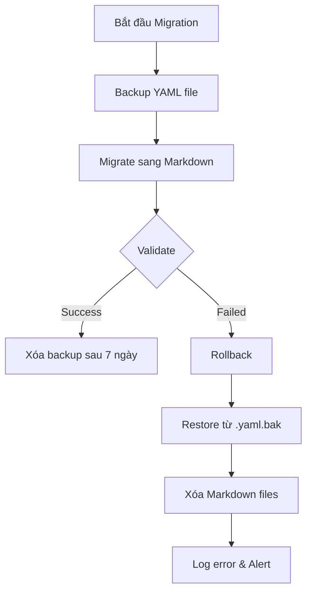
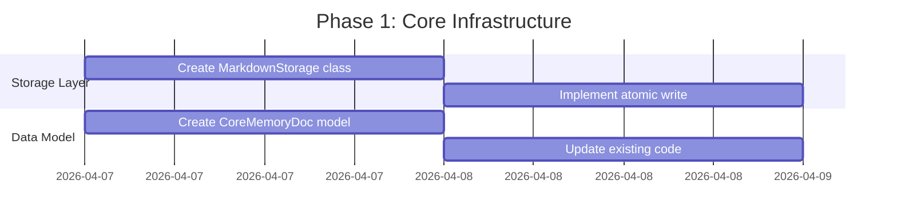
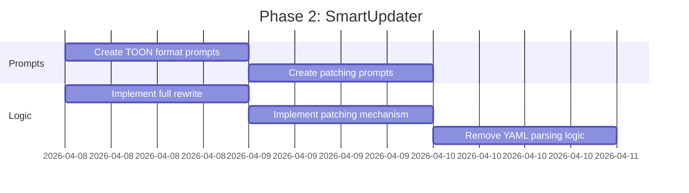

# Kế hoạch Cập nhật Tầng 3 (Core Memory) - Document-First Design (Markdown is Truth)

## 1. Tổng quan

### 1.1 Mục tiêu
Thay thế hệ thống lưu trữ Core Memory hiện tại (YAML-based) bằng Markdown files với thiết kế "Document-First" đơn giản:
- **Markdown is Truth**: File Markdown là nguồn chân lý, không có cache layer phức tạp
- **Human-Readable**: Dễ đọc, dễ chỉnh sửa thủ công bởi admin/user
- **LLM-Native**: LLM sinh Markdown tự nhiên hơn YAML/JSON
- **No Parse Complexity**: Không cần parse phức tạp, LLM đọc/ghi trực tiếp raw text
- **Simple I/O**: Storage layer chỉ làm I/O, không transform data

### 1.2 Phạm vi thay đổi
- **File mới**: 
  - `src/services/memories/core_memory/storage/markdown_storage.py` (simplified)
  - `scripts/migrate_yaml_to_markdown.py`
- **File cập nhật**:
  - `src/services/memories/core_memory/core_manager.py`
  - `src/services/memories/core_memory/smart_updater.py`
  - `src/services/memories/core_memory/prompts.yaml`
  - `src/services/memories/core_memory/models.py`
- **File deprecated**:
  - `src/services/memories/core_memory/storage/local_yaml_db.py`
  - `src/services/memories/core_memory/storage/local_json_db.py`

---

## 2. Hiện trạng và Vấn đề

### 2.1 Kiến trúc hiện tại



### 2.2 Vấn đề với LocalYamlDB hiện tại

| Vấn đề | Mô tả | Impact |
|--------|-------|--------|
| **Parse Complexity** | YAML parser dễ lỗi với LLM output (unclosed quotes, truncated YAML) | High - gây crash khi update |
| **Single File Storage** | Tất cả users trong 1 file `core_profiles.yaml` | Medium - khó manage, rủi ro data corruption |
| **No Caching Layer** | Mỗi read request phải load toàn bộ file | Medium - chậm khi scale |
| **Manual Fix Required** | LLM output YAML thường bị lỗi format | High - cần code fix phức tạp |
| **Not Human-Readable** | YAML format khó đọc cho end-users | Low - khó debug manual |

### 2.3 Vấn đề trong SmartUpdater

Xem [`smart_updater.py`](src/services/memories/core_memory/smart_updater.py:49-138):

```python
# Các hàm fix YAML phức tạp:
def _clean_yaml_output(self, raw_text: str) -> str:
    """Trích xuất lõi YAML từ markdown của LLM"""
    # Regex parsing dễ lỗi

def _fix_yaml_string_issues(self, yaml_str: str) -> str:
    """Sửa các lỗi YAML phổ biến do LLM tạo ra"""
    # Unclosed quotes, multiline strings, unicode, truncated YAML

def _sanitize_unicode(self, text: str) -> str:
    """Loại bỏ các Unicode control characters gây lỗi YAML parser"""

def _fix_truncated_yaml(self, yaml_str: str) -> str:
    """Cố gắng sửa YAML bị cắt giữa chừng do LLM token limit"""
```

**Vấn đề cốt lõi**: Đòi hỏi LLM output phải là YAML hợp lệ 100% là không thực tế.

---

## 3. Giải pháp Đề xuất: Document-First Design

### 3.1 Kiến trúc mới (Simplified)



**Key Principles:**
1. **No Cache Layer**: File system là nguồn chân lý, không có Redis
2. **Raw Text I/O**: Storage chỉ đọc/ghi raw markdown, không parse
3. **LLM-First Updates**: LLM đọc và viết lại toàn bộ file markdown
4. **Simple Model**: `CoreMemoryDoc` chỉ chứa `content` (raw markdown string)

### 3.2 Lợi ích của Document-First Design

| Tính năng | Lợi ích |
|-----------|---------|
| **Human-Readable** | Dễ đọc, dễ chỉnh sửa thủ công bởi admin/user |
| **LLM-Native** | LLM sinh Markdown tự nhiên hơn YAML/JSON |
| **No Parse Errors** | Markdown không có cú pháp nghiêm ngặt, không bao giờ parse error |
| **Version Control Friendly** | Git diff dễ đọc hơn |
| **Simple Architecture** | Không có cache layer, không có parse logic phức tạp |
| **Debuggable** | Có thể mở file .md và đọc trực tiếp |

---

## 4. Data Model (Simplified)

### 4.1 CoreMemoryDoc - Wrapper tối giản

**Path**: `src/services/memories/core_memory/models.py`

```python
from pydantic import BaseModel, Field
from datetime import datetime

class CoreMemoryDoc(BaseModel):
    """
    Document wrapper cho Core Memory.
    Chỉ chứa raw markdown content - không có structured fields.
    """
    user_id: str
    last_updated: str = Field(default_factory=lambda: datetime.utcnow().isoformat())
    content: str = ""  # Raw markdown text - TOÀN BỘ nội dung file
    version: int = 1
    
    def increment_version(self) -> "CoreMemoryDoc":
        """Tăng version sau mỗi update."""
        return CoreMemoryDoc(
            user_id=self.user_id,
            last_updated=datetime.utcnow().isoformat(),
            content=self.content,
            version=self.version + 1
        )
```

**Lý do thiết kế này:**
- Không có `name`, `demographics`, `interests` fields riêng
- `content` chứa toàn bộ markdown text
- LLM đọc và viết lại `content` trực tiếp
- Không cần parse/serialize logic

### 4.2 So sánh với Model cũ

```python
# OLD: UserProfile - Quá nhiều fields
class UserProfile(BaseModel):
    name: Optional[str] = None
    demographics: Optional[str] = None
    occupation: Optional[str] = None
    relationships: List[str] = []
    interests: List[str] = []
    goals_and_plans: List[str] = []
    preferences: List[str] = []
    constraints: List[str] = []
    other_facts: List[str] = []
    # ... cần parse/serialize cho mỗi field

# NEW: CoreMemoryDoc - Chỉ 1 field content
class CoreMemoryDoc(BaseModel):
    user_id: str
    content: str  # Raw markdown - done!
    # ... không cần parse, LLM xử lý trực tiếp
```

---

## 5. MarkdownStorage - Simple I/O Only

### 5.1 Interface

**Path**: `src/services/memories/core_memory/storage/markdown_storage.py`

```python
from pathlib import Path
import aiofiles
from typing import Optional
from .base_core_db import BaseCoreDB
from ..models import CoreMemoryDoc

class MarkdownStorage(BaseCoreDB):
    """
    Kho lưu trữ Profile chạy bằng Markdown Files.
    - Mỗi user một file riêng: profiles/user_{user_id}.md
    - CHỈ làm I/O, KHÔNG parse markdown
    - Atomic write để tránh data corruption
    """
    
    def __init__(self, storage_path: str = "data/memories/core_profiles"):
        self.storage_path = Path(storage_path)
        self.storage_path.mkdir(parents=True, exist_ok=True)
    
    async def get_profile_doc(self, user_id: str) -> CoreMemoryDoc:
        """
        Đọc file Markdown và trả về Document object.
        Không parse content - trả về raw text.
        """
        file_path = self.storage_path / f"user_{user_id}.md"
        
        if not file_path.exists():
            # Return new doc với default template
            return CoreMemoryDoc(
                user_id=user_id,
                content=self._get_default_template(user_id)
            )
        
        async with aiofiles.open(file_path, "r", encoding="utf-8") as f:
            content = await f.read()
        
        # Extract metadata từ file
        version = self._extract_version(content)
        last_updated = self._extract_last_updated(content)
        
        return CoreMemoryDoc(
            user_id=user_id,
            content=content,
            version=version,
            last_updated=last_updated
        )
    
    async def save_profile_doc(self, doc: CoreMemoryDoc) -> None:
        """
        Atomic write trực tiếp text vào file.
        Không transform hay validate - chỉ write.
        """
        target_path = self.storage_path / f"user_{doc.user_id}.md"
        temp_path = self.storage_path / f"user_{doc.user_id}.tmp"
        
        # Write to temp file first
        async with aiofiles.open(temp_path, "w", encoding="utf-8") as f:
            await f.write(doc.content)
        
        # Atomic rename
        temp_path.replace(target_path)
    
    def _get_default_template(self, user_id: str) -> str:
        """Template mặc định cho user mới."""
        from datetime import datetime
        return f"""# User Profile: {user_id}

> Last updated: {datetime.utcnow().isoformat()}Z
> Version: 1

## Định danh

- **Danh xưng**: 
- **Nhân khẩu học**: 

## Vai trò xã hội

- **Nghề nghiệp**: 

## Mối quan hệ


## Sở thích & Đam mê


## Mục tiêu & Kế hoạch


## Thói quen & Ưa thích


## Ràng buộc & Cấm kỵ


## Thông tin khác

"""
    
    def _extract_version(self, content: str) -> int:
        """Extract version từ markdown header."""
        import re
        match = re.search(r'> Version: (\d+)', content)
        return int(match.group(1)) if match else 1
    
    def _extract_last_updated(self, content: str) -> str:
        """Extract last_updated từ markdown header."""
        import re
        match = re.search(r'> Last updated: ([^\n]+)', content)
        return match.group(1) if match else ""
```

### 5.2 Không có Parse Logic

```python
# KHÔNG CÓ các hàm này:
# def _parse_markdown_to_profile(content: str) -> UserProfile:  # REMOVED
# def _profile_to_markdown(profile: UserProfile) -> str:        # REMOVED

# CHỈ CÓ:
# - get_profile_doc() -> đọc raw text
# - save_profile_doc() -> ghi raw text
```

---

## 6. SmartUpdater với TOON Format Prompt

### 6.1 TOON Format Prompt

**Path**: `src/services/memories/core_memory/prompts.yaml`

```yaml
# TOON Format: Task, Objective, Obstacles, Narrative
CORE_UPDATE_PROMPT_MARKDOWN: |
  <Task>
  Bạn là Hệ điều hành Quản lý Hồ sơ (Core Memory) của AI. 
  Nhiệm vụ của bạn là tích hợp thông tin/sự thật mới vào file hồ sơ Markdown của người dùng.
  </Task>
  
  <Objective>
  Phản ánh chính xác sự thay đổi về sở thích, trạng thái, hoặc thói quen của người dùng.
  Bạn có toàn quyền tạo thêm các tiêu đề (Heading `##`, `###`) mới nếu thông tin mới không khớp với bất kỳ mục nào có sẵn.
  </Objective>
  
  <Obstacles>
  - KHÔNG thay đổi hoặc xóa các thông tin cũ nếu sự thật mới không xung đột với chúng.
  - KHÔNG được thêm các câu dẫn chuyện như "Đây là hồ sơ mới...". Chỉ trả về duy nhất khối văn bản Markdown.
  </Obstacles>
  
  <Narrative>
  Đọc file Markdown hiện tại và ngữ cảnh bên dưới. Dựa vào sự thật mới, hãy viết lại TOÀN BỘ file Markdown đã được cập nhật.
  
  [CURRENT_MARKDOWN]
  {current_profile_text}
  
  [NEW_FACT]
  {new_fact}
  
  [CONTEXT]
  {context}
  </Narrative>

# Prompt cho Patching (file lớn)
CORE_PATCH_PROMPT_MARKDOWN: |
  <Task>
  Bạn là Hệ điều hành Quản lý Hồ sơ (Core Memory) của AI.
  Nhiệm vụ của bạn là xác định section cần cập nhật và tạo patch cho section đó.
  </Task>
  
  <Objective>
  Chỉ cập nhật section liên quan đến sự thật mới, giữ nguyên các section khác.
  Trả về TÊN SECTION cần cập nhật và NỘI DUNG MỚI cho section đó.
  </Objective>
  
  <Obstacles>
  - KHÔNG trả về toàn bộ file, chỉ trả về section cần thay đổi.
  - Format output phải đúng để có thể apply patch tự động.
  </Obstacles>
  
  <Narrative>
  [CURRENT_MARKDOWN]
  {current_profile_text}
  
  [NEW_FACT]
  {new_fact}
  
  [CONTEXT]
  {context}
  
  Output format:
  ```json
  {
    "target_section": "Tên section (ví dụ: 'Sở thích & Đam mê')",
    "action": "replace|append|delete",
    "new_content": "Nội dung mới của section"
  }
  ```
  </Narrative>
```

### 6.2 SmartUpdater Implementation

**Path**: `src/services/memories/core_memory/smart_updater.py`

```python
from .models import CoreMemoryDoc
from .storage.markdown_storage import MarkdownStorage
import yaml

class SmartUpdater:
    """
    Người Thư Ký của Tầng 3.
    Sử dụng LLM để update trực tiếp Markdown content.
    """
    
    # Token threshold để quyết định full rewrite vs patch
    PATCH_THRESHOLD = 2000  # tokens
    
    def __init__(self, storage: MarkdownStorage, llm_client):
        self.storage = storage
        self.llm_client = llm_client
        self._load_prompts()
    
    def _load_prompts(self):
        """Load prompts từ YAML file."""
        with open("src/services/memories/core_memory/prompts.yaml", "r") as f:
            self.prompts = yaml.safe_load(f)
    
    async def update_profile_with_fact(
        self, 
        user_id: str, 
        new_fact: str, 
        context: str = ""
    ) -> bool:
        """
        Luồng chạy chính khi có CRITICAL_INFO từ Tầng 1.
        Sử dụng LLM để update trực tiếp Markdown.
        """
        # 1. Lấy profile hiện tại
        doc = await self.storage.get_profile_doc(user_id)
        
        # 2. Quyết định strategy: full rewrite hay patch
        token_count = self._estimate_tokens(doc.content)
        
        if token_count > self.PATCH_THRESHOLD:
            # File lớn -> dùng patching mechanism
            updated_content = await self._patch_update(doc, new_fact, context)
        else:
            # File nhỏ -> full rewrite
            updated_content = await self._full_rewrite(doc, new_fact, context)
        
        # 3. Lưu xuống storage
        updated_doc = CoreMemoryDoc(
            user_id=user_id,
            content=updated_content,
            version=doc.version + 1
        )
        await self.storage.save_profile_doc(updated_doc)
        
        return True
    
    async def _full_rewrite(
        self, 
        doc: CoreMemoryDoc, 
        new_fact: str, 
        context: str
    ) -> str:
        """
        Full rewrite: LLM viết lại toàn bộ file.
        Dùng cho file nhỏ (< 2000 tokens).
        """
        prompt = self.prompts["CORE_UPDATE_PROMPT_MARKDOWN"].format(
            current_profile_text=doc.content,
            new_fact=new_fact,
            context=context
        )
        
        response = await self.llm_client.generate_response(
            messages=[{"role": "user", "content": prompt}],
        )
        
        # Extract markdown từ response (có thể có ```markdown wrapper)
        return self._extract_markdown(response.content)
    
    async def _patch_update(
        self, 
        doc: CoreMemoryDoc, 
        new_fact: str, 
        context: str
    ) -> str:
        """
        Patch update: Chỉ update section liên quan.
        Dùng cho file lớn (> 2000 tokens).
        """
        prompt = self.prompts["CORE_PATCH_PROMPT_MARKDOWN"].format(
            current_profile_text=doc.content,
            new_fact=new_fact,
            context=context
        )
        
        response = await self.llm_client.generate_response(
            messages=[{"role": "user", "content": prompt}],
        )
        
        # Parse patch instruction
        patch = self._parse_patch_response(response.content)
        
        # Apply patch to content
        return self._apply_patch(doc.content, patch)
    
    def _extract_markdown(self, response: str) -> str:
        """Extract markdown từ LLM response."""
        import re
        # Nếu có ```markdown wrapper, extract content
        match = re.search(r'```markdown\n(.*?)\n```', response, re.DOTALL)
        if match:
            return match.group(1)
        # Nếu không có wrapper, return nguyên response
        return response.strip()
    
    def _estimate_tokens(self, text: str) -> int:
        """Estimate token count (rough: 1 token ≈ 4 chars)."""
        return len(text) // 4
    
    def _parse_patch_response(self, response: str) -> dict:
        """Parse patch instruction từ LLM response."""
        import json
        import re
        
        # Extract JSON từ response
        match = re.search(r'```json\n(.*?)\n```', response, re.DOTALL)
        if match:
            return json.loads(match.group(1))
        
        # Fallback: parse directly
        return json.loads(response)
    
    def _apply_patch(self, content: str, patch: dict) -> str:
        """Apply patch to markdown content."""
        import re
        
        target_section = patch.get("target_section", "")
        action = patch.get("action", "replace")
        new_content = patch.get("new_content", "")
        
        # Find section in content
        pattern = rf'(## {re.escape(target_section)}\n)(.*?)(?=\n## |$)'
        match = re.search(pattern, content, re.DOTALL)
        
        if not match:
            # Section không tồn tại -> append vào cuối
            return content + f"\n## {target_section}\n{new_content}\n"
        
        if action == "replace":
            # Replace section content
            return content[:match.start(2)] + new_content + content[match.end(2):]
        elif action == "append":
            # Append to section
            return content[:match.end(2)] + f"\n{new_content}" + content[match.end(2):]
        elif action == "delete":
            # Delete section
            return content[:match.start()] + content[match.end():]
        
        return content
```

---

## 7. CoreManager - Simplified Flow

### 7.1 CoreManager Implementation

**Path**: `src/services/memories/core_memory/core_manager.py`

```python
from .models import CoreMemoryDoc
from .storage.markdown_storage import MarkdownStorage
from .smart_updater import SmartUpdater

class CoreManager:
    """
    Facade Tổng Chỉ Huy của Tầng 3 (Core Memory).
    Đơn giản hóa - không có cache layer.
    """
    
    def __init__(
        self, 
        storage: MarkdownStorage, 
        smart_updater: SmartUpdater
    ):
        self.storage = storage
        self.smart_updater = smart_updater
    
    async def get_system_prompt_context(self, user_id: str) -> str:
        """
        Lấy Profile context để nhét vào System Prompt.
        Trả về RAW MARKDOWN - không parse, không transform.
        """
        doc = await self.storage.get_profile_doc(user_id)
        return doc.content
    
    async def update_with_fact(
        self, 
        user_id: str, 
        new_fact: str, 
        context: str = ""
    ) -> bool:
        """
        Update profile với fact mới từ Tầng 1.
        """
        return await self.smart_updater.update_profile_with_fact(
            user_id, new_fact, context
        )
    
    async def get_profile_doc(self, user_id: str) -> CoreMemoryDoc:
        """
        Lấy full document object (cho admin/debug purposes).
        """
        return await self.storage.get_profile_doc(user_id)
    
    async def save_profile_doc(self, doc: CoreMemoryDoc) -> None:
        """
        Lưu document (cho admin/manual edit).
        """
        await self.storage.save_profile_doc(doc)
```

### 7.2 Usage trong Chat Flow

```python
# Trong chat_coordinator.py

async def build_system_prompt(self, user_id: str) -> str:
    """Build system prompt với core memory context."""
    # Get raw markdown từ CoreManager
    core_memory_context = await self.core_manager.get_system_prompt_context(user_id)
    
    # Build system prompt
    system_prompt = f"""
{self.base_personality}

## Thông tin về người dùng

{core_memory_context}

## Hướng dẫn
- Sử dụng thông tin về người dùng để cá nhân hóa câu trả lời
- Nếu có thông tin mới quan trọng, hãy ghi nhớ để cập nhật sau
"""
    return system_prompt
```

---

## 8. Patching Mechanism cho File Lớn

### 8.1 Khi nào dùng Patching?

```python
# Token threshold
PATCH_THRESHOLD = 2000  # tokens (~8000 chars)

# Decision logic
if estimated_tokens > PATCH_THRESHOLD:
    # Dùng patching - chỉ update section liên quan
    updated_content = await self._patch_update(doc, new_fact, context)
else:
    # Dùng full rewrite - LLM viết lại toàn bộ
    updated_content = await self._full_rewrite(doc, new_fact, context)
```

### 8.2 Patching Flow



### 8.3 Patch JSON Format

```json
{
  "target_section": "Sở thích & Đam mê",
  "action": "append",
  "new_content": "- Thích chơi game mới: Elden Ring\n"
}
```

**Actions:**
- `replace`: Thay thế toàn bộ section
- `append`: Thêm vào cuối section
- `delete`: Xóa section

---

## 9. File System Structure

### 9.1 Directory Layout

```
data/
└── memories/
    └── core_profiles/
        ├── user_123456789.md
        ├── user_987654321.md
        └── ...
```

### 9.2 Markdown File Format

```markdown
# User Profile: user_123456789

> Last updated: 2026-04-07T10:30:00Z
> Version: 3

## Định danh

- **Danh xưng**: Minh
- **Nhân khẩu học**: 25 tuổi, Nam, TP.HCM, Việt Nam

## Vai trò xã hội

- **Nghề nghiệp**: Kỹ sư phần mềm tại công ty công nghệ

## Mối quan hệ

- Có bạn gái tên Lan
- Sống cùng roommate tên Tuấn
- Có một chú chó tên Rex

## Sở thích & Đam mê

- Chơi game Wuthering Waves, Genshin Impact
- Đọc light novel
- Nghe nhạc J-pop

## Mục tiêu & Kế hoạch

- Đang học tiếng Nhật N3
- Kế hoạch đi du lịch Nhật Bản vào mùa hè

## Thói quen & Ưa thích

- Thích bot trả lời ngắn gọn, không dài dòng
- Hay thức khuya, ngủ muộn
- Dùng Discord chủ yếu vào buổi tối

## Ràng buộc & Cấm kỵ

- Dị ứng hải sản
- Không thích nói chuyện chính trị
- Không muốn bị nhắc về công việc vào cuối tuần

## Thông tin khác

- Đang viết một dự án side project về Discord bot
- Có kênh YouTube về review game
```

---

## 10. Migration từ YAML sang Markdown

### 10.1 Migration Script

**Path**: `scripts/migrate_yaml_to_markdown.py`

```python
"""
Script migration từ YAML sang Markdown cho Core Memory.
Chạy một lần khi deploy version mới.
"""

import asyncio
import yaml
from pathlib import Path
from datetime import datetime

def yaml_to_markdown(user_id: str, profile_data: dict) -> str:
    """Convert YAML profile data sang Markdown format."""
    lines = [
        f"# User Profile: {user_id}",
        "",
        f"> Last updated: {datetime.utcnow().isoformat()}Z",
        f"> Version: 1",
        "",
    ]
    
    # Định danh
    if profile_data.get("name") or profile_data.get("demographics"):
        lines.append("## Định danh")
        if profile_data.get("name"):
            lines.append(f"- **Danh xưng**: {profile_data['name']}")
        if profile_data.get("demographics"):
            lines.append(f"- **Nhân khẩu học**: {profile_data['demographics']}")
        lines.append("")
    
    # Nghề nghiệp
    if profile_data.get("occupation"):
        lines.append("## Vai trò xã hội")
        lines.append(f"- **Nghề nghiệp**: {profile_data['occupation']}")
        lines.append("")
    
    # Các list fields
    list_sections = {
        "Mối quan hệ": "relationships",
        "Sở thích & Đam mê": "interests",
        "Mục tiêu & Kế hoạch": "goals_and_plans",
        "Thói quen & Ưa thích": "preferences",
        "Ràng buộc & Cấm kỵ": "constraints",
        "Thông tin khác": "other_facts"
    }
    
    for section_name, field_name in list_sections.items():
        items = profile_data.get(field_name, [])
        if items:
            lines.append(f"## {section_name}")
            for item in items:
                lines.append(f"- {item}")
            lines.append("")
    
    return "\n".join(lines)


async def migrate_yaml_to_markdown(
    source_file: str = "data/memories/core_profiles.yaml",
    target_dir: str = "data/memories/core_profiles"
):
    """
    Main migration function.
    """
    source_path = Path(source_file)
    target_path = Path(target_dir)
    
    if not source_path.exists():
        print(f"Source file not found: {source_file}")
        return
    
    # Create target directory
    target_path.mkdir(parents=True, exist_ok=True)
    
    # Load YAML data
    with open(source_path, "r", encoding="utf-8") as f:
        data = yaml.safe_load(f) or {}
    
    print(f"Found {len(data)} user profiles to migrate")
    
    # Migrate each user
    for user_id, profile_data in data.items():
        markdown_content = yaml_to_markdown(user_id, profile_data)
        
        user_file = target_path / f"user_{user_id}.md"
        with open(user_file, "w", encoding="utf-8") as f:
            f.write(markdown_content)
        
        print(f"Migrated: {user_id} -> {user_file}")
    
    # Backup original YAML
    backup_path = source_path.with_suffix(".yaml.bak")
    source_path.rename(backup_path)
    print(f"Original file backed up to: {backup_path}")


if __name__ == "__main__":
    asyncio.run(migrate_yaml_to_markdown())
```

### 10.2 Validation Script

**Path**: `scripts/validate_migration.py`

```python
"""
Validate migration từ YAML sang Markdown.
So sánh data integrity giữa source và target.
"""

import yaml
from pathlib import Path
from typing import Optional, List

def parse_markdown_to_dict(content: str) -> dict:
    """Parse Markdown content back to dict for validation."""
    result = {
        "name": None,
        "demographics": None,
        "occupation": None,
        "relationships": [],
        "interests": [],
        "goals_and_plans": [],
        "preferences": [],
        "constraints": [],
        "other_facts": []
    }
    
    current_section = None
    
    for line in content.split("\n"):
        line = line.strip()
        
        # Detect sections
        if line.startswith("## "):
            section_map = {
                "Định danh": "identity",
                "Vai trò xã hội": "occupation",
                "Mối quan hệ": "relationships",
                "Sở thích & Đam mê": "interests",
                "Mục tiêu & Kế hoạch": "goals_and_plans",
                "Thói quen & Ưa thích": "preferences",
                "Ràng buộc & Cấm kỵ": "constraints",
                "Thông tin khác": "other_facts"
            }
            current_section = section_map.get(line[3:])
            continue
        
        # Parse content
        if line.startswith("- **"):
            # Key-value pair
            key, value = line[4:].split("**:", 1)
            key = key.strip()
            value = value.strip()
            
            if key == "Danh xưng":
                result["name"] = value
            elif key == "Nhân khẩu học":
                result["demographics"] = value
            elif key == "Nghề nghiệp":
                result["occupation"] = value
                
        elif line.startswith("- ") and current_section:
            # List item
            value = line[2:]
            if current_section in result and isinstance(result[current_section], list):
                result[current_section].append(value)
    
    return result


def validate_migration(
    yaml_file: str = "data/memories/core_profiles.yaml.bak",
    md_dir: str = "data/memories/core_profiles"
):
    """Validate that all data was migrated correctly."""
    yaml_path = Path(yaml_file)
    md_path = Path(md_dir)
    
    if not yaml_path.exists():
        print("Backup YAML file not found")
        return False
    
    # Load original YAML
    with open(yaml_path, "r", encoding="utf-8") as f:
        original_data = yaml.safe_load(f) or {}
    
    errors = []
    
    for user_id, original_profile in original_data.items():
        user_file = md_path / f"user_{user_id}.md"
        
        if not user_file.exists():
            errors.append(f"Missing file for user: {user_id}")
            continue
        
        with open(user_file, "r", encoding="utf-8") as f:
            md_content = f.read()
        
        migrated_profile = parse_markdown_to_dict(md_content)
        
        # Compare fields
        for field in ["name", "demographics", "occupation"]:
            if original_profile.get(field) != migrated_profile.get(field):
                errors.append(f"Field mismatch for {user_id}.{field}")
        
        # Compare list fields
        for field in ["relationships", "interests", "goals_and_plans", 
                      "preferences", "constraints", "other_facts"]:
            orig_set = set(original_profile.get(field, []))
            mig_set = set(migrated_profile.get(field, []))
            if orig_set != mig_set:
                errors.append(f"List mismatch for {user_id}.{field}")
    
    if errors:
        print("Validation FAILED:")
        for error in errors:
            print(f"  - {error}")
        return False
    
    print("Validation PASSED: All profiles migrated correctly")
    return True


if __name__ == "__main__":
    validate_migration()
```

### 10.3 Rollback Mechanism



**Rollback Script**:

```python
def rollback_migration(
    backup_file: str = "data/memories/core_profiles.yaml.bak",
    target_file: str = "data/memories/core_profiles.yaml",
    md_dir: str = "data/memories/core_profiles"
):
    """Rollback migration nếu có lỗi."""
    backup_path = Path(backup_file)
    target_path = Path(target_file)
    md_path = Path(md_dir)
    
    # Restore YAML
    if backup_path.exists():
        backup_path.rename(target_path)
        print(f"Restored: {target_path}")
    
    # Remove Markdown files
    if md_path.exists():
        for md_file in md_path.glob("user_*.md"):
            md_file.unlink()
            print(f"Removed: {md_file}")
        md_path.rmdir()
    
    print("Rollback complete")
```

---

## 11. Configuration

### 11.1 Environment Variables

```bash
# .env.example additions

# Core Memory Storage
CORE_MEMORY_STORAGE_PATH=data/memories/core_profiles

# LLM Model for Profile Updates
LLM_UPDATE_MODEL=gemini-1.5-flash

# Patching threshold (tokens)
CORE_MEMORY_PATCH_THRESHOLD=2000
```

### 11.2 Settings Update

```python
# src/config/settings.py additions

class Config:
    # ... existing config ...
    
    # Core Memory Storage
    CORE_MEMORY_STORAGE_PATH = os.getenv(
        "CORE_MEMORY_STORAGE_PATH", 
        "data/memories/core_profiles"
    )
    
    # LLM Update Model
    LLM_UPDATE_MODEL = os.getenv(
        "LLM_UPDATE_MODEL", 
        "gemini-1.5-flash"  # Cheaper model for profile updates
    )
    
    # Patching threshold
    CORE_MEMORY_PATCH_THRESHOLD = int(
        os.getenv("CORE_MEMORY_PATCH_THRESHOLD", "2000")
    )
```

### 11.3 Docker Compose Updates

```yaml
# docker-compose.yml additions
services:
  bot:
    environment:
      - CORE_MEMORY_STORAGE_PATH=/app/data/memories/core_profiles
      - LLM_UPDATE_MODEL=gemini-1.5-flash
      - CORE_MEMORY_PATCH_THRESHOLD=2000
    volumes:
      - ./data/memories/core_profiles:/app/data/memories/core_profiles
```

---

## 12. Implementation Roadmap

### 12.1 Phase 1: Core Infrastructure



### 12.2 Phase 2: SmartUpdater



### 12.3 Phase 3: Migration


---

## 13. Testing Strategy

### 13.1 Unit Tests

```python
# tests/test_markdown_storage.py

import pytest
from src.services.memories.core_memory.storage.markdown_storage import MarkdownStorage
from src.services.memories.core_memory.models import CoreMemoryDoc

class TestMarkdownStorage:
    
    @pytest.mark.asyncio
    async def test_get_new_profile(self, tmp_path):
        """Test getting profile for new user returns default template."""
        storage = MarkdownStorage(storage_path=str(tmp_path))
        doc = await storage.get_profile_doc("new_user")
        
        assert doc.user_id == "new_user"
        assert doc.version == 1
        assert "# User Profile: new_user" in doc.content
    
    @pytest.mark.asyncio
    async def test_save_and_get_profile(self, tmp_path):
        """Test save and retrieve profile."""
        storage = MarkdownStorage(storage_path=str(tmp_path))
        
        # Create and save
        doc = CoreMemoryDoc(
            user_id="test_user",
            content="# User Profile: test_user\n\n## Test\n- Item 1",
            version=1
        )
        await storage.save_profile_doc(doc)
        
        # Retrieve
        retrieved = await storage.get_profile_doc("test_user")
        assert retrieved.user_id == "test_user"
        assert "## Test" in retrieved.content
    
    @pytest.mark.asyncio
    async def test_atomic_write(self, tmp_path):
        """Test that write is atomic (no partial writes)."""
        storage = MarkdownStorage(storage_path=str(tmp_path))
        
        doc = CoreMemoryDoc(
            user_id="atomic_test",
            content="Test content",
            version=1
        )
        await storage.save_profile_doc(doc)
        
        # Check no temp file left
        temp_file = tmp_path / "user_atomic_test.tmp"
        assert not temp_file.exists()
        
        # Check target file exists
        target_file = tmp_path / "user_atomic_test.md"
        assert target_file.exists()
```

### 13.2 Integration Tests

```python
# tests/test_core_memory_integration.py

import pytest
from src.services.memories.core_memory.core_manager import CoreManager
from src.services.memories.core_memory.storage.markdown_storage import MarkdownStorage
from src.services.memories.core_memory.smart_updater import SmartUpdater

class TestCoreMemoryIntegration:
    
    @pytest.fixture
    def setup(self, tmp_path):
        storage = MarkdownStorage(storage_path=str(tmp_path))
        # Mock LLM client for testing
        llm_client = MockLLMClient()
        updater = SmartUpdater(storage=storage, llm_client=llm_client)
        manager = CoreManager(storage=storage, smart_updater=updater)
        return manager, storage
    
    @pytest.mark.asyncio
    async def test_get_system_prompt_context(self, setup):
        """Test getting raw markdown for system prompt."""
        manager, storage = setup
        
        # Create a profile
        doc = CoreMemoryDoc(
            user_id="test_user",
            content="# User Profile: test_user\n\n## Định danh\n- **Danh xưng**: Minh",
            version=1
        )
        await storage.save_profile_doc(doc)
        
        # Get context
        context = await manager.get_system_prompt_context("test_user")
        
        assert "# User Profile: test_user" in context
        assert "**Danh xưng**: Minh" in context
    
    @pytest.mark.asyncio
    async def test_update_with_fact(self, setup):
        """Test updating profile with new fact."""
        manager, storage = setup
        
        # Update with new fact
        success = await manager.update_with_fact(
            user_id="test_user",
            new_fact="Người dùng thích chơi game Elden Ring",
            context="Người dùng vừa nhắc về game mới"
        )
        
        assert success
        
        # Verify update
        doc = await storage.get_profile_doc("test_user")
        assert doc.version == 2  # Version should increment


class MockLLMClient:
    """Mock LLM client for testing."""
    
    async def generate_response(self, messages, **kwargs):
        """Return a mock response."""
        from types import SimpleNamespace
        return SimpleNamespace(
            content="""# User Profile: test_user

> Last updated: 2026-04-07T10:30:00Z
> Version: 2

## Định danh
- **Danh xưng**: Minh

## Sở thích & Đam mê
- Thích chơi game Elden Ring
"""
        )
```

---

## 14. Monitoring & Observability

### 14.1 Metrics to Track

```python
# Metrics definitions
METRICS = {
    "core_memory_read_total": {
        "description": "Total number of core memory reads",
        "labels": ["user_id"]
    },
    "core_memory_write_total": {
        "description": "Total number of core memory writes",
        "labels": ["user_id"]
    },
    "core_memory_storage_latency": {
        "description": "Latency of storage operations",
        "labels": ["operation"]  # operation: read, write
    },
    "core_memory_llm_update_total": {
        "description": "Total LLM-based profile updates",
        "labels": ["strategy", "status"]  # strategy: full, patch; status: success, failure
    },
    "core_memory_token_count": {
        "description": "Token count of profiles",
        "labels": ["user_id"]
    }
}
```

### 14.2 Logging

```python
# Structured logging format
LOG_FORMAT = """
{
    "timestamp": "2026-04-07T10:30:00Z",
    "level": "INFO",
    "component": "core_memory",
    "operation": "update_profile",
    "user_id": "123456789",
    "strategy": "full_rewrite",
    "latency_ms": 150,
    "message": "Profile updated successfully"
}
"""
```

---

## 15. Risks & Mitigations

| Rủi ro | Xác suất | Tác động | Giảm thiểu |
|--------|----------|----------|------------|
| LLM sinh Markdown không đúng format | Trung bình | Thấp | Markdown không strict như YAML, dễ recover |
| File system corruption | Thấp | Cao | Atomic writes + backup strategy |
| Migration data loss | Thấp | Cao | Validation script + rollback mechanism |
| File lớn gây chậm | Trung bình | Trung bình | Patching mechanism cho file > 2000 tokens |
| Concurrent writes | Thấp | Trung bình | File locking mechanism (nếu cần) |

---

## 16. Success Criteria

- [ ] Tất cả user profiles được migrate sang Markdown format
- [ ] Validation script xác nhận 100% data integrity
- [ ] Read latency < 10ms (direct file read)
- [ ] Write latency < 100ms
- [ ] LLM update success rate > 95%
- [ ] Zero data loss during migration
- [ ] Rollback script tested và sẵn sàng
- [ ] Patching mechanism hoạt động cho file lớn

---

## 17. Appendix

### 17.1 File Structure After Migration

```
src/services/memories/core_memory/
├── __init__.py
├── core_manager.py          # Updated: Simplified, no cache
├── models.py                 # Updated: CoreMemoryDoc instead of UserProfile
├── prompts.yaml              # Updated: TOON format prompts
├── smart_updater.py          # Updated: Markdown-based updates + patching
└── storage/
    ├── __init__.py
    ├── base_core_db.py        # Unchanged
    ├── local_json_db.py      # Deprecated
    ├── local_yaml_db.py      # Deprecated
    └── markdown_storage.py   # Updated: Simplified I/O only

scripts/
├── migrate_yaml_to_markdown.py  # Migration script
├── validate_migration.py         # Validation script
└── rollback_migration.py        # Rollback script

data/memories/core_profiles/
├── user_123456789.md
├── user_987654321.md
└── ...
```

### 17.2 Dependencies

```txt
# requirements.txt - No new dependencies needed!
# Removed: redis, aioredis (no longer needed)
# Existing: aiofiles (for async file I/O)
```

### 17.3 Related Documents

- [Kế hoạch tổng thể](plans/memories/update_memory.md)
- [Tầng 1: Active Memory](plans/memories/t1_update_memory.md)
- [Tầng 2: Episodic Memory](plans/memories/t2_update_memory.md)