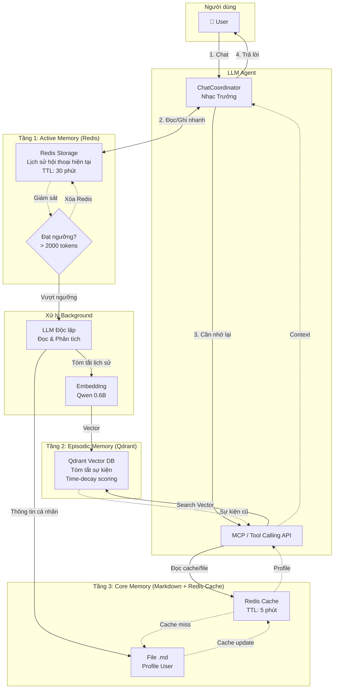
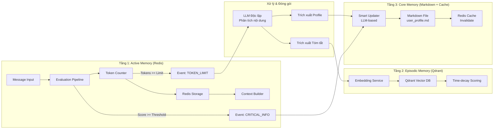
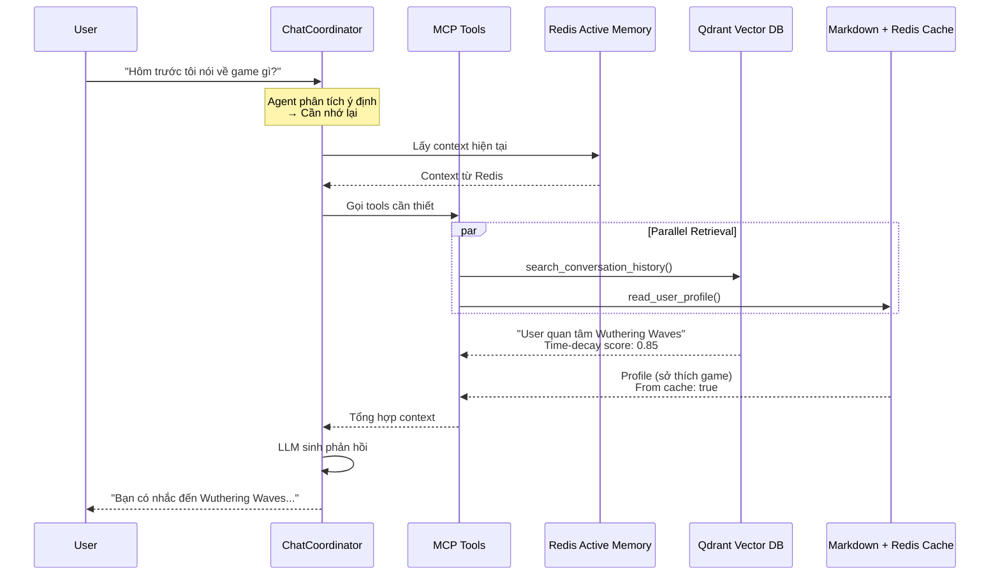
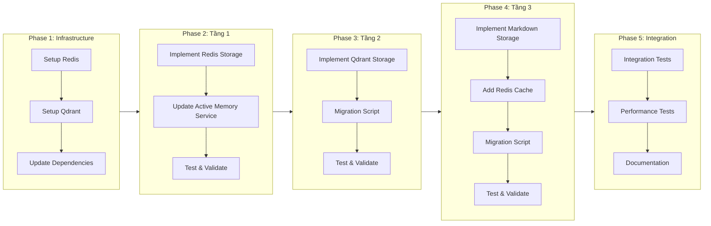

# Kế hoạch Cập nhật Hệ thống Trí nhớ 3 Tầng (Three-Tier Memory System Update)

## Tổng quan

Tài liệu này mô tả kế hoạch cập nhật hệ thống bộ nhớ cho Discord bot, bao gồm việc migration từ RAM/Local Vector DB sang Redis/Qdrant để tối ưu hóa việc lưu trữ và truy xuất thông tin.

### Nguyên lý cốt lõi

1. **Phân tách rõ ràng 2 loại trí nhớ:**
   - **Trí nhớ sự kiện (Episodic Memory):** Lịch sử cuộc trò chuyện → Tóm tắt → Embedding → Vector DB (Qdrant)
   - **Trí nhớ cốt lõi (Core Memory):** Thông tin cá nhân user → File Markdown (.md) → MCP Tool

2. **Lợi ích của thiết kế này:**
   - Giảm nhiễu thông tin (Noise Reduction)
   - Tối ưu Vector Search với mật độ ngữ nghĩa cao
   - Thông tin cá nhân luôn chính xác 100% (deterministic)
   - Dễ dàng quản lý bởi con người (Human-in-the-loop)

---

## 📋 Checklist Triển khai

### Tầng 1: Active Memory (Redis Migration)
- [ ] Tạo file `redis_storage.py` implement `BaseStorage` interface
- [ ] Implement Redis connection pool và configuration
- [ ] Implement các methods: `add_entry()`, `get_entries()`, `clear()`, `get_token_count()`
- [ ] Implement TTL auto-expiration cho session timeout
- [ ] Cập nhật `settings.py` với Redis configuration
- [ ] Cập nhật `dependencies.py` để inject Redis storage
- [ ] Thêm `REDIS_URL` vào `.env.example`
- [ ] Viết unit tests cho Redis storage
- [ ] Update documentation

### Tầng 2: Episodic Memory (Qdrant Migration)
- [ ] Tạo file `qdrant_vector_db.py` implement `BaseVectorDB` interface
- [ ] Design Qdrant collection schema với payload indexes
- [ ] Implement các methods: `add_record()`, `search_similar()`, `get_recent_records()`
- [ ] Implement time-decay scoring algorithm
- [ ] Implement metadata filtering (user_id, date range, topics)
- [ ] Tạo migration script từ Local Vector DB sang Qdrant
- [ ] Cập nhật `episodic_manager.py` để sử dụng Qdrant
- [ ] Cập nhật `vector_engine.py` cho Qdrant queries
- [ ] Thêm `QDRANT_URL` vào `.env.example`
- [ ] Viết unit tests cho Qdrant storage
- [ ] Update documentation

### Tầng 3: Core Memory (Markdown + Redis Cache)
- [ ] Tạo file `markdown_storage.py` implement `BaseCoreDB` interface
- [ ] Design Markdown file format với sections chuẩn
- [ ] Implement LLM-based update mechanism
- [ ] Tạo file `redis_cache.py` cho caching layer
- [ ] Implement read-through cache pattern
- [ ] Implement write-through cache invalidation
- [ ] Tạo migration script từ YAML sang Markdown
- [ ] Cập nhật `core_manager.py` để sử dụng Markdown storage
- [ ] Cập nhật `smart_updater.py` cho LLM-based updates
- [ ] Thêm `CORE_MEMORY_STORAGE_PATH` vào `.env.example`
- [ ] Viết unit tests cho Markdown storage
- [ ] Update documentation

### Infrastructure & DevOps
- [ ] Thêm Redis service vào `docker-compose.yml`
- [ ] Thêm Qdrant service vào `docker-compose.yml`
- [ ] Cấu hình volume persistence cho Redis
- [ ] Cấu hình volume persistence cho Qdrant
- [ ] Setup health checks cho các services
- [ ] Update `requirements.txt` với các dependencies mới
- [ ] Tạo backup/restore scripts

### Testing & Validation
- [ ] Integration tests cho 3-tier memory flow
- [ ] Performance benchmarks (Redis vs RAM, Qdrant vs Local)
- [ ] Load testing với concurrent users
- [ ] Data integrity validation sau migration
- [ ] Rollback plan testing

---

## 📁 Chi tiết Kế hoạch từng Tầng

### Tầng 1: Active Memory - Migration từ RAM sang Redis

📄 **File kế hoạch chi tiết:** [`t1_update_memory.md`](t1_update_memory.md)

**Tóm tắt thay đổi:**
- Thay thế [`ram_storage.py`](src/services/memories/activate_memory/storage/ram_storage.py) bằng `redis_storage.py`
- Hỗ trợ persistence và distributed deployment
- Native TTL cho session timeout
- Key pattern: `active_memory:{user_id}`

**Files cần thay đổi:**
| File | Hành động |
|------|-----------|
| `src/services/memories/activate_memory/storage/redis_storage.py` | Tạo mới |
| `src/config/settings.py` | Cập nhật |
| `src/services/dependencies.py` | Cập nhật |
| `.env.example` | Cập nhật |

---

### Tầng 2: Episodic Memory - Migration sang Qdrant

📄 **File kế hoạch chi tiết:** [`t2_update_memory.md`](t2_update_memory.md)

**Tóm tắt thay đổi:**
- Thay thế [`local_vector_db.py`](src/services/memories/episodic_memory/storage/local_vector_db.py) bằng `qdrant_vector_db.py`
- Hỗ trợ distributed vector search
- Rich metadata filtering
- Time-decay scoring

**Files cần thay đổi:**
| File | Hành động |
|------|-----------|
| `src/services/memories/episodic_memory/storage/qdrant_vector_db.py` | Tạo mới |
| `src/services/memories/episodic_memory/episodic_manager.py` | Cập nhật |
| `src/services/memories/episodic_memory/extraction/retrieval/vector_engine.py` | Cập nhật |
| `src/config/settings.py` | Cập nhật |
| `.env.example` | Cập nhật |

---

### Tầng 3: Core Memory - Migration sang Markdown + Redis Cache

📄 **File kế hoạch chi tiết:** [`t3_update_memory.md`](t3_update_memory.md)

**Tóm tắt thay đổi:**
- Thay thế [`local_yaml_db.py`](src/services/memories/core_memory/storage/local_yaml_db.py) bằng `markdown_storage.py`
- Thêm Redis caching layer cho read operations
- LLM-based update thay vì parse phức tạp
- Human-readable format

**Files cần thay đổi:**
| File | Hành động |
|------|-----------|
| `src/services/memories/core_memory/storage/markdown_storage.py` | Tạo mới |
| `src/services/memories/core_memory/redis_cache.py` | Tạo mới |
| `src/services/memories/core_memory/core_manager.py` | Cập nhật |
| `src/services/memories/core_memory/smart_updater.py` | Cập nhật |
| `src/config/settings.py` | Cập nhật |
| `.env.example` | Cập nhật |

---

## Sơ đồ Kiến trúc Mới



---

## Sơ đồ Luồng Đóng gói Ký ức (Updated)



---

## Sơ đồ Luồng Truy xuất (Retrieval - Updated)



---

## Dependencies Cần thêm

### requirements.txt
```txt
# Redis
redis>=5.0.0

# Qdrant
qdrant-client>=1.7.0

# Markdown processing
markdown-it-py>=3.0.0
```

### docker-compose.yml
```yaml
services:
  redis:
    image: redis:7-alpine
    ports:
      - "6379:6379"
    volumes:
      - redis_data:/data
    command: redis-server --appendonly yes
    healthcheck:
      test: ["CMD", "redis-cli", "ping"]
      interval: 5s
      timeout: 3s
      retries: 5

  qdrant:
    image: qdrant/qdrant:latest
    ports:
      - "6333:6333"
      - "6334:6334"
    volumes:
      - qdrant_data:/qdrant/storage
    healthcheck:
      test: ["CMD", "curl", "-f", "http://localhost:6333/health"]
      interval: 30s
      timeout: 10s
      retries: 5

volumes:
  redis_data:
  qdrant_data:
```

### .env.example
```env
# Redis Configuration
REDIS_URL=redis://localhost:6379/0
REDIS_KEY_PREFIX=discord_bot
SESSION_INACTIVE_TIMEOUT=1800

# Qdrant Configuration
QDRANT_URL=http://localhost:6333
QDRANT_COLLECTION_NAME=episodic_memory
QDRANT_VECTOR_SIZE=768

# Core Memory Configuration
CORE_MEMORY_STORAGE_PATH=./data/memories/core_profiles
CORE_MEMORY_CACHE_TTL=300
```

---

## Thứ tự Triển khai



---

## Kết luận

Kiến trúc cập nhật này giải quyết được các vấn đề:

1. **Persistence:** Redis và Qdrant đảm bảo dữ liệu không mất khi restart
2. **Scalability:** Hỗ trợ distributed deployment với nhiều bot instances
3. **Performance:** Redis cache cho read-heavy operations, Qdrant cho fast vector search
4. **Maintainability:** Markdown files dễ đọc và chỉnh sửa bởi con người
5. **Cost-efficient:** TTL auto-expiration giảm chi phí storage

Đây là hướng đi đúng đắn, phù hợp với các framework hiện đại như Mem0, LangGraph.