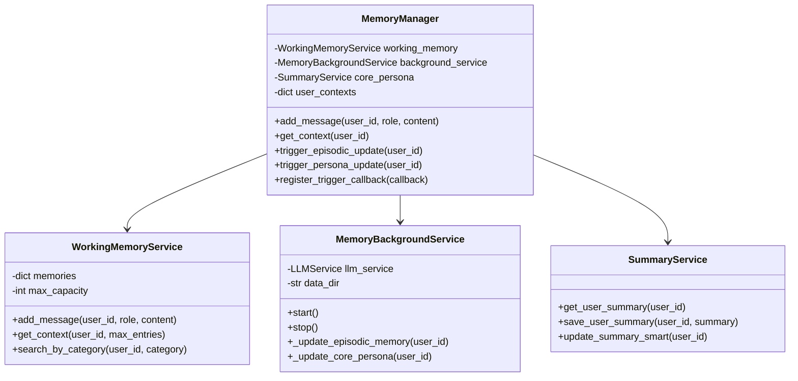

# Kế hoạch thiết kế lớp MemoryManager

## Tổng quan

Lớp MemoryManager sẽ là trung tâm điều phối cho cả 3 tầng bộ nhớ:
- Working Memory (Tầng 1 - Ngắn hạn)
- Episodic Memory (Tầng 2 - Nhật ký)
- Core Persona (Tầng 3 - Hồ sơ cốt lõi)

## Mục tiêu thiết kế

1. **Tập trung hóa quản lý**: Một điểm duy nhất để truy cập và quản lý cả 3 tầng bộ nhớ
2. **Tích hợp liền mạch**: Kết nối các tầng bộ nhớ với nhau một cách logic
3. **Tối ưu hiệu suất**: Giảm thiểu số lần truy cập file và tăng tốc độ truy vấn
4. **Hỗ trợ trigger system**: Tích hợp cơ chế kích hoạt các hành động giữa các tầng

## Kiến trúc lớp MemoryManager



## Triển khai chi tiết

### Tệp: `src/services/memory_manager.py`

```python
import logging
from typing import Dict, List, Optional, Callable
from datetime import datetime
import asyncio

from services.working_memory_service import WorkingMemoryService
from services.memory_background_service import MemoryBackgroundService
from services.summary_service import SummaryService

logger = logging.getLogger(__name__)

class MemoryManager:
    """
    Lớp quản lý tập trung cho cả 3 tầng bộ nhớ:
    - Working Memory (Tầng 1 - Ngắn hạn)
    - Episodic Memory (Tầng 2 - Nhật ký)
    - Core Persona (Tầng 3 - Hồ sơ cốt lõi)
    """
    
    def __init__(self, llm_service, data_dir: str):
        self.llm_service = llm_service
        self.data_dir = data_dir
        
        # Khởi tạo các tầng bộ nhớ
        self.working_memory = WorkingMemoryService(max_capacity=20, trigger_threshold=20)
        self.background_service = MemoryBackgroundService(llm_service, data_dir)
        self.core_persona = SummaryService(llm_service, 
                                         data_dir=data_dir,
                                         prompts_dir=f"{data_dir}/prompts",
                                         config_dir=f"{data_dir}/config")
        
        # Context cho từng người dùng
        self.user_contexts: Dict[str, Dict] = {}
        
        # Callback cho các trigger
        self.trigger_callbacks: List[Callable] = []
        
        # Đăng ký callback cho working memory
        self.working_memory.register_trigger_callback(self._on_working_memory_trigger)
        
        logger.info("🧠 MemoryManager initialized with 3 memory tiers")
    
    def initialize_user_context(self, user_id: str):
        """Khởi tạo context cho người dùng mới"""
        if user_id not in self.user_contexts:
            self.user_contexts[user_id] = {
                "last_activity": datetime.now(),
                "session_start": datetime.now(),
                "message_count": 0,
                "needs_persona_update": False,
                "last_episodic_update": None,
                "last_persona_update": None
            }
    
    def add_message(self, user_id: str, role: str, content: str):
        """
        Thêm tin nhắn vào hệ thống bộ nhớ
        """
        # Khởi tạo context nếu chưa có
        self.initialize_user_context(user_id)
        
        # Cập nhật thông tin context
        self.user_contexts[user_id]["last_activity"] = datetime.now()
        self.user_contexts[user_id]["message_count"] += 1
        
        # Thêm vào working memory
        entry = self.working_memory.add_message(user_id, role, content)
        
        # Ghi nhận hoạt động cho background service
        self.background_service.record_user_activity(user_id)
        
        logger.debug(f"🧠 Added message to memory for {user_id}: {content[:50]}...")
    
    def get_context(self, user_id: str) -> Dict:
        """
        Lấy toàn bộ context cho người dùng bao gồm cả 3 tầng bộ nhớ
        """
        # Lấy thông tin từ working memory
        working_context = self.working_memory.get_context(user_id, max_entries=5)
        
        # Lấy thông tin từ core persona
        core_summary = self.core_persona.get_user_summary(user_id)
        
        # Tạo context tổng hợp
        context = {
            "working_memory": [
                {
                    "role": entry.role,
                    "content": entry.content,
                    "importance": entry.importance_score,
                    "category": entry.category.value,
                    "timestamp": entry.timestamp.isoformat()
                } for entry in working_context
            ],
            "core_persona": core_summary,
            "user_stats": self.working_memory.get_statistics(user_id),
            "session_info": self.user_contexts.get(user_id, {})
        }
        
        return context
    
    def get_working_memory_context(self, user_id: str, max_entries: int = 5) -> List[Dict]:
        """
        Lấy context từ working memory
        """
        entries = self.working_memory.get_context(user_id, max_entries)
        return [
            {
                "role": entry.role,
                "content": entry.content,
                "importance": entry.importance_score,
                "category": entry.category.value
            } for entry in entries
        ]
    
    def get_core_persona(self, user_id: str) -> str:
        """
        Lấy core persona của người dùng
        """
        return self.core_persona.get_user_summary(user_id)
    
    def get_episodic_memory(self, user_id: str, limit: int = 10) -> List[Dict]:
        """
        Lấy episodic memory của người dùng
        """
        # Đọc từ file episodic memory
        import os
        import json
        
        episodic_file = os.path.join(self.data_dir, "user_summaries", f"{user_id}_episodic.json")
        
        if not os.path.exists(episodic_file):
            return []
        
        try:
            with open(episodic_file, 'r', encoding='utf-8') as f:
                events = json.load(f)
                # Trả về các sự kiện gần nhất
                return events[-limit:] if len(events) > limit else events
        except Exception as e:
            logger.error(f"Error loading episodic memory for {user_id}: {e}")
            return []
    
    def trigger_episodic_update(self, user_id: str):
        """
        Kích hoạt cập nhật episodic memory cho người dùng
        """
        logger.info(f"🔄 Triggering episodic memory update for {user_id}")
        
        # Gọi trực tiếp phương thức cập nhật từ background service
        asyncio.create_task(self.background_service._update_episodic_memory(user_id))
    
    def trigger_persona_update(self, user_id: str):
        """
        Kích hoạt cập nhật core persona cho người dùng
        """
        logger.info(f"🔄 Triggering core persona update for {user_id}")
        
        # Gọi trực tiếp phương thức cập nhật từ background service
        asyncio.create_task(self.background_service._update_core_persona(user_id))
    
    def _on_working_memory_trigger(self, trigger_type: str, user_id: str, data: any):
        """
        Xử lý các trigger từ working memory
        """
        logger.info(f"🔔 Working memory trigger: {trigger_type} for {user_id} with data: {data}")
        
        if trigger_type == "MESSAGE_THRESHOLD_REACHED":
            # Kích hoạt cập nhật episodic memory khi đạt ngưỡng tin nhắn
            self.trigger_episodic_update(user_id)
    
    def register_trigger_callback(self, callback: Callable):
        """
        Đăng ký callback cho các trigger
        """
        self.trigger_callbacks.append(callback)
    
    def start_background_services(self):
        """
        Khởi động các dịch vụ nền
        """
        self.background_service.start()
        logger.info("🔄 Background services started")
    
    def stop_background_services(self):
        """
        Dừng các dịch vụ nền
        """
        self.background_service.stop()
        logger.info("🔄 Background services stopped")
    
    def get_memory_status(self, user_id: str) -> Dict:
        """
        Lấy trạng thái tổng quát của bộ nhớ cho người dùng
        """
        working_stats = self.working_memory.get_statistics(user_id)
        
        # Kiểm tra sự tồn tại của các file bộ nhớ
        import os
        user_summary_path = os.path.join(self.data_dir, "user_summaries", f"{user_id}_summary.txt")
        user_history_path = os.path.join(self.data_dir, "user_summaries", f"{user_id}_history.json")
        user_episodic_path = os.path.join(self.data_dir, "user_summaries", f"{user_id}_episodic.json")
        
        return {
            "working_memory": working_stats,
            "core_persona_exists": os.path.exists(user_summary_path),
            "episodic_memory_exists": os.path.exists(user_episodic_path),
            "history_exists": os.path.exists(user_history_path),
            "session_info": self.user_contexts.get(user_id, {}),
            "last_activity": self.user_contexts.get(user_id, {}).get("last_activity", None)
        }
    
    def reset_user_memory(self, user_id: str):
        """
        Đặt lại bộ nhớ cho người dùng
        """
        # Xóa khỏi working memory
        self.working_memory.clear_memory(user_id)
        
        # Xóa context người dùng
        if user_id in self.user_contexts:
            del self.user_contexts[user_id]
        
        # Xóa các file bộ nhớ
        import os
        user_summary_path = os.path.join(self.data_dir, "user_summaries", f"{user_id}_summary.txt")
        user_history_path = os.path.join(self.data_dir, "user_summaries", f"{user_id}_history.json")
        user_episodic_path = os.path.join(self.data_dir, "user_summaries", f"{user_id}_episodic.json")
        
        for path in [user_summary_path, user_history_path, user_episodic_path]:
            if os.path.exists(path):
                try:
                    os.remove(path)
                    logger.info(f"🗑️ Removed memory file: {path}")
                except Exception as e:
                    logger.error(f"Error removing memory file {path}: {e}")
    
    async def force_update_all_memories(self, user_id: str):
        """
        Buộc cập nhật tất cả các tầng bộ nhớ
        """
        logger.info(f"🔄 Force updating all memories for {user_id}")
        
        # Cập nhật episodic memory
        await self.background_service._update_episodic_memory(user_id)
        
        # Cập nhật core persona
        await self.background_service._update_core_persona(user_id)
        
        logger.info(f"✅ All memories updated for {user_id}")
    
    def search_memory(self, user_id: str, query: str) -> Dict:
        """
        Tìm kiếm trong tất cả các tầng bộ nhớ
        """
        results = {}
        
        # Tìm trong working memory
        keywords = [query.lower()]  # Đơn giản hóa: chỉ tìm theo từ khóa
        working_results = self.working_memory.search_by_keywords(user_id, keywords, limit=5)
        results["working_memory"] = [
            {
                "content": entry.content,
                "role": entry.role,
                "importance": entry.importance_score,
                "category": entry.category.value,
                "timestamp": entry.timestamp.isoformat()
            } for entry in working_results
        ]
        
        # Tìm trong episodic memory
        episodic_memory = self.get_episodic_memory(user_id, limit=20)
        query_lower = query.lower()
        episodic_results = [
            event for event in episodic_memory
            if query_lower in event.get("summary", "").lower() or 
               query_lower in event.get("details", "").lower()
        ][:5]
        results["episodic_memory"] = episodic_results
        
        # Trong core persona, tìm kiếm đơn giản trong nội dung
        core_persona = self.get_core_persona(user_id)
        if query_lower in core_persona.lower():
            results["core_persona"] = {
                "found": True,
                "preview": core_persona[:200] + "..." if len(core_persona) > 200 else core_persona
            }
        else:
            results["core_persona"] = {"found": False}
        
        return results
```

## Tích hợp với hệ thống hiện tại

### 1. Cập nhật LLMMessageCog

Thay thế việc sử dụng trực tiếp các dịch vụ riêng lẻ bằng MemoryManager:

```python
# Thay vì:
# self.conversation_manager
# self.summary_service
# self.relationship_service

# Sử dụng:
self.memory_manager = MemoryManager(llm_service, data_dir)
```

### 2. Cập nhật luồng xử lý tin nhắn

```python
# Trong _handle_message:
async def _handle_message(self, message):
    # ...
    user_id = str(message.author.id)
    
    # Thêm tin nhắn vào hệ thống bộ nhớ
    self.memory_manager.add_message(user_id, "user", content)
    
    # Lấy context tổng hợp
    context = self.memory_manager.get_context(user_id)
    
    # Sử dụng context cho LLM
    # ...
```

## Lợi ích của MemoryManager

1. **Tập trung hóa**: Một điểm duy nhất để quản lý cả 3 tầng bộ nhớ
2. **Tích hợp liền mạch**: Các tầng bộ nhớ có thể tương tác với nhau dễ dàng
3. **Dễ bảo trì**: Thay đổi trong một tầng không ảnh hưởng đến các thành phần khác
4. **Hiệu suất**: Giảm số lần truy cập file và tăng tốc độ truy vấn
5. **Mở rộng**: Dễ dàng thêm các tầng bộ nhớ mới trong tương lai

## Các điểm cần lưu ý khi triển khai

1. **Thread safety**: Cần đảm bảo an toàn khi truy cập đa luồng
2. **Hiệu suất**: Không làm chậm luồng xử lý chính của bot
3. **Tương thích ngược**: Đảm bảo API mới tương thích với các thành phần hiện tại
4. **Xử lý lỗi**: Có cơ chế fallback khi một tầng bộ nhớ gặp sự cố