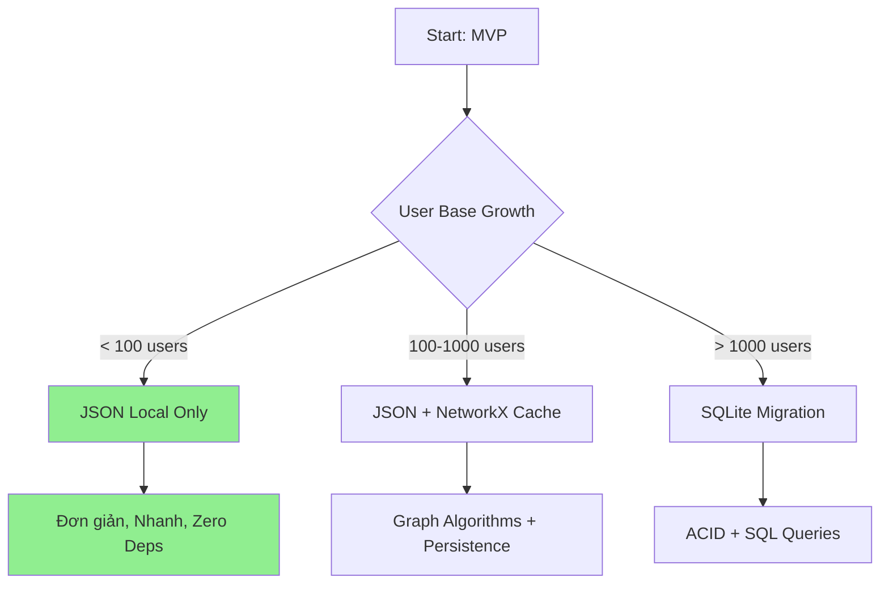
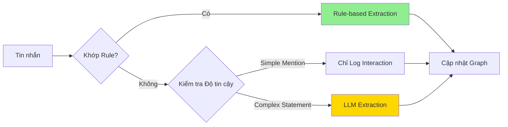
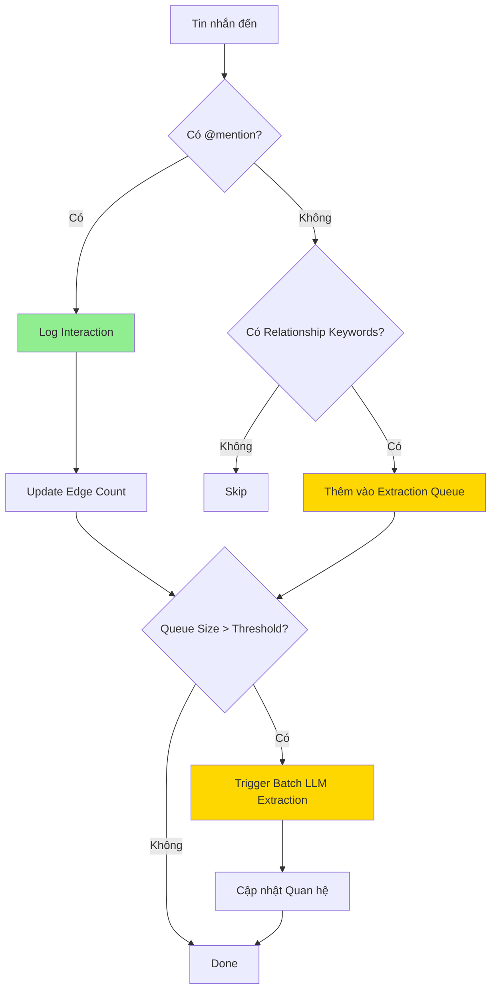
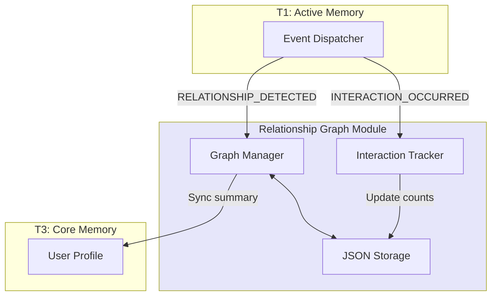
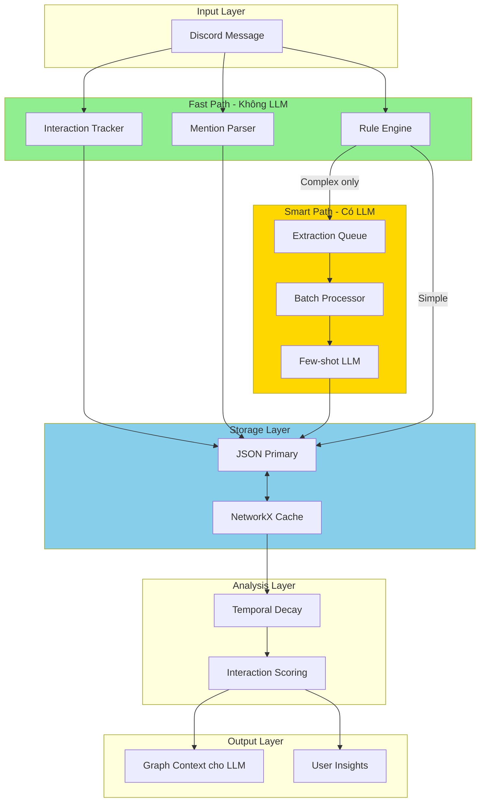

# 📊 Báo cáo Nghiên cứu: Các Phương án Thay thế cho Hệ thống Relationship Graph

## 🎯 Tóm tắt Điều hành

Dựa trên phân tích tài liệu thiết kế `relationship_graph_design.md` và codebase hiện tại (Memory 3 tầng), đây là đánh giá chi tiết các phương án thay thế cho từng thành phần.

---

## 1. Các Phương án Lưu trữ Đồ thị

### 1.1 Bảng So sánh

| Tiêu chí | JSON Local | NetworkX | Neo4j/ArangoDB | Vector DB + Metadata | SQLite + Extension |
|----------|------------|----------|-----------------|---------------------|-------------------|
| **Độ phức tạp** | ⭐ Rất thấp | ⭐⭐ Thấp | ⭐⭐⭐⭐⭐ Cao | ⭐⭐⭐ Trung bình | ⭐⭐ Thấp |
| **Khả năng truy vấn** | ⭐ Cơ bản | ⭐⭐⭐ Tốt | ⭐⭐⭐⭐⭐ Xuất sắc | ⭐⭐⭐ Tốt | ⭐⭐⭐ Tốt |
| **Hiệu năng (Quy mô)** | ⭐⭐ Vừa-nhỏ | ⭐⭐ Chỉ RAM | ⭐⭐⭐⭐⭐ Doanh nghiệp | ⭐⭐⭐⭐ Tốt | ⭐⭐⭐ Tốt |
| **Công sức tích hợp** | ⭐⭐⭐⭐⭐ Tối thiểu | ⭐⭐⭐⭐ Dễ | ⭐⭐ Phức tạp | ⭐⭐⭐ Trung bình | ⭐⭐⭐⭐ Dễ |
| **Phụ thuộc** | ✅ Không | `networkx` | External server | Tái dùng T2 | `sqlite3` built-in |
| **Thao tác đồ thị** | Lặp thủ công | Thuật toán native | Native + Cypher | Truy vấn metadata | SQL joins |
| **Lưu trữ bền vững** | ✅ Có | ❌ Chỉ RAM | ✅ Có | ✅ Có | ✅ Có |

### 1.2 Phân tích Chi tiết

#### **Phương án A: JSON Local (Thiết kế hiện tại)** ✅ Khuyến nghị cho MVP

**Ưu điểm:**
- Zero dependencies, phù hợp với pattern hiện tại của [`LocalCoreDB`](src/services/memories/core_memory/storage/local_json_db.py:14)
- Dễ debug, kiểm tra dữ liệu trực tiếp
- Nhất quán với pattern lưu trữ T3 Core Memory
- Khởi động tức thì, không cần dịch vụ bên ngoài

**Nhược điểm:**
- Truy vấn phức tạp phải lặp thủ công
- Không có thuật toán đồ thị built-in
- Scale kém với >1000 relationships/user
- Không có ACID transactions

**Kết luận:** **Lựa chọn tốt nhất cho MVP** - phù hợp với ràng buộc "Discord bot với traffic vừa phải"

#### **Phương án B: NetworkX (Đồ thị trong RAM)**

**Ưu điểm:**
- Thuật toán đồ thị phong phú: PageRank, phát hiện cộng đồng, đường đi ngắn nhất
- Python native, dễ tích hợp
- Hoàn hảo cho lớp caching trong RAM

**Nhược điểm:**
- **Chỉ trong RAM** - mất dữ liệu khi restart
- Cần lớp persistence riêng (kết hợp với JSON)
- Không scale được với đồ thị lớn

**Kết luận:** Tốt làm **lớp caching** kết hợp với JSON storage

#### **Phương án C: Neo4j / ArangoDB**

**Ưu điểm:**
- Graph database cấp doanh nghiệp
- Ngôn ngữ truy vấn Cypher/AQL mạnh mẽ
- Built-in PageRank, phát hiện cộng đồng, dự đoán liên kết
- ACID transactions

**Nhược điểm:**
- **Quá mức cho quy mô dự án** - Discord bot traffic vừa phải
- Yêu cầu server riêng (external infrastructure)
- Đường cong học tập dốc
- Độ phức tạp vận hành thêm
- Chi phí hosting

**Kết luận:** ❌ **Không khuyến nghị** - vi phạm nguyên tắc "Ưu tiên đơn giản hơn phức tạp"

#### **Phương án D: Vector DB với Graph Metadata**

**Ưu điểm:**
- Tái sử dụng hạ tầng [`LocalVectorDB`](src/services/memories/episodic_memory/storage/local_vector_db.py:16) hiện có
- Tìm kiếm ngữ nghĩa trên các facts về quan hệ
- Có thể lưu relationship embeddings cho similarity

**Nhược điểm:**
- Quan hệ đồ thị lưu dưới dạng metadata, không phải edges native
- Truy vấn cấu trúc đồ thị phức tạp
- Chồng chéo concerns với T2 Episodic Memory

**Kết luận:** Có thể dùng cho **tăng cường tìm kiếm** nhưng không phải lưu trữ đồ thị chính

#### **Phương án E: SQLite với Adjacency List**

**Ưu điểm:**
- Built-in Python, zero dependencies
- ACID transactions
- Khả năng truy vấn tốt với SQL JOINs
- Có thể triển khai graph traversals
- Nhất quán với pattern "local file storage"

**Nhược điểm:**
- Không có thuật toán đồ thị native
- Truy vấn đệ quy phức tạp (CTEs)
- Cần schema migration

**Kết luận:** **Lựa chọn trung gian** tốt giữa JSON và full graph DB

### 1.3 Khuyến nghị Lưu trữ



**Cách tiếp cận Khuyến nghị: Hybrid JSON + NetworkX Cache**
- Primary: JSON files (nhất quán với pattern T3)
- Cache: NetworkX in-memory graph cho thuật toán
- Đường migration: SQLite khi cần scale

---

## 2. Các Phương pháp Trích xuất Quan hệ

### 2.1 Bảng So sánh

| Phương pháp | Chi phí | Độ chính xác | Linh hoạt | Độ trễ | Độ phức tạp |
|-------------|---------|--------------|-----------|--------|-------------|
| **LLM-based** | 💸💸💸 Cao | ⭐⭐⭐⭐⭐ Tốt nhất | ⭐⭐⭐⭐⭐ Tốt nhất | ⚡⚡ Chậm | ⭐⭐⭐ Trung bình |
| **Rule-based + NER** | ✅ Miễn phí | ⭐⭐ Hạn chế | ⭐ Cứng nhắc | ⚡⚡⚡⚡⚡ Nhanh | ⭐⭐ Thấp |
| **Hybrid** | 💸💸 Trung bình | ⭐⭐⭐⭐ Tốt | ⭐⭐⭐⭐ Tốt | ⚡⚡⚡ Trung bình | ⭐⭐⭐⭐ Cao hơn |
| **Fine-tuned Model** | 💸💸 Ban đầu | ⭐⭐⭐⭐ Tốt | ⭐⭐⭐ Trung bình | ⚡⚡⚡⚡ Nhanh | ⭐⭐⭐⭐⭐ Cao nhất |
| **Few-shot Structured** | 💸💸 Trung bình | ⭐⭐⭐⭐ Tốt | ⭐⭐⭐⭐⭐ Tốt nhất | ⚡⚡⚡ Trung bình | ⭐⭐ Thấp |

### 2.2 Phân tích Chi tiết

#### **Phương án A: LLM-based (Thiết kế hiện tại)**

**Ưu điểm:**
- Linh hoạt tối đa - trích xuất mọi loại quan hệ
- Hiểu ngữ cảnh, sắc thái, tiếng Việt
- Có thể trích xuất nhiều quan hệ từ một tin nhắn
- Đã có LLM integration trong codebase

**Nhược điểm:**
- **Chi phí đáng kể** - mỗi lần extraction tốn tokens
- Độ trễ cộng dồn (500ms-2s mỗi lần gọi)
- Output format không nhất quán cần validation
- Quá mức cho simple mentions

**Ước tính Chi phí:**
```
Per extraction: ~500-1000 tokens input + 200-500 tokens output
Tại $0.002/1K tokens: ~$0.002-0.003 mỗi tin nhắn
1000 users × 50 tin nhắn/ngày = $100-150/tháng
```

#### **Phương án B: Rule-based + NER**

**Ưu điểm:**
- Zero chi phí LLM
- Độ trễ mili-giây
- Output nhất quán, dự đoán được
- Tốt cho các pattern có cấu trúc: "@mentions", "bạn [tên]", "crush [tên]"

**Nhược điểm:**
- Không trích xuất được quan hệ ngầm
- Thư viện Vietnamese NER hạn chế
- Nhiều false positives/negatives
- Không có phân tích sentiment

**Các Rule Mẫu:**
```python
RELATIONSHIP_PATTERNS = {
    "family": [r"anh (?:tui|tao|minh) (.+)", r"chị (?:tui|tao|minh) (.+)"],
    "friend": [r"bạn (?:tui|tao|minh) (.+)", r"(?:thằng|con) (.+) bạn tao"],
    "romantic": [r"crush (.+)", r"người yêu (.+)", r"bồ (.+)"],
}

# Simple sentiment với emoji + keywords
SENTIMENT_KEYWORDS = {
    "positive": ["thích", "yêu", "ghê", "ngon", "đẹp"],
    "negative": ["ghét", "ngáo", "dở", "tệ"],
}
```

#### **Phương án C: Hybrid (Khuyến nghị)** ⭐

**Chiến lược:**
1. **Fast path**: Rule-based cho các trường hợp đơn giản
   - Discord @mentions → auto-log interaction
   - Simple patterns ("bạn [tên]", "crush [tên]")
   
2. **Smart path**: LLM cho các trường hợp phức tạp
   - Quan hệ mơ hồ
   - Phân tích sentiment
   - Trích xuất multi-relationship



**Tiết kiệm Chi phí:** ~60-70% giảm LLM calls

#### **Phương án D: Fine-tuned Model**

**Ưu điểm:**
- Độ chính xác tốt hơn general LLM cho domain cụ thể
- Chi phí inference thấp hơn mỗi lần gọi
- Nhanh hơn general LLM

**Nhược điểm:**
- **Đầu tư ban đầu cao** - training data, compute
- Cần fine-tuning liên tục
- Model drift theo thời gian
- **Không đáng cho bot traffic vừa phải**

#### **Phương án E: Few-shot Structured Output**

**Ưu điểm:**
- Tận dụng LLM hiện có với prompting tốt hơn
- Structured output (JSON schema) đảm bảo tính nhất quán
- Few-shot examples cải thiện độ chính xác
- Không cần hạ tầng thêm

**Nhược điểm:**
- Vẫn sử dụng LLM tokens
- Cần prompt engineering cẩn thận

### 2.3 Khuyến nghị Trích xuất

**Khuyến nghị: Hybrid Rule + Few-shot LLM**

```python
class RelationshipExtractor:
    def __init__(self):
        self.rule_engine = RuleEngine()  # Simple patterns
        self.llm = LLMService()         # For complex cases
        
    async def extract(self, content: str, context: dict) -> List[Relationship]:
        # Bước 1: Fast rule check
        rule_matches = self.rule_engine.extract(content)
        if rule_matches and rule_matches.confidence > 0.8:
            return rule_matches.relationships
        
        # Bước 2: Kiểm tra có đáng gọi LLM không
        if not self._has_relationship_indicators(content):
            return []  # Skip LLM entirely
        
        # Bước 3: LLM extraction với few-shot
        return await self.llm.extract_structured(content, FEW_SHOT_PROMPTS)
```

---

## 3. Các Chiến lược Cập nhật Đồ thị

### 3.1 Bảng So sánh

| Chiến lược | Độ trễ | Tính nhất quán | Chi phí LLM | Độ phức tạp | Trải nghiệm User |
|------------|--------|----------------|-------------|-------------|------------------|
| **Real-time** | ⚡⚡⚡⚡⚡ Tức thì | ⭐⭐⭐⭐⭐ Tốt nhất | 💸💸💸 Cao | ⭐⭐⭐ Trung bình | ⭐⭐⭐⭐⭐ Tốt nhất |
| **Batch Processing** | ⚡ Chậm | ⭐⭐⭐ Trung bình | 💸 Thấp | ⭐⭐⭐⭐ Cao hơn | ⭐⭐ Laggy |
| **Hybrid** | ⚡⚡⚡⚡ Nhanh | ⭐⭐⭐⭐ Tốt | 💸💸 Trung bình | ⭐⭐⭐⭐ Cao hơn | ⭐⭐⭐⭐ Tốt |
| **Event Sourcing** | ⚡⚡⚡⚡ Nhanh | ⭐⭐⭐⭐⭐ Tốt nhất | 💸 Biến thiên | ⭐⭐⭐⭐⭐ Cao nhất | ⭐⭐⭐ Trung bình |

### 3.2 Phân tích Chi tiết

#### **Phương án A: Real-time (Thiết kế hiện tại)**

**Luồng:**
```
Message → Event Emitted → LLM Extract → Update Graph → Done
```

**Ưu điểm:**
- Cập nhật quan hệ tức thì
- User thấy thay đổi ngay lập tức
- Mental model đơn giản

**Nhược điểm:**
- **Mỗi tin nhắn trigger LLM** → chi phí cao
- Thêm độ trễ vào xử lý tin nhắn
- Có thể quá tải hệ thống khi traffic cao

#### **Phương án B: Batch Processing**

**Luồng:**
```
Messages → Queue → Batch (mỗi 5 phút) → Process → Update
```

**Ưu điểm:**
- LLM batching hiệu quả
- Chi phí extraction thấp hơn
- System load dự đoán được

**Nhược điểm:**
- Quan hệ cũ giữa các batch
- Quản lý queue phức tạp
- UX kém - quan hệ không được phản ánh ngay

#### **Phương án C: Hybrid (Khuyến nghị)** ⭐

**Chiến lược:**
1. **Immediate Updates** (không LLM):
   - @mentions → log interaction
   - Replies → tăng count
   - Reactions → cập nhật sentiment nhanh

2. **Deferred Extraction** (với LLM):
   - Queue tin nhắn có relationship indicators
   - Batch process mỗi N tin nhắn hoặc T giây
   - Cost-efficient trong khi vẫn duy trì độ mới



#### **Phương án D: Event Sourcing**

**Ưu điểm:**
- Audit trail đầy đủ
- Có thể rebuild graph từ events
- Temporal queries khả thi

**Nhược điểm:**
- Tăng trưởng storage đáng kể
- Event schema phức tạp
- Thời gian rebuild tăng theo history

### 3.3 Khuyến nghị Chiến lược Update

**Khuyến nghị: Hybrid Immediate + Deferred**

```python
# Pseudo-code
class RelationshipUpdateStrategy:
    BATCH_SIZE = 10  # tin nhắn
    BATCH_TIMEOUT = 60  # giây
    
    async def on_message(self, message):
        # Luôn: Fast path
        mentions = self.parse_mentions(message)
        for target_id in mentions:
            await self.interaction_tracker.log(
                source=message.author_id,
                target=target_id,
                type="mention"
            )
        
        # Có điều kiện: Queue cho LLM
        if self.has_relationship_content(message):
            await self.extraction_queue.add(message)
            
            if self.extraction_queue.size >= BATCH_SIZE:
                await self.process_batch()
```

---

## 4. Các Thuật toán Phân tích Mạng xã hội

### 4.1 Thuật toán Áp dụng được

| Thuật toán | Trường hợp Sử dụng | Giá trị | Công sức Triển khai |
|------------|---------------------|---------|---------------------|
| **PageRank** | Xác định quan hệ quan trọng nhất | ⭐⭐⭐⭐ Cao | ⭐⭐ Dễ với NetworkX |
| **Community Detection** | Nhóm bạn bè, gia đình, đồng nghiệp | ⭐⭐⭐ Trung bình | ⭐⭐ Dễ với NetworkX |
| **Link Prediction** | Dự đoán quan hệ tương lai | ⭐⭐ Thấp | ⭐⭐⭐ Trung bình |
| **Sentiment Propagation** | Lan truyền sentiment qua mạng | ⭐⭐⭐ Trung bình | ⭐⭐⭐⭐ Custom |
| **Temporal Decay** | Sức mạnh quan hệ theo thời gian | ⭐⭐⭐⭐⭐ Quan trọng | ⭐ Dễ |

### 4.2 Các Thuật toán Khuyến nghị

#### **Must Have: Temporal Decay**

```python
def calculate_effective_intimacy(edge: RelationshipEdge) -> float:
    """
    Intimacy suy giảm theo thời gian không tương tác.
    """
    days_since_interaction = (datetime.now() - edge.last_interaction_at).days
    
    # Exponential decay với half-life 30 ngày
    decay = math.exp(-0.023 * days_since_interaction)  # ~0.5 sau 30 ngày
    
    return edge.intimacy_score * decay * edge.confidence
```

#### **Should Have: Interaction Scoring**

```python
def calculate_intimacy_score(interactions: List[Interaction]) -> float:
    """
    Điểm dựa trên pattern tương tác.
    """
    score = 0.0
    
    for interaction in interactions:
        weight = {
            "mention": 0.1,
            "reply": 0.15,
            "reaction": 0.05,
            "dm": 0.2,
        }.get(interaction.type, 0.05)
        
        # Áp dụng temporal decay
        age_days = (datetime.now() - interaction.timestamp).days
        decay = math.exp(-0.01 * age_days)
        
        score += weight * decay
    
    return min(score, 1.0)  # Cap at 1.0
```

#### **Nice to Have: Community Detection**

```python
# Sử dụng NetworkX
import networkx as nx

def detect_communities(graph: nx.DiGraph) -> Dict[str, List[str]]:
    """
    Nhóm những người có quan hệ lại với nhau.
    """
    # Convert sang undirected cho community detection
    undirected = graph.to_undirected()
    
    # Louvain community detection
    communities = nx.community.louvain_communities(undirected)
    
    return {
        f"community_{i}": list(members) 
        for i, members in enumerate(communities)
    }
```

---

## 5. Các Pattern Tích hợp Memory

### 5.1 Bảng So sánh

| Pattern | Tách biệt | Tái sử dụng | Độ phức tạp | Trùng lặp Dữ liệu |
|---------|-----------|-------------|-------------|-------------------|
| **Separate Module** | ⭐⭐⭐⭐⭐ Tốt nhất | ⭐⭐⭐⭐ Tốt | ⭐⭐ Thấp | ⭐⭐⭐ Trung bình |
| **Embedded in Core Memory** | ⭐ Kém | ⭐⭐ Hạn chế | ⭐⭐⭐ Trung bình | ⭐⭐⭐⭐ Thấp |
| **Hybrid** | ⭐⭐⭐⭐ Tốt | ⭐⭐⭐⭐⭐ Tốt nhất | ⭐⭐⭐⭐ Cao hơn | ⭐⭐ Cao hơn |
| **Event-Sourced** | ⭐⭐⭐⭐⭐ Tốt nhất | ⭐⭐⭐⭐⭐ Tốt nhất | ⭐⭐⭐⭐⭐ Cao nhất | ✅ Không |

### 5.2 Khuyến nghị: Hybrid Pattern

**Kiến trúc:**



**Các Điểm Tích hợp:**

1. **Event-driven** với [`EventDispatcher`](src/services/memories/activate_memory/events/event_dispatcher.py:19) hiện có
2. **Metadata sync** đến [`UserProfile.relationships`](src/services/memories/core_memory/models.py:17) trong T3
3. **Standalone storage** như một module riêng

**Lý do:**
- T3 vẫn có summary của relationships (backward compatible)
- Graph module có full graph data và algorithms
- Loose coupling qua events
- Có thể phát triển độc lập

---

## 6. Các Khuyến nghị Cuối cùng

### 6.1 Kiến trúc Khuyến nghị



### 6.2 Độ ưu tiên Triển khai

| Giai đoạn | Thành phần | Độ ưu tiên | Công sức |
|-----------|------------|------------|----------|
| **P1** | JSON Storage + Models | 🔴 Quan trọng | Thấp |
| **P1** | Rule-based Extraction | 🔴 Quan trọng | Thấp |
| **P1** | Interaction Tracking | 🔴 Quan trọng | Thấp |
| **P2** | LLM Extraction (Hybrid) | 🟠 Cao | Trung bình |
| **P2** | Event Integration | 🟠 Cao | Trung bình |
| **P3** | NetworkX Cache + Algorithms | 🟡 Trung bình | Trung bình |
| **P3** | Temporal Decay | 🟡 Trung bình | Thấp |
| **P4** | Community Detection | 🟢 Thấp | Trung bình |

### 6.3 Giảm thiểu Rủi ro

| Rủi ro | Biện pháp Giảm thiểu |
|--------|---------------------|
| **Bùng nổ Chi phí LLM** | Hybrid extraction với rules cho simple cases |
| **Quan hệ Lỗi thời** | Temporal decay + periodic cleanup |
| **Tăng trưởng Storage** | Chiến lược JSON pruning + archive old interactions |
| **Extraction Không nhất quán** | Structured output schema + validation |
| **Quyền riêng tư User** | Thêm lệnh `!relationships clear` |
| **Hiệu năng khi Scale** | NetworkX cache layer + SQLite migration path |

### 6.4 Tóm tắt Tối ưu Chi phí

| Tối ưu hóa | Tiết kiệm Ước tính |
|------------|-------------------|
| Rule-based cho simple patterns | 40-50% LLM calls |
| Batch processing (10 tin nhắn) | 30-40% token efficiency |
| Skip tin nhắn không có quan hệ | 60-70% fewer extractions |
| **Tổng Tiết kiệm Ước tính** | **70-80% giảm chi phí** |

---

## 7. Kết luận

**Stack Khuyến nghị:**
1. **Storage**: JSON Local + NetworkX in-memory cache
2. **Extraction**: Hybrid (Rule-based + Few-shot LLM)
3. **Update Strategy**: Hybrid Immediate + Deferred batch
4. **Algorithms**: Temporal decay + Interaction scoring (P1), Community detection (P3)
5. **Integration**: Event-driven module với T3 metadata sync

Cách tiếp cận này cân bằng:
- ✅ Đơn giản (nhất quán với existing codebase patterns)
- ✅ Hiệu quả chi phí (70-80% giảm chi phí LLM)
- ✅ Khả năng mở rộng (migration path to SQLite/NetworkX)
- ✅ Khả năng bảo trì (modular, event-driven)
- ✅ Trải nghiệm người dùng (immediate interactions, deferred complex extraction)

---

## 8. Các Bước Tiếp theo

1. **Review và approve** các phát hiện nghiên cứu
2. **Chuyển sang Code mode** để triển khai Phase 1
3. **Tạo detailed specs** cho từng thành phần
4. **Viết unit tests** cho core algorithms
5. **Document API contracts** cho integration