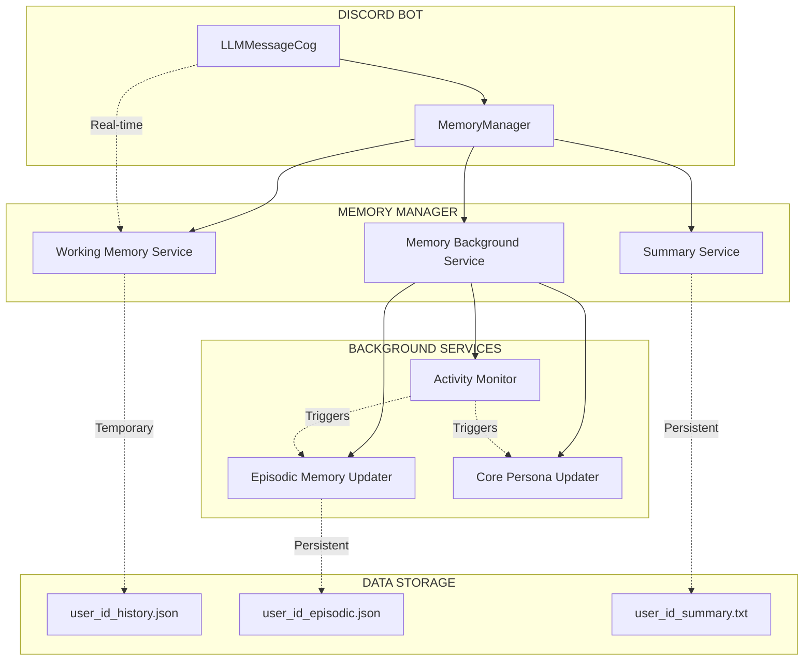
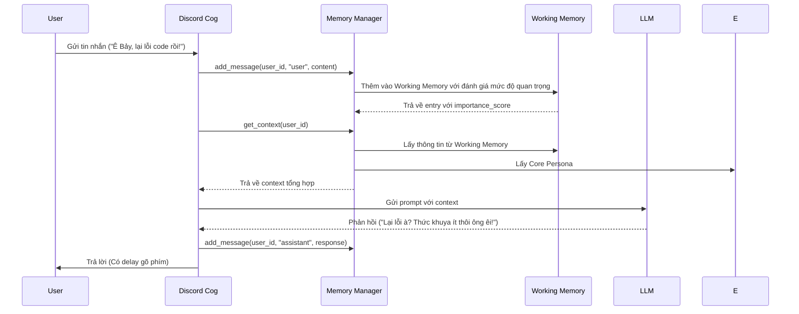
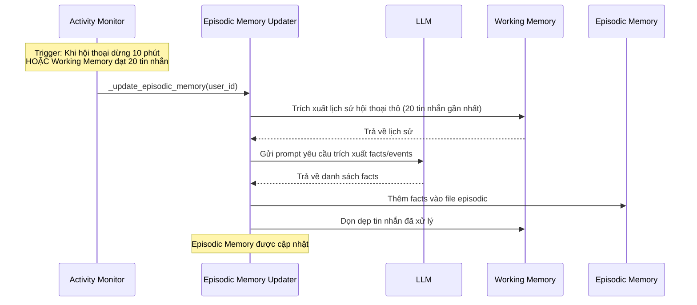
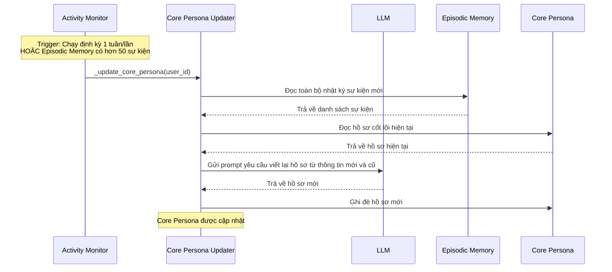

# Tài liệu hệ thống 3 tầng Bộ nhớ cho Discord Bot

## Tổng quan

Hệ thống 3 tầng Bộ nhớ (Three-Tier Memory System) là một kiến trúc nâng cao cho phép Discord bot ghi nhớ và học hỏi từ người dùng theo thời gian. Hệ thống bao gồm 3 tầng chính:

1. **Working Memory (Tầng 1 - Ngắn hạn)**: Lưu trữ thông tin ngắn hạn trong phiên hội thoại hiện tại
2. **Episodic Memory (Tầng 2 - Nhật ký)**: Lưu trữ các sự kiện và thông tin quan trọng theo thời gian
3. **Core Persona (Tầng 3 - Hồ sơ cốt lõi)**: Lưu trữ thông tin tổng quát và đặc điểm chính của người dùng

## Kiến trúc hệ thống



## Chi tiết từng tầng

### 1. Working Memory (Tầng 1 - Ngắn hạn)

**Vị trí**: `src/services/working_memory_service.py`

**Chức năng**:
- Lưu trữ thông tin ngắn hạn trong phiên hội thoại hiện tại
- Ưu tiên thông tin quan trọng dựa trên mức độ liên quan
- Cung cấp ngữ cảnh cho các phản hồi thời gian thực

**Cấu trúc dữ liệu**:
```python
class WorkingMemoryEntry:
    role: str          # 'user' hoặc 'assistant'
    content: str       # Nội dung tin nhắn
    timestamp: datetime # Thời gian tạo
    importance_score: float # Mức độ quan trọng (0.0 - 1.0)
    category: MessageCategory # Danh mục (fact, preference, query, etc.)
    access_count: int  # Số lần được truy cập
    is_sensitive: bool # Có chứa thông tin nhạy cảm không
    entities: List[str] # Các thực thể được trích xuất
    keywords: List[str] # Từ khóa quan trọng
```

**Cơ chế hoạt động**:
- Tự động đánh giá mức độ quan trọng của tin nhắn khi thêm vào
- Ưu tiên hiển thị thông tin quan trọng trong ngữ cảnh
- Kích hoạt cập nhật Episodic Memory khi đạt ngưỡng 20 tin nhắn

### 2. Episodic Memory (Tầng 2 - Nhật ký)

**Vị trí**: `user_id_episodic.json` trong `src/data/user_summaries/`

**Chức năng**:
- Lưu trữ các sự kiện và thông tin quan trọng theo thời gian
- Tổng hợp từ Working Memory định kỳ
- Là nguồn dữ liệu cho việc cập nhật Core Persona

**Cấu trúc dữ liệu**:
```json
[
  {
    "type": "fact|event|behavior|preference|milestone|change",
    "category": "personal_info|interests|habits|goals|relationships|activities|status_change",
    "summary": "Tóm tắt ngắn gọn sự kiện/fact",
    "details": "Chi tiết cụ thể về sự kiện/fact",
    "timestamp": "Thời gian (nếu có thể xác định)",
    "confidence": 0.0-1.0,
    "added_at": "Thời gian thêm vào episodic memory"
  }
]
```

**Cơ chế hoạt động**:
- Được cập nhật bởi Episodic Memory Updater trong Background Service
- Kích hoạt khi Working Memory đạt ngưỡng 20 tin nhắn hoặc không hoạt động 10 phút
- Giới hạn 200 sự kiện gần nhất để tránh file quá lớn

### 3. Core Persona (Tầng 3 - Hồ sơ cốt lõi)

**Vị trí**: `user_id_summary.txt` trong `src/data/user_summaries/`

**Chức năng**:
- Lưu trữ thông tin tổng quát và đặc điểm chính của người dùng
- Tổng hợp từ Episodic Memory định kỳ
- Cung cấp thông tin nền cho mọi cuộc trò chuyện

**Cấu trúc dữ liệu**:
```
=== THÔNG TIN CƠ BẢN ===
Tên: [Tên thật hoặc biệt danh]
Tuổi: [Tuổi hiện tại]
Sinh nhật: [Ngày sinh nếu có]

=== SỞ THÍCH & ĐAM MÊ ===
• Công nghệ: [Ngôn ngữ lập trình, dự án, level skill]
• Giải trí: [Phim, nhạc, game, thể loại yêu thích]
• Khác: [Các sở thích khác được đề cập]

=== TÍNH CÁCH & PHONG CÁCH ===
• Giao tiếp: [Cách user nói chuyện - hài hước, nghiêm túc, etc]
• Tâm trạng: [Thường vui, hay lo lắng, tích cực, etc]
• Đặc điểm: [Những điều đặc biệt về user]

=== DỰ ÁN & MỤC TIÊU ===
• Hiện tại: [Đang làm gì, học gì, quan tâm gì]
• Kế hoạch: [Mục tiêu, ước mơ đã chia sẻ]

=== LỊCH SỬ TƯƠNG TÁC ===
• Chủ đề đã thảo luận: [Những gì đã nói chuyện]
• Mức độ thân thiết: [Mới quen, đã quen, thân thiết]
• Ghi chú đặc biệt: [Điều gì cần nhớ đặc biệt]

=== MỐI QUAN HỆ VỚI NGƯỜI KHÁC ===
• Bạn bè: [Tên các user khác mà user này đã nhắc đến, kèm thông tin về mối quan hệ]
• Gia đình: [Thành viên gia đình được nhắc đến]
• Đồng nghiệp: [Đồng nghiệp, đối tác làm việc được đề cập]
• Người quan trọng: [Người yêu, crush, người đặc biệt được nhắc đến]
• Ghi chú về tương tác: [Cách user nói về người khác, mức độ thân thiết]
```

**Cơ chế hoạt động**:
- Được cập nhật bởi Core Persona Updater trong Background Service
- Kích hoạt khi Episodic Memory có hơn 50 sự kiện hoặc định kỳ hàng tuần
- Kết hợp thông tin cũ với thông tin mới, giữ lại thông tin vẫn còn chính xác

## Luồng hoạt động chính

### 1. Luồng trả lời tin nhắn (Real-time)



### 2. Luồng cập nhật nhật ký (Episodic Memory - Chạy ngầm)



### 3. Luồng cập nhật hồ sơ (Core Persona - Chạy ngầm)



## Cơ chế Trigger

### 1. Message Count Trigger
- **Điều kiện**: Working Memory đạt ngưỡng 20 tin nhắn
- **Kích hoạt**: Cập nhật Episodic Memory
- **Mục tiêu**: Trích xuất thông tin quan trọng trước khi Working Memory quá tải

### 2. Inactivity Timeout Trigger
- **Điều kiện**: Không có hoạt động trong 10 phút
- **Kích hoạt**: Cập nhật Episodic Memory
- **Mục tiêu**: Tổng hợp thông tin từ phiên hội thoại vừa kết thúc

### 3. Event Count Trigger
- **Điều kiện**: Episodic Memory có hơn 50 sự kiện mới
- **Kích hoạt**: Cập nhật Core Persona
- **Mục tiêu**: Cập nhật hồ sơ tổng quát khi có nhiều thay đổi

### 4. Priority Event Trigger
- **Điều kiện**: Có sự kiện ưu tiên (thay đổi thông tin cá nhân, mối quan hệ, v.v.)
- **Kích hoạt**: Cập nhật ngay Core Persona
- **Mục tiêu**: Đảm bảo thông tin quan trọng được cập nhật kịp thời

## Tích hợp với hệ thống hiện tại

### 1. MemoryManager
Là lớp trung gian quản lý cả 3 tầng bộ nhớ:
- Cung cấp API thống nhất cho các tầng bộ nhớ
- Xử lý các trigger và callback
- Tích hợp với Activity Monitor

### 2. LLMMessageCog
Được cập nhật để sử dụng MemoryManager thay cho các dịch vụ riêng lẻ:
- Thêm tin nhắn vào hệ thống bộ nhớ qua `memory_manager.add_message()`
- Lấy context tổng hợp qua `memory_manager.get_context()`
- Không cần quản lý các dịch vụ riêng lẻ nữa

### 3. Background Services
Chạy độc lập để xử lý các tác vụ cập nhật định kỳ:
- Không ảnh hưởng đến luồng xử lý chính
- Có thể cấu hình thời gian và ngưỡng kích hoạt
- Có cơ chế xử lý lỗi và phục hồi

## Lợi ích của hệ thống 3 tầng

1. **Tách biệt trách nhiệm**: Mỗi tầng có vai trò rõ ràng và không chồng chéo
2. **Hiệu suất cao**: Working Memory nhanh chóng cho phản hồi thời gian thực
3. **Tự động hóa**: Các cập nhật diễn ra tự động theo điều kiện đã định
4. **Tính chính xác**: Thông tin được tổng hợp và cập nhật định kỳ, tránh sai sót
5. **Mở rộng tốt**: Dễ dàng thêm các tầng bộ nhớ mới hoặc thay đổi cơ chế hoạt động
6. **Tối ưu lưu trữ**: Mỗi tầng có cơ chế lưu trữ phù hợp với mục đích sử dụng

## Cấu hình và tùy chỉnh

Các tham số có thể cấu hình trong hệ thống:

- `message_threshold`: Ngưỡng tin nhắn để kích hoạt cập nhật (mặc định: 20)
- `inactivity_timeout`: Thời gian timeout để kích hoạt cập nhật (mặc định: 600 giây - 10 phút)
- `event_count_threshold`: Số lượng sự kiện để cập nhật Core Persona (mặc định: 50)
- `max_episodic_events`: Giới hạn số lượng sự kiện trong Episodic Memory (mặc định: 200)
- `max_working_memory`: Giới hạn số lượng tin nhắn trong Working Memory (mặc định: 20)

## Bảo trì và giám sát

Hệ thống cung cấp các công cụ để giám sát và bảo trì:

- Lệnh `!memory_status`: Xem trạng thái bộ nhớ của người dùng
- Lệnh `!search_memory`: Tìm kiếm trong các tầng bộ nhớ
- Logging chi tiết cho việc debug và theo dõi
- Cơ chế backup và phục hồi dữ liệu

## Kết luận

Hệ thống 3 tầng Bộ nhớ là một kiến trúc mạnh mẽ và linh hoạt cho phép Discord bot ghi nhớ và học hỏi từ người dùng một cách thông minh. Với sự phân chia rõ ràng giữa các tầng, hệ thống đảm bảo hiệu suất cao trong xử lý thời gian thực đồng thời duy trì khả năng học hỏi và cập nhật thông tin dài hạn.