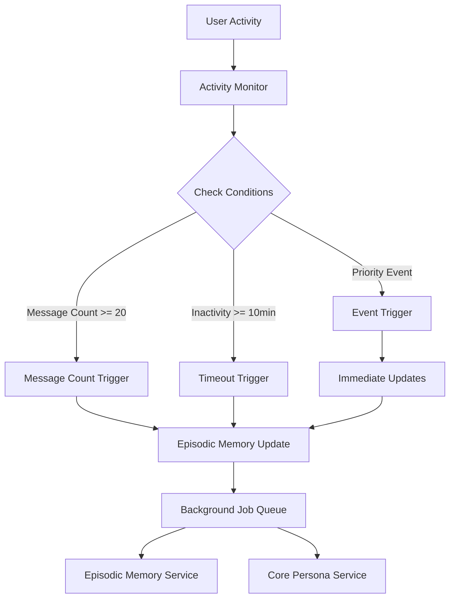

# Kế hoạch cơ chế Trigger cho hệ thống 3 tầng

## Tổng quan

Cơ chế trigger là thành phần quan trọng để kích hoạt các luồng cập nhật nền theo các điều kiện cụ thể như:
- Working Memory đạt ngưỡng 20 tin nhắn
- Không có hoạt động trong 10 phút (hội thoại dừng)
- Có sự kiện quan trọng cần cập nhật ngay

## Thiết kế hệ thống Trigger

### 1. Trigger Types

Có 3 loại trigger chính:

#### a. Message Count Trigger
- Kích hoạt khi Working Memory đạt ngưỡng 20 tin nhắn
- Mục tiêu: Trích xuất thông tin quan trọng và chuyển sang Episodic Memory

#### b. Inactivity Timeout Trigger
- Kích hoạt khi không có hoạt động trong 10 phút
- Mục tiêu: Tổng hợp thông tin từ phiên hội thoại vừa kết thúc

#### c. Priority Event Trigger
- Kích hoạt khi có sự kiện quan trọng (thay đổi thông tin cá nhân, mối quan hệ, v.v.)
- Mục tiêu: Cập nhật ngay để đảm bảo thông tin luôn chính xác

### 2. Kiến trúc Trigger System



## Triển khai chi tiết

### 1. ActivityMonitor

Tệp: `src/services/activity_monitor.py`

```python
import asyncio
import logging
from datetime import datetime, timedelta
from typing import Dict, Callable, Any
from dataclasses import dataclass

logger = logging.getLogger(__name__)

@dataclass
class TriggerCondition:
    user_id: str
    last_activity: datetime
    message_count: int
    session_start: datetime

class ActivityMonitor:
    """
    Theo dõi hoạt động người dùng và kích hoạt các trigger
    """
    
    def __init__(self, 
                 message_threshold: int = 20,
                 inactivity_timeout: int = 600,  # 10 minutes
                 check_interval: int = 30):      # 30 seconds
        self.message_threshold = message_threshold
        self.inactivity_timeout = inactivity_timeout
        self.check_interval = check_interval
        
        # Theo dõi trạng thái người dùng
        self.user_conditions: Dict[str, TriggerCondition] = {}
        
        # Callback cho các loại trigger
        self.message_count_callbacks: list[Callable] = []
        self.timeout_callbacks: list[Callable] = []
        self.priority_event_callbacks: list[Callable] = []
        
        # Cờ cho vòng lặp
        self.running = False
        self.monitor_task = None
    
    def start_monitoring(self):
        """Bắt đầu theo dõi hoạt động"""
        if not self.running:
            self.running = True
            self.monitor_task = asyncio.create_task(self._monitor_loop())
            logger.info(f"👀 Activity monitor started (interval: {self.check_interval}s)")
    
    def stop_monitoring(self):
        """Dừng theo dõi hoạt động"""
        if self.running:
            self.running = False
            if self.monitor_task:
                self.monitor_task.cancel()
            logger.info("👀 Activity monitor stopped")
    
    async def _monitor_loop(self):
        """Vòng lặp theo dõi chính"""
        while self.running:
            try:
                await self._check_all_conditions()
                await asyncio.sleep(self.check_interval)
            except asyncio.CancelledError:
                logger.info("👀 Monitor loop cancelled")
                break
            except Exception as e:
                logger.error(f"❌ Error in monitor loop: {e}")
                await asyncio.sleep(self.check_interval)
    
    def record_activity(self, user_id: str):
        """Ghi nhận hoạt động của người dùng"""
        current_time = datetime.now()
        
        if user_id not in self.user_conditions:
            self.user_conditions[user_id] = TriggerCondition(
                user_id=user_id,
                last_activity=current_time,
                message_count=0,
                session_start=current_time
            )
        else:
            self.user_conditions[user_id].last_activity = current_time
            self.user_conditions[user_id].message_count += 1
    
    def record_priority_event(self, user_id: str, event_type: str, event_data: Any = None):
        """Ghi nhận sự kiện ưu tiên cần xử lý ngay"""
        self.record_activity(user_id)  # Cập nhật thời gian hoạt động
        
        # Gọi các callback cho sự kiện ưu tiên
        for callback in self.priority_event_callbacks:
            try:
                callback(user_id, event_type, event_data)
            except Exception as e:
                logger.error(f"❌ Error in priority event callback: {e}")
    
    async def _check_all_conditions(self):
        """Kiểm tra điều kiện cho tất cả người dùng"""
        current_time = datetime.now()
        users_to_check = list(self.user_conditions.keys())
        
        for user_id in users_to_check:
            if user_id not in self.user_conditions:
                continue
                
            condition = self.user_conditions[user_id]
            
            # Kiểm tra điều kiện số lượng tin nhắn
            if condition.message_count >= self.message_threshold:
                await self._trigger_message_count(user_id, condition)
            
            # Kiểm tra điều kiện timeout
            time_since_activity = current_time - condition.last_activity
            if time_since_activity.total_seconds() >= self.inactivity_timeout:
                await self._trigger_timeout(user_id, condition)
    
    async def _trigger_message_count(self, user_id: str, condition: TriggerCondition):
        """Kích hoạt trigger khi đạt ngưỡng tin nhắn"""
        logger.info(f"📈 Message count trigger for {user_id}: {condition.message_count}/{self.message_threshold}")
        
        # Gọi các callback
        for callback in self.message_count_callbacks:
            try:
                await callback(user_id, condition)
            except Exception as e:
                logger.error(f"❌ Error in message count callback: {e}")
        
        # Reset bộ đếm tin nhắn sau khi kích hoạt
        condition.message_count = 0  # Có thể giữ lại một số tin nhắn gần nhất
    
    async def _trigger_timeout(self, user_id: str, condition: TriggerCondition):
        """Kích hoạt trigger khi timeout"""
        logger.info(f"⏰ Timeout trigger for {user_id}: inactive for {self.inactivity_timeout}s")
        
        # Gọi các callback
        for callback in self.timeout_callbacks:
            try:
                await callback(user_id, condition)
            except Exception as e:
                logger.error(f"❌ Error in timeout callback: {e}")
        
        # Xóa condition sau khi xử lý (hoặc có thể giữ lại để theo dõi lâu dài)
        # del self.user_conditions[user_id]
    
    def add_message_count_callback(self, callback: Callable):
        """Thêm callback cho trigger số lượng tin nhắn"""
        self.message_count_callbacks.append(callback)
    
    def add_timeout_callback(self, callback: Callable):
        """Thêm callback cho trigger timeout"""
        self.timeout_callbacks.append(callback)
    
    def add_priority_event_callback(self, callback: Callable):
        """Thêm callback cho trigger sự kiện ưu tiên"""
        self.priority_event_callbacks.append(callback)
    
    def get_user_status(self, user_id: str) -> Dict[str, Any]:
        """Lấy trạng thái trigger của người dùng"""
        if user_id not in self.user_conditions:
            return {
                "active": False,
                "message_count": 0,
                "time_since_activity": None,
                "next_trigger": None
            }
        
        condition = self.user_conditions[user_id]
        time_since_activity = datetime.now() - condition.last_activity
        
        next_trigger = None
        if condition.message_count >= self.message_threshold:
            next_trigger = "message_count"
        elif time_since_activity.total_seconds() >= self.inactivity_timeout:
            next_trigger = "timeout"
        
        return {
            "active": True,
            "message_count": condition.message_count,
            "time_since_activity": time_since_activity.total_seconds(),
            "next_trigger": next_trigger,
            "session_duration": (datetime.now() - condition.session_start).total_seconds()
        }
```

### 2. Integration với MemoryBackgroundService

Cập nhật `MemoryBackgroundService` để sử dụng ActivityMonitor:

```python
class MemoryBackgroundService:
    def __init__(self, llm_service, data_dir: str):
        self.llm_service = llm_service
        self.data_dir = data_dir
        
        # Đường dẫn lưu trữ
        self.user_summaries_dir = os.path.join(data_dir, "user_summaries")
        
        # Tạo activity monitor
        self.activity_monitor = ActivityMonitor()
        
        # Cài đặt callback cho các trigger
        self.activity_monitor.add_message_count_callback(self._on_message_count_trigger)
        self.activity_monitor.add_timeout_callback(self._on_timeout_trigger)
        self.activity_monitor.add_priority_event_callback(self._on_priority_event_trigger)
        
        # Các thuộc tính khác...
        self.running = False
        self.task = None
    
    def start(self):
        """Khởi động dịch vụ nền và activity monitor"""
        if not self.running:
            self.running = True
            self.task = asyncio.create_task(self._background_worker())
            self.activity_monitor.start_monitoring()  # Bắt đầu theo dõi
            logger.info("🔄 MemoryBackgroundService started with activity monitoring")
    
    def stop(self):
        """Dừng dịch vụ nền và activity monitor"""
        if self.running:
            self.running = False
            if self.task:
                self.task.cancel()
            self.activity_monitor.stop_monitoring()  # Dừng theo dõi
            logger.info("🔄 MemoryBackgroundService stopped")
    
    def record_user_activity(self, user_id: str):
        """Ghi nhận hoạt động của người dùng"""
        self.activity_monitor.record_activity(user_id)
    
    def record_priority_event(self, user_id: str, event_type: str, event_data: Any = None):
        """Ghi nhận sự kiện ưu tiên"""
        self.activity_monitor.record_priority_event(user_id, event_type, event_data)
    
    async def _on_message_count_trigger(self, user_id: str, condition: TriggerCondition):
        """Xử lý khi đạt ngưỡng tin nhắn"""
        logger.info(f"🔄 Processing message count trigger for {user_id}")
        await self._update_episodic_memory(user_id)
    
    async def _on_timeout_trigger(self, user_id: str, condition: TriggerCondition):
        """Xử lý khi timeout (hội thoại dừng)"""
        logger.info(f"🔄 Processing timeout trigger for {user_id}")
        await self._update_episodic_memory(user_id)
        
        # Có thể kích hoạt cập nhật core persona nếu cần
        # await self._update_core_persona_if_needed(user_id)
    
    async def _on_priority_event_trigger(self, user_id: str, event_type: str, event_data: Any):
        """Xử lý khi có sự kiện ưu tiên"""
        logger.info(f"🔄 Processing priority event {event_type} for {user_id}")
        
        if event_type == "personal_info_update":
            # Cập nhật core persona ngay lập tức
            await self._update_core_persona(user_id)
        elif event_type == "relationship_change":
            # Cập nhật thông tin mối quan hệ
            await self._update_core_persona(user_id)
        # Thêm các loại sự kiện khác nếu cần
```

### 3. Integration với MemoryManager

Cập nhật `MemoryManager` để tích hợp với ActivityMonitor:

```python
class MemoryManager:
    def __init__(self, llm_service, data_dir: str):
        self.llm_service = llm_service
        self.data_dir = data_dir
        
        # Khởi tạo các tầng bộ nhớ
        self.working_memory = WorkingMemoryService(max_capacity=20, trigger_threshold=20)
        self.background_service = MemoryBackgroundService(llm_service, data_dir)
        self.core_persona = SummaryService(llm_service, 
                                         data_dir=data_dir,
                                         prompts_dir=f"{data_dir}/prompts",
                                         config_dir=f"{data_dir}/config")
        
        # Context cho từng người dùng
        self.user_contexts: Dict[str, Dict] = {}
        
        # Callback cho các trigger
        self.trigger_callbacks: List[Callable] = []
        
        # Đăng ký callback cho working memory (nếu cần)
        self.working_memory.register_trigger_callback(self._on_working_memory_trigger)
        
        logger.info("🧠 MemoryManager initialized with integrated trigger system")
    
    def add_message(self, user_id: str, role: str, content: str):
        """
        Thêm tin nhắn vào hệ thống bộ nhớ và ghi nhận hoạt động
        """
        # Khởi tạo context nếu chưa có
        self.initialize_user_context(user_id)
        
        # Cập nhật thông tin context
        self.user_contexts[user_id]["last_activity"] = datetime.now()
        self.user_contexts[user_id]["message_count"] += 1
        
        # Thêm vào working memory
        entry = self.working_memory.add_message(user_id, role, content)
        
        # Ghi nhận hoạt động cho background service (bao gồm cả activity monitor)
        self.background_service.record_user_activity(user_id)
        
        logger.debug(f"🧠 Added message to memory for {user_id}: {content[:50]}...")
    
    def record_priority_event(self, user_id: str, event_type: str, event_data: Any = None):
        """Ghi nhận sự kiện ưu tiên"""
        self.background_service.record_priority_event(user_id, event_type, event_data)
```

### 4. Integration với LLMMessageCog

Cập nhật `LLMMessageCog` để sử dụng hệ thống trigger:

```python
class LLMMessageCog(commands.Cog):
    # ... các phương thức khác ...
    
    async def _process_relationship_data(self, message, content: str, user_id: str):
        """Process relationship data from message"""
        try:
            # Get author info
            author_username = message.author.display_name or message.author.name

            # Extract mentioned users
            mentioned_user_ids = []
            for mention in message.mentions:
                mentioned_user_ids.append(str(mention.id))
                # Update mentioned user's name info too
                self.memory_manager.relationship_service.update_user_name(
                    str(mention.id),
                    mention.display_name or mention.name,
                    mention.display_name
                    if mention.display_name != mention.name
                    else None,
                    mention.global_name if hasattr(mention, "global_name") else None,
                )

            # Process the message through relationship service
            await self.memory_manager.relationship_service.process_message(
                user_id,
                author_username,
                content,
                mentioned_user_ids,
                str(message.channel.id) if message.channel else None,
            )

            # Check if this message contains priority information that should trigger immediate updates
            if self._contains_priority_information(content):
                self.memory_manager.record_priority_event(
                    user_id, 
                    "personal_info_update", 
                    {"content": content, "type": "potential_personal_info"}
                )

            logger.debug(
                f"🔗 Processed relationship data for {author_username} (ID: {user_id})"
            )

        except Exception as e:
            logger.error(f"❌ Error processing relationship data: {e}")
    
    def _contains_priority_information(self, content: str) -> bool:
        """Kiểm tra xem tin nhắn có chứa thông tin ưu tiên không"""
        priority_indicators = [
            "tên", "name", "tuổi", "age", "sinh nhật", "birthday",
            "thích", "like", "yêu", "love", "gì", "ơi", "ơi", "ơi",
            "bạn", "crush", "người yêu", "gf", "bf", "boyfriend", "girlfriend"
        ]
        
        content_lower = content.lower()
        return any(indicator in content_lower for indicator in priority_indicators)
```

## Lợi ích của hệ thống Trigger

1. **Tự động hóa**: Các hành động được kích hoạt tự động theo điều kiện
2. **Hiệu quả**: Không cần kiểm tra liên tục, chỉ xử lý khi có điều kiện đúng
3. **Linh hoạt**: Dễ dàng thêm các loại trigger và callback mới
4. **Hiệu suất**: Giảm tải cho hệ thống bằng cách xử lý theo lịch trình
5. **Tăng chất lượng dữ liệu**: Cập nhật thông tin kịp thời khi có thay đổi quan trọng

## Các điểm cần lưu ý khi triển khai

1. **Hiệu suất**: Đảm bảo vòng lặp theo dõi không ảnh hưởng đến hiệu suất chính
2. **Thread safety**: Đảm bảo an toàn khi truy cập từ nhiều luồng
3. **Xử lý lỗi**: Có cơ chế xử lý lỗi cho các callback
4. **Tùy chỉnh**: Cho phép cấu hình các ngưỡng và khoảng thời gian
5. **Logging**: Ghi log đầy đủ để dễ debug và theo dõi