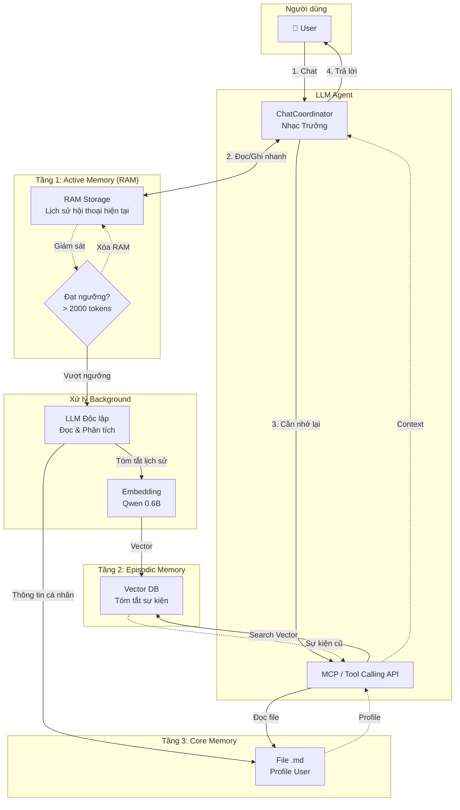
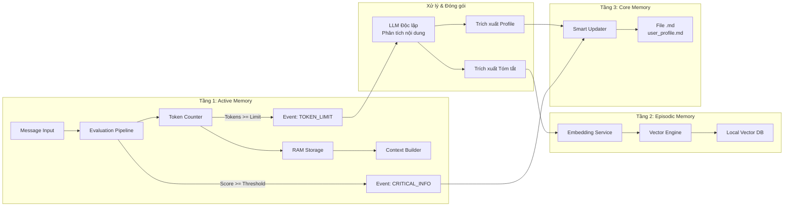
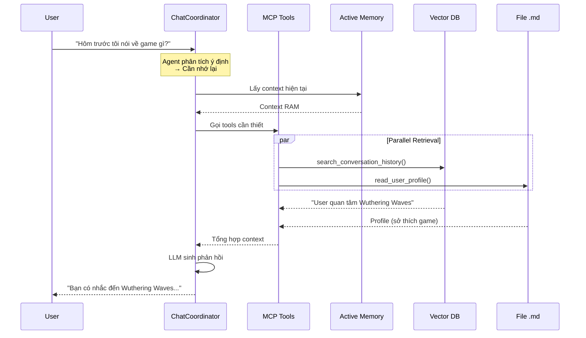
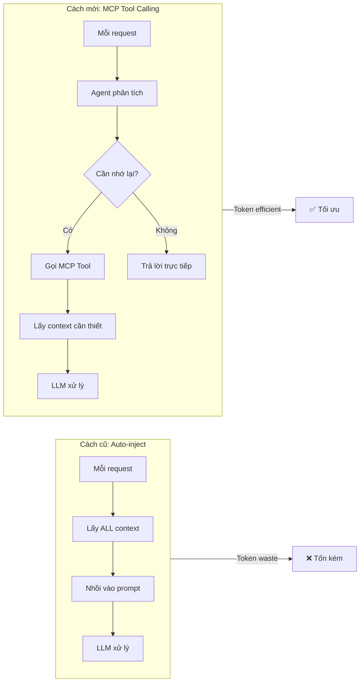

# Kiến trúc Hệ thống Trí nhớ 3 Tầng (Three-Tier Memory System)

## Tổng quan

Tài liệu này mô tả kiến trúc bộ nhớ cho Discord bot, kết hợp 3 tầng trí nhớ với giao thức MCP (Model Context Protocol) để tối ưu hóa việc lưu trữ và truy xuất thông tin.

### Nguyên lý cốt lõi

1. **Phân tách rõ ràng 2 loại trí nhớ:**
   - **Trí nhớ sự kiện (Episodic Memory):** Lịch sử cuộc trò chuyện → Tóm tắt → Embedding → Vector DB
   - **Trí nhớ cốt lõi (Core Memory):** Thông tin cá nhân user → File Markdown (.md) → MCP Tool

2. **Lợi ích của thiết kế này:**
   - Giảm nhiễu thông tin (Noise Reduction)
   - Tối ưu Vector Search với mật độ ngữ nghĩa cao
   - Thông tin cá nhân luôn chính xác 100% (deterministic)
   - Dễ dàng quản lý bởi con người (Human-in-the-loop)

---

## Sơ đồ Kiến trúc Tổng quan



---

## Sơ đồ Luồng Đóng gói Ký ức



---

## Sơ đồ Luồng Truy xuất (Retrieval)



---

## Chi tiết từng Tầng

### Tầng 1: Active Memory (Bộ nhớ hoạt động)

**Mục đích:** Lưu trữ tạm thời hội thoại hiện tại trên RAM

**Đặc điểm:**
- Tốc độ truy xuất cực nhanh
- Lưu trữ tin nhắn raw (chưa qua xử lý)
- Giới hạn bởi `MAX_WORKING_TOKENS` (ví dụ: 2000 tokens)

**Cơ chế trigger:**
- Đếm token liên tục
- Khi đạt ngưỡng → Phát sự kiện `TOKEN_LIMIT_REACHED`
- Kích hoạt LLM độc lập để xử lý

**Triển khai hiện tại:**
- [`activate_memory_service.py`](src/services/memories/activate_memory/activate_memory_service.py)
- [`ram_storage.py`](src/services/memories/activate_memory/storage/ram_storage.py)

---

### Tầng 2: Episodic Memory (Trí nhớ sự kiện)

**Mục đích:** Lưu trữ tóm tắt các cuộc hội thoại đã qua

**Quy trình xử lý:**

```
Lịch sử raw → LLM Tóm tắt → Embedding → Vector DB
```

**Tại sao chỉ embedding bản tóm tắt?**
1. **Lọc bỏ rác:** Tin nhắn raw chứa nhiều từ thừa ("ok", "haha", "đúng rồi")
2. **Mật độ ngữ nghĩa cao:** Bản tóm tắt chứa thông tin cô đọng
3. **Tiết kiệm tài nguyên:** Giảm dung lượng Vector DB và Token khi retrieval

**Cấu trúc bản tóm tắt (Markdown):**

```markdown
# Session: 2026-04-05 14:30

## Chủ đề chính
- Thảo luận về tối ưu hóa RAG system
- User gặp lỗi cài đặt ChromaDB

## Chi tiết
- User đang build PC mới cho AI project
- Bot đã hướng dẫn fix lỗi Docker cho ChromaDB
- User quan tâm đến Wuthering Waves

## Kết quả
- Lỗi đã được fix thành công
- User sẽ thử nghiệm RAG pipeline
```

**Lợi ích của Markdown Chunking:**
- Cắt theo thẻ Heading (`#`, `##`, `###`)
- Tự động gắn metadata: `{"Header 1": "Session", "Header 2": "Chủ đề chính"}`
- LLM đọc hiểu tốt hơn JSON/YAML

**Triển khai hiện tại:**
- [`episodic_manager.py`](src/services/memories/episodic_memory/episodic_manager.py)
- [`event_extractor.py`](src/services/memories/episodic_memory/extraction/event_extractor.py)
- [`local_vector_db.py`](src/services/memories/episodic_memory/storage/local_vector_db.py)

---

### Tầng 3: Core Memory (Trí nhớ cốt lõi)

**Mục đích:** Lưu trữ thông tin cá nhân, sở thích, facts về user

**Tại sao dùng File Markdown (.md) thay vì Vector DB?**

| Tiêu chí | Vector DB | File Markdown |
|----------|-----------|---------------|
| Độ chính xác | Xác suất (có thể sai) | 100% chính xác |
| Cập nhật | Phức tạp | Đơn giản (ghi đè) |
| Con người đọc được | Không | Có |
| Cấu trúc | Mất khi embedding | Giữ nguyên |

**Cấu trúc file `user_profile_{user_id}.md`:**

```markdown
# Thông tin cá nhân

## Thông tin cơ bản
- **Tên:** Hoà
- **Nghề nghiệp:** AI Engineer
- **Khu vực:** Việt Nam

## Sở thích
- Tự build PC cho AI projects
- Chơi game Wuthering Waves
- Nghiên cứu RAG systems

## Kỹ năng
- Python, Docker, Kubernetes
- LLM fine-tuning
- Vector databases

## Lưu ý đặc biệt
- Thích giải thích chi tiết, có ví dụ code
- Không thích trả lời quá ngắn gọn
```

**Cơ chế cập nhật:**
- LLM độc lập (SmartUpdater) phát hiện thông tin quan trọng
- Phát sự kiện `CRITICAL_INFO_DETECTED`
- Cập nhật vào file .md

**Triển khai hiện tại:**
- [`core_manager.py`](src/services/memories/core_memory/core_manager.py)
- [`smart_updater.py`](src/services/memories/core_memory/smart_updater.py)
- [`local_yaml_db.py`](src/services/memories/core_memory/storage/local_yaml_db.py) → Cần migrate sang Markdown

---

## Tích hợp MCP (Model Context Protocol)

### Các MCP Tools cần triển khai

```python
# tools/user_profile.py
@mcp_tool
def read_user_profile(user_id: str) -> str:
    """Đọc file profile .md của user"""
    with open(f"profiles/{user_id}.md", "r") as f:
        return f.read()

@mcp_tool
def update_user_profile(user_id: str, section: str, content: str) -> bool:
    """Cập nhật section trong file profile"""
    # Parse markdown, update section, write back
    pass

# tools/episodic_search.py
@mcp_tool
def search_conversation_history(query: str, user_id: str, limit: int = 5) -> list:
    """Tìm kiếm trong lịch sử hội thoại đã tóm tắt"""
    query_embedding = embedding_service.embed(query)
    results = vector_db.search(query_embedding, filter={"user_id": user_id})
    return results[:limit]

@mcp_tool
def get_recent_sessions(user_id: str, days: int = 7) -> list:
    """Lấy các session gần đây"""
    # Search by date range in vector db
    pass
```

### Cấu hình Agent với MCP

```python
# chat_coordinator.py
class ChatCoordinator:
    def __init__(self):
        self.mcp_client = MCPClient()
        self.tools = [
            read_user_profile,
            update_user_profile,
            search_conversation_history,
            get_recent_sessions,
        ]
    
    async def process_message(self, message: str, user_id: str):
        # Agent tự quyết định có cần gọi tool không
        response = await self.llm.generate(
            message,
            tools=self.tools,
            context=self.active_memory.get_context(user_id)
        )
        return response
```

---

## So sánh: Auto-inject vs MCP



| Tiêu chí | Auto-inject (cũ) | MCP Tool Calling (mới) |
|----------|------------------|------------------------|
| Token usage | Luôn tốn | Chỉ tốn khi cần |
| Độ nhiễu | Cao | Thấp |
| Độ chính xác | Trung bình | Cao |
| Linh hoạt | Cứng nhắc | Agent tự quyết định |

---

## Migration Plan

### Từ YAML/JSON sang Markdown

**Bước 1:** Tạo converter
```python
def yaml_to_markdown(yaml_path: str) -> str:
    data = yaml.safe_load(open(yaml_path))
    # Convert to markdown format
    return markdown_content
```

**Bước 2:** Migrate dữ liệu hiện có
```bash
python scripts/migrate_profiles.py --from-yaml --to-markdown
```

**Bước 3:** Cập nhật SmartUpdater
- Thay đổi logic ghi file
- Sử dụng MarkdownHeaderTextSplitter khi cần

### Từ Auto-inject sang MCP

**Bước 1:** Định nghĩa MCP tools
**Bước 2:** Cập nhật ChatCoordinator
**Bước 3:** Test với các scenario khác nhau

---

## Kết luận

Kiến trúc này giải quyết được các bài toán lớn:

1. **Nhiễu thông tin (Noise):** Tóm tắt trước khi embedding
2. **Ảo giác (Hallucination):** Thông tin cá nhân lưu deterministic
3. **Token waste:** Agent tự quyết định khi nào cần context
4. **Human-in-the-loop:** File .md dễ đọc, dễ sửa

Đây là hướng đi đúng đắn, phù hợp với các framework hiện đại như Mem0, LangGraph.