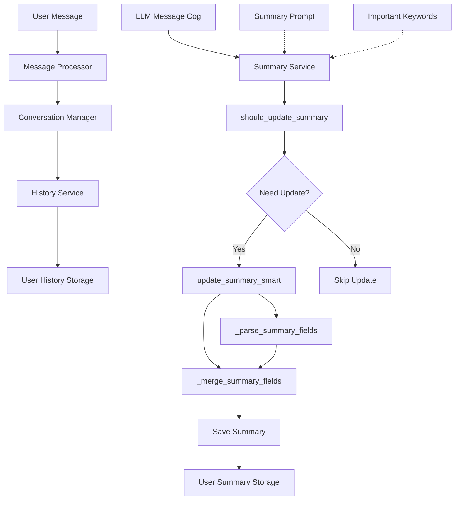
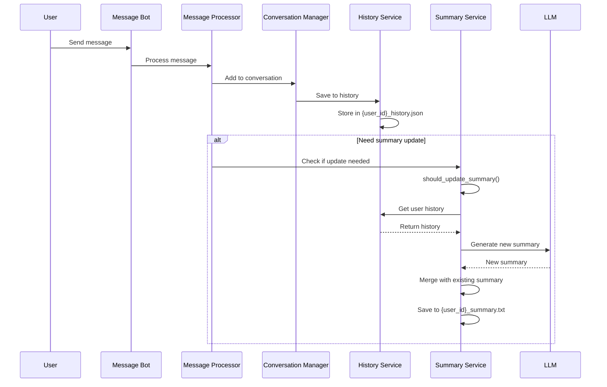

# Logic Tổng Hợp User Summary

## Tổng Quan

Hệ thống user summary là một thành phần quan trọng trong Discord bot, có nhiệm vụ theo dõi, phân tích và tổng hợp thông tin về người dùng từ các cuộc trò chuyện. Hệ thống này giúp bot ghi nhớ thông tin cá nhân, sở thích, mối quan hệ và các chi tiết quan trọng khác để cá nhân hóa trải nghiệm trò chuyện.

## Kiến Trúc Hệ Thống



## Thành Phần Chính

### 1. SummaryService (`src/services/summary_service.py`)

Lớp chính xử lý logic tổng hợp summary, bao gồm các phương thức quan trọng:

- `_parse_summary_fields`: Trích xuất các trường thông tin từ nội dung summary
- `_merge_summary_fields`: Kết hợp summary cũ và mới một cách thông minh
- `should_update_summary`: Kiểm tra xem có cần cập nhật summary không
- `update_summary_smart`: Thực hiện cập nhật summary với nhiều điều kiện kiểm tra
- `get_user_summary`, `save_user_summary`: Quản lý lưu trữ summary

### 2. Prompt Template (`src/data/prompts/summary_prompt.txt`)

Prompt chi tiết hướng dẫn LLM cách phân tích hội thoại và trích xuất thông tin người dùng theo định dạng cụ thể.

### 3. Cơ Chế Lưu Trữ

- Mỗi user có một file summary riêng: `{user_id}_summary.txt`
- File history riêng: `{user_id}_history.json`
- Thư mục: `src/data/user_summaries/`

## Luồng Xử Lý Chi Tiết



## Cơ Chế Cập Nhật Summary

### 1. Điều Kiện Cập Nhật

Hệ thống kiểm tra nhiều điều kiện trước khi cập nhật:

- **Template Summary**: Nếu summary hiện tại là template (chứa nhiều `[Không có]`), force update
- **Từ Khóa Quan Trọng**: Kiểm tra các từ khóa trong tin nhắn người dùng
- **Random Update**: 30% cơ hội cập nhật định kỳ
- **Điều Kiện Nội Dung**: 
  - Ít nhất 4 tin nhắn trong lịch sử
  - Ít nhất 2 nội dung khác nhau
  - Tổng cộng ít nhất 15 ký tự

### 2. Quy Trình Cập Nhật

1. **Lấy Lịch Sử**: Lấy 20 tin nhắn gần nhất từ lịch sử người dùng
2. **Tạo Prompt**: Kết hợp prompt template với lịch sử trò chuyện
3. **Gọi LLM**: Gửi yêu cầu đến LLM để tạo summary mới
4. **Merge Summary**: Kết hợp summary mới với summary cũ
5. **Lưu Trữ**: Lưu summary đã merge vào file

## Cấu Trúc Summary

Summary được tổ chức theo các section sau:

```
=== THÔNG TIN CƠ BẢN ===
Tên: [Tên thật hoặc biệt danh]
Tuổi: [Tuổi hiện tại]
Sinh nhật: [Ngày sinh nếu có]

=== SỞ THÍCH & ĐAM MÊ ===
• Công nghệ: [Ngôn ngữ lập trình, dự án, level skill]
• Giải trí: [Phim, nhạc, game, thể loại yêu thích]
• Khác: [Các sở thích khác được đề cập]

=== TÍNH CÁCH & PHONG CÁCH ===
• Giao tiếp: [Cách user nói chuyện - hài hước, nghiêm túc, etc]
• Tâm trạng: [Thường vui, hay lo lắng, tích cực, etc]
• Đặc điểm: [Những điều đặc biệt về user]

=== DỰ ÁN & MỤC TIÊU ===
• Hiện tại: [Đang làm gì, học gì, quan tâm gì]
• Kế hoạch: [Mục tiêu, ước mơ đã chia sẻ]

=== LỊCH SỬ TƯƠNG TÁC ===
• Chủ đề đã thảo luận: [Những gì đã nói chuyện]
• Mức độ thân thiết: [Mới quan, đã quen, thân thiết]
• Ghi chú đặc biệt: [Điều gì cần nhớ đặc biệt]

=== MỐI QUAN HỆ VỚI NGƯỜI KHÁC ===
• Bạn bè: [Tên các user khác mà user này đã nhắc đến]
• Gia đình: [Thành viên gia đình được nhắc đến]
• Đồng nghiệp: [Đồng nghiệp, đối tác làm việc được đề cập]
• Người quan trọng: [Người yêu, crush, người đặc biệt được nhắc đến]
• Ghi chú về tương tác: [Cách user nói về người khác]
```

## Cơ Chế Merge Thông Minh

Quy trình merge giữa summary cũ và mới:

1. Parse cả hai summary thành dictionary các trường
2. Với mỗi trường:
   - Nếu trường mới có thông tin (không phải "[Không có]" hoặc "None"), sử dụng giá trị mới
   - Nếu trường mới rỗng, giữ lại giá trị cũ
3. Xây dựng lại summary theo định dạng chuẩn

## Cơ Chế Phát Hiện Template Summary

Hệ thống kiểm tra xem summary có phải là template bằng cách:

- Đếm số lượng trường có giá trị "[Không có]" hoặc "None"
- Nếu >= 15 trường trống trên tổng số 19 trường, coi là template
- Force update nếu phát hiện template

## Các Vấn Đề Tiềm Ẩn

1. **Hiệu Suất**: Mỗi lần cập nhật đọc toàn bộ lịch sử trò chuyện, có thể chậm với lịch sử dài
2. **Cơ Chế Random**: 30% cập nhật có thể gây không đồng đều giữa các user
3. **Xử Lý Lỗi**: Cơ chế fallback khi LLM lỗi chưa tối ưu
4. **Phát Hiện Mâu Thuẫn**: Cần cải thiện khả năng xử lý thông tin mâu thuẫn phức tạp
5. **Định Dạng Đầu Ra**: Một số trường hợp thiếu dòng ngắt giữa các section

## Ưu Điểm

1. **Thiết Kế Tốt**: Các phương thức được phân tách nhiệm vụ rõ ràng
2. **Cơ Chế Merge Thông Minh**: Giữ lại thông tin vẫn chính xác khi cập nhật
3. **Force Update Cho Template**: Phát hiện và cập nhật summary mẫu
4. **Prompt Chi Tiết**: Hướng dẫn cụ thể cho LLM
5. **Cơ Chế Kiểm Tra Chất Lượng**: Đảm bảo chỉ cập nhật khi có đủ dữ liệu