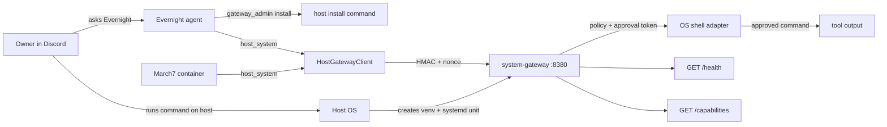

# System Gateway

Native host boundary for the Twin agent stack. `march7` and `evernight` run in
Docker, but host operations run through this service on the host OS. Agents do
not receive a general host shell; they call `host_system`, which signs requests
to System Gateway, and dangerous operations still require owner approval.

This README describes the repo package and expected operating model. It does
not mean the service is currently installed on this host; when in doubt, ask
Evernight for `gateway_admin status` or `gateway_admin doctor`.

## Architecture

Directory ownership:

- `services/system_gateway/` is the native host service package. This is what
  gets installed into the host venv and runs as `system-gateway.service`.
- `twin/shared/system_gateway/` is shared protocol code: HMAC auth, request and
  response types, client errors, and `HostGatewayClient`.
- `twin/evernight/host_gateway/` is Evernight-side orchestration only:
  health monitor, `gateway_admin` bootstrap hints, and update requests. It is
  not a second service implementation.
- `scripts/bootstrap_system_gateway.py` is the one-command installer for the
  native service package in `services/system_gateway/`.
- March7 and Evernight use `host_system` for host operations. Evernight also
  exposes owner-only `gateway_admin` commands for status, diagnosis, install
  hints, and update requests.



First install is special: when the service is missing, there is no host
execution channel yet. Install guidance comes from Evernight's
`gateway_admin install` or `gateway_admin install_hint`, which returns a
code-generated command for the owner to run on the host. It does not execute a
container-side bootstrap bridge.

After install, normal host interaction goes through `host_system` and
`HostGatewayClient`.

## Current Capabilities

- `GET /health` reports service status, version, uptime, and platform.
- `GET /capabilities` reports platform, shell, and feature metadata.
- `POST /shell/run` runs an owner-approved command on the platform shell.
- `POST /self/update` records an owner-approved update request; it does not
  download or restart binaries by itself.

Current adapters expose one generic shell path:

| Platform | Shell | Feature |
| --- | --- | --- |
| Linux | `/bin/sh` | `generic_shell_exec` |
| macOS | `/bin/zsh` | `generic_shell_exec` |
| Windows | `powershell.exe` | `generic_shell_exec` |

## Security Model

- `/health` and `/capabilities` are public for monitoring.
- Mutating endpoints require HMAC request signing with timestamp and nonce.
- Shell execution also requires a fresh owner approval token bound to action
  `shell` and the request actor.
- Approval tokens are single-use; replayed nonces are rejected.
- The rendered Linux systemd unit (after `system-gateway install`) runs with
  `ExecStart=/opt/system-gateway/venv/bin/python -m system_gateway run`. The
  packaged template ships with `ExecStart=/usr/local/bin/system-gateway run`;
  `install` rewrites it to the current Python interpreter.
- The unit hardens the service with `NoNewPrivileges=true`,
  `ProtectSystem=strict`, `ProtectHome=true`,
  `ReadWritePaths=/etc/system-gateway`, empty `CapabilityBoundingSet`,
  `SystemCallFilter=@system-service`, and `SystemCallErrorNumber=EPERM`.
- The shared secret is read from `SYSTEM_GATEWAY_SHARED_SECRET_FILE`
  (`/etc/system-gateway/secret` by default); `SYSTEM_GATEWAY_SHARED_SECRET`
  is a fallback.
- There is no Docker privileged host executor in the default stack.

## Quick Start

### Owner-Driven Install Hint

From Discord DM with Evernight:

```text
Evernight, cài lại System Gateway bằng gateway_admin install.
Sau khi xong gọi host_system capabilities.
```

Evernight returns the exact host command. If you already know the March7 install
directory, pass it as `install_path`; a path to
`scripts/bootstrap_system_gateway.py` also works. Run the generated command on
the host, then ask Evernight or March7 for `host_system capabilities` to verify
the service.

Without `install_path`, the generated command only uses
`SYSTEM_GATEWAY_BOOTSTRAP_REPO_ROOT` when Evernight can verify that path
contains both `scripts/bootstrap_system_gateway.py` and
`services/system_gateway/`. If the path is unset or not visible from
Evernight's runtime, the hint falls back to the placeholder `/path/to/march7`.

## Configuration

| Variable | Default | Used by |
| --- | --- | --- |
| `SYSTEM_GATEWAY_URL` | `http://host.docker.internal:8380` | containers |
| `SYSTEM_GATEWAY_HOST` | `127.0.0.1` | native service |
| `SYSTEM_GATEWAY_PORT` | `8380` | native service |
| `SYSTEM_GATEWAY_RAW_SHELL` | `true` | emergency kill-switch |
| `SYSTEM_GATEWAY_SHARED_SECRET` | unset | native service / CLI (fallback if secret file is not used) |
| `SYSTEM_GATEWAY_SHARED_SECRET_FILE` | platform default (e.g. `/etc/system-gateway/secret` on Linux) | native service / CLI (preferred) |
| `SYSTEM_GATEWAY_BOOTSTRAP_REPO_ROOT` | unset | Evernight install hint |
| `SYSTEM_GATEWAY_BOOTSTRAP_VENV` | `/opt/system-gateway/venv` | bootstrap script |

`SYSTEM_GATEWAY_SHARED_SECRET_FILE` is the preferred way to supply the shared secret; `SYSTEM_GATEWAY_SHARED_SECRET` is a fallback. If both are set, the environment variable takes precedence.

Signing configuration is managed by the bootstrap/tooling path. Keep sensitive
values out of docs and chat.

## Operations

```bash
curl http://127.0.0.1:8380/health
curl http://127.0.0.1:8380/capabilities
systemctl status system-gateway --no-pager
journalctl -u system-gateway -f
```

Useful agent-facing checks:

```text
Evernight, gọi gateway_admin status rồi gọi host_system mode=capabilities.
Evernight, gọi host_system mode=shell command="printf system-gateway-ok && uname -s".
```

The second command should trigger owner approval before execution.

## Development And Tests

```bash
python -m pytest services/system_gateway/tests -q -p no:phoenix
python -m pytest \
  tests/unit/gateway_admin_tool_test.py \
  tests/unit/evernight_host_gateway_installer_test.py \
  tests/unit/system_gateway_cli_test.py \
  tests/unit/tool_bootstrap_test.py \
  -q -p no:phoenix
```

Run from a Python environment that has the project dependencies installed.

## Migration Note

The legacy Docker bash executor and hidden host-bash tool have been removed.
System Gateway is the only supported host boundary.
