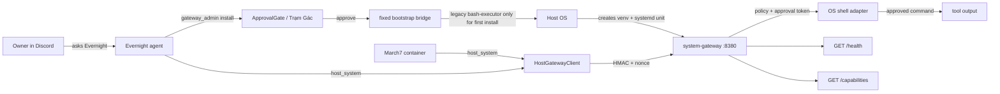

# System Gateway

Native host boundary for the Twin agent stack. `march7` and `evernight` run in
Docker, but host operations run through this service on the host OS. Agents do
not receive a general host shell; they call `host_system`, which signs requests
to System Gateway, and dangerous operations still require owner approval.

## Architecture



First install is special: when the service is missing, Evernight can run
`gateway_admin install` after owner approval. That path uses a narrow,
code-generated command through the legacy `bash-executor`; it does not accept
model-written shell fragments. The command parses only required `.env` keys,
writes `/etc/system-gateway/secret`, creates `/opt/system-gateway/venv`, installs
the package there, renders a systemd unit, restarts the service, and waits for
`/health`.

After install, normal host interaction goes through `host_system` and
`HostGatewayClient`, not through `bash-executor`.

## Current Capabilities

- `GET /health` reports service status, version, uptime, and platform.
- `GET /capabilities` reports platform, shell, and feature metadata.
- `POST /shell/run` runs an owner-approved command on the platform shell.
- `POST /self/update` records an owner-approved update request; it does not
  download or restart binaries by itself.

Current adapters expose one generic shell path:

| Platform | Shell | Feature |
| --- | --- | --- |
| Linux | `/bin/sh` | `generic_shell_exec` |
| macOS | `/bin/zsh` | `generic_shell_exec` |
| Windows | `powershell.exe` | `generic_shell_exec` |

## Security Model

- `/health` and `/capabilities` are public for monitoring.
- Mutating endpoints require HMAC request signing with timestamp and nonce.
- Shell execution also requires a fresh owner approval token bound to action
  `shell` and the request actor.
- Approval tokens are single-use; replayed nonces are rejected.
- The Linux systemd unit runs from `/opt/system-gateway/venv/bin/python`, keeps
  `ProtectHome=true`, and reads the shared secret from
  `/etc/system-gateway/secret`.
- Bootstrap output is redacted before being returned to chat.

## Quick Start

### Agent-Driven Install

From Discord DM with Evernight:

```text
Evernight, cài lại System Gateway bằng gateway_admin install.
Sau khi xong gọi host_system capabilities.
```

Evernight should request approval in Discord. Approve it, then expect a
successful bootstrap message and a `host_system capabilities` response.

### Manual Install Fallback

From the repo root on the host:

```bash
/usr/bin/python3 -m venv --system-site-packages /opt/system-gateway/venv
/opt/system-gateway/venv/bin/python -m pip install --no-build-isolation services/system_gateway
SYSTEM_GATEWAY_HOST=0.0.0.0 \
SYSTEM_GATEWAY_PORT=8380 \
SYSTEM_GATEWAY_SHARED_SECRET_FILE=/etc/system-gateway/secret \
  /opt/system-gateway/venv/bin/python -m system_gateway install
systemctl restart system-gateway
```

Normally the agent-driven installer writes `/etc/system-gateway/secret` from
`.env`; do not print or commit that value.

## Configuration

| Variable | Default | Used by |
| --- | --- | --- |
| `SYSTEM_GATEWAY_URL` | `http://host.docker.internal:8380` | containers |
| `SYSTEM_GATEWAY_HOST` | `127.0.0.1` | native service |
| `SYSTEM_GATEWAY_PORT` | `8380` | native service |
| `SYSTEM_GATEWAY_SHARED_SECRET` | unset | containers / signing |
| `SYSTEM_GATEWAY_SHARED_SECRET_FILE` | unset | systemd service |
| `SYSTEM_GATEWAY_RAW_SHELL` | `true` | emergency kill-switch |
| `SYSTEM_GATEWAY_BOOTSTRAP_REPO_ROOT` | unset | Evernight install |
| `SYSTEM_GATEWAY_BOOTSTRAP_PYTHON` | `/usr/bin/python3` | Evernight install |
| `SYSTEM_GATEWAY_BOOTSTRAP_VENV` | `/opt/system-gateway/venv` | Evernight install |

Docker compose loads the shared secret from `.env` via `env_file`; do not set it
to an empty value in `environment:`.

## Operations

```bash
curl http://127.0.0.1:8380/health
curl http://127.0.0.1:8380/capabilities
systemctl status system-gateway --no-pager
journalctl -u system-gateway -f
```

Useful agent-facing checks:

```text
Evernight, gọi gateway_admin status rồi gọi host_system mode=capabilities.
Evernight, gọi host_system mode=shell command="printf system-gateway-ok && uname -s".
```

The second command should trigger owner approval before execution.

## Development And Tests

```bash
/home/flowerf/.conda/envs/discord_bot/bin/python -m pytest services/system_gateway/tests -q -p no:phoenix
/home/flowerf/.conda/envs/discord_bot/bin/python -m pytest \
  tests/unit/gateway_admin_tool_test.py \
  tests/unit/evernight_system_gateway_installer_test.py \
  tests/unit/system_gateway_cli_test.py \
  tests/unit/tool_bootstrap_test.py \
  -q -p no:phoenix
```

## Migration Note

`execute_host_bash` remains hidden from the model-facing catalog. The legacy
`bash-executor` is still required for the first owner-approved bootstrap while
System Gateway is absent. Once a separate host package manager path exists, that
bridge can be removed.
